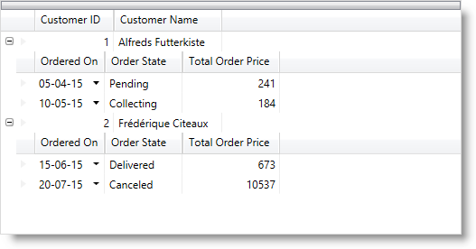
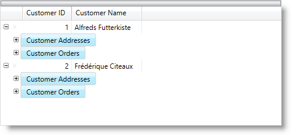
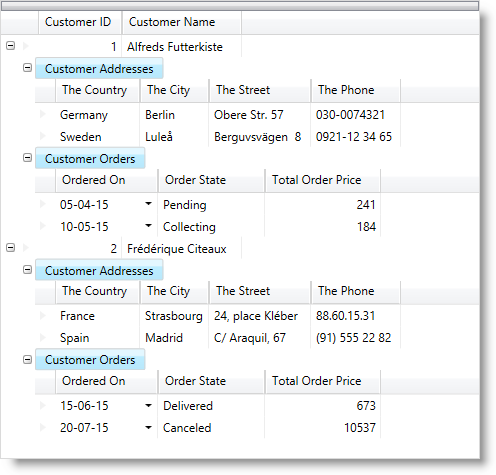

////

|metadata|
{
    "name": "xamdatapresenter-define-a-field-layout",
    "controlName": ["xamDataPresenter"],
    "tags": ["Extending","How Do I","Layouts"],
    "guid": "{FAD67F16-FF2B-4CA9-A6ED-24C43F59689C}",  
    "buildFlags": [],
    "createdOn": "2012-01-30T19:39:53.1299791Z"
}
|metadata|
////

= Define a Field Layout

== Topic Overview

=== Purpose

This topic explains how to define a custom set of fields displayed for the data entities.

=== Required background

The following topics are prerequisites to understanding this topic:

[options="header", cols="a,a"]
|====
|Topic|Purpose

| link:xamdatagrid-understanding-xamdatagrid.html[About xamDataGrid]
|This topic provides an overview of the xamDataGrid control including a conceptual diagram of its comprising elements.

| link:xamdatapresenter-about-data-items-and-data-records.html[About Data Items and Data Records]
|This topic explains the difference between Data Items and Data Records.

|====

=== In this topic

This topic contains the following sections:

* <<_Ref405562793, Defining Field Layout for Flat Structure >>
* <<_Ref405562801, Defining Field Layout for Hierarchical Structure >>
* <<_Ref405562811, Related Content >>

[[_Ref405562793]]
== Defining Field Layout for Flat Structure

[[_Hlk368069110]]

=== Overview

Even though the  _xamDataPresenter_™,  _xamDataGrid_™,  _xamDataCards_™, and  _xamDataCarousel_™ controls automatically create field layouts based on your data model, you can still define field layouts to specify which fields to display and to set properties related to those fields. If you set the link:{ApiPlatform}datapresenter{ApiVersion}~infragistics.windows.datapresenter.fieldlayoutsettings.html[FieldLayoutSettings] object's link:{ApiPlatform}datapresenter{ApiVersion}~infragistics.windows.datapresenter.fieldlayoutsettings~autogeneratefields.html[AutoGenerateFields] property to False, you are responsible for defining any fields that you want to display. Otherwise, you only have to define fields that you want to modify since the remaining fields will be generated automatically.

You must keep in mind the following when defining custom field layout:

* If you want to bind to a simple property from the data model objects, set the link:{ApiPlatform}datapresenter{ApiVersion}~infragistics.windows.datapresenter.field.html[Field]'s link:{ApiPlatform}datapresenter{ApiVersion}~infragistics.windows.datapresenter.field~bindingtype.html[BindingType] to link:{ApiPlatform}datapresenter{ApiVersion}~infragistics.windows.datapresenter.bindingtype.html[UseNameBinding] and set the link:{ApiPlatform}datapresenter{ApiVersion}~infragistics.windows.datapresenter.fielditem~name.html[Name] property to match the data model object's property name (the value of the `Name` property also must be unique)
* If you need to bind to a complex property from the data model objects, set the `Field`'s `BindingType` to link:{ApiPlatform}datapresenter{ApiVersion}~infragistics.windows.datapresenter.bindingtype.html[UseAlternateBinding] and specify the binding path in the link:{ApiPlatform}datapresenter{ApiVersion}~infragistics.windows.datapresenter.field~alternatebinding.html[AlternateBinding] property
* If you need to have an unbound field (with some calculated value), set the `Field`'s `BindingType` to link:{ApiPlatform}datapresenter{ApiVersion}~infragistics.windows.datapresenter.bindingtype.html[Unbound]

If you add a `Field` object that does not match a property exposed by your data entity, then the link:{ApiPlatform}datapresenter{ApiVersion}~infragistics.windows.datapresenter.fieldlayout.html[FieldLayout] object will not be assigned to the link:{ApiPlatform}datapresenter{ApiVersion}~infragistics.windows.datapresenter.datarecord.html[DataRecord] object when the record is initialized. When this happens with the `AutoGenerateFields` property set to False, you will not see any data in a `DataPresenter` control. Otherwise, the controls will automatically create a new `FieldLayout` object and assign it to the `DataRecord` object.

.Note
[NOTE]
====
If you handle the link:{ApiPlatform}datapresenter{ApiVersion}~infragistics.windows.datapresenter.events.assigningfieldlayouttoitemeventargs.html[AssigningFieldLayoutToItem] event and assign a `FieldLayout` object to an item whose properties do not match the names of the Field objects, the `DataPresenter` controls will throw an exception.
====

For example, if you have a customer entity that exposes a  *CustomerID*  property,  *ContactName*  property, and  *ContactTitle*  property, you can create three `Field` objects and set their `Name` properties to "CustomerID", "ContactName", and "ContactTitle" respectively.

[[_Hlk337817761]]

=== Example

The following example code demonstrates how to define a field layout. The example code assumes that your data model exposes a  *ProductID*  property and a  *ProductName*  property.

*In XAML:*

[source,xaml]
----
<igDP:XamDataPresenter Name="xamDataPresenter1">
    <igDP:XamDataPresenter.FieldLayoutSettings>
        <igDP:FieldLayoutSettings AutoGenerateFields=" />
    </igDP:XamDataPresenter.FieldLayoutSettings>
    <igDP:XamDataPresenter.FieldLayouts>
        <igDP:FieldLayout Key="productLayout">
            <igDP:FieldLayout.Fields>
                <igDP:Field Name="ProductID" Label="Product ID" />
                <igDP:TextField Name="ProductName" Label="Product Name" />
                <!-- You can add more Field objects here -->
            </igDP:FieldLayout.Fields>
        </igDP:FieldLayout>
    </igDP:XamDataPresenter.FieldLayouts>
</igDP:XamDataPresenter>
----

*In Visual Basic:*

[source,vb]
----
Imports Infragistics.Windows.DataPresenter
Imports Infragistics.Windows.DataPresenter.Events
...
' You can attach this event handler to the FieldLayoutInitialized event
Private Sub xamDataPresenter1_FieldLayoutInitialized(ByVal sender As Object, ByVal e As FieldLayoutInitializedEventArgs) 
    Dim productIDField As New Field With {.Name = "ProductID", .Label = "Product ID"}
    Dim productNameField As New TextField With {.Name = "ProductName", .Label = "Product Name"}
    e.FieldLayout.Fields.Add(productIDField)
    e.FieldLayout.Fields.Add(productNameField)
End Sub
----

*In C#:*

[source,csharp]
----
using Infragistics.Windows.DataPresenter;
using Infragistics.Windows.DataPresenter.Events;
...
// You can attach this event handler to the FieldLayoutInitialized event.
private void xamDataPresenter1_FieldLayoutInitialized(object sender, FieldLayoutInitializedEventArgs e)
{
    Field productIDField = new Field
    {
        Name = "ProductID",
        Label = "Product ID"
    };
    TextField productNameField = new TextField
    {
        Name = "ProductName",
        Label = "Product Name"
    };
    e.FieldLayout.Fields.Add(productIDField);
    e.FieldLayout.Fields.Add(productNameField);
}
----

[[_Ref405562801]]
== Defining Field Layout for Hierarchical Structure

=== Overview

If you are binding to a hierarchical data model you may need more than one field layout because in some cases child data objects are having different properties that the parent data objects. You can define different field layouts for each data type by specifying the data type in the link:{ApiPlatform}datapresenter{ApiVersion}~infragistics.windows.datapresenter.fieldlayout~key.html[Key] property of the `FieldLayout`s.

.Note
[NOTE]
====
For hierarchical `DataSet` objects, you must set the `Field` object's `Name` property to the name of a DataRelation object in order to display child records.
====

=== Example

XAML code with field layout definitions:

*In XAML:*

[source,xaml]
----
<igDP:XamDataGrid x:Name="xamDataGrid">
    <igDP:XamDataGrid.FieldLayoutSettings>
        <igDP:FieldLayoutSettings AutoGenerateFields=" />
    </igDP:XamDataGrid.FieldLayoutSettings>
    <igDP:XamDataGrid.FieldLayouts>
        <igDP:FieldLayout Key="Customer">
            <igDP:FieldLayout.Fields>
                <igDP:Field Name="ID" Label="Customer ID" />
                <igDP:TextField Name="Name" Label="Customer Name" />
                <!-- The next field definitions are referencing collections of sub-items -->
                <igDP:Field Name="Addresses" Label="Customer Addresses" />
                <igDP:Field Name="Orders" Label="Customer Orders"/>
            </igDP:FieldLayout.Fields>
        </igDP:FieldLayout>
        <igDP:FieldLayout Key="Address">
            <igDP:FieldLayout.Fields>
                <igDP:Field Name="Country" Label="The Country" />
                <igDP:Field Name="City" Label="The City" />
                <igDP:Field Name="Street" Label="The Street" />
                <igDP:Field Name="Phone" Label="The Phone" />
            </igDP:FieldLayout.Fields>
        </igDP:FieldLayout>
        <igDP:FieldLayout Key="Order">
            <igDP:FieldLayout.Fields>
                <igDP:Field Name="FromDate" Label="Ordered On" />
                <igDP:Field Name="Status" Label="Order State" />
                <igDP:Field Name="TotalPrice" Label="Total Order Price" />
            </igDP:FieldLayout.Fields>
        </igDP:FieldLayout>
    </igDP:XamDataGrid.FieldLayouts>
</igDP:XamDataGrid>
----

Code behind defining the entity data types:

*In Visual Basic:*

[source,vb]
----
Public Class Address
        Public Property Country() As String
                Get
                        Return m_Country
                End Get
                Set
                        m_Country = Value
                End Set
        End Property
        Private m_Country As String
        Public Property City() As String
                Get
                        Return m_City
                End Get
                Set
                        m_City = Value
                End Set
        End Property
        Private m_City As String
        Public Property Street() As String
                Get
                        Return m_Street
                End Get
                Set
                        m_Street = Value
                End Set
        End Property
        Private m_Street As String
        Public Property Phone() As String
                Get
                        Return m_Phone
                End Get
                Set
                        m_Phone = Value
                End Set
        End Property
        Private m_Phone As String
End Class
Public Class Order
        Public Property FromDate() As DateTime
                Get
                        Return m_FromDate
                End Get
                Set
                        m_FromDate = Value
                End Set
        End Property
        Private m_FromDate As DateTime
        Public Property Status() As String
                Get
                        Return m_Status
                End Get
                Set
                        m_Status = Value
                End Set
        End Property
        Private m_Status As String
        Public Property TotalPrice() As Integer
                Get
                        Return m_TotalPrice
                End Get
                Set
                        m_TotalPrice = Value
                End Set
        End Property
        Private m_TotalPrice As Integer
End Class
Public Class Customer
        Public Property ID() As Integer
                Get
                        Return m_ID
                End Get
                Set
                        m_ID = Value
                End Set
        End Property
        Private m_ID As Integer
        Public Property Name() As String
                Get
                        Return m_Name
                End Get
                Set
                        m_Name = Value
                End Set
        End Property
        Private m_Name As String
        Private m_addresses As New List(Of Address)()
        Public ReadOnly Property Addresses() As List(Of Address)
                Get
                        Return Me.m_addresses
                End Get
        End Property
        Private m_orders As New List(Of Order)()
        Public ReadOnly Property Orders() As List(Of Order)
                Get
                        Return Me.m_orders
                End Get
        End Property
End Class
----

*In C#:*

[source,csharp]
----
public class Address
{
    public string Country { get; set; }
    public string City { get; set; }
    public string Street { get; set; }
    public string Phone { get; set; }
}
public class Order
{
    public DateTime FromDate { get; set; }
    public string Status { get; set; }
    public int TotalPrice { get; set; }
}
public class Customer
{
    public int ID { get; set; }
    public string Name { get; set; }
    private List<Address> addresses = new List<Address>();
    public List<Address> Addresses
    {
        get { return this.addresses; }
    }
    private List<Order> orders = new List<Order>();
    public List<Order> Orders
    {
        get { return this.orders; }
    }
}
----

Instantiating the entity classes, creating a list of them and setting the list as a data source for the  _xamDataGrid_   control:

*In Visual Basic:*

[source,vb]
----
Dim list As New List(Of Customer)()
Dim a As New Customer() With { _
        .ID = 1, _
        .Name = "Alfreds Futterkiste" _
}
a.Addresses.Add(New Address() With { _
        .Country = "Germany", _
        .City = "Berlin", _
        .Street = "Obere Str. 57", _
        .Phone = "030-0074321" _
})
a.Addresses.Add(New Address() With { _
        .Country = "Sweden", _
        .City = "Luleå", _
        .Street = "Berguvsvägen  8", _
        .Phone = "0921-12 34 65" _
})
a.Orders.Add(New Order() With { _
        .FromDate = New DateTime(2015, 4, 5), _
        .Status = "Pending", _
        .TotalPrice = 241 _
})
a.Orders.Add(New Order() With { _
        .FromDate = New DateTime(2015, 5, 10), _
        .Status = "Collecting", _
        .TotalPrice = 184 _
})
list.Add(a)
Dim b As New Customer() With { _
        .ID = 2, _
        .Name = "Frédérique Citeaux" _
}
b.Addresses.Add(New Address() With { _
        .Country = "France", _
        .City = "Strasbourg", _
        .Street = "24, place Kléber", _
        .Phone = "88.60.15.31" _
})
b.Addresses.Add(New Address() With { _
        .Country = "Spain", _
        .City = "Madrid", _
        .Street = "C/ Araquil, 67", _
        .Phone = "(91) 555 22 82" _
})
b.Orders.Add(New Order() With { _
        .FromDate = New DateTime(2015, 6, 15), _
        .Status = "Delivered", _
        .TotalPrice = 673 _
})
b.Orders.Add(New Order() With { _
        .FromDate = New DateTime(2015, 7, 20), _
        .Status = "Canceled", _
        .TotalPrice = 10537 _
})
list.Add(b)
Me.xamDataGrid.DataSource = list
----

*In C#:*

[source,csharp]
----
List<Customer> list = new List<Customer>();
Customer a = new Customer() { ID = 1, Name = "Alfreds Futterkiste"};
a.Addresses.Add(new Address()
{
  Country = "Germany", City = "Berlin", Street = "Obere Str. 57", Phone = "030-0074321"
});
a.Addresses.Add(new Address()
{
  Country = "Sweden", City = "Luleå", Street = "Berguvsvägen  8", Phone = "0921-12 34 65"
});
a.Orders.Add(new Order()
{
  FromDate = new DateTime(2015, 4, 5), Status = "Pending", TotalPrice = 241
});
a.Orders.Add(new Order()
{
  FromDate = new DateTime(2015, 5, 10), Status = "Collecting", TotalPrice = 184
});
list.Add(a);
Customer b = new Customer() { ID = 2, Name = "Frédérique Citeaux" };
b.Addresses.Add(new Address()
{
  Country = "France", City = "Strasbourg", Street = "24, place Kléber", Phone = "88.60.15.31"
});
b.Addresses.Add(new Address()
{
  Country = "Spain", City = "Madrid", Street = "C/ Araquil, 67", Phone = "(91) 555 22 82"
});
b.Orders.Add(new Order()
{
  FromDate = new DateTime(2015, 6, 15), Status = "Delivered", TotalPrice = 673
});
b.Orders.Add(new Order()
{
  FromDate = new DateTime(2015, 7, 20), Status = "Canceled", TotalPrice = 10537
});
list.Add(b);
this.xamDataGrid.DataSource = list;
----

=== Result

The following screenshot shows the  _xamDataGrid_   bound to hierarchical data in which each parent record has only one child collection. After expanding a parent record, the child collection is immediately shown:

The following screenshot shows the  _xamDataGrid_   bound to hierarchical data in which each parent record has multiple child collections. When first expanding a parent record, only the child band headers are visible indicating the presence of child collections:

The following screenshot shows the  _xamDataGrid_   bound to hierarchical data in which each parent record has multiple child collections and all child bands are also expanded. As you can see because of the different field layouts definitions, the parent and child records have different fields displayed:

[[_Ref405562811]]
== Related Content

=== Topics

The following topics provide additional information related to this topic.

[options="header", cols="a,a"]
|====
|Topic|Purpose

| link:xamdata-generating-fields-manually-versus-automatically.html[Generating Fields Manually Versus Automatically]
|This topic explains the types of field layouts generation.

| link:xamdatapresenter-manually-assigning-a-field-layout-to-xamdatapresenter.html[Manually Assigning a Field Layout to xamDataPresenter]
|This topic explains how to manually assign a custom field layout for each data record.

| link:xamdatapresenter-add-unbound-fields-to-a-datapresenter-control.html[Configuring Unbound Field]
|This topic explains how to define fields in the field layout which are not directly bound to a data record's field.

| link:xamdatapresenter-configuring-specific-editor-fields.html[Configuring Specific Editor Fields (xamDataPresenter)]
|This topic describes an easy and straightforward way of configuring specific editor fields for different data types.

|====