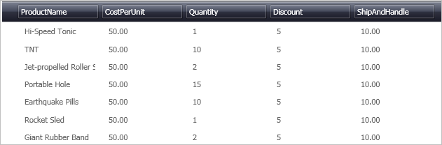

////

|metadata|
{
    "name": "xamdatapresenter-disable-groupby",
    "controlName": ["xamDataPresenter"],
    "tags": ["Grouping","How Do I"],
    "guid": "{0F1D18ED-44F3-4DB7-A54A-AE0117323C46}",  
    "buildFlags": [],
    "createdOn": "2012-01-30T19:39:53.1459823Z"
}
|metadata|
////

= Disable GroupBy

The xamDataPresenter™ control displays a link:{ApiPlatform}datapresenter{ApiVersion}~infragistics.windows.datapresenter.groupbyarea.html[GroupByArea] above the data area. You can prevent the GroupByArea from displaying by setting the link:{ApiPlatform}datapresenter{ApiVersion}~infragistics.windows.datapresenter.datapresenterbase~groupbyarealocation.html[GroupByAreaLocation] property.

The following procedure assumes you have a data bound xamDataPresenter, and you want to hide the GroupByArea, so that end users can't group fields. For more information, see link:xamdatapresenter-getting-started-with-xamdatapresenter.html[Adding xamDataPresenter to Your Application].

[start=1]
. The following XAML creates an instance of XamDataPresenter and names it. The XAML then sets the GroupByAreaLocation property to None.

*In XAML:*

----
<igDP:XamDataPresenter x:Name="XamDataPresenter1" 
  ...
  GroupByAreaLocation="None"/>
----

[start=2]
. Build and run the project. You should see xamDataPresenter without a group-by area similar to the image below.

== Related Topics

link:xamdatapresenter-about-sorting.html[About Sorting]

link:xamdatapresenter-about-grouping.html[About Grouping]

link:xamdatapresenter-sorting-and-grouping-fields-programmatically.html[Sorting and Grouping Fields Programmatically]

link:xamdatapresenter-modify-the-group-by-area.html[Modify the Group-By Area]

link:xamdatapresenter-create-an-external-group-by-area.html[Create an External Group-By Area]

link:xamdatapresenter-change-the-location-of-the-groupbyarea.html[Change the Location of the GroupByArea]