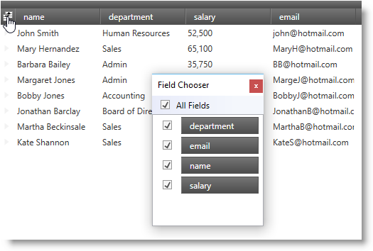

////
|metadata|
{
    "name": "xamdatapresenter-display-the-field-chooser",
    "controlName": ["xamDataPresenter"],
    "tags": ["How Do I","Layouts","Tips and Tricks"],
    "guid": "{A03E17A2-7CAB-489C-A4E4-56AC2C6349F5}",
    "buildFlags": [],
    "createdOn": "2012-01-30T19:39:53.1509833Z"
}
|metadata|
////

= Display the Field Chooser

In order for your end users to use the field chooser feature, you must provide a way for your end users to display the link:{ApiPlatform}datapresenter.v{ProductVersion}~infragistics.windows.datapresenter.fieldchooser.html[FieldChooser] control. The DataPresenter controls offer four different ways to display the field chooser.

[start=1]
. You can display a field chooser button in the header prefix area above the record selectors by setting a link:{ApiPlatform}datapresenter.v{ProductVersion}~infragistics.windows.datapresenter.fieldlayoutsettings.html[FieldLayoutSettings] object's link:{ApiPlatform}datapresenter.v{ProductVersion}~infragistics.windows.datapresenter.fieldlayoutsettings~headerprefixareadisplaymode.html[HeaderPrefixAreaDisplayMode] property to FieldChooserButton. However, a DataPresenter control will only display a field chooser button when you also display headers at the top and record selectors on the left or right side of the cell area.
+

[start=2]
. You can programmatically show the FieldChooser control by invoking the DataPresenter control's link:{ApiPlatform}datapresenter.v{ProductVersion}~infragistics.windows.datapresenter.datapresenterbase~showfieldchooser.html[ShowFieldChooser] method.

[start=3]
. You can execute the link:{ApiPlatform}datapresenter.v{ProductVersion}~infragistics.windows.datapresenter.datapresentercommands~showfieldchooser.html[ShowFieldChooser] command exposed by the link:{ApiPlatform}datapresenter.v{ProductVersion}~infragistics.windows.datapresenter.datapresentercommands.html[DataPresenterCommands] class.

[start=4]
. You can add an instance of a FieldChooser control to your window and set its link:{ApiPlatform}datapresenter.v{ProductVersion}~infragistics.windows.datapresenter.fieldchooser~datapresenter.html[DataPresenter] property to an instance of a DataPresenter control. For an example of the code required to create an external field chooser, read the topic on link:xamdatapresenter-create-an-external-field-chooser.html[Creating an External Field Chooser].
+
The following example code demonstrates three different ways to display the field chooser button.
+
*In XAML:*
+
[source,xaml]
----
<!--Button that executes the ShowFieldChooser command-->
<!--
<Button 
    Content="Show Field Chooser" 
    Command="{x:Static igDP:DataPresenterCommands.ShowFieldChooser}" 
    CommandTarget="{Binding ElementName=xamDataPresenter1}" />
-->
<igDP:XamDataPresenter Name="xamDataPresenter1">
    <!--You do not have to use the field chooser button if you are displaying the field chooser using a command-->
    <igDP:XamDataPresenter.FieldLayoutSettings>
        <igDP:FieldLayoutSettings HeaderPrefixAreaDisplayMode="FieldChooserButton" />
    </igDP:XamDataPresenter.FieldLayoutSettings>
</igDP:XamDataPresenter>
----
+
*In Visual Basic:*
+
[source,vb]
----
Imports Infragistics.Windows.DataPresenter
...
Me.xamDataPresenter1.FieldLayoutSettings.HeaderPrefixAreaDisplayMode = HeaderPrefixAreaDisplayMode.FieldChooserButton
'Calling the DataPresenter control's ShowFieldChooser method
'Me.xamDataPresenter1.ShowFieldChooser()
...
----
+
*In C#:*
+
[source,csharp]
----
using Infragistics.Windows.DataPresenter;
...
this.xamDataPresenter1.FieldLayoutSettings.HeaderPrefixAreaDisplayMode = HeaderPrefixAreaDisplayMode.FieldChooserButton;
//Calling the DataPresenter control's ShowFieldChooser method
//this.xamDataPresenter1.ShowFieldChooser();
...
----

== Related Topics

link:xamdatapresenter-about-the-field-chooser.html[About the Field Chooser]

link:xamdatapresenter-about-field-chooser-settings.html[About Field Chooser Settings]

link:xamdatapresenter-prevent-fields-from-being-hidden.html[Prevent Fields from Being Hidden]

link:xamdatapresenter-create-an-external-field-chooser.html[Create an External Field Chooser]

link:xamdatapresenter-change-the-display-order-of-fields-in-the-field-chooser.html[Change the Display Order of Fields in the Field Chooser]