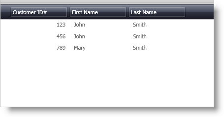

////
|metadata|
{
    "name": "xamdatapresenter-displaying-a-complex-property-xaml",
    "controlName": ["xamDataPresenter"],
    "tags": ["FAQ","How Do I","Tips and Tricks"],
    "guid": "{2ADC2317-CC9A-43FE-BE18-8323A79BE0B8}",
    "buildFlags": [],
    "createdOn": "2012-01-30T19:39:53.1549841Z"
}
|metadata|
////

= Displaying a Complex Property (XAML)

== Before You Begin

When you data bind xamDataPresenter™, the xamDataPresenter control will automatically create link:{ApiPlatform}datapresenter{ApiVersion}~infragistics.windows.datapresenter.field.html[Fields] for each public property in your business object. If the property is a complex property, the link:{ApiPlatform}datapresenter{ApiVersion}~infragistics.windows.datapresenter.cell.html[Cell] will display the result of the ToString method of that property.

For example, let's assume that you have a Name class that exposes two public properties, a FirstName property and a LastName property that both return strings. You also have a Customer class that exposes two public properties, a FullName property that returns a Name object, and an ID property that returns an integer. If you bind xamDataPresenter to a collection of Customers, xamDataPresenter will not display the FirstName and LastName properties of the FullName property. Instead, you will see the result of the ToString method of the Name class, which normally returns the fully qualified name of the Type.

== What You Will Accomplish

Most of the time, instead of displaying the result of the ToString method of a complex property, you may want to display separate fields for its sub-properties. To accomplish this, you will add an `UnboundField` object for each sub-property you want to display. You will then set the `UnboundField.BindingPath` property and `UnboundField.BindingMode` property of the UnboundField to bind the Cell values in the unbound field to a sub-property.

== Follow these Steps

[start=1]
. Download and add the link:resources-customer-data.html[CustomerData] class to your project.
+
The CustomerData class is available for you in C# and VB.NET to download and use in your project while working through this topic. The implementation details of the CustomerData class will not be covered in this topic as it is beyond the scope of this topic.

[start=2]
. Add the following markup for an ObjectDataProvider to the Resources section of your Window.
+
*In XAML:*
+
[source,xaml]
----
<!-- TODO: If you are using Visual Basic, replace the XML namespace mapping for the CustomerData class with the root namespace of your project. -->
<ObjectDataProvider 
    xmlns:MyCustomerData="clr-namespace:IGDocumentation" 
    x:Key="Customers" 
    ObjectType="{x:Type MyCustomerData:CustomerData}" 
    MethodName="GetCustomers" />
----

[start=3]
. Add a xamDataPresenter control to your Window and bind it to the ObjectDataProvider you added in step two.
+
*In XAML:*
+
[source,xaml]
----
...
<igDP:XamDataPresenter DataSource="{Binding Source={StaticResource Customers}}">
</igDP:XamDataPresenter>
...
----

[start=4]
. Turn off automatic Field generation since you will be defining the Fields.
+
--
.. Declare tags for the link:{ApiPlatform}datapresenter{ApiVersion}~infragistics.windows.datapresenter.datapresenterbase~fieldlayoutsettings.html[FieldLayoutSettings] property within the tags for xamDataPresenter.
.. Add a FieldLayoutSettings object within the tags of the FieldLayoutSettings property.
.. Set the link:{ApiPlatform}datapresenter{ApiVersion}~infragistics.windows.datapresenter.fieldlayoutsettings~autogeneratefields.html[AutoGenerateFields] property to False.
--
+
*In XAML:*
+
[source,xaml]
----
...
<igDP:XamDataPresenter.FieldLayoutSettings>
    <igDP:FieldLayoutSettings AutoGenerateFields=" />
</igDP:XamDataPresenter.FieldLayoutSettings>
...
----

[start=5]
. Declare tags for xamDataPresenter's link:{ApiPlatform}datapresenter{ApiVersion}~infragistics.windows.datapresenter.fieldlayoutcollection.html[FieldLayout collection] within the tags for xamDataPresenter.
+
*In XAML:*
+
[source,xaml]
----
...
<igDP:XamDataPresenter.FieldLayouts>
</igDP:XamDataPresenter.FieldLayouts>
...
----

[start=6]
. Add a link:{ApiPlatform}datapresenter{ApiVersion}~infragistics.windows.datapresenter.fieldlayout.html[FieldLayout] object within the tags of the FieldLayout collection.
+
*In XAML:*
+
[source,xaml]
----
...
<igDP:FieldLayout>
</igDP:FieldLayout>
...
----

[start=7]
. Declare tags for the link:{ApiPlatform}datapresenter{ApiVersion}~infragistics.windows.datapresenter.fieldcollection.html[Fields collection] within the tags of the FieldLayout.
+
*In XAML:*
+
[source,xaml]
----
...
<igDP:FieldLayout.Fields>
</igDP:FieldLayout.Fields>
...
----

[start=8]
. Add a Field object to the Fields collection.
+
--
.. Set the link:{ApiPlatform}datapresenter{ApiVersion}~infragistics.windows.datapresenter.fielditem~name.html[Name] property to "ID".
+
The Name property of a Field object must match the name of a property in the business object.
.. Set the link:{ApiPlatform}datapresenter{ApiVersion}~infragistics.windows.datapresenter.fielditem~label.html[Label] property to "Customer ID#".
--
+
*In XAML:*
+
[source,xaml]
----
...
<igDP:Field Name="ID" Label="Customer ID#" />
...
----

[start=9]
. Add an UnboundField to the Fields collection.
+
--
.. Set the Name property to "FirstName".
+
Unlike a regular Field object, the Name property of an UnboundField object does not have to match the name of a property in the business object. You can use the value of the Name property as a key to retrieve a reference to the UnboundField object in the Fields collection using procedural code.
.. Set the Label property to "First Name".
.. Set the BindingPath property to "FullName.FirstName".
+
You need to set the BindingPath property to a property path on the business object.
.. Set the BindingMode property to "TwoWay".
+
The default value of the BindingMode property is OneWay. If you do not set the BindingMode property to TwoWay, your data model will not reflect any of the changes made to the values in the unbound fields.
--
+
*In XAML:*
+
[source,xaml]
----
...
<igDP:UnboundField 
    Name="FirstName" 
    Label="First Name" 
    BindingPath="FullName.FirstName" 
    BindingMode="TwoWay" />
...
----

[start=10]
. Add another UnboundField to the Fields collection.
+
--
.. Set the Name property to "LastName".
.. Set the Label property to "Last Name".
.. Set the BindingPath property to "FullName.LastName".
.. Set the BindingMode property to "TwoWay".
--
+
*In XAML:*
+
[source,xaml]
----
...
<igDP:UnboundField 
    Name="LastName" 
    Label="Last Name" 
    BindingPath="FullName.LastName" 
    BindingMode="TwoWay" />
...
----

[start=11]
. Run the project and you should see two unbound fields that display the first name and last name of the customer.
+

== Related Topics

link:xamdatapresenter-about-data-items-and-data-records.html[About Data Items and Data Records]

link:xamdatapresenter-displaying-a-complex-property.html[Displaying a Complex Property]