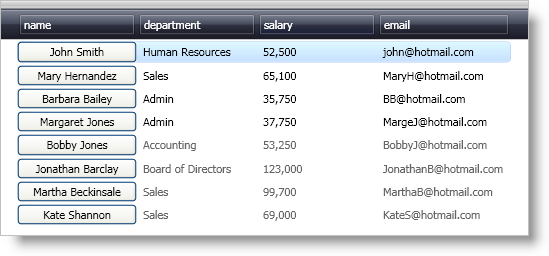

////
|metadata|
{
    "name": "xamdatapresenter-embedding-a-custom-control-in-a-field",
    "controlName": ["xamDataPresenter"],
    "tags": ["How Do I","Tips and Tricks"],
    "guid": "{773A23D9-FEA5-4A5C-9FCE-F43BEE1A9245}",
    "buildFlags": [],
    "createdOn": "2012-01-30T19:39:53.1619855Z"
}
|metadata|
////

= Embedding a Custom Control in a Field

== Before You Begin

You can modify the link:{ApiPlatform}datapresenter.v{ProductVersion}~infragistics.windows.datapresenter.cellvaluepresenter.html[CellValuePresenter] object's link:{ApiPlatform}datapresenter.v{ProductVersion}~infragistics.windows.datapresenter.cellvaluepresenter.html[Template] property to supply your own visual tree for a cell. In essence, you can embed any control you want into a cell by creating your own template.

== What You Will Accomplish

You will embed a Button control in the cells of a field. You will also use data binding to display a cell's value in the Button control.

== Follow these Steps

[start=1]
. Add the following XML namespace declaration in the Window's opening tag.
+
*In XAML:*
+
[source,xaml]
----
xmlns:igDP="http://infragistics.com/DataPresenter"
----

[start=2]
. Add tags for the Window's local Resource Dictionary.
+
*In XAML:*
+
[source,xaml]
----
<Window.Resources>
    <!--TODO: Create Styles here-->
</Window.Resources>
----

[start=3]
. Create a Style in that targets the CellValuePresenter object and add it to the Window's local resource dictionary.
+
*In XAML:*
+
[source,xaml]
----

----

[start=4]
. Add a Setter to modify the Template property of the CellValuePresenter object.
+
*In XAML:*
+
[source,xaml]
----
<Setter Property="Template">
    <Setter.Value>
        <!--TODO: Create the ControlTemplate here-->
    </Setter.Value>
</Setter>
----

[start=5]
. Set the Setter's Value property to a ControlTemplate that targets the CellValuePresenter object.
+
*In XAML:*
+
[source,xaml]
----
<ControlTemplate TargetType="{x:Type igDP:CellValuePresenter}">
    <!--TODO: Define a visual tree here-->
</ControlTemplate>
----

[start=6]
. Add a Button control to the control template.
+
The binding syntax you use may differ based on whether the template allows editing. In this example, the Button control is only going to display the cell's value, so the lightweight TemplateBinding markup extension is sufficient. However, if you have a control that accepts end-user input, you cannot use the TemplateBinding markup extension since it is one-way from the templated parent. You must use a normal Binding object if you want to give your end users the ability to edit the cell's value. See the commented code below for an example of the full binding expression.
+
*In XAML:*
+
[source,xaml]
----
<Button Content="{TemplateBinding Value}" />
<!--
If your template has a control that accepts end user input to modify the cell's value, such as a TextBox control, you have to use a full binding expression.
<TextBox Text="{Binding RelativeSource={RelativeSource TemplatedParent}, Path=Value}" />
-->
----

[start=7]
. Add a xamDataGrid™ control, a xamDataCarousel™ control, or a xamDataPresenter™ control to a layout panel in your Window.
+
*In XAML:*
+
[source,xaml]
----
<!--XAML for xamDataGrid-->
<igDP:XamDataGrid Name="xamDataGrid1" BindToSampleData="True">
    <!--TODO: Add FieldLayouts here-->
</igDP:XamDataGrid>
<!--XAML for xamDataCarousel-->
<igDP:XamDataCarousel Name="xamDataCarousel1" BindToSampleData="True">
    <!--TODO: Add FieldLayouts here-->
</igDP:XamDataCarousel>
<!--XAML for xamDataPresenter-->
<igDP:XamDataPresenter Name="xamDataPresenter1" BindToSampleData="True">
    <!--TODO: Add FieldLayouts here-->
</igDP:XamDataPresenter>
----

[start=8]
. Add a link:{ApiPlatform}datapresenter.v{ProductVersion}~infragistics.windows.datapresenter.fieldlayout.html[FieldLayout] object to the xamDataGrid/xamDataCarousel/xamDataPresenter control.
+
*In XAML:*
+
[source,xaml]
----
<!--XAML for xamDataGrid-->
<igDP:XamDataGrid.FieldLayouts>
    <igDP:FieldLayout>
        <!--TODO: Add Fields here-->
    </igDP:FieldLayout>
</igDP:XamDataGrid.FieldLayouts>
<!--XAML for xamDataCarousel-->
<igDP:XamDataCarousel.FieldLayouts>
    <igDP:FieldLayout>
        <!--TODO: Add Fields here-->
    </igDP:FieldLayout>
</igDP:XamDataCarousel.FieldLayouts>
<!--XAML for xamDataPresenter-->
<igDP:XamDataPresenter.FieldLayouts>
    <igDP:FieldLayout>
        <!--TODO: Add Fields here-->
    </igDP:FieldLayout>
</igDP:XamDataPresenter.FieldLayouts>
----

[start=9]
. Add a link:{ApiPlatform}datapresenter.v{ProductVersion}~infragistics.windows.datapresenter.field.html[Field] object for the name field to the field layout.
+
*In XAML:*
+
[source,xaml]
----
<igDP:FieldLayout.Fields>
    <igDP:Field Name="name">
        <!--TODO: Add FieldSettings here-->
    </igDP:Field>
</igDP:FieldLayout.Fields>
----

[start=10]
. Add a link:{ApiPlatform}datapresenter.v{ProductVersion}~infragistics.windows.datapresenter.fieldsettings.html[FieldSettings] object to the field and set its link:{ApiPlatform}datapresenter.v{ProductVersion}~infragistics.windows.datapresenter.fieldsettings~cellvaluepresenterstyle.html[CellValuePresenterStyle] property to the Style you created in step 3.
+
*In XAML:*
+
[source,xaml]
----
<igDP:Field.Settings>
    <igDP:FieldSettings CellValuePresenterStyle="{StaticResource buttonInCellStyle}" />
</igDP:Field.Settings>
----

[start=11]
. Run the project.
+
You should see a xamDataGrid control similar to the one in the screen shot below.
+
