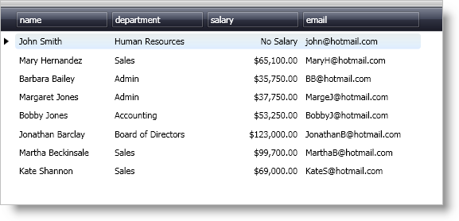

////
|metadata|
{
    "name": "xamdatapresenter-embedding-a-xameditor-in-a-field",
    "controlName": ["xamDataPresenter"],
    "tags": ["How Do I","Tips and Tricks"],
    "guid": "{2C0116E2-EBA0-4CB7-BF56-010CAAA363C3}",
    "buildFlags": [],
    "createdOn": "2012-01-30T19:39:53.1649861Z"
}
|metadata|
////

= Embedding a xamEditor in a Field

== Before You Begin

The xamDataPresenter™, xamDataGrid™, and xamDataCarousel™ controls embed a default ValueEditor derived control in a field based on a field's data type. However, you can change the xamEditor control that xamDataPresenter embeds in a field by setting the link:{ApiPlatform}datapresenter{ApiVersion}~infragistics.windows.datapresenter.fieldsettings~editortype.html[EditorType] property of the link:{ApiPlatform}datapresenter{ApiVersion}~infragistics.windows.datapresenter.fieldsettings.html[FieldSettings] object. To set properties on an embedded editor control, you have to create a Style that targets the editor control and then assign the Style to the link:{ApiPlatform}datapresenter{ApiVersion}~infragistics.windows.datapresenter.fieldsettings~editorstyle.html[EditorStyle] property of the FieldSettings object. For more information on default xamEditor controls and data types, see link:xamdata-about-xamdatapresenter-and-xameditors.html[About xamDataPresenter and xamEditors].

== What You Will Accomplish

You will embed xamCurrencyEditor™ to edit the salary field in xamDataGrid's built-in sample data. You will also set the link:{ApiPlatform}editors{ApiVersion}~infragistics.windows.editors.texteditorbase~nulltext.html[NullText] property of the embedded xamCurrencyEditor control using a Style.

.Note
[NOTE]
====
Even though the example code in this topic is for the xamCurrencyEditor control, you can still apply the basic ideas presented in this topic to embed any other xamEditor control.
====

== Follow these Steps

[start=1]
. Add the following three XML namespace declarations and using/Imports directives in your code-behind so you don't need to type out a member's fully qualified name.
+
*In XAML:*
+
[source,xaml]
----
xmlns:igDP="http://infragistics.com/DataPresenter" 
xmlns:igEditors="http://infragistics.com/Editors" 
xmlns:sys="clr-namespace:System;assembly=mscorlib"
----
+
*In Visual Basic:*
+
[source,vb]
----
Imports Infragistics.Windows.Editors
Imports Infragistics.Windows.DataPresenter
----
+
*In C#:*
+
[source,csharp]
----
using Infragistics.Windows.Editors;
using Infragistics.Windows.DataPresenter;
----

[start=2]
. Add tags for the Window's local resource dictionary. Create a Style that targets the xamCurrencyEditor control in the Window's local resource dictionary. Add a Setter to the Style to set the NullText property of the xamCurrencyEditor control.
+
*In XAML:*
+
[source,xaml]
----
<Window.Resources>
    
</Window.Resources>
----

[start=3]
. Add a xamDataGrid, xamDataCarousel, or xamDataPresenter control to a layout panel in your Window.
+
--
.. Name the controls so you can reference it in the code-behind.
.. Set the link:{ApiPlatform}datapresenter{ApiVersion}~infragistics.windows.datapresenter.datapresenterbase~bindtosampledata.html[BindToSampleData] property to True.
.. Attach an event handler to the link:{ApiPlatform}datapresenter{ApiVersion}~infragistics.windows.datapresenter.datapresenterbase~fieldlayoutinitialized_ev.html[FieldLayoutInitialized] event if you are going to use the code-behind.
--
+
*In XAML:*
+
[source,xaml]
----
<!--XAML for xamDataGrid-->
<igDP:XamDataGrid 
    Name="xamDataGrid1" 
    BindToSampleData="True"
    FieldLayoutInitialized="xamData_FieldLayoutInitialized">
    <!--TODO: Add FieldLayouts here-->
</igDP:XamDataGrid>
<!--XAML for xamDataCarousel-->
<igDP:XamDataCarousel 
    Name="xamDataCarousel1" 
    BindToSampleData="True"
    FieldLayoutInitialized="xamData_FieldLayoutInitialized">
    <!--TODO: Add FieldLayouts here-->
</igDP:XamDataCarousel>
<!--XAML for xamDataPresenter-->
<igDP:XamDataPresenter 
    Name="xamDataPresenter1" 
    BindToSampleData="True"
    FieldLayoutInitialized="xamData_FieldLayoutInitialized">
    <!--TODO: Add FieldLayouts here-->
</igDP:XamDataPresenter>
----

[start=4]
. Add a link:{ApiPlatform}datapresenter{ApiVersion}~infragistics.windows.datapresenter.fieldlayout.html[FieldLayout] object to the controls and then a link:{ApiPlatform}datapresenter{ApiVersion}~infragistics.windows.datapresenter.field.html[Field] object to field layout.
+
You can also add fields to the field layout for the remaining three fields, name, email, and department. Since we did not turn off the auto-generate fields feature, xamDataGrid will automatically generate the remaining three fields.
+
*In XAML:*
+
[source,xaml]
----
<!--XAML for xamDataGrid-->
<igDP:XamDataGrid.FieldLayouts>
    <igDP:FieldLayout>
        <!--Adding Fields here-->
        <igDP:FieldLayout.Fields>
            <igDP:Field Name="salary" Label="Salary">
                <!--TODO: Add FieldSettings here-->
            </igDP:Field>
        </igDP:FieldLayout.Fields>
    </igDP:FieldLayout>
</igDP:XamDataGrid.FieldLayouts>
<!--XAML for xamDataCarousel-->
<igDP:XamDataCarousel.FieldLayouts>
    <igDP:FieldLayout>
        <!--Adding Fields here-->
        <igDP:FieldLayout.Fields>
            <igDP:Field Name="salary" Label="Salary">
               <!--TODO: Add FieldSettings here-->
            </igDP:Field>
        </igDP:FieldLayout.Fields>
    </igDP:FieldLayout>
</igDP:XamDataCarousel.FieldLayouts>
<!--XAML for xamDataPresenter-->
<igDP:XamDataPresenter.FieldLayouts>
    <igDP:FieldLayout>
        <!--Adding Fields here-->
        <igDP:FieldLayout.Fields>
            <igDP:Field Name="salary" Label="Salary">
                <!--TODO: Add FieldSettings here-->
            </igDP:Field>
        </igDP:FieldLayout.Fields>
    </igDP:FieldLayout>
</igDP:XamDataPresenter.FieldLayouts>
----
+
*In Visual Basic:*
+
[source,vb]
----
Private Sub xamData_FieldLayoutInitialized(ByVal sender As Object, ByVal e As Infragistics.Windows.DataPresenter.Events.FieldLayoutInitializedEventArgs)
    'TODO: Add field layout related code here
    e.FieldLayout.Fields("salary").Settings.EditorType = _
        GetType(XamCurrencyEditor)
    Dim _style1 As Style =
        DirectCast(Me.TryFindResource("currencyEditorStyle"), Style)
End Sub
----
+
*In C#:*
+
[source,csharp]
----
private void xamData_FieldLayoutInitialized(object sender, Infragistics.Windows.DataPresenter.Events.FieldLayoutInitializedEventArgs e)
{
    //TODO: Add field layout related code here
    e.FieldLayout.Fields["salary"].Settings.EditorType =
        typeof(XamCurrencyEditor);
    Style _style1 =
        (Style)this.TryFindResource("currencyEditorStyle");
}
----

[start=5]
. Set the EditorStyle property of the Settings property on the salary field. Set the link:{ApiPlatform}datapresenter{ApiVersion}~infragistics.windows.datapresenter.fieldsettings~editastype.html[EditAsType] property of the Settings property on the salary field.
+
Since the built-in sample data is XML data, all data types for the data bound fields are strings. In order to edit these string values as decimal values using the xamCurrencyEditor control, you have to set the EditAsType property to decimal. However, if the data type of a data bound field in your field layout matches the data type that you want the editor to edit, you can skip this step.
+
*In XAML:*
+
[source,xaml]
----
<igDP:FieldLayout.Fields>
    <igDP:Field Name="salary" Label="Salary">
        <!--TODO: Add FieldSettings here-->
        <igDP:Field.Settings>
            <igDP:FieldSettings 
                EditorType="{x:Type igEditors:XamCurrencyEditor}"
                EditorStyle="{StaticResource currencyEditorStyle}"
                EditAsType="{x:Type sys:Decimal}" />
        </igDP:Field.Settings>
    </igDP:Field>
</igDP:FieldLayout.Fields>
----
+
*In Visual Basic:*
+
[source,vb]
----
e.FieldLayout.Fields("salary").Settings.EditorStyle = _style1
e.FieldLayout.Fields("salary").Settings.EditAsType = GetType(Decimal)
----
+
*In C#:*
+
[source,csharp]
----
e.FieldLayout.Fields["salary"].Settings.EditorStyle = _style1;
e.FieldLayout.Fields["salary"].Settings.EditAsType = typeof(decimal);
----

[start=6]
. Run the project.
+
The xamDataPresenter control is using xamCurrencyEditor to edit the salary field. If you delete a value in the salary field, the xamCurrencyEditor displays the null text that you set in the Style.
+
