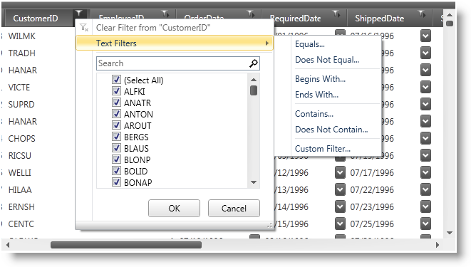

////

|metadata|
{
    "name": "xamdatapresenter-enable-excelstyle-record-filtering",
    "controlName": ["xamDataPresenter"],
    "tags": [],
    "guid": "7d03f04c-9775-446d-9486-3cbd868d0ef8",  
    "buildFlags": [],
    "createdOn": "2012-04-19T12:43:54.8894231Z"
}
|metadata|
////

= Enable Excel Style Record Filtering

You should enable record filtering for the DataPresenter controls by setting the link:{ApiPlatform}datapresenter.v{ProductVersion}~infragistics.windows.datapresenter.fieldsettings~allowrecordfiltering.html[AllowRecordFiltering] property on a link:{ApiPlatform}datapresenter.v{ProductVersion}~infragistics.windows.datapresenter.fieldsettings.html[FieldSettings] object to True and link:{ApiPlatform}datapresenter.v{ProductVersion}~infragistics.windows.datapresenter.fieldsettings~filterlabelicondropdowntype.html[FilterLabelIconDropDownStyle] to MultiSelectExcelStyle. You should also set the link:{ApiPlatform}datapresenter.v{ProductVersion}~infragistics.windows.datapresenter.fieldlayoutsettings~filteruitype.html[FilterUIType] property on a link:{ApiPlatform}datapresenter.v{ProductVersion}~infragistics.windows.datapresenter.fieldlayoutsettings.html[FieldLayoutSettings] object to LabelIcons.

.Note
[NOTE]
====
The filter record and filter icons are not available for the xamDataCarousel™ control. However, you can add filter conditions to xamDataCarousel in XAML or in procedural code to filter your data.
====

The following example code demonstrates how to enable record filtering. Even though the example code uses a xamDataPresenter control, you can use a xamDataGrid control in its place.

*In XAML:*

----
<igDP:XamDataPresenter Name="xamDataPresenter1">
    <igDP:XamDataPresenter.FieldSettings>
        <igDP:FieldSettings AllowRecordFiltering="True"
               FilterLabelIconDropDownType="MultiSelectExcelStyle"/>
    </igDP:XamDataPresenter.FieldSettings>
    <igDP:XamDataPresenter.FieldLayoutSettings>
        <igDP:FieldLayoutSettings FilterUIType="LabelIcons"/>
    </igDP:XamDataPresenter.FieldLayoutSettings>
</igDP:XamDataPresenter>
----

*In Visual Basic:*

----
Me.xamDataPresenter1.FieldSettings.AllowRecordFiltering = True
Me.xamDataPresenter1.FieldSettings.FilterLabelIconDropDownType = FilterLabelIconDropDownType.MultiSelectExcelStyle
----

*In C#:*

----
this.xamDataPresenter1.FieldSettings.AllowRecordFiltering = true;
this.xamDataPresenter1.FieldSettings.FilterLabelIconDropDownType = FilterLabelIconDropDownType.MultiSelectExcelStyle;
----

== Related Topic

link:xamdatapresenter-about-record-filtering.html[About Record Filtering]

link:xamdatapresenter-enable-record-filtering.html[Enable Record Filtering]

link:xamdatapresenter-add-filter-conditions.html[Add Filter Conditions]

link:xamdatapresenter-modify-the-list-of-operators.html[Modify the List of Operators]

link:xamdatapresenter-modify-the-look-of-filtered-records.html[Modify the Look of Filtered Records]