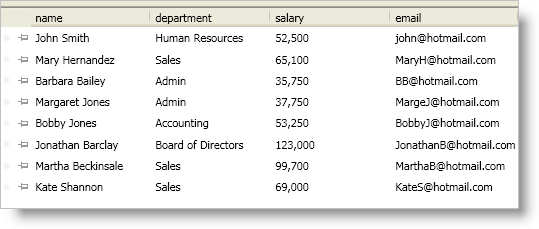

////

|metadata|
{
    "name": "xamdatapresenter-enable-fixed-records",
    "controlName": ["xamDataPresenter"],
    "tags": ["How Do I"],
    "guid": "{EF68A455-4F39-4819-96D6-8C77B0040162}",  
    "buildFlags": [],
    "createdOn": "2012-01-30T19:39:53.1769885Z"
}
|metadata|
////

= Enable Fixed Records

You can enable fixed records for the xamDataPresenter™ control or the xamDataGrid™ control by setting a link:{ApiPlatform}datapresenter{ApiVersion}~infragistics.windows.datapresenter.fieldlayoutsettings.html[FieldLayoutSettings] object's link:{ApiPlatform}datapresenter{ApiVersion}~infragistics.windows.datapresenter.fieldlayoutsettings~allowrecordfixing.html[AllowRecordFixing] property to one of the following link:{ApiPlatform}datapresenter{ApiVersion}~infragistics.windows.datapresenter.allowrecordfixing.html[AllowRecordFixing] enum values:

* Top - Your end users can click a record's pin icon to fix it to the top of the record list. Clicking on a fixed record's pin icon will unfix the record.
* Bottom - Your end users can click a record's pin icon to fix it to the bottom of the record list. Clicking on a fixed record's pin icon will unfix the record.
* TopOrBottom - Your end users can click a record's pin icon to display a pop-up menu that allows them to choose the record's fixed location. Clicking on a fixed record's pin icon will display a pop-up menu that allows them to either unfix the record or fix it to the opposite edge.

.Note
[NOTE]
====
Only root-level records can be fixed if you enable nested panels.
====

The following example code demonstrates how to enabled fixed records.

*In XAML:*

----
<igDP:XamDataPresenter Name="xamDataPresenter1" BindToSampleData="True">
    <igDP:XamDataPresenter.FieldLayoutSettings>
        <igDP:FieldLayoutSettings AllowRecordFixing="Top" />
    </igDP:XamDataPresenter.FieldLayoutSettings>
</igDP:XamDataPresenter>
----

*In Visual Basic:*

----
Imports Infragistics.Windows.DataPresenter
...
Me.xamDataPresenter1.FieldLayoutSettings.AllowRecordFixing = AllowRecordFixing.Top
...
----

*In C#:*

----
using Infragistics.Windows.DataPresenter;
...
this.xamDataPresenter1.FieldLayoutSettings.AllowRecordFixing = AllowRecordFixing.Top;
...
----

== Related Topics

link:xamdatapresenter-about-fixed-non-scrolling-records.html[About Fixed (Non-Scrolling) Records]

link:xamdatapresenter-about-fixed-records-and-sorting.html[About Fixed Records and Sorting]

link:xamdatapresenter-fix-records.html[Fix Records]

link:xamdatapresenter-limit-the-number-of-fixed-records.html[Limit the Number of Fixed Records]