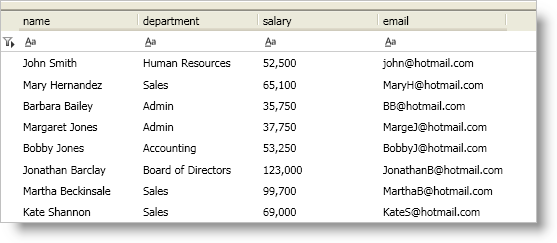

////

|metadata|
{
    "name": "xamdatapresenter-enable-record-filtering",
    "controlName": ["xamDataPresenter"],
    "tags": ["Filtering","How Do I"],
    "guid": "{A57CCE55-DCEB-445C-928F-F2B3D76D3204}",  
    "buildFlags": [],
    "createdOn": "2012-01-30T19:39:53.1819895Z"
}
|metadata|
////

= Enable Record Filtering

You can enable record filtering for the DataPresenter controls by setting the link:{ApiPlatform}datapresenter{ApiVersion}~infragistics.windows.datapresenter.fieldsettings~allowrecordfiltering.html[AllowRecordFiltering] property on a link:{ApiPlatform}datapresenter{ApiVersion}~infragistics.windows.datapresenter.fieldsettings.html[FieldSettings] object to True. You can set the AllowRecordFiltering property at the control level to enable record filtering on all fields in the control or you can set the AllowRecordFiltering property at the field level to enable record filtering for a particular field.

.Note
[NOTE]
====
The filter record and filter icons are not available for the xamDataCarousel™ control. However, you can add filter conditions to xamDataCarousel in XAML or in procedural code to filter your data.
====

The following example code demonstrates how to enable record filtering. Even though the example code uses a xamDataPresenter control, you can use a xamDataGrid control in its place.

*In XAML:*

----
<igDP:XamDataPresenter Name="xamDataPresenter1">
    <igDP:XamDataPresenter.FieldSettings>
        <igDP:FieldSettings AllowRecordFiltering="True" />
    </igDP:XamDataPresenter.FieldSettings>
</igDP:XamDataPresenter>
----

*In Visual Basic:*

----
Me.xamDataPresenter1.FieldSettings.AllowRecordFiltering = True
----

*In C#:*

----
this.xamDataPresenter1.FieldSettings.AllowRecordFiltering = true;
----

== Related Topic

link:xamdatapresenter-about-record-filtering.html[About Record Filtering]

link:xamdatapresenter-enable-excelstyle-record-filtering.html[Enable Excel Style Record Filtering]

link:xamdatapresenter-add-filter-conditions.html[Add Filter Conditions]

link:xamdatapresenter-modify-the-list-of-operators.html[Modify the List of Operators]

link:xamdatapresenter-modify-the-look-of-filtered-records.html[Modify the Look of Filtered Records]