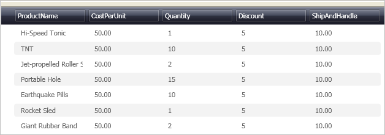

////

|metadata|
{
    "name": "xamdatapresenter-enabling-alternating-row-colors",
    "controlName": ["xamDataPresenter"],
    "tags": ["Editing","How Do I"],
    "guid": "{F7C51660-5805-478E-8F8D-87B5ED1D2403}",  
    "buildFlags": [],
    "createdOn": "2012-01-30T19:39:53.1889909Z"
}
|metadata|
////

= Enabling Alternating Row Colors

The xamDataPresenter's™ Grid View can style alternating rows (records) to give end users an easier time differentiating between rows. This feature is easily enabled off the link:{ApiPlatform}datapresenter.v{ProductVersion}~infragistics.windows.datapresenter.fieldlayoutsettings.html[FieldLayoutSettings] object by setting the link:{ApiPlatform}datapresenter.v{ProductVersion}~infragistics.windows.datapresenter.fieldlayoutsettings~highlightalternaterecords.html[HighlightAlternateRecords] property to True.

The following procedure assumes you have a data bound xamDataPresenter, and you want to enable alternating row colors. For more information, see link:xamdatapresenter-getting-started-with-xamdatapresenter.html[Adding xamDataPresenter to Your Application].

[start=1]
. The following XAML creates an instance of XamDataPresenter and names it. The XAML then specifies a xamDataPresenter FieldLayoutSettings object and sets the HighlightAlternateRecords property to True.

*In XAML:*

----
<igDP:XamDataPresenter x:Name="XamDataPresenter1" 
  ...
  >
        <igDP:XamDataPresenter.FieldLayoutSettings>
                <igDP:FieldLayoutSettings HighlightAlternateRecords="True" />
        </igDP:XamDataPresenter.FieldLayoutSettings>
</igDP:XamDataPresenter>
----

[start=2]
. Build and run the project. You should see xamDataPresenter's Grid View with alternating rows similar to the image below.

