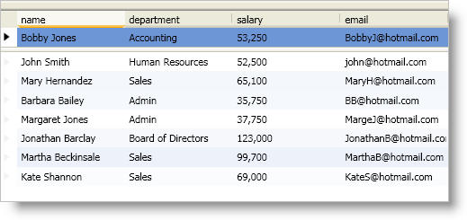

////

|metadata|
{
    "name": "xamdatapresenter-fix-records",
    "controlName": ["xamDataPresenter"],
    "tags": ["Layouts"],
    "guid": "{B01A0100-9B97-427A-BACF-EE19CF6C7D86}",  
    "buildFlags": [],
    "createdOn": "2012-01-30T19:39:53.2089949Z"
}
|metadata|
////

= Fix Records

You can programmatically fix records at run time regardless of a link:{ApiPlatform}datapresenter.v{ProductVersion}~infragistics.windows.datapresenter.fieldlayoutsettings.html[FieldLayoutSettings] object's link:{ApiPlatform}datapresenter.v{ProductVersion}~infragistics.windows.datapresenter.fieldlayoutsettings~allowrecordfixing.html[AllowRecordFixing] property value. You can fix a link:{ApiPlatform}datapresenter.v{ProductVersion}~infragistics.windows.datapresenter.record.html[Record] object by setting its link:{ApiPlatform}datapresenter.v{ProductVersion}~infragistics.windows.datapresenter.record~fixedlocation.html[FixedLocation] property to a link:{ApiPlatform}datapresenter.v{ProductVersion}~infragistics.windows.datapresenter.fixedrecordlocation.html[FixedRecordLocation] enum value or by executing one of the following commands exposed by the link:{ApiPlatform}datapresenter.v{ProductVersion}~infragistics.windows.datapresenter.datapresentercommands.html[DataPresenterCommands] class:

* FixRecordBottom
* FixRecordTop
* UnfixRecord

The following example code demonstrates how to fix a record. All three commands require you to pass in a Record object as a command parameter. The XAML binds the CommandParameter property of the Button control to the DataPresenter control's link:{ApiPlatform}datapresenter.v{ProductVersion}~infragistics.windows.datapresenter.datapresenterbase~activerecord.html[ActiveRecord] property.

*In XAML:*

----
<Button 
    Content="Fix the Active Record" 
    Command="{x:Static igDP:DataPresenterCommands.FixRecordTop}"
    CommandTarget="{Binding ElementName=xamDataPresenter1}" 
    CommandParameter="{Binding ElementName=xamDataPresenter1, Path=ActiveRecord}"/>
<igDP:XamDataPresenter Name="xamDataPresenter1" BindToSampleData="True">
</igDP:XamDataPresenter>
----

*In Visual Basic:*

----
Imports Infragistics.Windows.DataPresenter
...
'Me.xamDataPresenter1.Records(0).FixedLocation = FixedRecordLocation.FixedToTop
Me.xamDataPresenter1.ExecuteCommand(DataPresenterCommands.FixRecordTop, Me.xamDataPresenter1.ActiveRecord)
...
----

*In C#:*

----
using Infragistics.Windows.DataPresenter;
...
//this.xamDataPresenter1.Records[0].FixedLocation = FixedRecordLocation.FixedToTop;
this.xamDataPresenter1.ExecuteCommand(DataPresenterCommands.FixRecordTop, this.xamDataPresenter1.ActiveRecord);
...
----

== Related Topics

link:xamdatapresenter-about-fixed-non-scrolling-records.html[About Fixed (Non-Scrolling) Records]

link:xamdatapresenter-about-fixed-records-and-sorting.html[About Fixed Records and Sorting]

link:xamdatapresenter-enable-fixed-records.html[Enable Fixed Records]

link:xamdatapresenter-limit-the-number-of-fixed-records.html[Limit the Number of Fixed Records]