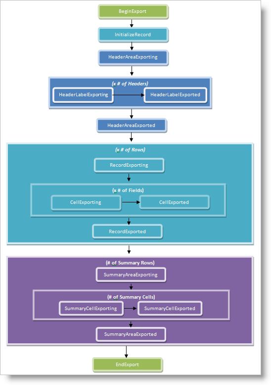

////

|metadata|
{
    "name": "xamdatapresenter-handle-exporting-events",
    "controlName": ["xamDataPresenter"],
    "tags": ["Events","Exporting"],
    "guid": "{3C83C7B1-CEDF-4E27-8955-FFD97D39CBD2}",  
    "buildFlags": [],
    "createdOn": "2012-01-30T19:39:53.2209973Z"
}
|metadata|
////

= Handle Exporting Events

The link:{ApiPlatform}datapresenter.excelexporter{ApiVersion}~infragistics.windows.datapresenter.excelexporter.datapresenterexcelexporter.html[DataPresenterExcelExporter] object exposes several events that you can handle to modify the exporting process. The DataPresenterExcelExporter object raises events in pairs during the exporting process. Before it exports an element, it will raise an event ending in "-ing". After it exports an element, it will raise the corresponding event ending in "-ed". For example, before the exporter exports a cell, it will raise the link:{ApiPlatform}datapresenter.excelexporter{ApiVersion}~infragistics.windows.datapresenter.excelexporter.datapresenterexcelexporter~cellexporting_ev.html[CellExporting] event. After the exporter exports a cell, it will raise the link:{ApiPlatform}datapresenter.excelexporter{ApiVersion}~infragistics.windows.datapresenter.excelexporter.datapresenterexcelexporter~cellexported_ev.html[CellExported] event. However, the InitializeRecord event does not follow this pattern.

The events ending in "-ing" allow you to modify the exporting process before the exporter exports an element. For example, you can cancel the export, apply formatting, or change the value that will be exported. If you cancel an exporting event, the exporter will not raise the corresponding event ending in "-ed". For example, if you cancel the link:{ApiPlatform}datapresenter.excelexporter{ApiVersion}~infragistics.windows.datapresenter.excelexporter.datapresenterexcelexporter~recordexporting_ev.html[RecordExporting] event, the exporter will not raise the link:{ApiPlatform}datapresenter.excelexporter{ApiVersion}~infragistics.windows.datapresenter.excelexporter.datapresenterexcelexporter~recordexported_ev.html[RecordExported] event.

The diagram below shows the order of events that the exporter will raise when you export a flat DataPresenter control with summaries at the bottom.

Since the exporter traverses the DataPresenter control from top-to-bottom, the order of events may change if you have nested records (hierarchical or group-by records), summaries at the top, or field labels in each cell. For example, with hierarchical records, after the exporter exports the first parent record and raises any related events, it will raise the header events for the parent record's nested children. The easiest way to understand the order of events for a DataPresenter control's configuration is to picture the DataPresenter control with all records expanded. Start at the top of the DataPresenter control and work your way down. The order that you encounter field headers, records, and summary records will be the order that the exporter raises events related to those elements.

The following example code demonstrates how to handle the CellExporting event to apply formatting to the cells.

*In XAML:*

----
<Window.Resources>
    <igExcelExporter:DataPresenterExcelExporter x:Key="excelExporter1" CellExporting="exporter_CellExporting" />
</Window.Resources>
----

*In Visual Basic:*

----
Imports Infragistics.Documents.Excel
...
Private Sub exporter_CellExporting(ByVal sender As Object, ByVal e As CellExportingEventArgs)
    e.FormatSettings.FillPattern = FillPatternStyle.Solid
    e.FormatSettings.FillPatternForegroundColor = Colors.Green
End Sub
----

*In C#:*

----
using Infragistics.Documents.Excel;
...
private void exporter_CellExporting(object sender, CellExportingEventArgs e)
{
    e.FormatSettings.FillPattern = FillPatternStyle.Solid;
    e.FormatSettings.FillPatternForegroundColor = Colors.Green;
}
----

== Related Topics

link:xamdatapresenter-export-a-datapresenter-control-to-excel.html[Export a DataPresenter Control to Excel]

link:xamdatapresenter-apply-formats-for-exporting.html[Apply Formats for Exporting]

link:xamdatapresenter-exclude-datapresenter-settings-when-exporting.html[Exclude DataPresenter Settings when Exporting]