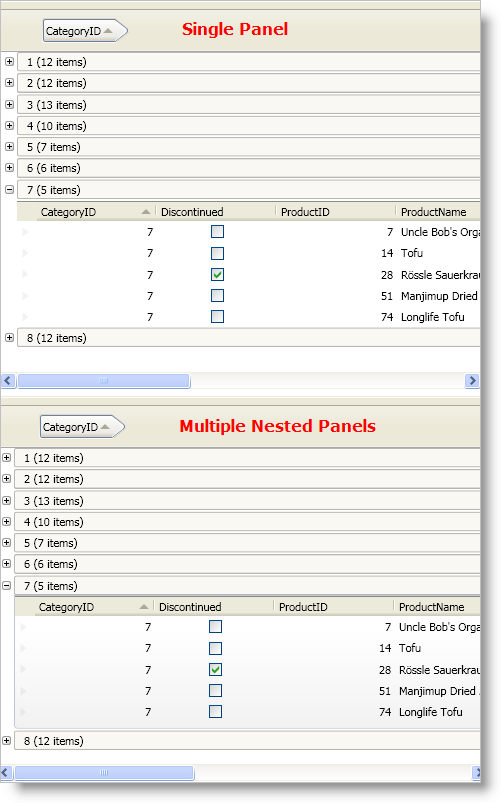

////

|metadata|
{
    "name": "xamdatapresenter-hierarchical-records-and-performance",
    "controlName": ["xamDataPresenter"],
    "tags": ["Data Binding","Performance"],
    "guid": "{AA2CCF35-28CA-41F1-BFA2-F24FA82E83E9}",  
    "buildFlags": [],
    "createdOn": "2012-01-30T19:39:53.2259983Z"
}
|metadata|
////

= Hierarchical Records and Performance

The xamDataGrid™ and xamDataPresenter™ controls use a single root-level panel to arrange their records starting in version 9.2. This results in better performance when dealing with nested records. However, the single panel approach contains visual drawbacks compared to nested panels as seen in the following list:

* Nested records will not be surrounded by chrome.
* Triggers in a link:{ApiPlatform}datapresenter{ApiVersion}~infragistics.windows.datapresenter.recordpresenter.html[RecordPresenter] object's template dealing with nested records will be ignored.
* Animations in a RecordPresenter object's template dealing with nested records will be ignored.

The screen shot below shows the difference between a xamDataGrid control using a single panel compared to a xamDataGrid control using nested panels. Notice in the single panel scenario, the group-by record's children are not surrounded by chrome.

The following example code demonstrates how to use multiple nested panels instead of the default single panel. You will be sacrificing performance in scenarios with hierarchical records if you decide to use nested panels. In addition to sacrificing performance, WPF has a limit on element-nesting depth; therefore, your end user won't be able to drill down more than 10 (approx.) levels of nested records.

*In XAML:*

----
<igDP:XamDataPresenter Name="xamDataPresenter1">
    <igDP:XamDataPresenter.View>
        <igDP:GridView>
            <igDP:GridView.ViewSettings>
                <igDP:GridViewSettings UseNestedPanels="True"  />
            </igDP:GridView.ViewSettings>
        </igDP:GridView>
    </igDP:XamDataPresenter.View>
</igDP:XamDataPresenter>
<!-- XAML for xamDataGrid
<igDP:XamDataGrid Name="xamDataGrid1">
    <igDP:XamDataGrid.ViewSettings>
        <igDP:GridViewSettings UseNestedPanels=" />
    </igDP:XamDataGrid.ViewSettings>
</igDP:XamDataGrid>
-->
----

*In Visual Basic:*

----
Dim gridview1 As New Infragistics.Windows.DataPresenter.GridView()
gridview1.ViewSettings.UseNestedPanels = True
Me.xamDataPresenter1.View = gridview1
'Changing the setting on a xamDataGrid control:
'xamDataGrid1.ViewSettings.UseNestedPanels = true;
----

*In C#:*

----
Infragistics.Windows.DataPresenter.GridView gridview1 = new Infragistics.Windows.DataPresenter.GridView();
gridview1.ViewSettings.UseNestedPanels = true;
this.xamDataPresenter1.View = gridview1;
//Changing the setting on a xamDataGrid control:
//xamDataGrid1.ViewSettings.UseNestedPanels = true;
----

== Related Topics