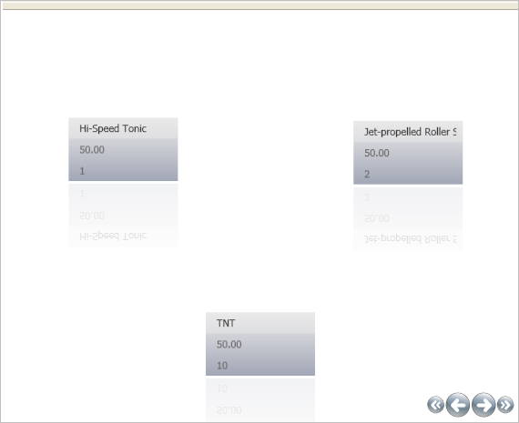

////

|metadata|
{
    "name": "xamdatapresenter-limiting-the-number-of-items-viewed-on-xamdatapresenters-path",
    "controlName": ["xamDataPresenter"],
    "tags": ["Editing","Layouts"],
    "guid": "{031E9163-4D8D-4D72-BC6E-6A4C7D405A5F}",  
    "buildFlags": [],
    "createdOn": "2012-01-30T19:39:53.2440019Z"
}
|metadata|
////

= Limiting the Number of Items Viewed on xamDataPresenter's Path

The xamDataPresenter's™ Carousel View displays a number of Records along a path. You can change the amount of Records displayed by setting the link:{ApiPlatform}v{ProductVersion}~infragistics.windows.controls.carouselviewsettings~itemsperpage.html[ItemsPerPage] property off the CarouselViewSettings object.

Use the following XAML to display three Records at a time.

*In XAML:*

----
<igDP:XamDataPresenter.View>
        <igDP:CarouselView>
                <igDP:CarouselView.ViewSettings>
                        <igWindows:CarouselViewSettings ItemsPerPage="3" />
                </igDP:CarouselView.ViewSettings>
        </igDP:CarouselView>
</igDP:XamDataPresenter.View>
----

Placing this code inside the opening XamDataPresenter tag in the link:xamdatapresenter-getting-started-with-xamdatapresenter.html[Adding xamDataPresenter to Your Application] topic will produce a result similar to the image below.

