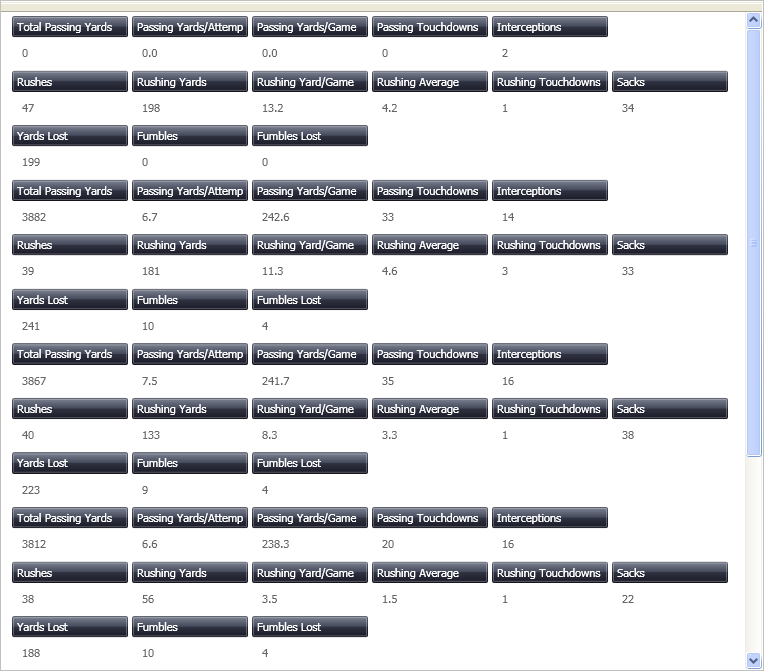

////
|metadata|
{
    "name": "xamdatapresenter-manually-assigning-a-field-layout-to-xamdatapresenter",
    "controlName": ["xamDataPresenter"],
    "tags": ["Editing","How Do I","Layouts","Templating"],
    "guid": "{E3875378-8348-4C67-8307-4BC6055A8BA3}",
    "buildFlags": [],
    "createdOn": "2012-01-30T19:39:53.2520035Z"
}
|metadata|
////

= Manually Assigning a Field Layout to xamDataPresenter

You can create multiple link:{ApiPlatform}datapresenter.v{ProductVersion}~infragistics.windows.datapresenter.fieldlayout.html[FieldLayout]s for the DataPresenter controls. This allows you to take data from one source and display it differently within a single DataPresenter control.

The following procedure assumes you have a data bound xamDataPresenter, and you want to manually assign field layouts. For more information, see link:xamdatapresenter-getting-started-with-xamdatapresenter.html[Adding xamDataPresenter to Your Application].

The following steps guide you through the setup of such a scenario, where all the data is coming out of one file called link:resources-quarterbacks.html[Quarterbacks.xml]. From this data. three FieldLayouts will be created to split up the data into groups of passing, rushing, and mistakes.

[start=1]
. The following XAML creates an instance of XamDataPresenter and names it.
+
*In XAML:*
+
[source,xaml]
----
<igDP:XamDataPresenter x:Name="XamDataPresenter1" 
    ...
    AssigningFieldLayoutToItem="XamDataPresenter1_AssigningFieldLayoutToItem">
    ...      
</igDP:XamDataPresenter>
----

[start=2]
. Turn off automatic field generation by setting the link:{ApiPlatform}datapresenter.v{ProductVersion}~infragistics.windows.datapresenter.fieldlayoutsettings~autogeneratefields.html[AutoGenerateFields] property to False. Change the location of the label to reside in each individual cell by setting the link:{ApiPlatform}datapresenter.v{ProductVersion}~infragistics.windows.datapresenter.fieldlayoutsettings~labellocation.html[LabelLocation] property to InCells. The following XAML sets these two properties which are found off the FieldLayoutSettings object.
+
*In XAML:*
+
[source,xaml]
----
...
    <igDP:XamDataPresenter.FieldLayoutSettings>
        <igDP:FieldLayoutSettings AutoGenerateFields="False" 
            LabelLocation="InCells" />
    </igDP:XamDataPresenter.FieldLayoutSettings>
...
----

[start=3]
. The second group of settings is where we define all the separate FieldLayouts that we want. As mentioned earlier there are three distinct groups, with the associating link:{ApiPlatform}datapresenter.v{ProductVersion}~infragistics.windows.datapresenter.field.html[Field]s arranged under them. We have also supplied each Field with a more descriptive link:{ApiPlatform}datapresenter.v{ProductVersion}~infragistics.windows.datapresenter.fielditem~label.html[Label] then just the link:{ApiPlatform}datapresenter.v{ProductVersion}~infragistics.windows.datapresenter.fielditem~name.html[Name], which is used if a Label is not specified.
+
*In XAML:*
+
[source,xaml]
----
...
    <igDP:XamDataPresenter.FieldLayouts>
        
        <igDP:FieldLayout Key="passing">
            <igDP:FieldLayout.Fields>
                <igDP:Field Name="passingyards" 
                    Label="Total Passing Yards" />
                <igDP:Field Name="passingyardsperattempt" 
                    Label="Passing Yards/Attempt" />
                <igDP:Field Name="passingyardspergame" 
                    Label="Passing Yards/Game" />
                <igDP:Field Name="passingtd" 
                    Label="Passing Touchdowns" />
                <igDP:Field Name="int" Label="Interceptions" />
            </igDP:FieldLayout.Fields>
        </igDP:FieldLayout>
        
        <igDP:FieldLayout Key="rushing">
            <igDP:FieldLayout.Fields>
                <igDP:Field Name="rushs" Label="Rushes" />
                <igDP:Field Name="rushyrds" 
                    Label="Rushing Yards" />
                <igDP:Field Name="rushyardspergame" 
                    Label="Rushing Yard/Game" />
                <igDP:Field Name="rushavg" 
                   Label="Rushing Average" />
                <igDP:Field Name="rushtd" 
                    Label="Rushing Touchdowns" />
                <igDP:Field Name="sack" Label="Sacks" />
            </igDP:FieldLayout.Fields>
        </igDP:FieldLayout>
        
        <igDP:FieldLayout Key="mistakes">
            <igDP:FieldLayout.Fields>
                <igDP:Field Name="yardslost" 
                    Label="Yards Lost" />
                <igDP:Field Name="fum" 
                    Label="Fumbles" />
            <igDP:Field Name="fuml" 
                    Label="Fumbles Lost" />
            </igDP:FieldLayout.Fields>
        </igDP:FieldLayout>
    </igDP:XamDataPresenter.FieldLayouts>
...
----

[start=4]
. In the XAML declaration of xamDataPresenter, you set an event handler method for the link:{ApiPlatform}datapresenter.v{ProductVersion}~infragistics.windows.datapresenter.datapresenterbase~assigningfieldlayouttoitem_ev.html[AssigningFieldLayoutsToItem] event. In this event, change which FieldLayout is shown first. This event fires in this sample when you move the scrollbar.
+
*In Visual Basic:*
+
[source,vb]
----
Imports Infragistics.Windows.DataPresenter.Events
...
Private index As Integer = 0
Sub XamDataPresenter1_AssigningFieldLayoutToItem(ByVal sender As Object, _
    ByVal e As AssigningFieldLayoutToItemEventArgs)
    .FieldLayout = Me.XamDataPresenter1.FieldLayouts(index)
    index += 1
    If index > 2 Then
        index = 0
    End If
End Sub
----
+
*In C#:*
+
[source,csharp]
----
using Infragistics.Windows.DataPresenter.Events;
...
private int index = 0;
...
void XamDataPresenter1_AssigningFieldLayoutToItem(object sender, 
    AssigningFieldLayoutToItemEventArgs e)
{
    e.FieldLayout = this.XamDataPresenter1.FieldLayouts[index];
    index++;
    if (index > 2)
    {
        index = 0;
    }
}
----

[start=5]
. Build and run the project You should see something similar to the image below.
+

== Related Topics

link:xamdata-generating-fields-manually-versus-automatically.html[Generating Fields Manually Versus Automatically]

link:xamdatapresenter-define-a-field-layout.html[Define a Field Layout]

link:xamdatapresenter-add-unbound-fields-to-a-datapresenter-control.html[Add Unbound Fields to a DataPresenter Control]