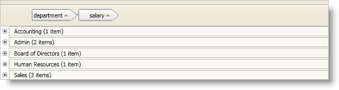

////

|metadata|
{
    "name": "xamdatapresenter-modify-the-group-by-area",
    "controlName": ["xamDataPresenter"],
    "tags": ["Grouping","How Do I","Layouts","Tips and Tricks"],
    "guid": "{415942D5-5B51-4F3B-8B7B-CC39E93C32F9}",  
    "buildFlags": [],
    "createdOn": "2012-01-30T19:39:53.2560043Z"
}
|metadata|
////

= Modify the Group-By Area

You can modify the layout of the field headers and field layout descriptions in the group-by area when you enable grouping across multiple field layouts. In order to modify the group-by area, you can set properties exposed by the link:{ApiPlatform}datapresenter{ApiVersion}~infragistics.windows.datapresenter.groupbyareamulti.html[GroupByAreaMulti] control that affect the layout of the field headers and field layout descriptions. For example, you can set the GroupByAreaMulti control's link:{ApiPlatform}datapresenter{ApiVersion}~infragistics.windows.datapresenter.groupbyareamulti~fieldoffsetx.html[FieldOffsetX] property to determine the space between the center of a field header and the beginning of the next field header in the group-by area.

The DataPresenter controls do not initialize their link:{ApiPlatform}datapresenter{ApiVersion}~infragistics.windows.datapresenter.datapresenterbase~groupbyareamulti.html[GroupByAreaMulti] property until they have been loaded. Therefore, you cannot set properties directly on the GroupByAreaMulti property before the DataPresenter control's Loaded event unless you set the GroupByAreaMulti property to an instance of a GroupByAreaMulti control first.

The GroupByAreaMulti control exposes the following properties that you can set to modify the group-by area:

* link:{ApiPlatform}datapresenter{ApiVersion}~infragistics.windows.datapresenter.groupbyareamulti~connectorlinepen.html[ConnectorLinePen]
* link:{ApiPlatform}datapresenter{ApiVersion}~infragistics.windows.datapresenter.groupbyareamulti~fieldlayoutdescriptiontemplate.html[FieldLayoutDescriptionTemplate]
* link:{ApiPlatform}datapresenter{ApiVersion}~infragistics.windows.datapresenter.groupbyareamulti~fieldlayoutoffsetx.html[FieldLayoutOffsetX]
* link:{ApiPlatform}datapresenter{ApiVersion}~infragistics.windows.datapresenter.groupbyareamulti~fieldlayoutoffsety.html[FieldLayoutOffsetY]
* link:{ApiPlatform}datapresenter{ApiVersion}~infragistics.windows.datapresenter.groupbyareamulti~fieldoffsetx.html[FieldOffsetX]
* link:{ApiPlatform}datapresenter{ApiVersion}~infragistics.windows.datapresenter.groupbyareamulti~fieldoffsety.html[FieldOffsetY]
* link:{ApiPlatform}datapresenter{ApiVersion}~infragistics.windows.datapresenter.groupbyareabase~isexpanded.html[IsExpanded]
* link:{ApiPlatform}datapresenter{ApiVersion}~infragistics.windows.datapresenter.groupbyareabase~prompt1.html[Prompt1]
* link:{ApiPlatform}datapresenter{ApiVersion}~infragistics.windows.datapresenter.groupbyareabase~prompt1template.html[Prompt1Template]
* link:{ApiPlatform}datapresenter{ApiVersion}~infragistics.windows.datapresenter.groupbyareabase~prompt2.html[Prompt2]
* link:{ApiPlatform}datapresenter{ApiVersion}~infragistics.windows.datapresenter.groupbyareabase~prompt2template.html[Prompt2Template]

The following example code demonstrates how to modify the group-by area.

*In XAML:*

----
<igDP:XamDataPresenter Name="xamDataPresenter1">
    <igDP:XamDataPresenter.GroupByAreaMulti>
        <igDP:GroupByAreaMulti FieldOffsetX="25" FieldLayoutOffsetY="15" />
    </igDP:XamDataPresenter.GroupByAreaMulti>
</igDP:XamDataPresenter>
----

*In Visual Basic:*

----
Imports Infragistics.Windows.DataPresenter
...
If Me.xamDataPresenter1.GroupByAreaMulti Is Nothing Then
    Me.xamDataPresenter1.GroupByAreaMulti = New GroupByAreaMulti()
End If
Me.xamDataPresenter1.GroupByAreaMulti.FieldOffsetX = 25
Me.xamDataPresenter1.GroupByAreaMulti.FieldLayoutOffsetY = 15
...
----

*In C#:*

----
using Infragistics.Windows.DataPresenter;
...
if(this.xamDataPresenter1.GroupByAreaMulti == null)
{
    this.xamDataPresenter1.GroupByAreaMulti = new GroupByAreaMulti();
}
this.xamDataPresenter1.GroupByAreaMulti.FieldOffsetX = 25;
this.xamDataPresenter1.GroupByAreaMulti.FieldLayoutOffsetY = 15;
...
----

== Related Topics

link:xamdatapresenter-about-sorting.html[About Sorting]

link:xamdatapresenter-about-grouping.html[About Grouping]

link:xamdatapresenter-sorting-and-grouping-fields-programmatically.html[Sorting and Grouping Fields Programmatically]

link:xamdatapresenter-create-an-external-group-by-area.html[Create an External Group-By Area]

link:xamdatapresenter-disable-groupby.html[Disable GroupBy]

link:xamdatapresenter-change-the-location-of-the-groupbyarea.html[Change the Location of the GroupByArea]