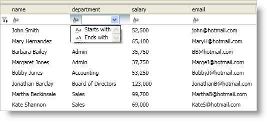

////

|metadata|
{
    "name": "xamdatapresenter-modify-the-list-of-operators",
    "controlName": ["xamDataPresenter"],
    "tags": ["Filtering","How Do I"],
    "guid": "{580CCEB0-9A47-41F6-8686-269C9C822C07}",  
    "buildFlags": [],
    "createdOn": "2012-01-30T19:39:53.2590049Z"
}
|metadata|
////

= Modify the List of Operators

The DataPresenter controls populate the list of operators based on the data type of the field. However, you can modify the list of operators that your end users can select by setting a link:{ApiPlatform}datapresenter.v{ProductVersion}~infragistics.windows.datapresenter.fieldsettings.html[FieldSettings] object's link:{ApiPlatform}datapresenter.v{ProductVersion}~infragistics.windows.datapresenter.fieldsettings~filteroperatordropdownitems.html[FilterOperatorDropDownItems] property to a bitwise combination of link:{ApiPlatform}v{ProductVersion}~infragistics.windows.controls.comparisonoperatorflags.html[ComparisonOperatorFlags] enumeration values. For example, you can modify the list of operators so that only the StartsWith and EndsWith operators are available for your end users in the drop-down list of operators.

.Note
[NOTE]
====
The filter record and filter icons are not available for the xamDataCarousel™ control. However, you can add filter conditions to xamDataCarousel in XAML or in procedural code to filter your data.
====

The following example code demonstrates how to modify the list of operators.

*In XAML:*

----
<igDP:XamDataPresenter Name="xamDataPresenter1">
    <igDP:XamDataPresenter.FieldSettings>
        <igDP:FieldSettings AllowRecordFiltering="True" FilterOperatorDropDownItems="StartsWith, EndsWith" />
    </igDP:XamDataPresenter.FieldSettings>
</igDP:XamDataPresenter>
----

*In Visual Basic:*

----
Imports Infragistics.Windows.Controls
...
Me.xamDataPresenter1.FieldSettings.FilterOperatorDropDownItems = ComparisonOperatorFlags.StartsWith Or ComparisonOperatorFlags.EndsWith
----

*In C#:*

----
using Infragistics.Windows.Controls;
...
this.xamDataPresenter1.FieldSettings.FilterOperatorDropDownItems = ComparisonOperatorFlags.StartsWith | ComparisonOperatorFlags.EndsWith;
----

== Related Topic

link:xamdatapresenter-about-record-filtering.html[About Record Filtering]

link:xamdatapresenter-add-filter-conditions.html[Add Filter Conditions]

link:xamdatapresenter-enable-record-filtering.html[Enable Record Filtering]

link:xamdatapresenter-modify-the-look-of-filtered-records.html[Modify the Look of Filtered Records]