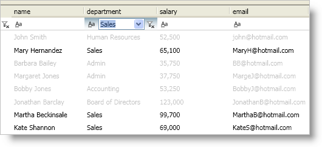

////

|metadata|
{
    "name": "xamdatapresenter-modify-the-look-of-filtered-records",
    "controlName": ["xamDataPresenter"],
    "tags": ["Filtering","How Do I"],
    "guid": "{DCCF2A92-E0DC-4E8F-B828-D9A9D51EE7F6}",  
    "buildFlags": [],
    "createdOn": "2012-01-30T19:39:53.2610053Z"
}
|metadata|
////

= Modify the Look of Filtered Records

The DataPresenter controls hide any records that do not match the filter criteria. However, you can change this behavior by setting the link:{ApiPlatform}datapresenter{ApiVersion}~infragistics.windows.datapresenter.fieldlayoutsettings.html[FieldLayoutSettings] object's link:{ApiPlatform}datapresenter{ApiVersion}~infragistics.windows.datapresenter.fieldlayoutsettings~filteraction.html[FilterAction] property to Disable or None. If you set the FilterAction property to Disable, any records that your end user filters out will be disabled but still visible. On the other hand, if you set the FilterAction property to None, there will be no visual indication that a record has been filtered out. This behavior allows you to implement your own style using triggers to modify the appearance of the records that your end users filter out.

.Note
[NOTE]
====
The filter record and filter icons are not available for the xamDataCarousel™ control. However, you can add filter conditions to xamDataCarousel in XAML or in procedural code to filter your data.
====

The following example code demonstrates how to modify the look of filtered records. Even though the example code uses a xamDataPresenter control, you can use a xamDataGrid control in its place.

*In XAML:*

----
<!--Add the style to a resource dictionary-->

...
<igDP:XamDataPresenter Name="xamDataPresenter1" BindToSampleData="True">
    <igDP:XamDataPresenter.FieldLayoutSettings>
        <igDP:FieldLayoutSettings FilterAction="None" />
    </igDP:XamDataPresenter.FieldLayoutSettings>
    <igDP:XamDataPresenter.FieldSettings>
        <igDP:FieldSettings AllowRecordFiltering="True" />
    </igDP:XamDataPresenter.FieldSettings>
</igDP:XamDataPresenter>
----

*In Visual Basic:*

----
Imports Infragistics.Windows.DataPresenter
...
Me.xamDataPresenter1.FieldLayoutSettings.FilterAction = RecordFilterAction.None
Me.xamDataPresenter1.FieldSettings.AllowRecordFiltering = True
----

*In C#:*

----
using Infragistics.Windows.DataPresenter;
...
this.xamDataPresenter1.FieldLayoutSettings.FilterAction = RecordFilterAction.None;
this.xamDataPresenter1.FieldSettings.AllowRecordFiltering = true;
----

== Related Topic

link:xamdatapresenter-about-record-filtering.html[About Record Filtering]

link:xamdatapresenter-add-filter-conditions.html[Add Filter Conditions]

link:xamdatapresenter-enable-record-filtering.html[Enable Record Filtering]

link:xamdatapresenter-modify-the-list-of-operators.html[Modify the List of Operators]