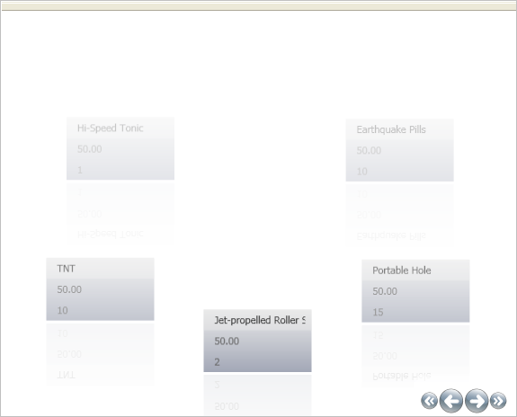

////

|metadata|
{
    "name": "xamdatapresenter-modifying-the-opacity-effect-of-items-on-a-path",
    "controlName": ["xamDataPresenter"],
    "tags": ["How Do I","Tips and Tricks"],
    "guid": "{A26CB8AB-463E-4E12-A859-E43C84C723C9}",  
    "buildFlags": [],
    "createdOn": "2012-01-30T19:39:53.2640059Z"
}
|metadata|
////

= Modifying the Opacity Effect of Items on a Path

The OpacityEffect can change the opacity of items making them lighter or darker, providing a fading effect. When used properly, this effect could give foreground items the effect of being closer and background items the effect of being further away. The OpacityEffect is created as an link:{ApiPlatform}v{ProductVersion}~infragistics.windows.controls.opacityeffectstopcollection.html[OpacityEffectStopCollection]*.* This collection contains several link:{ApiPlatform}v{ProductVersion}~infragistics.windows.controls.carouselviewsettings~opacityeffectstops.html[OpacityEffectStops] with Offsets and Values. The value can be specified as a decimal percentage from 0 to 1. The Offset depends on the link:{ApiPlatform}v{ProductVersion}~infragistics.windows.controls.carouselviewsettings~opacityeffectstopdirectionproperty.html[OpacityEffectStopDirection] which can be set to one of three values:

* Vertical
* Horizontal
* UseItemPath

.Note
[NOTE]
====
This topic assumes you have completed the tasks in link:xamdatapresenter-getting-started-with-xamdatapresenter.html[Adding xamDataPresenter to Your Application].
====

Follow these steps to create an opacity effect for Records in the xamDataPresenter™ Carousel View.

[start=1]
. In your code replace the Grid View setup with the following. This creates a CarouselView and a CarouselView's link:{ApiPlatform}datapresenter.v{ProductVersion}~infragistics.windows.datapresenter.xamdatacarousel~viewsettings.html[ViewSettings] which is of type link:{ApiPlatform}v{ProductVersion}~infragistics.windows.controls.carouselviewsettings.html[CarouselViewSettings]. Set the OpacityEffectStopDirection property to UseItemPath and set the UseOpacity property to True. This ensures that your Opacity settings will be used along the path.

*In XAML:*

----
<igDP:XamDataPresenter.View>
        <igDP:CarouselView>
                <igDP:CarouselView.ViewSettings>
                        <igWindows:CarouselViewSettings 
                          OpacityEffectStopDirection="UseItemPath" 
                          UseOpacity="True">
                                ...
                        </igWindows:CarouselViewSettings>
                </igDP:CarouselView.ViewSettings>
        </igDP:CarouselView>
</igDP:XamDataPresenter.View>
----

[start=2]
. Define the OpacityEffectStops and OpacityEffectStopCollection objects inside the CarouselViewSettings object.

*In XAML:*

----
<igWindows:CarouselViewSettings.OpacityEffectStops>
        <igWindows:OpacityEffectStopCollection>
        ...        
        </igWindows:OpacityEffectStopCollection>
</igWindows:CarouselViewSettings.OpacityEffectStops>
----

[start=3]
. Define the OpacityEffectStops object. Create three OpacityEffectStops. The Offsets will start at the beginning of the path and follow to the end, starting at a zero opacity, going to 1, and back to zero.

*In XAML:*

----
<igWindows:OpacityEffectStop Offset="0" Value="0" />
<igWindows:OpacityEffectStop Offset=".5" Value="1" />
<igWindows:OpacityEffectStop Offset="1" Value="0" />
----

[start=4]
. Build and run the project. You will see the farthest Records are still slightly visible. This is because the items on the path do not necessarily start right at 0 opacity nor do they end right at 1 opacity; Records come into view after the beginning of the path, therefore you never see them at exactly 0 opacity.

== Related Topics

link:xamcarousel-overview-of-path-effects.html[Overview of Path Effects]

link:xamdatapresenter-modifying-the-scale-of-elements-on-a-path.html[Modifying the Scale of Elements on a Path]

link:xamdatapresenter-modifying-the-skew-effect-of-items-on-a-path.html[Modifying the Skew Effect of Items on a Path]