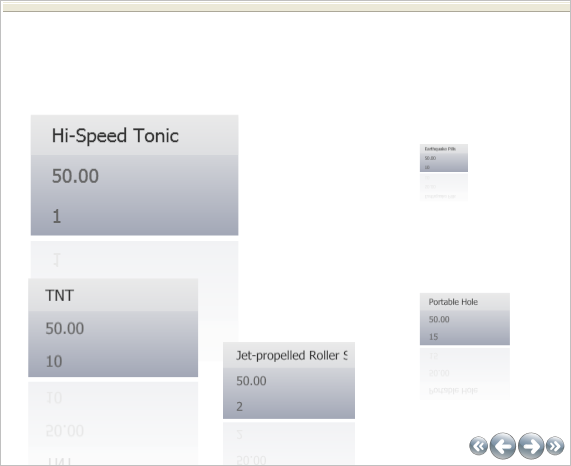

////

|metadata|
{
    "name": "xamdatapresenter-modifying-the-scale-of-elements-on-a-path",
    "controlName": ["xamDataPresenter"],
    "tags": ["How Do I","Layouts","Tips and Tricks"],
    "guid": "{FE444B7B-CC06-44AE-BED2-8B791B939201}",  
    "buildFlags": [],
    "createdOn": "2012-01-30T19:39:53.2660063Z"
}
|metadata|
////

= Modifying the Scale of Elements on a Path

The xamDataPresenter's™ Carousel View allows you to scale Records by a percentage based on their position on the path. Scaling gives Records a 3D effect. The ScalingEffect is similar to other Path effects in that you define a link:{ApiPlatform}v{ProductVersion}~infragistics.windows.controls.scalingeffectstopcollection.html[ScalingEffectStopCollection] that contains link:{ApiPlatform}v{ProductVersion}~infragistics.windows.controls.carouselviewsettings~scalingeffectstopsproperty.html[ScalingEffectsStops], each of which specify an offset and a value to apply at that offset. The value is a decimal percentage that can go from 0 to 10.

Enable scaling by setting the link:{ApiPlatform}v{ProductVersion}~infragistics.windows.controls.carouselviewsettings~usescalingproperty.html[UseScaling] property to True off the link:{ApiPlatform}v{ProductVersion}~infragistics.windows.controls.carouselviewsettings.html[CarouselViewSettings] object. Off this same object, set the link:{ApiPlatform}v{ProductVersion}~infragistics.windows.controls.carouselviewsettings~scalingeffectstopdirectionproperty.html[ScalingEffectStopDirection] property to UseItemPath, Horizontal, or Vertical.

.Note
[NOTE]
====
This topic assumes you have completed the tasks in link:xamdatapresenter-getting-started-with-xamdatapresenter.html[Adding xamDataPresenter to Your Application], and have read link:xamdatapresenter-about-carouselview.html[About CarouselView].
====

[start=1]
. Define the link:{ApiPlatform}datapresenter.v{ProductVersion}~infragistics.windows.datapresenter.xamdatacarousel~viewsettings.html[ViewSettings] object.

*In XAML:*

----
<igWindows:CarouselView.ViewSettings>
        ...        
</igWindows:CarouselView.ViewSettings>
----

[start=2]
. Specify the CarouselViewSettings object and set the UseScaling property to True and the ScalingEffectStopDirection property to UseItemPath.

*In XAML:*

----
<igWindows:CarouselViewSettings ScalingEffectStopDirection="UseItemPath" 
  UseScaling="True">
        ...
</igWindows:CarouselViewSettings>
----

[start=3]
. Define the link:{ApiPlatform}v{ProductVersion}~infragistics.windows.controls.scalingeffectstop.html[ScalingEffectStops] object. This object contains the ScalingEffectStopCollection and the ScalingEffectStops. Create three ScalingEffectStops.

*In XAML:*

----
<igWindows:CarouselViewSettings.ScalingEffectStops>
        <igWindows:ScalingEffectStopCollection>
                <igWindows:ScalingEffectStop Offset="0" Value="2" />
                <igWindows:ScalingEffectStop Offset=".5" Value="1.1" />
                <igWindows:ScalingEffectStop OffsetB"1" Value=".1" />
        </igWindows:ScalingEffectStopCollection>
</igWindows:CarouselViewSettings.ScalingEffectStops>
----

[start=4]
. Build and run the project. You should see the size of the Records in xamDataPresenter increasing in size as they pass through the path similar to the image below.

== Related Topics

link:xamcarousel-overview-of-path-effects.html[Overview of Path Effects]

link:xamdatapresenter-modifying-the-opacity-effect-of-items-on-a-path.html[Modifying the Opacity Effect of Items on a Path]

link:xamdatapresenter-modifying-the-skew-effect-of-items-on-a-path.html[Modifying the Skew Effect of Items on a Path]