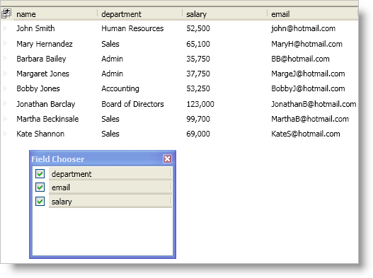

////

|metadata|
{
    "name": "xamdatapresenter-prevent-fields-from-being-hidden",
    "controlName": ["xamDataPresenter"],
    "tags": ["Layouts","Tips and Tricks"],
    "guid": "{06BE5812-54D7-4D1A-A402-43811B1C3D59}",  
    "buildFlags": [],
    "createdOn": "2012-01-30T19:39:53.2920115Z"
}
|metadata|
////

= Prevent Fields from Being Hidden

If you enable the field chooser button or you programmatically display the field chooser, your end users will be able to hide a field using one of these methods:

* Toggle the field chooser's check boxes to toggle a field's visibility.
* Drag a field into the field chooser to hide the field.
* Drag a field outside the bounds of the DataPresenter control.

However, you can modify the way your end users hide fields or you can prevent them from hiding a field altogether by setting a link:{ApiPlatform}datapresenter{ApiVersion}~infragistics.windows.datapresenter.fieldsettings.html[FieldSettings] object's link:{ApiPlatform}datapresenter{ApiVersion}~infragistics.windows.datapresenter.fieldsettings~allowhiding.html[AllowHiding] property to an AllowFieldHiding enum value.

The following example code demonstrates how to prevent fields from being hidden.

*In XAML:*

----
<igDP:XamDataPresenter Name="xamDataPresenter1" BindToSampleData="True">
    <!--Enable the field chooser button-->
    <igDP:XamDataPresenter.FieldLayoutSettings>
        <igDP:FieldLayoutSettings HeaderPrefixAreaDisplayMode="FieldChooserButton" />
    </igDP:XamDataPresenter.FieldLayoutSettings>
    <igDP:XamDataPresenter.FieldLayouts>
        <igDP:FieldLayout>
            <!--Prevent the name field from being hidden-->
            <igDP:Field Name="name">
                <igDP:Field.Settings>
                    <igDP:FieldSettings AllowHiding="Never" />
                </igDP:Field.Settings>
            </igDP:Field>
        </igDP:FieldLayout>
    </igDP:XamDataPresenter.FieldLayouts>
</igDP:XamDataPresenter>
----

*In Visual Basic:*

----
Imports Infragistics.Windows.DataPresenter
...
Me.xamDataPresenter1.FieldLayouts(0).Fields("name").Settings.AllowHiding = AllowFieldHiding.Never
...
----

*In C#:*

----
using Infragistics.Windows.DataPresenter;
...
this.xamDataPresenter1.FieldLayouts[0].Fields["name"].Settings.AllowHiding = AllowFieldHiding.Never;
...
----

== Related Topics

link:xamdatapresenter-about-the-field-chooser.html[About the Field Chooser]

link:xamdatapresenter-display-the-field-chooser.html[Display the Field Chooser]

link:xamdatapresenter-about-field-chooser-settings.html[About Field Chooser Settings]

link:xamdatapresenter-create-an-external-field-chooser.html[Create an External Field Chooser]

link:xamdatapresenter-change-the-display-order-of-fields-in-the-field-chooser.html[Change the Display Order of Fields in the Field Chooser]