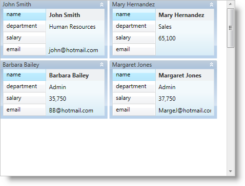

////

|metadata|
{
    "name": "xamdatapresenter-set-the-maximum-number-of-viewable-cards",
    "controlName": ["xamDataPresenter"],
    "tags": ["How Do I","Layouts","Tips and Tricks"],
    "guid": "{5D2E0BF3-3D50-492E-95AD-B9D9111AA93C}",  
    "buildFlags": [],
    "createdOn": "2012-01-30T19:39:53.3720275Z"
}
|metadata|
////

= Set the Maximum Number of Viewable Cards

The xamDataCards™ control can lay out its cards horizontally or vertically similar to a WrapPanel container. The link:{ApiPlatform}datapresenter{ApiVersion}~infragistics.windows.datapresenter.cardviewsettings.html[CardViewSettings] object's link:{ApiPlatform}datapresenter{ApiVersion}~infragistics.windows.datapresenter.cardviewsettings~orientation.html[Orientation] property is identical to the WrapPanel container's Orientation property. If you set it to Horizontal, the xamDataCards control lays out its cards left-to-right then top-to-bottom. On the other hand, if you set it to Vertical, the xamDataCards control lays out its cards top-to-bottom then left-to-right. In either mode, the xamDataCards control will use all the space available to lay out its cards; however, you can limit the maximum number of rows or columns xamDataCards creates by setting the CardViewSettings object's link:{ApiPlatform}datapresenter{ApiVersion}~infragistics.windows.datapresenter.cardviewsettings~maxcardrows.html[MaxCardRows] or link:{ApiPlatform}datapresenter{ApiVersion}~infragistics.windows.datapresenter.cardviewsettings~maxcardcols.html[MaxCardCols] properties, respectively. This effectively sets the maximum number of cards that your end users can view at one time.

The following example code demonstrates how to set the maximum number of viewable cards.

*In XAML:*

----
<igDP:XamDataCards Name="xamDataCards1" BindToSampleData="True">
    <igDP:XamDataCards.ViewSettings>
        <!--A maximum of 8 cards in view-->
        <igDP:CardViewSettings MaxCardRows="2" MaxCardCols="4" />
    </igDP:XamDataCards.ViewSettings>
</igDP:XamDataCards>
----

*In Visual Basic:*

----
Me.xamDataCards1.ViewSettings.MaxCardRows = 2
Me.xamDataCards1.ViewSettings.MaxCardCols = 4
----

*In C#:*

----
this.xamDataCards1.ViewSettings.MaxCardRows = 2;
this.xamDataCards1.ViewSettings.MaxCardCols = 4;
----

== Related Topics

link:xamdatapresenter-about-card-settings.html[About Card Settings]

link:xamdatapresenter-about-card-sizing.html[About Card Sizing]

link:xamdatapresenter-about-repositioning-animations.html[About Repositioning Animations]

link:xamdatapresenter-collapse-a-card.html[Collapse a Card]

link:xamdatapresenter-collapse-an-empty-cell.html[Collapse an Empty Cell]

link:xamdatapresenter-set-the-space-between-cards.html[Set the Space Between Cards]

link:xamdatapresenter-working-with-card-headers.html[Working with Card Headers]