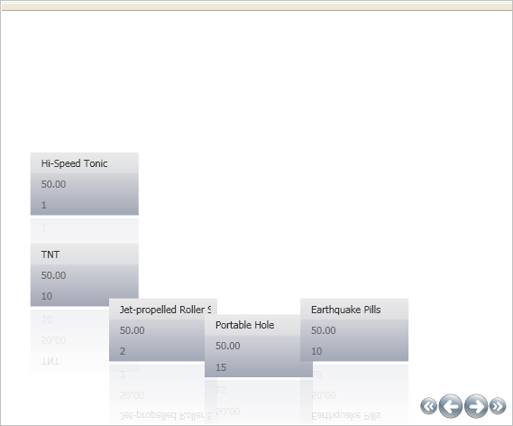

////

|metadata|
{
    "name": "xamdatapresenter-setting-padding-on-xamdatapresenters-path",
    "controlName": ["xamDataPresenter"],
    "tags": ["How Do I","Layouts"],
    "guid": "{670B1B48-017D-45FD-9767-9D60B389BBA3}",  
    "buildFlags": [],
    "createdOn": "2012-01-30T19:39:53.3320195Z"
}
|metadata|
////

= Setting Padding on xamDataPresenter's Path

You can place buffer zones before and after xamDataPresenter's™ Carousel View's path. The Carousel View uses this buffer zone, or padding, when it calculates the control's layout along the path.

The following image demonstrates the Path prefix and suffix functionality.

image::images/xamCarousel_Setting_a_Path_Padding_01.png[path prefix and suffix functionality for xamdatapresenter's carousel view]

Use the following code to specify the link:{ApiPlatform}v{ProductVersion}~infragistics.windows.controls.carouselviewsettings~itempathprefixpercent.html[ItemPathPrefixPercent] and link:{ApiPlatform}v{ProductVersion}~infragistics.windows.controls.carouselviewsettings~itempathsuffixpercent.html[ItemPathSuffixPercent] properties off the link:{ApiPlatform}v{ProductVersion}~infragistics.windows.controls.carouselviewsettings.html[CarouselViewSettings].

*In XAML:*

----
<igDP:XamDataPresenter.View>
        <igDP:CarouselView>
                <igDP:CarouselView.ViewSettings>
                        <igWindows:CarouselViewSettings ItemPathPrefixPercent=".2" 
                          ItemPathSuffixPercent=".4" />
                </igDP:CarouselView.ViewSettings>
        </igDP:CarouselView>
</igDP:XamDataPresenter.View>
----

Replace the code inside the XamDataPresenter's tags from link:xamdatapresenter-getting-started-with-xamdatapresenter.html[Adding xamDataPresenter to Your Application] with the above code to see the functionality. Doing this, when the project is run you notice how the code results in a larger amount of padding after the EarthQuake Pills Record and before the Hi-Speed Tonic Record similar to the image below.

