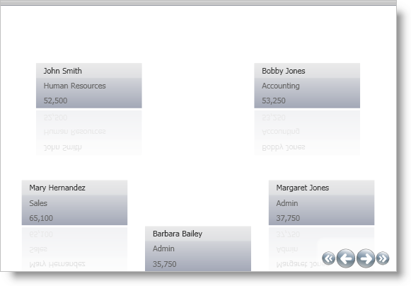
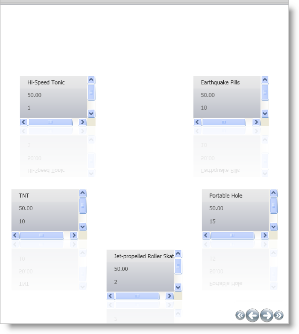

////

|metadata|
{
    "name": "xamdatapresenter-showing-more-than-three-fields-in-xamdatapresenter",
    "controlName": ["xamDataPresenter"],
    "tags": ["How Do I","Layouts"],
    "guid": "{C74BEC77-7CFB-4B7C-AA7E-ED361629EEAD}",  
    "buildFlags": [],
    "createdOn": "2012-01-30T19:39:53.3340199Z"
}
|metadata|
////

= Showing More Than Three Fields in xamDataPresenter

By default, the xamDataPresenter's™ Carousel View will show only the first three field values when it is displayed.

You can change this setting so that all the fields are shown, by setting the link:{ApiPlatform}datapresenter.v{ProductVersion}~infragistics.windows.datapresenter.fieldlayoutsettings~autoarrangemaxrows.html[AutoArrangeMaxRows] property to 0. The following example code shows how to set this property.

*In XAML:*

----
<igDP:XamDataPresenter.FieldLayoutSettings>
        <igDP:FieldLayoutSettings AutoArrangeMaxRows="0" />
</igDP:XamDataPresenter.FieldLayoutSettings>
----

You can use the above-mentioned code along with the code from link:xamdatapresenter-getting-started-with-xamdatapresenter.html[Adding xamDataPresenter to Your Application]. Simply place the above-mentioned code inside the XamDataPresenter tag. When you run the project, you should see something similar to the following.

