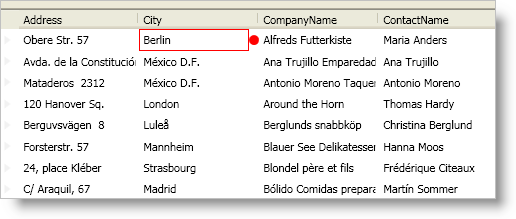

////
|metadata|
{
    "name": "xamdatapresenter-styling-data-errors",
    "controlName": ["xamDataPresenter"],
    "tags": ["How Do I","Styling"],
    "guid": "{065295C7-2E01-4565-A5ED-4A9AA5A214C3}",
    "buildFlags": [],
    "createdOn": "2012-01-30T19:39:53.3390209Z"
}
|metadata|
////

= Styling Data Errors

== Before You Begin

The DataPresenter controls offer two different ways to style data errors. If you only want to change the look of the error icon, you can create a style that modifies the template of the error icon. However, if you want more control over the error icon's placement within the cell or you want to change the cell highlight, you can create a data template to define the presentation of the data errors.

== What You Will Accomplish

You will create a style for the error icon and a data template that positions the error icon on the right-hand side of the cell's value. You will also use a predefined resource key exposed by the link:{ApiPlatform}datapresenter.v{ProductVersion}~infragistics.windows.datapresenter.datapresenterbase.html[DataPresenterBase] class when you create the style and data template so that the DataPresenter controls automatically apply them to all data errors.

The scope of the resource dictionary that contains the style and data template determines which DataPresenter controls are affected. For example, adding the style and data template to the window's resource dictionary affects all DataPresenter controls in the window. You can use this behavior to style DataPresenter controls selectively by adding the style and data templates to the control's local resource dictionary. In addition, if you only want the style and data template to affect a single field, you can create a keyed style that targets the link:{ApiPlatform}datapresenter.v{ProductVersion}~infragistics.windows.datapresenter.cellvaluepresenter.html[CellValuePresenter] class and add them to its resource dictionary. When you set the link:{ApiPlatform}datapresenter.v{ProductVersion}~infragistics.windows.datapresenter.fieldsettings~cellvaluepresenterstyle.html[CellValuePresenterStyle] property exposed by a link:{ApiPlatform}datapresenter.v{ProductVersion}~infragistics.windows.datapresenter.field.html[Field] object's link:{ApiPlatform}datapresenter.v{ProductVersion}~infragistics.windows.datapresenter.fieldsettings.html[FieldSettings] property, the style and data template will only affect data errors in that field.

== Follow these Steps

[start=1]
. Create a style for the error icon and add it to the window's resource dictionary.
+
--
.. Set its TargetType property to "{x:Type Control}".
.. Set its Key property to "{x:Static igDP:DataPresenterBase.DataErrorIconStyleKey}". Since you are using the resource key exposed by the DataPresenterBase class, the DataPresenter control will automatically apply this style to the error icons.
.. Add a Setter element for the Template property.
.. Add an Ellipse object to the control's template.
--
+
*In XAML:*
+
[source,xaml]
----

----

[start=2]
. Create a data template for the data errors and add it to the window's resource dictionary.
+
--
.. Set its Key property to "{x:Static igDP:DataPresenterBase.DataErrorContentTemplateKey}".
.. Add tags for the data template's Triggers collection.
--
+
*In XAML:*
+
[source,xaml]
----
<DataTemplate x:Key="{x:Static igDP:DataPresenterBase.DataErrorContentTemplateKey}">
    <!--TODO: Add a visual tree here-->
    <DataTemplate.Triggers>
        <!--TODO: Add a MultiDataTrigger to show the error icon-->
        <!--TODO: Add a MultiDataTrigger to show the highlight-->
    </DataTemplate.Triggers>
</DataTemplate>
----

[start=3]
. Add a Grid panel to the data template. The Grid panel will be the root layout panel for the data error.
+
--
.. Add a ColumnDefinition object and set its Width property to $$*$$.
.. Add a ColumnDefinition object and set its Width property to Auto.
--
+
*In XAML:*
+
[source,xaml]
----
<Grid>
    <Grid.ColumnDefinitions>
        <ColumnDefinition Width="*" />
        <ColumnDefinition Width="Auto" />
    </Grid.ColumnDefinitions>
    <!--TODO: Add a content presenter to display the cell's value-->
    <!--TODO: Add a control for the error icon-->
    <!--TODO: Add a border for the highlight-->
</Grid>
----

[start=4]
. Add a ContentPresenter object to the first column in the Grid panel and set its ContentTemplate property to NULL. The content presenter will display the cell's value.
+
*In XAML:*
+
[source,xaml]
----
<ContentPresenter ContentTemplate="{x:Null}" />
----

[start=5]
. Add a Control object to the second column in the Grid panel.
+
--
.. Name it errorIcon.
.. Set its Visibility property to Collapsed.
.. Set its Style property to a dynamic resource using the link:{ApiPlatform}datapresenter.v{ProductVersion}~infragistics.windows.datapresenter.datapresenterbase~dataerroriconstylekey.html[DataErrorIconStyleKey] property exposed by the DataPresenterBase class.
.. Set its ToolTip property to the CellValuePresenter object's link:{ApiPlatform}datapresenter.v{ProductVersion}~infragistics.windows.datapresenter.cellvaluepresenter~dataerror.html[DataError] property.
--
+
*In XAML:*
+
[source,xaml]
----
<Control 
    Grid.Column="1" 
    Name="errorIcon" 
    Visibility="Collapsed" 
    Style="{DynamicResource {x:Static igDP:DataPresenterBase.DataErrorIconStyleKey}}" 
    ToolTip="{Binding Host.DataError}" />
----

[start=6]
. Add a Border object to the first column in the Grid panel. If you build and run the project now, the error icon and error highlight will never be displayed even if your data item contains an error. You need to add triggers to the data template to show them when a data error occurs.
+
--
.. Name it errorHighlight.
.. Set its BorderBrush property to Red.
.. Set its BorderThickness property to 1.
.. Set its Visibility property to Collapsed.
--
+
*In XAML:*
+
[source,xaml]
----
<Border Name="errorHighlight" BorderBrush="Red" BorderThickness="1" Visibility="Collapsed" />
----

[start=7]
. Add a MultiDataTrigger element to the data template's Triggers collection. When the cell has a data error and an error icon should be displayed, set the Visibility property of the control named "errorIcon" to True.
+
--
.. Add a Condition element for the CellValuePresenter object's link:{ApiPlatform}datapresenter.v{ProductVersion}~infragistics.windows.datapresenter.cellvaluepresenter~hasdataerror.html[HasDataError] property to the Conditions collection.
.. Add a Condition element for the CellValuePresenter object's link:{ApiPlatform}datapresenter.v{ProductVersion}~infragistics.windows.datapresenter.cellvaluepresenter~isdataerrordisplaymodeicon.html[IsDataErrorDisplayModeIcon] property to the Conditions collection.
.. Add a Setter element that sets the error icon's Visibility property to Visible.
--
+
*In XAML:*
+
[source,xaml]
----
<MultiDataTrigger>
    <MultiDataTrigger.Conditions>
        <Condition Binding="{Binding Host.HasDataError}" Value="True" />
        <Condition Binding="{Binding Host.IsDataErrorDisplayModeIcon}" Value="True" />
    </MultiDataTrigger.Conditions>
    <Setter TargetName="errorIcon" Property="Visibility" Value="Visible" />
</MultiDataTrigger>
----

[start=8]
. Add a MultiDataTrigger element to the data template's Triggers collection. When the cell has a data error and an error highlight should be displayed, set the Visibility property of the Border object named "errorHighlight" to True.
+
--
.. Add a Condition element for the CellValuePresenter object's HasDataError property to the Conditions collection.
.. Add a Condition element for the CellValuePresenter object's link:{ApiPlatform}datapresenter.v{ProductVersion}~infragistics.windows.datapresenter.cellvaluepresenter~isdataerrordisplaymodehighlight.html[IsDataErrorDisplayModeHighlight] property to the Conditions collection.
.. Add a Setter element that sets the Border object's Visibility property to Visible.
--
+
*In XAML:*
+
[source,xaml]
----
<MultiDataTrigger>
    <MultiDataTrigger.Conditions>
        <Condition Binding="{Binding Host.HasDataError}" Value="True" />
        <Condition Binding="{Binding Host.IsDataErrorDisplayModeHighlight}" Value="True" />
    </MultiDataTrigger.Conditions>
    <Setter TargetName="errorHighlight" Property="Visibility" Value="Visible" />
</MultiDataTrigger>
----

[start=9]
. Run the project. If your data items contain errors, you should see a DataPresenter control display data errors similar to the screen shot below.
+

== Related Topics

link:xamdatapresenter-enable-idataerrorinfo-interface-support.html[Enable IDataErrorInfo Interface Support]

link:xamdatapresenter-validate-data-as-your-end-users-edit-a-cell.html[Validate Data as Your End Users Edit a Cell]

link:xamdatapresenter-validating-edited-cell-data-in-xamdatapresenter.html[Validating Edited Cell Data in xamDataPresenter]