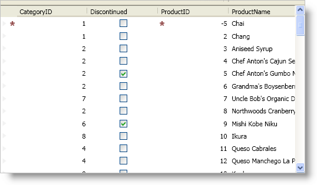

////
|metadata|
{
    "name": "xamdatapresenter-validating-data",
    "controlName": ["xamDataPresenter"],
    "tags": ["How Do I","Validation"],
    "guid": "{39DAA02D-82BD-4CE9-BEC9-384093C88733}",
    "buildFlags": [],
    "createdOn": "2012-01-30T19:39:53.3510233Z"
}
|metadata|
////

= Data Validation Overview

== Topic Overview

=== Purpose

This topic explains how to work with the validation feature.

=== Required background

The following topics are prerequisites to understanding this topic:

[options="header", cols="a,a"]
|====
|Topic|Purpose

| link:xamdatagrid-understanding-xamdatagrid.html[About xamDataGrid]
|This topic provides an overview of the xamDataGrid control including a conceptual diagram of its comprising elements.

|====

=== In this topic

This topic contains the following sections:

* <<_Ref419378280, Overview >>
* <<_Ref419378289, Related Content >>

[[_Ref419378280]]
== Overview

=== Summary

If your data items implement the `INotifyDataErrorInfo` or `IDataErrorInfo` interface found in the .NET Framework, the  _DataPresenter_   family of controls can display an error message(s) when the user enters invalid data in a cell. However, you must link:xamdatapresenter-enable-idataerrorinfo-interface-support.html[enable the data error information support] by setting a link:{ApiPlatform}datapresenter.v{ProductVersion}~infragistics.windows.datapresenter.fieldlayoutsettings.html[FieldLayoutSettings] object's link:{ApiPlatform}datapresenter.v{ProductVersion}~infragistics.windows.datapresenter.fieldlayoutsettings~supportdataerrorinfo.html[SupportDataErrorInfo] property to a link:{ApiPlatform}datapresenter.v{ProductVersion}~infragistics.windows.datapresenter.supportdataerrorinfo.html[SupportDataErrorInfo] enumeration value.

In addition to enabling support for data errors, the `SupportDataErrorInfo` property determines whether the  _DataPresenter_   control displays the data error in a cell, record selector, or both.

The following screenshot shows a data error in the first record’s "ProductID" column:

.Note
[NOTE]
====
The `INotifyDataErrorInfo` interface takes precedence over the `IDataErrorInfo` interface when both interfaces are implemented by the data items. The advantage of using the `INotifyDataErrorInfo` interface is that you may have more than one error message per record and/or cell.
====

=== Configure data error support

The following table shows how the  _DataPresenter_   control accesses the methods/properties of the data items in order to obtain the error information which ultimately depends on the value of the `SupportDataErrorInfo` property.

[options="header", cols="a,a,a"]
|====
|Value set on the `SupportDataErrorInfo` property|Interface used by the data item|
|
|`IDataErrorInfo`
|`INotifyDataErrorInfo`

|`RecordsOnly`
|Obtain record’s error message by querying the `Error` property.
|Obtain record’s error messages by querying the `GetErrors()` method with an empty string as an argument value.

|`CellsOnly`
|Obtain each property error message by querying the data item’s indexer and passing the property name as an argument.
|Obtain each property error messages by querying the `GetErrors()` method with the property name as an argument value.

|`RecordsAndCells`
|Both of the above.
|Both of the above.

|====

If you enable the data error support on the `FieldLayoutSettings` object, any fields in the affected field layout will automatically report data errors. You can selectively disable this feature on a field by setting the link:{ApiPlatform}datapresenter.v{ProductVersion}~infragistics.windows.datapresenter.fieldsettings~supportdataerrorinfo.html[SupportDataErrorInfo] property exposed by a field object's link:{ApiPlatform}datapresenter.v{ProductVersion}~infragistics.windows.datapresenter.field~settings.html[FieldSettings] property to `false`.

You can also modify how the  _DataPresenter_   control reports data errors by setting a `FieldLayoutSettings` object's link:{ApiPlatform}datapresenter.v{ProductVersion}~infragistics.windows.datapresenter.fieldlayoutsettings~dataerrordisplaymode.html[DataErrorDisplayMode] property to a link:{ApiPlatform}datapresenter.v{ProductVersion}~infragistics.windows.datapresenter.dataerrordisplaymode.html[DataErrorDisplayMode] enumeration value. Setting the `DataErrorDisplayMode` property determines whether a data error is presented as an error icon, a highlight, or both.

=== Editor’s Value Constraints

If you enable support for either the `IDataErrorInfo` interface or the `INotifyDataErrorInfo` interface and you set the link:{ApiPlatform}editors.v{ProductVersion}~infragistics.windows.editors.valueeditor~valueconstraint.html[ValueConstraint] property of an embedded xamEditor control, any value constraint errors will also cause the error icon and/or highlight to appear. Value constraints will force your end users to correct an error before they can move focus to a new cell. If you set a `FieldSettings` object's link:{ApiPlatform}datapresenter.v{ProductVersion}~infragistics.windows.datapresenter.fieldsettings~invalidvaluebehavior.html[InvalidValueBehavior] property to link:{ApiPlatform}editors.v{ProductVersion}~infragistics.windows.editors.invalidvaluebehavior.html[RevertValue], the cell's value will automatically revert to its original value allowing your end users to move focus to a new cell. However, because the valued will always pass the value constraints, the  _DataPresenter_   control will never display an error icon and/or highlight. On the other hand, if you do not use value constraints, the  _DataPresenter_   control will display your data item's error message in the appropriate cell and your end users can move focus to a new cell.

[[_Ref419378289]]
== Related Content

=== Topics

The following topics provide additional information related to this topic.

[options="header", cols="a,a"]
|====
|Topic|Purpose

| link:xamdatapresenter-enable-idataerrorinfo-interface-support.html[Enable Data Error Information Support]
|This topic explains how to enable the data error support with code examples.

| link:xamdatapresenter-validate-data-as-your-end-users-edit-a-cell.html[Validate Data as Your End Users Edit a Cell]
|This topic explains how to provide validation feedback as the user edits a cell value.

| link:xamdatapresenter-styling-data-errors.html[Styling Data Errors]
|This topic explains how to provide custom styling for the visual data validation indication.

| link:xamdatapresenter-validating-edited-cell-data-in-xamdatapresenter.html[Validating Edited Cell Data in xamDataPresenter]
|This topic explains how to define custom validation logic.

|====

=== Sample

The following sample provides additional information related to this topic.

[options="header", cols="a,a"]
|====
|Sample|Purpose

| link:{SamplesURL}/data-grid/idataerrorinfo-support[IDataErrorInfo Support]
|This sample shows you how to enable IDataErrorInfo support in the data presenter.

|====