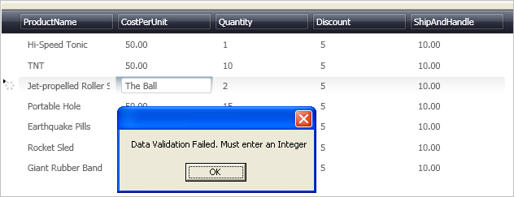

////
|metadata|
{
    "name": "xamdatapresenter-validating-edited-cell-data-in-xamdatapresenter",
    "controlName": ["xamDataPresenter"],
    "tags": ["How Do I","Validation"],
    "guid": "{A9F87008-0061-48A6-BB93-BDE36C13BD00}",
    "buildFlags": [],
    "createdOn": "2012-01-30T19:39:53.3530237Z"
}
|metadata|
////

= Validating Edited Cell Data in xamDataPresenter

A common task in developing data entry applications is to implement validation logic. Validation logic tests the end user's input for valid data. The xamDataPresenter™ control raises the link:{ApiPlatform}datapresenter{ApiVersion}~infragistics.windows.datapresenter.datapresenterbase~editmodeending_ev.html[EditModeEnding] event when the end user is finished editing a cell. This event provides you an opportunity to inject your own custom data validation logic and cancel the cell edit if the validation fails.

Follow these steps to verify that the edited content of a cell can be parsed as an Integer.

[start=1]
. Before you start writing any code, you should place using/Imports directives in your code-behind so you don't need to always type out a member's fully qualified name.
+
*In Visual Basic:*
+
[source,vb]
----
Imports Infragistics.Windows.DataPresenter.Events
----
+
*In C#:*
+
[source,csharp]
----
using Infragistics.Windows.DataPresenter.Events;
----

[start=2]
. Wire the EditModeEnding event to xamDataPresenter.
+
*In XAML:*
+
[source,xaml]
----
<igDP:XamDataPresenter x:Name="XamDataPresenter1" 
  ...
  EditModeEnding="XamDataPresenter1_EditModeEnding" />
----

[start=3]
. Create the event handler method in your code-behind.
+
*In Visual Basic:*
+
[source,vb]
----
Sub XamDataPresenter1_EditModeEnding(ByVal sender As Object, _
  ByVal e As EditModeEndingEventArgs)
End Sub
----
+
*In C#:*
+
[source,csharp]
----
void XamDataPresenter1_EditModeEnding(object sender, EditModeEndingEventArgs e)
{
}
----
+
Notice the method receives the link:{ApiPlatform}datapresenter{ApiVersion}~infragistics.windows.datapresenter.events.editmodeendingeventargs.html[EditModeEndingEventArgs] parameter which provides properties containing information specific to edited cell data.

[start=4]
. Add your validation logic to the event handler. Verify the edited content of a cell can be parsed as an Integer. If the parse fails, the program rejects the changes using the link:{ApiPlatform}datapresenter{ApiVersion}~infragistics.windows.datapresenter.events.editmodeendingeventargs~acceptchanges.html[AcceptChanges] property and notifies the end user of the validation failure with a MessageBox.
+
*In Visual Basic:*
+
[source,vb]
----
Sub XamDataPresenter1_EditModeEnding(ByVal sender As Object, _
    ByVal e As EditModeEndingEventArgs)
    ' Try to parse the data to see if its valid
    Dim value As Integer
    If Not Int32.TryParse(e.Editor.Text, value) Then
        ' If the parse fails, reject the changes               
        e.AcceptChanges = False
        MessageBox.Show("Data Validation Failed. Must enter an Integer")
        e.Cancel = True
    End If
End Sub
----
+
*In C#:*
+
[source,csharp]
----
void XamDataPresenter1_EditModeEnding(object sender, EditModeEndingEventArgs e)
{            
    // Try to parse the data to see if its valid
    int value;
    if (!Int32.TryParse(e.Editor.Text, out value))
    {
        // If the parse fails, reject the changes               
        e.AcceptChanges = false;
        MessageBox.Show("Data Validation Failed. Must enter an Integer");
        e.Cancel = true;
    }
}
----

[start=5]
. Build and run the project. When you enter data that is not of type Integer into any link:{ApiPlatform}datapresenter{ApiVersion}~infragistics.windows.datapresenter.field.html[Field], you will be prompted with a MessageBox.
+

== Related Topics

link:xamdatapresenter-enable-idataerrorinfo-interface-support.html[Enable IDataErrorInfo Interface Support]

link:xamdatapresenter-validate-data-as-your-end-users-edit-a-cell.html[Validate Data as Your End Users Edit a Cell]

link:xamdatapresenter-styling-data-errors.html[Styling Data Errors]