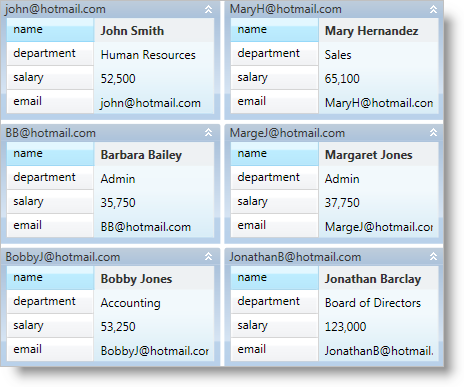

////

|metadata|
{
    "name": "xamdatapresenter-working-with-card-headers",
    "controlName": ["xamDataPresenter"],
    "tags": ["How Do I","Layouts"],
    "guid": "{26B584FE-5F9A-4DA9-848B-2A83C385E38B}",  
    "buildFlags": [],
    "createdOn": "2012-01-30T19:39:53.3770285Z"
}
|metadata|
////

= Working with Card Headers

The xamDataCards™ control automatically displays the value of the primary field in the header of each card. However, you can change this default behavior so that xamDataCards displays a different value in the headers or even hides the headers entirely.

If you want to display a value other than the primary field in the headers, you can set the link:{ApiPlatform}datapresenter{ApiVersion}~infragistics.windows.datapresenter.cardviewsettings.html[CardViewSettings] object's link:{ApiPlatform}datapresenter{ApiVersion}~infragistics.windows.datapresenter.cardviewsettings~headerpath.html[HeaderPath] property to the name of a property exposed by your data item.

If you want to hide the headers, you can set the CardViewSettings object's link:{ApiPlatform}datapresenter{ApiVersion}~infragistics.windows.datapresenter.cardviewsettings~headervisibility.html[HeaderVisibility] property to Collapsed. However, if you hide the headers, the collapse card button and collapse empty cell buttons will not be available even if you enable those features.

The following example code demonstrates how to set the header caption.

*In XAML:*

----
<igDP:XamDataCards Name="xamDataCards1" BindToSampleData="True"> 
    <igDP:XamDataCards.ViewSettings>
        <igDP:CardViewSettings HeaderPath="email" />
    </igDP:XamDataCards.ViewSettings>
</igDP:XamDataCards>
----

*In Visual Basic:*

----
Me.xamDataCards1.ViewSettings.HeaderPath = "email"
----

*In C#:*

----
this.xamDataCards1.ViewSettings.HeaderPath = "email";
----

== Related Topics

link:xamdatapresenter-about-card-settings.html[About Card Settings]

link:xamdatapresenter-about-card-sizing.html[About Card Sizing]

link:xamdatapresenter-about-repositioning-animations.html[About Repositioning Animations]

link:xamdatapresenter-collapse-a-card.html[Collapse a Card]

link:xamdatapresenter-collapse-an-empty-cell.html[Collapse an Empty Cell]

link:xamdatapresenter-set-the-maximum-number-of-viewable-cards.html[Set the Maximum Number of Viewable Cards]

link:xamdatapresenter-set-the-space-between-cards.html[Set the Space Between Cards]