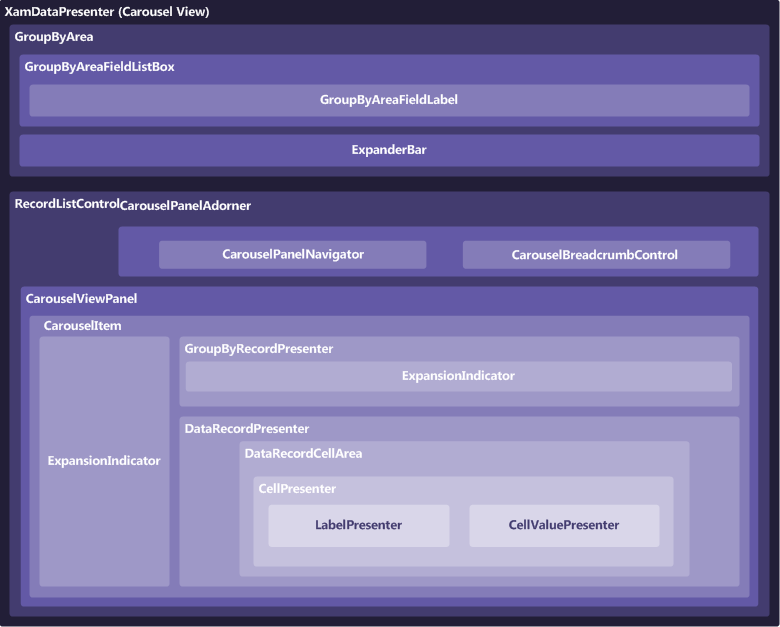

////

|metadata|
{
    "name": "xamdatapresenter-xamdatapresenters-carousel-view-composition-diagram",
    "controlName": ["xamDataPresenter"],
    "tags": ["Getting Started"],
    "guid": "{EBA18409-957E-453D-8169-5A49566D8B8B}",  
    "buildFlags": [],
    "createdOn": "2012-01-30T19:39:53.3550241Z"
}
|metadata|
////

= xamDataPresenter's Carousel View Composition Diagram

The xamDataPresenter™ control is comprised of various elements. The following illustration depicts the relationship between the elements, so that you can gain a better understanding of the overall composition of xamDataPresenter.

