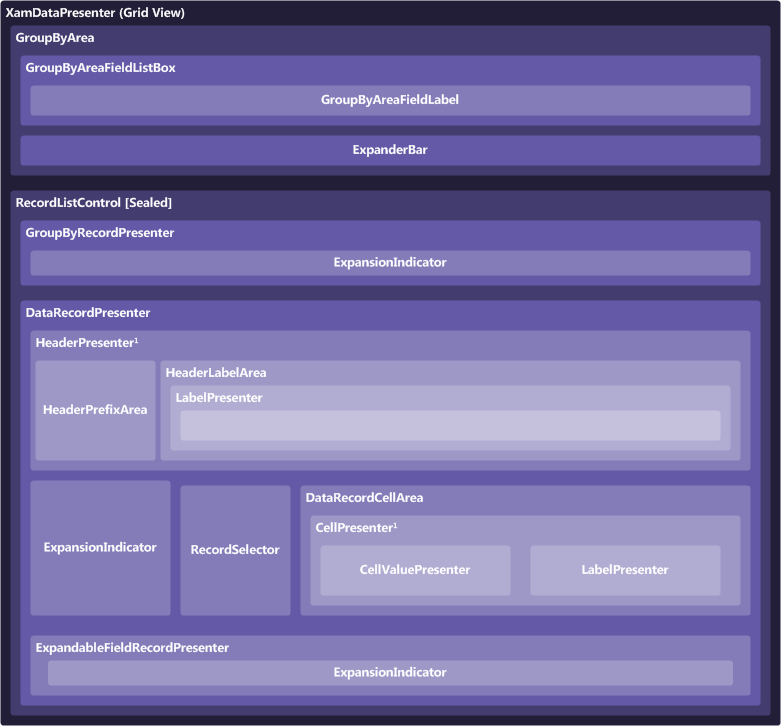

////

|metadata|
{
    "name": "xamdatapresenter-xamdatapresenters-grid-view-composition-diagram",
    "controlName": ["xamDataPresenter"],
    "tags": ["Getting Started"],
    "guid": "{002FB247-5082-4229-984E-F1B2447C6926}",  
    "buildFlags": [],
    "createdOn": "2012-01-30T19:39:53.3580247Z"
}
|metadata|
////

= xamDataPresenters Grid View Composition Diagram

The xamDataPresenter™ control is comprised of various elements. The following illustration depicts the relationship between the elements, so that you can gain a better understanding of the overall composition of xamDataPresenter.

*1* If labels are in a separate area (i.e. there is a link:{ApiPlatform}datapresenter{ApiVersion}~infragistics.windows.datapresenter.headerpresenter.html[HeaderPresenter]) then you cannot have a link:{ApiPlatform}datapresenter{ApiVersion}~infragistics.windows.datapresenter.cellpresenter.html[CellPresenter]. Instead, the link:{ApiPlatform}datapresenter{ApiVersion}~infragistics.windows.datapresenter.cellvaluepresenter.html[CellValuePresenter] is placed directly into the link:{ApiPlatform}datapresenter{ApiVersion}~infragistics.windows.datapresenter.datarecordcellarea.html[DataRecordCellArea]. The CellPresenter is used only when labels and cells are together based on the link:{ApiPlatform}datapresenter{ApiVersion}~infragistics.windows.datapresenter.fieldlayoutsettings~labellocation.html[FieldLayoutSettings.LabelLocation] property.