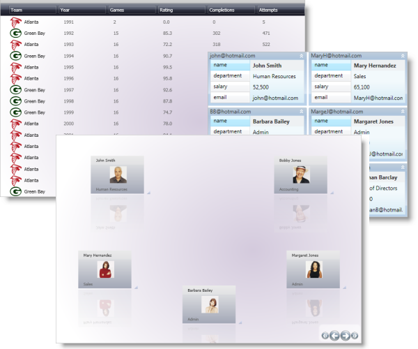

////

|metadata|
{
    "name": "xamdatapresenter",
    "controlName": ["xamDataPresenter"],
    "tags": [],
    "guid": "{16FF4F65-5D4D-4D68-BE0E-BE67634A8975}",  
    "buildFlags": [],
    "createdOn": "2012-01-30T19:39:53.0359603Z"
}
|metadata|
////

= xamDataPresenter

== In This Group of Topics

=== Introduction

This section contains topics covering the  _xamDataPresenter_™ control for WPF.

The  _xamDataPresenter_   is a layout-type control which allows the visualizing of data in several different views including custom ones. It is useful when you need to change the data presentation view dynamically.

The illustration below demonstrates pre-defined views. (The control can display one view at a time; there are several views in the picture for illustration purposes.)

=== Topics

[options="header", cols="a,a"]
|====
|Topic|Purpose

| link:xamdatapresenter-understanding-xamdatapresenter.html[About _xamDataPresenter_ ]
|This is a group of topics providing an overview of the _xamDataPresenter_ control.

| link:xamdatapresenter-getting-started-with-xamdatapresenter.html[Adding _xamDataPresenter_ to Your Page]
|This topic provides step-by-step instructions on how to add a basic _xamDataPresenter_ to your page.

| link:xamdatapresenter-accessing-data.html[Binding _xamDataPresenter_ to Data]
|This is a group of topics explaining how to bind the _xamDataPresenter_ to different data types.

| link:xamdatapresenter-using-xamdatapresenter.html[Working with _xamDataPresenter_ ]
|This a group of topics explaining how to use the _xamDataPresenter_ control and manage it programmatically.

| link:xamdatapresenter-designing-the-look-and-feel.html[Styling _xamDataPresenter_ ]
|This is a group of topics explaining how to style the various visual elements of the _xamDataPresenter_ control and how to modify the build-in themes to manage the look-and-feel of the grid.

| link:xamdatapresenter-optimizing-performance.html[Optimizing Performance ( _xamDataPresenter_ )]
|This is a group of topics explaining how to improve the performance of the _xamDataPresenter_ in your application.

| link:xamdatapresenter-api-overview.html[API Reference ( _xamDataPresenter_ )]
|This topic provides reference information about the namespaces and classes related to the _xamDataPresenter_ control.

|====