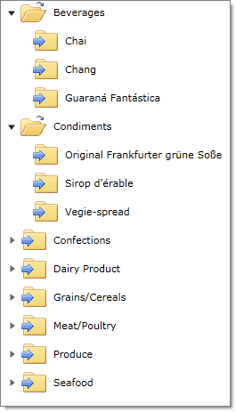

////

|metadata|
{
    "name": "xamdatatree-expanded-and-collapsed-xamdatatree-nodes",
    "controlName": ["xamDataTree"],
    "tags": ["Data Presentation","Editing"],
    "guid": "373d1884-439b-45e7-9391-802101ea25fa",  
    "buildFlags": [],
    "createdOn": "2016-05-25T18:21:54.8871119Z"
}
|metadata|
////

= Configuring Expanded/Collapsed Node State (xamDataTree)

By default, on first load, the xamDataTree™ control is displayed with all the nodes collapsed; each parent node appears with an expansion icon displayed next to it. Clicking on this icon will expand that particular parent node.

However, you can override the first load default behavior by displaying certain or all nodes as expanded. You can achieve this by setting the XamDataTreeNode object’s link:{ApiPlatform}controls.menus.xamdatatree.v{ProductVersion}~infragistics.controls.menus.xamdatatreenode~isexpanded.html[IsExpanded] property.

The following code demonstrates how to achieve this.

*In Visual Basic:*

----
MyTree.Nodes(0).IsExpanded = true
----

*In C#:*

----
MyTree.Nodes[0].IsExpanded = true;
----

You can also bind the expansion of a node to a particular field on your data object by setting the NodeLayout object’s link:{ApiPlatform}controls.menus.xamdatatree.v{ProductVersion}~infragistics.controls.menus.nodelayout~isexpandedmemberpath.html[IsExpandedMemberPath] to a field on your object.

*In XAML:*

----
<ig:NodeLayout Key="CategoryLayout" TargetTypeName="Category" IsExpandedMemberPath="UnitsInStock" DisplayMemberPath="CategoryName">
----

You can display custom icons for the expanded and collapsed states of each node in the xamDataTree control. You can achieve this by defining a data template for the link:{ApiPlatform}controls.menus.xamdatatree.v{ProductVersion}~infragistics.controls.menus.xamdatatree~expandedicontemplate.html[ExpandedIconTemplate] and link:{ApiPlatform}controls.menus.xamdatatree.v{ProductVersion}~infragistics.controls.menus.xamdatatree~collapsedicontemplate.html[CollapsedIconTemplate] properties of the xamDataTree control, or you can set them individually for each node layout.

The following code snippet demonstrates how to set icons for nodes’ expanded and collapsed states.

*In XAML:*

----
<ig:XamDataTree x:Name="MyTree">
   <ig:XamDataTree.CollapsedIconTemplate>
      <DataTemplate>
         <Image Source="/xamWebChart_XAML;component/Images/MoveToFolder32.png"/>
      </DataTemplate>
   </ig:XamDataTree.CollapsedIconTemplate>
   <ig:XamDataTree.ExpandedIconTemplate>
      <DataTemplate>
         <Image Source="/xamWebChart_XAML;component/Images/Open32.png"/>
      </DataTemplate>
   </ig:XamDataTree.ExpandedIconTemplate>
   <!-- TODO: Add xamDataTree Items -->
</ig:XamDataTree>
----

*Related Topics*

link:xamdatatree-xamdatatree-activation.html[Activation (xamDataTree)]

link:xamdatatree-active-data-item.html[Configuring Active Data Item (xamDataTree)]

link:xamdatatree-xamdatatree-check-boxes.html[Configuring Check Boxes Visibility (xamDataTree)]

link:xamdatatree-xamdatatree-drag-and-drop.html[Configuring Drag and Drop (xamDataTree)]

link:xamdatatree-xamdatatree-editing.html[Configuring Editing (xamDataTree)]

link:xamdatatree-xamdatatree-node-connectors.html[Configuring Node Connectors Visibility (xamDataTree)]

link:xamdatatree-xamdatatree-node-layouts.html[Configuring Node Layouts (xamDataTree)]

link:xamdatatree-xamdatatree-selection.html[Selection (xamDataTree)]