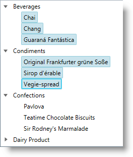
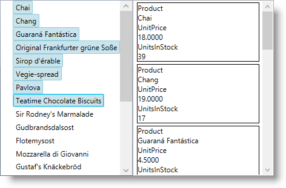
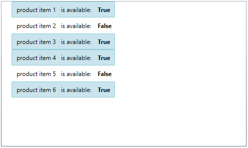

////

|metadata|
{
    "name": "xamdatatree-performing-selection-programmatically",
    "tags": ["Selection"],
    "controlName": ["xamDataTree"],
    "guid": "a54d7d6e-5169-486a-9958-60823615f90d",  
    "buildFlags": [],
    "createdOn": "2016-05-25T18:21:54.9401234Z"
}
|metadata|
////

= Performing Selection Programmatically (xamDataTree)

== Topic Overview

=== Purpose

This topic describes how to programmatically perform selection in the  _xamDataTree_™ control.

=== Required background

The following topics are prerequisites to understanding this topic:

[options="header", cols="a,a"]
|====
|Topic|Purpose

| link:xamdatatree-about-xamdatatree.html[About xamDataTree]
|This topic describes the main key features of the _xamDataTree_ control.

| link:xamdatatree-adding-xamdatatree-to-your-page.html[Adding xamDataTree to Your Page]
|This topic describes the basic steps required for adding the _xamDataTree_ control to your page using procedural code and XAML.

|====

=== In this topic

This topic contains the following sections:

* <<_Ref391047944,Programmatic Selection Summary>>
* <<_Ref391042353,Configuring Selection Type>>
* <<_Ref391042377,Configuring Specific Selected Node>>
* <<_Ref391047968,Configuring Collection of Selected Nodes>>
* <<_Ref391047976,Configuring Selected Data Items>>
* <<_Ref395434076,Modifying the Selected Data Items Collection via a Data Model Boolean Property’s Value>>
* <<_Ref391047984,Related Content>>

** <<_Ref391047990,Topics>>

ifdef::sl[]
** <<_Ref391047996,Samples>>

endif::sl[]

[[_Ref391047944]]
== Programmatic Selection Summary

=== Programmatic Selection Summary

The  _xamDataTree_   control provides functionality for enabling single or multiple selection using either mouse or keyboard. The control also provides easy way to configure all the aspects of the selection feature.

=== Programmatic selection configuration summary chart

The following table explains briefly the configurable aspects of the selection in the  _xamDataTree_   control and maps them to the properties that configure them. Further details are available after the table.

[options="header", cols="a,a,a"]
|====
|Configurable aspect|Details|Properties

|<<_Ref391042353,Configuring Selection Type>>
|Enable single or multiple selection or disable the selection at all in the _xamDataTree_ .
|
* link:{ApiPlatform}controls.menus.xamdatatree{ApiVersion}~infragistics.controls.menus.treeselectionsettings~nodeselection.html[NodeSelection] 

|<<_Ref391042377,Configuring Specific Selected Node>>
|Select a particular node or identify the currently selected node in the _xamDataTree_ .
|
* link:{ApiPlatform}controls.menus.xamdatatree{ApiVersion}~infragistics.controls.menus.xamdatatreenode~isselected.html[IsSelected] 

|<<_Ref391047968,Configuring Collection of Selected Nodes>>
|Set/Get a collection of selected `XamDataTreeNode` objects in the _xamDataTree_ .
|
* link:{ApiPlatform}controls.menus.xamdatatree{ApiVersion}~infragistics.controls.menus.treeselectionsettings~selectednodes.html[SelectedNodes] 

|<<_Ref391047976,Configuring Selected Data Items>>
|Set/Get a collection of selected data items in the _xamDataTree_ .
|
* link:{ApiPlatform}controls.menus.xamdatatree{ApiVersion}~infragistics.controls.menus.xamdatatree~selecteddataitems.html[SelectedDataItems] 

|<<_Ref395434076,Modifying the Selected Data Items Collection via a Data Model Boolean Property’s Value>>
|Configure the Selected/Unselected data items using an underlying data model’s property which boolean value determines the items’ current state in the _xamDataTree_ .
|
* link:{ApiPlatform}controls.menus.xamdatatree{ApiVersion}~infragistics.controls.menus.xamdatatree~isselectedmemberpath.html[IsSelectedMemberPath] 

|====

[[_Ref391042353]]
== Configuring Selection Type

[[_Hlk368069110]]

=== Overview

Use the link:{ApiPlatform}controls.menus.xamdatatree{ApiVersion}~infragistics.controls.menus.treeselectionsettings_members.html[TreeSelectionSettings] object’s `NodeSelection` property to configure the desired node selection type in the  _xamDataTree_   control.

You can enable single or multiple node selection or disable the selection completely.

=== Property settings

The following table maps the desired configuration to the property settings that manage it.

[options="header", cols="a,a,a"]
|====
|In order to:|Use this property:|And set it to:

|Disable node selection
| link:{ApiPlatform}controls.menus.xamdatatree{ApiVersion}~infragistics.controls.menus.treeselectionsettings~nodeselection.html[NodeSelection]
| link:{ApiPlatform}controls.menus.xamdatatree{ApiVersion}~infragistics.controls.menus.treeselectiontype.html[None]

|Enable multiple nodes selection
| link:{ApiPlatform}controls.menus.xamdatatree{ApiVersion}~infragistics.controls.menus.treeselectionsettings~nodeselection.html[NodeSelection]
| link:{ApiPlatform}controls.menus.xamdatatree{ApiVersion}~infragistics.controls.menus.treeselectiontype.html[Multiple]

|Enable one node selection at a time
| link:{ApiPlatform}controls.menus.xamdatatree{ApiVersion}~infragistics.controls.menus.treeselectionsettings~nodeselection.html[NodeSelection]
| link:{ApiPlatform}controls.menus.xamdatatree{ApiVersion}~infragistics.controls.menus.treeselectiontype.html[Single]

|====

[[_Hlk337817761]]

=== Example

The screenshot below demonstrates how the  _xamDataTree_   would behave as a result of the following settings:

[options="header", cols="a,a"]
|====
|Property|Value

| link:{ApiPlatform}controls.menus.xamdatatree{ApiVersion}~infragistics.controls.menus.treeselectionsettings~nodeselection.html[NodeSelection]
| _Multiple_ 

|====

Following is the code that implements this example.

*In XAML:*

[source,xaml]
----
<ig:XamDataTree x:Name="DataTree" ItemsSource="{Binding CategoriesAndProducts}">
    <ig:XamDataTree.SelectionSettings>
        <ig:TreeSelectionSettings NodeSelection="Multiple"/>
    </ig:XamDataTree.SelectionSettings>
</ig:XamDataTree>
----

*In Visual Basic:*

[source,vb]
----
DataTree.SelectionSettings.NodeSelection = TreeSelectionType.Multiple
----

*In C#:*

[source,csharp]
----
DataTree.SelectionSettings.NodeSelection = TreeSelectionType.Multiple;
----

[[_Ref391042377]]
== Configuring Specific Selected Node

=== Overview

Use the link:{ApiPlatform}controls.menus.xamdatatree{ApiVersion}~infragistics.controls.menus.xamdatatreenode_members.html[XamDataTreeNode] object’s `IsSelected` property to select a particular node or to determine which node is currently selected.

=== Property settings

The following table maps the desired configuration to the property settings that manage it.

[options="header", cols="a,a,a"]
|====
|In order to:|Use this property:|And set it to:

|Select/unselect a specific node
| link:{ApiPlatform}controls.menus.xamdatatree{ApiVersion}~infragistics.controls.menus.xamdatatreenode~isselected.html[IsSelected]
|`bool`

|====

=== Example

The example code below demonstrates how to select the root node in the  _xamDataTree_   control:

*In Visual Basic:*

[source,vb]
----
DataTree.Nodes(0).IsSelected = true
----

*In C#:*

[source,csharp]
----
DataTree.Nodes[0].IsSelected = true;
----

[[_Ref391047968]]
== Configuring Collection of Selected Nodes

=== Overview

Use the link:{ApiPlatform}controls.menus.xamdatatree{ApiVersion}~infragistics.controls.menus.treeselectionsettings_members.html[TreeSelectionSettings] object’s `SelectedNodes` collection property to programmatically set selected link:{ApiPlatform}controls.menus.xamdatatree{ApiVersion}~infragistics.controls.menus.xamdatatreenode_members.html[XamDataTreeNode] objects in the  _xamDataTree_   control.

You can also use this property to identify the user’s selected link:{ApiPlatform}controls.menus.xamdatatree{ApiVersion}~infragistics.controls.menus.xamdatatreenode_members.html[XamDataTreeNode] objects.

=== Property settings

The following table maps the desired configuration to the property settings that manage it.

[options="header", cols="a,a,a"]
|====
|In order to:|Use this property:|And set it to:

|Set programmatically a collection of selected `XamDataTreeNode` objects
| link:{ApiPlatform}controls.menus.xamdatatree{ApiVersion}~infragistics.controls.menus.treeselectionsettings~selectednodes.html[SelectedNodes]
| link:{ApiPlatform}controls.menus.xamdatatree{ApiVersion}~infragistics.controls.menus.selectednodescollection_members.html[SelectedNodesCollection]

|====

=== Example

The example code below demonstrates how to add the root node to the collection of selected nodes in the  _xamDataTree_   control:

*In Visual Basic:*

[source,vb]
----
DataTree.SelectionSettings.SelectedNodes.Add(DataTree.Nodes(0))
----

*In C#:*

[source,csharp]
----
DataTree.SelectionSettings.SelectedNodes.Add(DataTree.Nodes[0]);
----

[[_Ref391047976]]
== Configuring Selected Data Items

=== Overview

Use the link:{ApiPlatform}controls.menus.xamdatatree{ApiVersion}~infragistics.controls.menus.xamdatatree_members.html[XamDataTree] `SelectedDataItems` property to set or get the selected data items in the  _xamDataTree_   control.

When an item is selected/unselected, this change reflects the `SelectedDataItems` collection as well as the link:{ApiPlatform}controls.menus.xamdatatree{ApiVersion}~infragistics.controls.menus.treeselectionsettings_members.html[SelectionSettings] link:{ApiPlatform}controls.menus.xamdatatree{ApiVersion}~infragistics.controls.menus.treeselectionsettings~selectednodes.html[SelectedNodes] collection.

The `SelectedDataItems` collection accepts items of different types and different levels in the data source hierarchy.

=== Property settings

The following table maps the desired behavior to the property settings that manage it.

[options="header", cols="a,a,a"]
|====
|In order to:|Use this property:|And set it to:

|Set the selected data items
| link:{ApiPlatform}controls.menus.xamdatatree{ApiVersion}~infragistics.controls.menus.xamdatatree~selecteddataitems.html[SelectedDataItems]
|`object[]`

|====

=== Example

The screenshot below demonstrates how the `XamDataTree` `SelectedDataItems` property is used as an `ItemsSource` of the `ListView` control:

Following is the code that implements this example.

*In XAML:*

[source,xaml]
----
<ig:XamDataTree x:Name="DataTree" ItemsSource="{Binding Path=Products}">
    <ig:XamDataTree.SelectionSettings>
        <ig:TreeSelectionSettings NodeSelection="Multiple" />
    </ig:XamDataTree.SelectionSettings>
    <ig:XamDataTree.GlobalNodeLayouts>
        <ig:NodeLayout Key="ProductLayout" 
                       TargetTypeName="Product" 
                       DisplayMemberPath="ProductName">
        </ig:NodeLayout>
    </ig:XamDataTree.GlobalNodeLayouts>
</ig:XamDataTree>
<ListView ItemsSource="{Binding ElementName=DataTree, Path=SelectedDataItems}" >
    <ListView.ItemTemplate>
        <DataTemplate>
            <Border BorderBrush="Black" BorderThickness="1">
                <StackPanel Width="200">
                    <TextBlock Text="Product" />
                    <TextBlock Text="{Binding ProductName}" />
                    <TextBlock Text="UnitPrice" />
                    <TextBlock Text="{Binding UnitPrice}" />
                    <TextBlock Text="UnitsInStock" />
                    <TextBlock Text="{Binding UnitsInStock}" />                            
                </StackPanel>
            </Border>
        </DataTemplate>
    </ListView.ItemTemplate>
</ListView>
----

[[_Ref395434076]]
== Modifying the Selected Data Items Collection via a Data Model Boolean Property’s Value

=== Overview

Configure the Selected/Unselected data items using an underlying data model’s boolean property value to determine the items’ current state in the  _xamDataTree_   control. The name of this data model property is set through the `IsSelectedMemberPath` property.

Once the `IsSelectedMemberPath` is set to a data model property path, the link:{ApiPlatform}controls.menus.xamdatatree{ApiVersion}~infragistics.controls.menus.xamdatatree~selecteddataitems.html[SelectedDataItems] collection is populated with the tree data items that have the specified property value set to `True`. If the underlying data model supports the `INotifyPropertyChanged` interface, modifications over the specified property values reflect over the  _xamDataTree_   items’ selection state, as well as changes over the nodes selection reflect over the specified member path property values.

The `IsSelectedMemberPath` property can be set to the link:{ApiPlatform}controls.menus.xamdatatree{ApiVersion}~infragistics.controls.menus.xamdatatree_members.html[XamDataTree] itself or to a link:{ApiPlatform}controls.menus.xamdatatree{ApiVersion}~infragistics.controls.menus.nodelayout_members.html[NodeLayout] object. If it is set to the `XamDataTree`, it is the default value for every `NodeLayout`.

.Note
[NOTE]
====
The data model’s property that determines the Selected/Unselected state of the data item in the  _xamDataTree_   has to be of type `bool`.
====

.Note
[NOTE]
====
Using the `IsSelectedMemberPath` property has an impact over the performance of the  _xamDataTree_   control depending on the size of the data source bound to it.
====

=== Property settings

The following table maps the desired configuration to the property settings that manage it.

[options="header", cols="a,a,a"]
|====
|In order to:|Use this property:|And set it to:

|Configure items selection depending on the underlying data model’s property boolean value
| link:{ApiPlatform}controls.menus.xamdatatree{ApiVersion}~infragistics.controls.menus.xamdatatree~isselectedmemberpath.html[IsSelectedMemberPath]
|`string`

|====

=== Example

The screenshot below demonstrates how the  _xamDataTree_   looks as a result of the following settings:

[options="header", cols="a,a"]
|====
|Property|Value

| link:{ApiPlatform}controls.menus.xamdatatree{ApiVersion}~infragistics.controls.menus.xamdatatree~isselectedmemberpath.html[IsSelectedMemberPath]
| _IsAvailable_ 

|====

Following is the code that implements this example.

*In XAML:*

[source,xaml]
----
<Grid>
    <Grid.DataContext>
        <local:DataProvider />
    </Grid.DataContext>
    <ig:XamDataTree x:Name="DataTree" Margin="10"
                    ItemsSource="{Binding Path=ProductItems}"                         
                    IsSelectedMemberPath="IsAvailable">
        <ig:XamDataTree.GlobalNodeLayouts>
            <ig:NodeLayout Key="ProductItems" 
                           DisplayMemberPath="ProductNames" 
                           TargetTypeName="ProductItem" >
                <ig:NodeLayout.ItemTemplate>
                    <DataTemplate>
                        <Grid Margin="5">
                            <Grid.ColumnDefinitions>
                                <ColumnDefinition/>
                                <ColumnDefinition/>
                            </Grid.ColumnDefinitions>
                            <TextBlock Text="{Binding Data.ProductName}" />
                            <StackPanel Orientation="Horizontal" 
                                        Margin="10,0,0,0" 
                                        Grid.Column="1">
                                <TextBlock Text="is available: "/>
                                <TextBlock Text="{Binding Data.IsAvailable}" 
                                           Margin="10,0,0,0"
                                           FontWeight="Bold"/>
                            </StackPanel>
                        </Grid>
                    </DataTemplate>
                </ig:NodeLayout.ItemTemplate>
            </ig:NodeLayout>
        </ig:XamDataTree.GlobalNodeLayouts>          
    </ig:XamDataTree>
</Grid>
----

The following class is the data model used in the example:

*In C#:*

[source,csharp]
----
public class ProductItem : INotifyPropertyChanged
{
    public ProductItem(string name, bool isAvailable)
    {
        _productName = name;
        _isAvailable = isAvailable;
    }
    private string _productName;
    public string ProductName
    {
        get { return this._productName; }
        set
        {
            if (this._productName != value)
            {
                this._productName = value;
                this.OnPropertyChanged("ProductName");
            }
        }
    }
    private bool _isAvailable;
    public bool IsAvailable
    {
        get { return this._isAvailable; }
        set
        {
            if (this._isAvailable != value)
            {
                this._isAvailable = value;
                this.OnPropertyChanged("IsAvailable");
            }
        }
    }
    public event PropertyChangedEventHandler PropertyChanged;
    protected void OnPropertyChanged(object sender, PropertyChangedEventArgs e)
    {
        PropertyChangedEventHandler handler = this.PropertyChanged;
        if (handler != null)
            handler(sender, e);
    }
    protected void OnPropertyChanged(string propertyName)
    {
        OnPropertyChanged(this, new PropertyChangedEventArgs(propertyName));
    }
}
----

*In C#:*

[source,csharp]
----
public class DataProvider : INotifyPropertyChanged
{
    public DataProvider()
    {
        DownloadDataSource();
    }
    private ObservableCollection<ProductItem> _productItems = null;
    public ObservableCollection<ProductItem> ProductItems
    {
        get { return this._productItems; }
        set
        {
            if (this._productItems != value)
            {
                this._productItems = value;
                this.OnPropertyChanged("ProductItems");
            }
        }
    }
    private void DownloadDataSource()
    {
        var data = new ObservableCollection<ProductItem>();
        data.Add(new ProductItem("product item 1", true));
        data.Add(new ProductItem("product item 2", false));
        data.Add(new ProductItem("product item 3", true));
        data.Add(new ProductItem("product item 4", true));
        data.Add(new ProductItem("product item 5", false));
        data.Add(new ProductItem("product item 6", true));
        this._productItems = data;
    }
    public event PropertyChangedEventHandler PropertyChanged;
    protected void OnPropertyChanged(object sender, PropertyChangedEventArgs e)
    {
        PropertyChangedEventHandler handler = this.PropertyChanged;
        if (handler != null)
            handler(sender, e);
    }
    protected void OnPropertyChanged(string propertyName)
    {
        OnPropertyChanged(this, new PropertyChangedEventArgs(propertyName));
    }
}
----

[[_Ref391047984]]
== Related Content

[[_Ref391047990]]

=== Topics

The following topics provide additional information related to this topic.

[options="header", cols="a,a"]
|====
|Topic|Purpose

| link:xamdatatree-xamdatatree-activation.html[Activation]
|This topic describes the nodes activation feature in the _xamDataTree_ control.

| link:xamdatatree-active-data-item.html[Configuring Active Data Item]
|This topic describes how to easily identify and manipulate the currently active _xamDataTree_ data item while using the Model-View-ViewModel (MVVM) architecture.

| link:xamdatatree-xamdatatree-check-boxes.html[Configuring Check Boxes Visibility]
|This topic describes how to enable the nodes’ check boxes in the _xamDataTree_ control.

| link:xamdatatree-expanded-and-collapsed-xamdatatree-nodes.html[Configuring Expanded/Collapsed Node State]
|This topic describes how to expand certain or all nodes in code in the _xamDataTree_ control.

| link:xamdatatree-xamdatatree-drag-and-drop.html[Configuring Drag and Drop]
|This topic describes the drag and drop functionality in the _xamDataTree_ control.

| link:xamdatatree-xamdatatree-editing.html[Editing]
|This topic describes how to enable editing in the _xamDataTree_ control.

| link:xamdatatree-xamdatatree-node-connectors.html[Configuring Node Connectors Visibility]
|This topic describes how to visualize the node connectors in the _xamDataTree_ control.

| link:xamdatatree-xamdatatree-node-layouts.html[Configuring Node Layouts]
|This topic describes the concept of node layout and different node layouts in the _xamDataTree_ control.

| link:xamdatatree-xamdatatree-selection.html[Selection]
|This topic describes the selection in the _xamDataTree_ control.

|====

ifdef::sl[]

[[_Ref391047996]]

=== Samples

The following sample provides additional information related to this topic.

[options="header", cols="a,a"]
|====
|Sample|Purpose

| link:{SamplesURL}/data-tree/#/selected-data-items[Selected Data Items]
|This sample demonstrates how with a single line of code you can identify the selected data items in the _xamDataTree_ control.

| link:{SamplesURL}/data-tree/#/node-selection[Node Selection]
|This sample demonstrates how a single node or multiple nodes selection is enabled by setting the SelectionSettings object’s NodeSelection property in the _xamDataTree_ control.

| link:{SamplesURL}/data-tree/#/using-checkboxes[Using Check Boxes]
|This sample demonstrates how to display check boxes next to each node item in the _xamDataTree_ control by setting the CheckBoxSettings object's CheckBoxVisibilty property to Visible.

|====

endif::sl[]