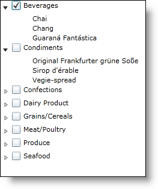

////
|metadata|
{
    "name": "xamdatatree-xamdatatree-check-boxes",
    "controlName": ["xamDataTree"],
    "tags": ["Editing"],
    "guid": "527db322-c923-4ad8-a8ad-4ab27f711e18",
    "buildFlags": [],
    "createdOn": "2016-05-25T18:21:54.8811112Z"
}
|metadata|
////

= Configuring Check Boxes Visibility (xamDataTree)

You can display check boxes next to each node item in the xamDataTree™ control. You can enable check boxes by setting the link:{ApiPlatform}controls.menus.xamdatatree.v{ProductVersion}~infragistics.controls.menus.checkboxsettings.html[CheckBoxSettings] object’s link:{ApiPlatform}controls.menus.xamdatatree.v{ProductVersion}~infragistics.controls.menus.checkboxsettings~checkboxvisibility.html[CheckBoxVisibility] property to Visible.

You can also enable or disable check boxes on different node levels by setting the CheckBoxSettingsOverride object’s properties. The link:{ApiPlatform}controls.menus.xamdatatree.v{ProductVersion}~infragistics.controls.menus.checkboxsettingsoverride.html[CheckBoxSettingsOverride] object takes precedence over the CheckBoxSettings object.

The following code snippet demonstrates how to enable check boxes for the entire tree, and also how to disable check boxes for the Product level.

*In XAML:*
[source,xaml]
----
<ig:XamDataTree x:Name="MyTree" ItemsSource={StaticResource DataUtil}>
   <!-- Enable Check Boxes-->
   <ig:XamDataTree.CheckBoxSettings>
      <ig:CheckBoxSettings CheckBoxVisibility="Visible"/>
   </ig:XamDataTree.CheckBoxSettings>
   <ig:XamDataTree.GlobalNodeLayouts>
      <ig:NodeLayout Key="CategoryLayout" TargetTypeName="Category" 
                     DisplayMemberPath="CategoryName"/>
      <ig:NodeLayout Key="ProductLayout" TargetTypeName="Product" 
                     DisplayMemberPath="ProductName">
         <!-- Disable Check Boxes at the Product Level -->         
         <ig:NodeLayout.CheckBoxSettings>
            <ig:CheckBoxSettingsOverride CheckBoxVisibility="Collapsed"/>
         </ig:NodeLayout.CheckBoxSettings>
      </ig:NodeLayout>
   </ig:XamDataTree.GlobalNodeLayouts>
</ig:XamDataTree>
----

*In Visual Basic:*
[source,vb]
----
MyTree.CheckBoxSettings.CheckBoxVisibility = Visibility.Visible
MyTree.GlobalNodeLayouts(1).CheckBoxSettings.CheckBoxVisibility = Visibility.Collapsed
----

*In C#:*
[source,csharp]
----
MyTree.CheckBoxSettings.CheckBoxVisibility = Visibility.Visible;
MyTree.GlobalNodeLayouts[1].CheckBoxSettings.CheckBoxVisibility = Visibility.Collapsed;
----

The CheckBoxSettings object also contains the following properties:

* link:{ApiPlatform}controls.menus.xamdatatree.v{ProductVersion}~infragistics.controls.menus.checkboxsettings~checkboxstyle.html[CheckBoxStyle] – You can style the check boxes by setting this property which targets the CheckBox control.
* link:{ApiPlatform}controls.menus.xamdatatree.v{ProductVersion}~infragistics.controls.menus.checkboxsettings~ischeckboxthreestate.html[IsCheckBoxThreeState] - This property determines if the check boxes can accept three different checked states:
** Checked – displayed as a check mark
** Unchecked – displayed as blank
** Indeterminate – displayed as a horizontal line
+
This property is only used when the `CheckboxMode` property is set to Manual.

* link:{ApiPlatform}controls.menus.xamdatatree.v{ProductVersion}~infragistics.controls.menus.checkboxsettings~checkboxmode.html[CheckBoxMode] – This property must be set to one of the following `TreeCheckBoxMode` enumeration values:

** link:{ApiPlatform}controls.menus.xamdatatree.v{ProductVersion}~infragistics.controls.menus.treecheckboxmode.html[Auto] – When in auto mode the children nodes are only twostate check boxes Checked or Unchecked; however the parent nodes are threestate check boxes – Checked, Unchecked or Indeterminate. When the parent node is selected, all the children nodes are also selected. If all the children are in the same state, then the parent will be the same state. If some of the children are selected, then the parent will be in an indeterminate state.
** link:{ApiPlatform}controls.menus.xamdatatree.v{ProductVersion}~infragistics.controls.menus.treecheckboxmode.html[Manual] - When in manual mode, each node’s check box is independent of every other node.

The CheckBoxSettingsOverride object contains the CheckBoxStyle and CheckBoxVisibilty properties, as well as two additional readonly properties, CheckBoxSettingsOverrideResolved and CheckBoxStyleResolved, which determine what the current value evaluates out to.

You can use the XamDataTreeNode object’s link:{ApiPlatform}controls.menus.xamdatatree.v{ProductVersion}~infragistics.controls.menus.xamdatatreenode~ischecked.html[IsChecked] property to select a particular node or to determine if a particular node is selected.

*In Visual Basic:*
[source,vb]
----
MyTree.Nodes(0).Nodes(1).IsChecked = True
----

*In C#:*
[source,csharp]
----
MyTree.Nodes[0].Nodes[1].IsChecked = true;
----

You can also bind the check box to a particular field on your data object by setting the NodeLayout object’s link:{ApiPlatform}controls.menus.xamdatatree.v{ProductVersion}~infragistics.controls.menus.nodelayout~checkboxmemberpath.html[CheckBoxMemberPath] to a field on your object. The value of this binding needs to be correct at time of binding.

*In XAML:*
[source,xaml]
----
<ig:NodeLayout
    Key="ProductLayout"
    DisplayMemberPath="ProductName"
    TargetTypeName="Product"
    CheckBoxMemberPath="UnitsInStock">                  
----

*Related Topics*

link:xamdatatree-xamdatatree-activation.html[Activation (xamDataTree)]

link:xamdatatree-active-data-item.html[Configuring Active Data Item (xamDataTree)]

link:xamdatatree-expanded-and-collapsed-xamdatatree-nodes.html[Configuring Expanded/Collapsed Node State (xamDataTree)]

link:xamdatatree-xamdatatree-drag-and-drop.html[Configuring Drag and Drop (xamDataTree)]

link:xamdatatree-xamdatatree-editing.html[Configuring Editing (xamDataTree)]

link:xamdatatree-xamdatatree-node-connectors.html[Configuring Node Connectors Visibility (xamDataTree)]

link:xamdatatree-xamdatatree-node-layouts.html[Configuring Node Layouts (xamDataTree)]

link:xamdatatree-xamdatatree-selection.html[Selection (xamDataTree)]