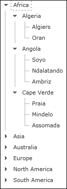

////

|metadata|
{
    "name": "xamdatatree-xamdatatree-node-connectors",
    "controlName": ["xamDataTree"],
    "tags": ["How Do I","Layouts","Styling"],
    "guid": "2b57a82d-1b62-4c1f-8089-927ca6aa14fc",  
    "buildFlags": [],
    "createdOn": "2016-05-25T18:21:54.9111209Z"
}
|metadata|
////

= Configuring Node Connectors Visibility (xamDataTree)

The node connectors feature of the xamDataTree™ control displays lines that connect each node in the tree. The node connectors demonstrate the relationship between each of the nodes. For example, as xamDataTree’s nodes are expanded, at a glance you can see each of the parent nodes in the xamDataTree control as they are connected with the same line.

By default, node connectors are disabled. You can enable node connectors by setting the xamDataTree control’s link:{ApiPlatform}controls.menus.xamdatatree.v{ProductVersion}~infragistics.controls.menus.xamdatatree~nodelinevisibility.html[NodeLineVisibility] property to Visible as demonstrated in the following code snippet.

*In XAML:*

----
<ig:XamDataTree x:Name="MyTree" NodeLineVisibility="Visible">
<!-- TODO: Add xamDataTree Items -->
</ig:XamDataTree>
----

*In Visual Basic:*

----
MyTree.NodeLineVisibility = Visibility.Visible
----

*In C#:*

----
MyTree.NodeLineVisibility = Visibility.Visible;
----

*Related Topics*

link:xamdatatree-xamdatatree-activation.html[Activation (xamDataTree)]

link:xamdatatree-active-data-item.html[Configuring Active Data Item (xamDataTree)]

link:xamdatatree-xamdatatree-check-boxes.html[Configuring Check Boxes Visibility (xamDataTree)]

link:xamdatatree-expanded-and-collapsed-xamdatatree-nodes.html[Configuring Expanded/Collapsed Node State (xamDataTree)]

link:xamdatatree-xamdatatree-drag-and-drop.html[Configuring Drag and Drop (xamDataTree)]

link:xamdatatree-xamdatatree-editing.html[Configuring Editing (xamDataTree)]

link:xamdatatree-xamdatatree-node-layouts.html[Configuring Node Layouts (xamDataTree)]

link:xamdatatree-xamdatatree-selection.html[Selection (xamDataTree)]