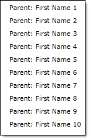
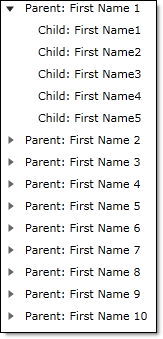
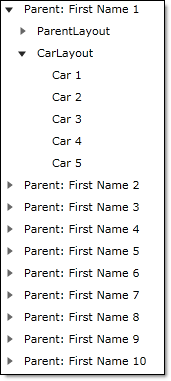
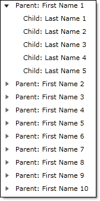

////

|metadata|
{
    "name": "xamdatatree-xamdatatree-node-layouts",
    "controlName": ["xamDataTree"],
    "tags": ["How Do I","Layouts","Styling"],
    "guid": "fc57f16b-d3cf-4d79-a438-affd1497f039",  
    "buildFlags": [],
    "createdOn": "2016-05-25T18:21:54.9281208Z"
}
|metadata|
////

= Configuring Node Layouts (xamDataTree)

The xamDataTree™ control uses a concept called Node Layouts to determine which nodes are shown and where in the tree the nodes are displayed. You can define one or more link:{ApiPlatform}controls.menus.xamdatatree.v{ProductVersion}~infragistics.controls.menus.nodelayout.html[NodeLayout] objects within xamDataTree’s link:{ApiPlatform}controls.menus.xamdatatree.v{ProductVersion}~infragistics.controls.menus.xamdatatree~globalnodelayouts.html[GlobalNodeLayouts] collection. NodeLayouts are objects that are used against certain data types for your tree.

The default and simplest way to generate NodeLayout objects is to let the control do it for you. All you have to do is set the link:{ApiPlatform}controls.menus.xamdatatree.v{ProductVersion}~infragistics.controls.menus.xamdatatree~itemssource.html[ItemsSource] property on the control and set the xamDataTree control’s link:{ApiPlatform}controls.menus.xamdatatree.v{ProductVersion}~infragistics.controls.menus.xamdatatree~displaymemberpath.html[DisplayMemberPath] property.

*In XAML:*

----
<ig:XamDataTree x:Name="MyTree" DisplayMemberPath="FirstName">
----

Assuming that your data is a list of objects, the above code snippet will display a flat, non-expandable tree of information (essentially a list).

*Global Layouts*

You can add node layouts to the GlobalNodeLayouts collection to define how the nodes will be displayed within the xamDataTree control.

To define a node layout of the tree, you will need to set the following properties of the NodeLayout object:

link:{ApiPlatform}controls.menus.xamdatatree.v{ProductVersion}~infragistics.controls.menus.nodelayoutbase~key.html[Key] – This property defines the unique identifier of the node layout. If you want the tree to automatically create children nodes, this property can be set to the property of the objects in the initial collection. See the <<LocalLayouts,Local Layouts>> section for an example.

link:{ApiPlatform}controls.menus.xamdatatree.v{ProductVersion}~infragistics.controls.menus.nodelayout~targettypename.html[TargetTypeName] – This property allows you to specify a mapping between the NodeLayout and a data source property by telling the xamDataTree control to match this property’s value to the object Type name contained in the collection exposed by a data source property.

link:{ApiPlatform}controls.menus.xamdatatree.v{ProductVersion}~infragistics.controls.menus.nodelayout~displaymemberpath.html[DisplayMemberPath] – This property specifies the property of the object type that will be displayed in the tree.

Assuming that you have the following data object:

*In Visual Basic:*

----
Public Class Parent        
   Private _children As ObservableCollection
   Public Property FirstName As String    
   End Property        
   Public Property LastName As String
   End Property        
   Public ReadOnly Property Children As ObservableCollection
      Get
         If (Me._children Is Nothing) Then 
            Me._children = New ObservableCollection     
         End If
         Return Me._children   
      End Get    
   End Property
End Class
----

*In C#:*

----
public class Parent
{
   ObservableCollection<Parent> _children;
   public string FirstName { get; set; }
   public string LastName { get; set; }
   public ObservableCollection<Parent> Children
   {
      get
      {
         if (this._children == null)
            this._children = new ObservableCollection<Parent>();
         return this._children;
      }
   }
}
----

Your node layout would be defined as follows:

*In XAML:*

----
<ig:XamDataTree.GlobalNodeLayouts>
   <ig:NodeLayout Key="ParentLayout" TargetTypeName="Parent" 
                  DisplayMemberPath="FirstName">
   </ig:NodeLayout>
</ig:XamDataTree.GlobalNodeLayouts>
----

Whenever the xamDataTree control finds a list of Parent objects, which is defined by the TargetTypeName property, this ParentLayout will be used. The above snippet will show the FirstName of the Parent, and will also display the Children of each Parent, as shown in the following screenshot.

*Defining Additional Layouts*

You can define many different layouts to be displayed within the xamDataTree control. This can be done by adding additional layouts to the GlobalNodeLayout collection.

Assuming we have the following data object:

*In Visual Basic:*

----
Public Class Parent        
   Private _children As ObservableCollection
   Private _cars As ObservableCollection        
   Public Property FirstName As String 
   End Property
   Public Property LastName As String
   End Property
   Public ReadOnly Property Children As ObservableCollection 
      Get
         If (Me._children Is Nothing) Then
            Me._children = New ObservableCollection
         End If 
         Return Me._children
      End Get
   End Property
   Public ReadOnly Property Cars As ObservableCollection
      Get
         If (Me._cars Is Nothing) Then
            Me._cars = New ObservableCollection
         End If 
         Return Me._cars
      End Get
   End Property
End Class
Public Class Cars        
   Public Property Name As String
   End Property
End Class
----

*In C#:*

----
public class Parent
{
   ObservableCollection<Parent> _children;
   public string FirstName { get; set; }
   public string LastName { get; set; }
   public ObservableCollection<Parent> Children
   {
      get
      {
         if (this._children == null)
            this._children = new ObservableCollection<Parent>();
         return this._children;
      }
   }
   ObservableCollection<Cars> _cars;
   public ObservableCollection<Cars> Cars
   {
      get
      {
         if (this._cars == null)
         {
            this._cars = new ObservableCollection<Cars>();
         }
         return this._cars;
      }
   }
}
public class Cars
{
   public string Name { get; set; }
}
----

The following code snippet demonstrates how to add a new layout named CarLayout to the GlobalNodeLayout collection.

*In XAML:*

----
<ig:XamDataTree.GlobalNodeLayouts>
   <ig:NodeLayout Key="ParentLayout" TargetTypeName="Parent" 
                  DisplayMemberPath="FirstName"/>
   <ig:NodeLayout Key="CarLayout" TargetTypeName="Cars" DisplayMemberPath="Name"/>
</ig:XamDataTree.GlobalNodeLayouts>
----

The following screenshot displays a tree with two layouts defined.

[[LocalLayouts]]

*Local Layouts*

You can also define node layouts that are not in the GlobalNodeLayouts collection. This allows you more control over how nodes are displayed and also provides you with the ability to customize the individual nodes.

For example, in the following code snippet, a local node layout is defined and bound to the Children property of the objects in the initial collection, and displays the LastName for those objects. It is not necessary to set the TargetTypeName in this situation.

*In XAML:*

----
<ig:XamDataTree x:Name="MyTree" DisplayMemberPath="FirstName">
   <ig:XamDataTree.NodeLayouts>
      <ig:NodeLayout Key="Children" DisplayMemberPath="LastName"/>
   </ig:XamDataTree.NodeLayouts>
</ig:XamDataTree>
----

*Related Topics*

link:xamdatatree-xamdatatree-activation.html[Activation (xamDataTree)]

link:xamdatatree-active-data-item.html[Configuring Active Data Item (xamDataTree)]

link:xamdatatree-xamdatatree-check-boxes.html[Configuring Check Boxes Visibility (xamDataTree)]

link:xamdatatree-expanded-and-collapsed-xamdatatree-nodes.html[Configuring Expanded/Collapsed Node State (xamDataTree)]

link:xamdatatree-xamdatatree-drag-and-drop.html[Configuring Drag and Drop (xamDataTree)]

link:xamdatatree-xamdatatree-editing.html[Configuring Editing (xamDataTree)]

link:xamdatatree-xamdatatree-node-connectors.html[Configuring Node Connectors Visibility (xamDataTree)]

link:xamdatatree-xamdatatree-selection.html[Selection (xamDataTree)]