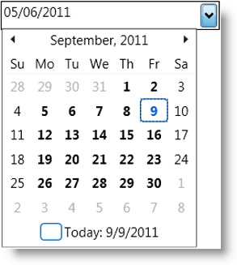

////

|metadata|
{
    "name": "xamdatetimeinput-about",
    "controlName": ["xamInputs"],
    "tags": ["Editing"],
    "guid": "20b3778b-0f10-4b18-8fce-e64c1710550a",  
    "buildFlags": [],
    "createdOn": "2016-05-25T18:21:57.0012222Z"
}
|metadata|
////

= About xamDateTimeInput

The xamDateTimeInput control is a simple text box control that uses a mask to assist users in entering dates and/or time values in the correct format. Using this mask, you can restrict the user's input to valid date and time formats that you decide beforehand. The control also provides a calendar drop down from which to choose a date. You can use the xamDateTimeInput control either link:xamdatetimeinput-using.html[as a stand-alone text box] or link:xaminputs-using-xaminput-controls-in-xamgrid-cells-for-data-editing.html[in a xamGrid™ cell].

ifdef::sl,wpf,win-phone[]

endif::sl,wpf,win-phone[]

ifdef::win-rt[]

endif::win-rt[]

== Related Topics

Following are some other topics you may find useful.

* link:xamdatetimeinput-using.html[Using xamDateTimeInput]
* link:xaminputs-masks.html[Masks]
* link:xaminputs-overview-of-the-valueinput-class.html[Overview of the ValueInput Class]
* link:xaminputs-using-xaminput-controls-in-xamgrid-cells-for-data-editing.html[Using xamInput Controls in xamGrid Cells for Data Editing]