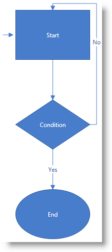
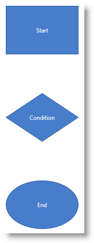
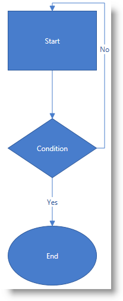

////

|metadata|
{
    "name": "xamdiagram-adding-to-a-page",
    "tags": ["Application Scenarios","Charting","Getting Started","How Do I"],
    "controlName": ["xamDiagram"],
    "guid": "253d0be2-a15b-4370-af61-06649f2050a6",  
    "buildFlags": [],
    "createdOn": "2014-03-20T06:34:26.8216382Z"
}
|metadata|
////

= Adding xamDiagram to a Page

== Topic Overview

=== Purpose

This topic explains how to add the  _xamDiagram_™ control to a {PlatformName} application.

=== Required background

The following topics are prerequisites to understanding this topic:

[options="header", cols="a,a"]
|====
|Topic|Purpose

| link:xamdiagram-overview.html[ _xamDiagram_ Overview]
|The topics in this group provide an overview of the functionality of the _xamDiagram_ control and its features.

|====

=== In this topic

This topic contains the following sections:

* <<_Ref382754136,Adding xamDiagram – Conceptual Overview>>

** <<_Ref382308317,Adding xamDiagram summary>>
** <<_Ref382297640,Requirements>>
** <<_Ref382308328,Steps>>

* <<_Ref382754142,Adding xamDiagram – Example>>

** <<_Ref382308341,Introduction>>
** <<_Preview,Preview>>
** <<_Prerequisites,Prerequisites>>
** <<_Overview,Overview>>
** <<_Ref382308361,Steps>>
** <<_Ref382317785,Full code>>

* <<_Ref382754149,Related Content>>

** <<_Ref382308370,Samples>>

[[_Ref382308311]]

[[_Ref382754136]]
== Adding  _xamDiagram_  – Conceptual Overview

[[_Ref382308317]]

=== Adding xamDiagram summary

To add a  _xamDiagram_   control to your page, you need to create an instance of the control and add it to your page’s root element. The control is pre-configured to have a white background and takes the size of the container it has been placed into. Nodes with various shapes can be then added to it, as well as two types of connections – straight lines and right-angled lines with various configurable end caps. Apart from configuring connections between different nodes,  _xamDiagram_   allows for creating stand-alone connections which can be placed at an arbitrary place on its surface.

When adding diagram nodes in XAML, they are added to the link:{ApiPlatform}controls.charts.xamdiagram{ApiVersion}~infragistics.controls.charts.xamdiagram~items.html[Items] collection of the diagram. The `Items` property is marked with the `ContentPropertyAttribute`.

The arrow-pointed lines visualizing the activity flow are configured as link:{ApiPlatform}controls.charts.xamdiagram{ApiVersion}~infragistics.controls.charts.diagramconnection_members.html[DiagramConnection] objects.

[[_Ref382297640]]

=== Requirements

Following are the general requirements for adding  _xamDiagram_ .

* Assembly references:

**  _{ApiPlatform}Controls.Charts.XamDiagram{ApiVersion}.dll_  
**  _{ApiPlatform}Controls.Editors.XamColorPicker{ApiVersion}.dll_  
**  _{ApiPlatform}Controls.Editors.XamMaskedInput{ApiVersion}.dll_  
**  _{ApiPlatform}Controls.Editors.XamSlider{ApiVersion}.dll_  
**  _{ApiPlatform}DataVisualization{ApiVersion}.dll_  
**  _{ApiPlatform}DragDrop{ApiVersion}.dll_  
**  _{ApiPlatform}Undo{ApiVersion}.dll_  
**  _{ApiPlatform}{ApiVersion}dll_  

* Namespaces:

** A reference to the Infragistics® namespace: `(xmlns:ig="http://schemas.infragistics.com/xaml")`

.Note:
[NOTE]
====
For details, refer to link:api-reference-guide.html[Assemblies].
====

[[_Ref382308328]]

=== Steps

Following are the general conceptual steps for adding  _xamDiagram_  .

[start=1]
. *Adding the xamDiagram control* 
[start=2]
. *Adding the nodes* 
[start=3]
. *Adding the connections* 

[[_Ref382308334]]

[[_Ref382754142]]
== Adding  _xamDiagram_  – Example

[[_Ref382308341]]

=== Introduction

The following procedure walks you through the adding process by instantiating a  _xamDiagram_   control, adding it to a WPF application, and configuring a diagram structure of three nodes (a rectangle, rhombus, and ellipse) representing the start, end, and a condition of a process.

The nodes are connected with two straight-line connections and one right-angled connection in which the direction changes at right angles (the No option in the picture in the <<_Preview,Preview>>).

The entry point of the activity flow is denoted by a stand-alone connection.

[[_Preview]]

=== Preview

The following screenshot is a preview of the final result.

[[_Prerequisites]]

=== Prerequisites

To complete the procedure, you need the following:

* A Microsoft® Visual Studio® WPF project with a page
* The required assembly references and namespaces added to the project (See <<_Ref382297640,Requirements>>.)

[[_Overview]]

=== Overview

Following is a conceptual overview of the process:

*1. Adding the  _xamDiagram_  control*

*2. Adding the nodes*

*3. Adding the connections between the nodes*

*4. Adding the stand-alone connection*

[[_Ref382308361]]

=== Steps

The following steps demonstrate how to add  _xamDiagram_   to a page.

=== 1. Add the xamDiagram control.

*Add a*   _xamDiagram_    *declaration to your page’s root*  `Grid`  *element and set its desired*  `Height`  *and*  `Width`.

*In XAML:*

[source,XAML]
---- 
<ig:XamDiagram x:Name="diagram"
Width="700"
Height="700">
</ig:XamDiagram>
----

This declaration instantiates a blank diagram with no visible parts, as the background of the control is white-colored by default, so some additional configuration is needed.

=== 2. Add the nodes.

*Configure the*  link:{ApiPlatform}controls.charts.xamdiagram{ApiVersion}~infragistics.controls.charts.diagramnode_members.html[DiagramNode]  *objects and add them to the*   _xamDiagram_    *control*  by adding the nodes to the link:{ApiPlatform}controls.charts.xamdiagram{ApiVersion}~infragistics.controls.charts.xamdiagram~items.html[Items] collection of the diagram. The `Items` property is marked with the `ContentPropertyAttribute`.

In this example procedure, three differently shaped nodes are created. *1. Create the rectangle-shaped node.* 

Create the rectangle-shaped node (If the link:{ApiPlatform}controls.charts.xamdiagram{ApiVersion}~infragistics.controls.charts.diagramnode~shapetype.html[ShapeType] property of the `DiagramNode` is not explicitly specified, the node type used will be  _“Rectangle”_  .) with a `Height` of  _100px_   and `Width` of  _150px_  , set its link:{ApiPlatform}controls.charts.xamdiagram{ApiVersion}~infragistics.controls.charts.diagramitem~content.html[Content] to  _“Start”_   and configure its link:{ApiPlatform}controls.charts.xamdiagram{ApiVersion}~infragistics.controls.charts.diagramnode~position.html[Position] on the diagram to be  _(200, 20)_  .

Set the `Key` property to a string identifier in order to be able to add connections from/to the node.

*In XAML:*

[source,XAML]
---- 
<ig:DiagramNode Key="node1"
Content="Start"
Height="100"
Width="150"
Position="200,20"/>
----

*2. Create the rhombus-shaped node.*

Create the rhombus-shaped node (Set the link:{ApiPlatform}controls.charts.xamdiagram{ApiVersion}~infragistics.controls.charts.diagramnode~shapetype.html[ShapeType] property of `DiagramNode` to  _“Rhombus”_  ) with a `Height` of  _100px_   and `Width` of  _150px_  , set its `Content` to  _“Condition”_   and configure its `Position` on the diagram to be  _(200, 200)_   (This will place this rhombus beneath the rectangle created in step 2.1).

*In XAML:*

[source,XAML]
---- 
<ig:DiagramNode Key="node2"
Content="Condition"
Height="100"
Width="150"
ShapeType="Rhombus"
Position="200,200"/>
----

*3. Create the ellipse-shaped node.*

Create the ellipse-shaped node (Set the link:{ApiPlatform}controls.charts.xamdiagram{ApiVersion}~infragistics.controls.charts.diagramnode~shapetype.html[ShapeType] property of `DiagramNode` to  _“Ellipse”_  ) with a `Height` of  _100px_   and `Width` of  _150px_  , set its `Content` to  _“End”_   and configure its `Position` on the diagram to be  _(200, 380)_   (This will place this ellipse beneath the rhombus created in step 2.2).

*In XAML:*

[source,XAML]
---- 
<ig:DiagramNode Key="node3"
Content="End"
Height="100"
Width="150"
ShapeType="Ellipse"
Position="200,380"/>
----

*4. Add the three nodes to the  _xamDiagram_   control.*
*In XAML:*
[source,XAML]
---- 
<ig:XamDiagram x:Name="diagram"
Width="700"
Height="700">
<ig:DiagramNode Key="node1".../>
<ig:DiagramNode Key="node2".../>
<ig:DiagramNode Key="node3".../>
</ig:XamDiagram>
----

The following screenshot is a preview of what the diagram should look at this point.

=== 3. Add the connections.

*1. Add the connections between the nodes by*  configuring the connections as link:{ApiPlatform}controls.charts.xamdiagram{ApiVersion}~infragistics.controls.charts.diagramconnection_members.html[DiagramConnection] objects with link:{ApiPlatform}controls.charts.xamdiagram{ApiVersion}~infragistics.controls.charts.diagramconnection~startnodekey.html[StartNodeKey] and link:{ApiPlatform}controls.charts.xamdiagram{ApiVersion}~infragistics.controls.charts.diagramconnection~endnodekey.html[EndNodeKey] properties set to the nodes that are being connected.

In this example procedure, you create three arrow-pointed diagram connections.

** A. Create an arrow-pointed straight line connection between the Start and the Condition nodes.

To this end, set the link:{ApiPlatform}controls.charts.xamdiagram{ApiVersion}~infragistics.controls.charts.diagramconnection~startnodekey.html[StartNodeKey] property of the connection to  _“node1”_   and the link:{ApiPlatform}controls.charts.xamdiagram{ApiVersion}~infragistics.controls.charts.diagramconnection~endnodekey.html[EndNodeKey] property to  _“node2”_  . As by default the end cap of the connection already represents a filled arrow ( link:{ApiPlatform}controls.charts.xamdiagram{ApiVersion}~infragistics.controls.charts.diagramconnection~endcaptype.html[EndCapType]= _”_   _FilledArrow_   _”_  ), only its link:{ApiPlatform}controls.charts.xamdiagram{ApiVersion}~infragistics.controls.charts.diagramconnection~connectiontype.html[ConnectionType] should be set to “StraightLine” to override the default setting for this property which is a right-angled line.

*In XAML:*

[source,XAML]
---- 
<ig:DiagramConnection Name="conn12"
StartNodeKey="node1"
EndNodeKey="node2"
ConnectionType="Straight"/>
----

** B. Create an arrow-pointed straight line connection between the Condition and the End nodes.

Set the `StartNodeKey`, `EndNodeKey`, and the `ConnectionType` properties as in step 3.1.A. Set the link:{ApiPlatform}controls.charts.xamdiagram{ApiVersion}~infragistics.controls.charts.diagramitem~content.html[Content] property to  _“Yes”_   in order to specify the exit case in the activity flow example.

*In XAML:*

[source,XAML]
---- 
<ig:DiagramConnection Name="conn23"
StartNodeKey="node2"
EndNodeKey="node3"
ConnectionType="Straight"
Content="Yes"/>
----

 

** C. Create an arrow-pointed right-angle line connection between the Start and the Condition nodes.

This connection represents the looping case in the activity diagram. Set its `Content` property to  _“No”_  . (The `ConnectionType` property has a default value of  _“_   _RightAngle_   _”_  , so no additional configuration applies for the type of the connection.)

** D. Specify the exact positions on the nodes at which you want the connection to begin and end.

Specify the connections’ connector points by setting the link:{ApiPlatform}controls.charts.xamdiagram{ApiVersion}~infragistics.controls.charts.diagramconnection~startnodeconnectionpointname.html[StartNodeConnectionPointName] and link:{ApiPlatform}controls.charts.xamdiagram{ApiVersion}~infragistics.controls.charts.diagramconnection~endnodeconnectionpointname.html[EndNodeConnectionPointName] properties. Basically, by setting these properties to  _“Right”_   and  _“Top”_  , respectively, you specify that you want to draw a connection starting from the utmost-right connector point of  _“node2”_   and ending at the utmost-top connector point of  _“node1”_   (for details on the connector points, see link:xamdiagram-overview.html[ _xamDiagram_  Overview]).

*In XAML:*

[source,XAML]
----
<ig:DiagramConnection Name="conn21"
StartNodeKey="node2"
EndNodeKey="node1"
StartNodeConnectionPointName="Right"
EndNodeConnectionPointName="Top"
Content="No"/>
----

** E. Add the connections to the diagram.

*In XAML:*

[source,XAML]
---- 
<ig:XamDiagram x:Name="diagram"
Width="700"
Height="700">
...
<ig:DiagramConnection Name="conn12".../>
<ig:DiagramConnection Name="conn23".../>
<ig:DiagramConnection Name="conn21".../>
</ig:XamDiagram>
----

The following screenshot is a preview of what the diagram should look at this point.

*2. _(Optional)_ Add a stand-alone connection.*

In this example procedure, you need to configure the connection representing the entry point of the activity flow diagram.

** A. Create a connection and specify its link:{ApiPlatform}controls.charts.xamdiagram{ApiVersion}~infragistics.controls.charts.diagramconnection~startposition.html[StartPosition] and link:{ApiPlatform}controls.charts.xamdiagram{ApiVersion}~infragistics.controls.charts.diagramconnection~endposition.html[EndPosition] of to  _(175, 70)_   and  _(195, 70)_  , respectively.

*In XAML:*

[source,XAML]
---- 
<ig:DiagramConnection Name="connStart"
StartPosition="175,70"
EndPosition="195,70"/>
----

** B. Add the connection to the diagram.

*In XAML:*

[source,XAML]
---- 
<ig:XamDiagram x:Name="diagram"
Width="700"
Height="700">
...
<ig:DiagramConnection Name="connStart"
StartPosition="175,70"
EndPosition="195,70"/>
</ig:XamDiagram>
----

=== 4. (Optional) Verify the result.

To verify the result, save and build the project. The diagram should look as shown the <<_Preview,Preview>>.

[[_Ref382317785]]

=== Full code

Following is the full code for this procedure.

[source,XAML]
---- 
<ig:XamDiagram xmlns:ig="http://schemas.infragistics.com/xaml" x:Name="diagram"
Width="700"
Height="700">
<ig:DiagramNode Key="node1"
Content="Start"
Height="100"
Width="150"
Position="200,20"/>
<ig:DiagramNode Key="node2"
Content="Condition"
Height="100"
Width="150"
ShapeType="Rhombus"
Position="200,200"/>
<ig:DiagramNode Key="node3"
Content="End"
Height="100"
Width="150"
ShapeType="Ellipse"
Position="200,380"/>
<ig:DiagramConnection Name="conn12"
StartNodeKey="node1"
EndNodeKey="node2"
ConnectionType="Straight"/>
<ig:DiagramConnection Name="conn23"
StartNodeKey="node2"
EndNodeKey="node3"
ConnectionType="Straight"
Content="Yes"/>
<ig:DiagramConnection Name="conn21"
StartNodeKey="node2"
EndNodeKey="node1"
StartNodeConnectionPointName="Right"
EndNodeConnectionPointName="Top"
Content="No"/>
<ig:DiagramConnection Name="connStart"
StartPosition="175,70"
EndPosition="195,70"/>
</ig:XamDiagram>
----

 

[[_Ref382308365]]

[[_Ref382754149]]
== Related Content

[[_Ref382308370]]

=== Samples

The following samples provide additional information related to this topic.

[options="header", cols="a,a"]
|====
|Sample|Purpose

| link:{SamplesURL}/diagram/basic-configuration[Basic Configuration]
|This sample demonstrates a simple flow-chart diagram.

|====