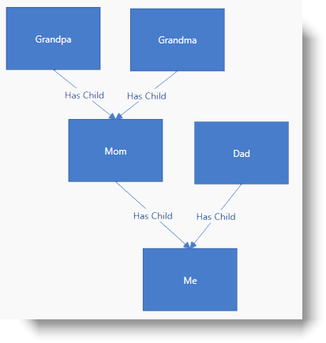

////

|metadata|
{
    "name": "xamdiagram-binding-to-hierarchical-node-data-with-keys",
    "tags": ["Charting","Data Binding","Data Presentation","How Do I"],
    "controlName": ["xamDiagram"],
    "guid": "22a12bbc-37ab-4f2a-b4db-63bcfd679703",  
    "buildFlags": [],
    "createdOn": "2014-06-25T10:59:05.0368385Z"
}
|metadata|
////

= Binding to Hierarchical Node Data with Keys (xamDiagram)

== Topic Overview

=== Purpose

This topic provides a step by step guidance on how to bind the  _xamDiagram_™ control to hierarchical node data with keys.

=== Required background

The following topics are prerequisites to understanding this topic:

[options="header", cols="a,a"]
|====
|Topic|Purpose

| link:xamdiagram-binding-to-data.html[Binding _xamDiagram_ to Data]
|This topic provides an overview of the data binding scenarios supported by the _xamDiagram_ control.

|====

=== In this topic

* <<_Ref391055893, Binding  _xamDiagram_  to Hierarchical Node Data with Keys >>

** <<_Ref391055896,Introduction>>
** <<_Preview,Preview>>
** <<_Prerequisites,Prerequisites>>
** <<_Overview,Overview>>
** <<_Ref391055903,Steps>>
** <<_Ref382317785,Full code>>

* <<_Ref391056408, Related Content >>

** <<_Ref391056410,Topics>>
** <<_Ref391056412,Samples>>

[[_Ref391055893]]
== Binding  _xamDiagram_   to Hierarchical Node Data with Keys

[[_Ref391055896]]

=== Introduction

The following procedure demonstrates how to bind the  _xamDiagram_   to data where input data objects represent nodes and each of them has a unique string identifier and a collection of keys of its child objects.

[[_Preview]]

=== Preview

The following screenshot is a preview of the result.

[[_Prerequisites]]

=== Prerequisites

To complete the procedure, you need the following:

* A WPF application with an empty  _xamDiagram_   added to a page
* The link:{ApiPlatform}controls.charts.xamdiagram.v{ProductVersion}~infragistics.controls.charts.xamdiagram~layout.html[Layout] property of the  _xamDiagram_   set to an instance of the link:{ApiPlatform}controls.charts.xamdiagram.v{ProductVersion}~infragistics.controls.charts.forcedirectedgraphdiagramlayout_members.html[ForceDirectedGraphDiagramLayout]

[[_Overview]]

=== Overview

Following is a conceptual overview of the process:

*1. Configure the `ItemsSource` property*

*2. Create the node definitions*

*3. Create the connection definitions*

[[_Ref391055903]]

=== Steps

The following steps demonstrate how to bind the  _xamDiagram_   to hierarchical node data with keys.

=== 1. Set the ItemsSource

*1. Add the sample data class*

Add the following `Person` class to the code behind. The `Person` class has a Name property of type string, an Id property of type int and a Children property set to a list of int. The latter property is used to create the  _Person-Person_   relations in the  _xamDiagram_  . Note that there is no requirement for the parent-child types to have any relation, and any two types can be used.

*In C#:*

[source, CS]
---- 
public class Person : INotifyPropertyChanged
{
public Person(int id, string name) { Id = id; Name = name; }
int _id;
public int Id
{
get { return _id; }
set
{
_id = value;
OnPropertyChanged();
}
}
string _name;
public string Name
{
get { return _name; }
set
{
_name = value;
OnPropertyChanged();
}
}
IList _children;
public IList Children
{
get { return _children; }
set
{
_children = value;
OnPropertyChanged();
}
}
public event PropertyChangedEventHandler PropertyChanged;
void OnPropertyChanged([CallerMemberName] string propertyName = "")
{
if (PropertyChanged != null)
PropertyChanged(this, new PropertyChangedEventArgs(propertyName));
}
}
----

*In VB:*

[source, VB]
---- 
Public Class Person
Implements INotifyPropertyChanged
Public Sub New(id__1 As Integer, name__2 As String)
Id = id__1
Name = name__2
End Sub
Private _id As Integer
Public Property Id() As Integer
Get
Return _id
End Get
Set
_id = value
OnPropertyChanged()
End Set
End Property
Private _name As String
Public Property Name() As String
Get
Return _name
End Get
Set
_name = value
OnPropertyChanged()
End Set
End Property
Private _children As IList
Public Property Children() As IList
Get
Return _children
End Get
Set
_children = value
OnPropertyChanged()
End Set
End Property
Public Event PropertyChanged As PropertyChangedEventHandler
Private Sub OnPropertyChanged( Optional propertyName As String = "")
RaiseEvent PropertyChanged(Me, New PropertyChangedEventArgs(propertyName))
End Sub
End Class
----

[start=2]
*2. Add the view model class*

Add the following list class that the  _xamDiagram_   will be bound to:

*In C#:*

[source, CS]
---- 
public class FamilyTreeViewModel : INotifyPropertyChanged
{
ObservableCollection<Person> _familyTree;
public ObservableCollection<Person> FamilyTree
{
get { return _familyTree; }
set
{
_familyTree = value;
OnPropertyChanged();
}
}
public FamilyTreeViewModel()
{
var me = new Person(1, "Me");
var dad = new Person(2, "Dad") { Children = new List<int>() { 1 } };
var mom = new Person(3, "Mom") { Children = new List<int>() { 1 } };
var grandpa = new Person(4, "Grandpa") { Children = new List<int>() { 3 } };
var grandma = new Person(5, "Grandma") { Children = new List<int>() { 3 } };
FamilyTree = new ObservableCollection<Person>();
FamilyTree.Add(me);
FamilyTree.Add(dad);
FamilyTree.Add(mom);
FamilyTree.Add(grandpa);
FamilyTree.Add(grandma);
}
public event PropertyChangedEventHandler PropertyChanged;
void OnPropertyChanged([CallerMemberName] string propertyName = "")
{
if (PropertyChanged != null)
PropertyChanged(this, new PropertyChangedEventArgs(propertyName));
}
}
----

*In VB:*

[source, VB]
---- 
Public Class FamilyTreeViewModel
Implements INotifyPropertyChanged
Private _familyTree As ObservableCollection(Of Person)
Public Property FamilyTree() As ObservableCollection(Of Person)
Get
Return _familyTree
End Get
Set(value As ObservableCollection(Of Person))
_familyTree = value
OnPropertyChanged()
End Set
End Property
Public Sub New()
Dim [me] = New Person(1, "Me")
Dim dad = New Person(2, "Dad") With { _
.Children = New List(Of Integer)() From { _
1 _
} _
}
Dim mom = New Person(3, "Mom") With { _
.Children = New List(Of Integer)() From { _
1 _
} _
}
Dim grandpa = New Person(4, "Grandpa") With { _
.Children = New List(Of Integer)() From { _
3 _
} _
}
Dim grandma = New Person(5, "Grandma") With { _
.Children = New List(Of Integer)() From { _
3 _
} _
}
FamilyTree = New ObservableCollection(Of Person)()
FamilyTree.Add([me])
FamilyTree.Add(dad)
FamilyTree.Add(mom)
FamilyTree.Add(grandpa)
FamilyTree.Add(grandma)
End Sub
Public Event PropertyChanged As PropertyChangedEventHandler Implements INotifyPropertyChanged.PropertyChanged
Private Sub OnPropertyChanged(Optional propertyName As String = "")
RaiseEvent PropertyChanged(Me, New PropertyChangedEventArgs(propertyName))
End Sub
End Class
----

*3. Set the*  `ItemsSource`  *property*

Set the `DataContext` property to a new instance of the `FamilyTreeViewModel` class and bind the link:{ApiPlatform}controls.charts.xamdiagram.v{ProductVersion}~infragistics.controls.charts.xamdiagram~itemssource.html[ItemsSource] to `FamilyTree` property.

*In XAML:*

[source,XAML]
---- 
<ig:XamDiagram ItemsSource="{Binding FamilyTree}">
<ig:XamDiagram.DataContext>
<local:FamilyTreeViewModel/>
</ig:XamDiagram.DataContext>
</ig:XamDiagram>
----

=== 2. Create the node definitions

Usually for each of the data types in the link:{ApiPlatform}controls.charts.xamdiagram.v{ProductVersion}~infragistics.controls.charts.xamdiagram~itemssource.html[ItemsSource] a link:{ApiPlatform}controls.charts.xamdiagram.v{ProductVersion}~infragistics.controls.charts.nodedefinition_members.html[NodeDefinition] is added to the  _xamDiagram_  . If one or more types are in an inheritance relationship, the most concrete types have to be specified first. The  _xamDiagram_   tries to match the type of each of the data items the link:{ApiPlatform}controls.charts.xamdiagram.v{ProductVersion}~infragistics.controls.charts.nodedefinition~targettype.html[TargetType] of a node definition. The first node definition whose link:{ApiPlatform}controls.charts.xamdiagram.v{ProductVersion}~infragistics.controls.charts.nodedefinition~targettype.html[TargetType] returns true to a call to `IsAssignableFrom` is selected. That is if the link:{ApiPlatform}controls.charts.xamdiagram.v{ProductVersion}~infragistics.controls.charts.nodedefinition~targettype.html[TargetType] of a node definition matches exactly or is a parent type of the data item’s type, the node definition will be selected.

In order to use data binding with keys, the node objects must have a unique identifier property to be set as the link:{ApiPlatform}controls.charts.xamdiagram.v{ProductVersion}~infragistics.controls.charts.diagramnode~key.html[Key] property of the link:{ApiPlatform}controls.charts.xamdiagram.v{ProductVersion}~infragistics.controls.charts.diagramnode_members.html[DiagramNode] class.

*1. Create a NodeDefinition for the `Person` class*

Create a link:{ApiPlatform}controls.charts.xamdiagram.v{ProductVersion}~infragistics.controls.charts.nodedefinition_members.html[NodeDefinition] and add it to the link:{ApiPlatform}controls.charts.xamdiagram.v{ProductVersion}~infragistics.controls.charts.xamdiagram~nodedefinitions.html[NodeDefinitions] collection.

[start=2]
*2. Set the link:{ApiPlatform}controls.charts.xamdiagram.v{ProductVersion}~infragistics.controls.charts.nodedefinition~targettype.html[TargetType] of the link:{ApiPlatform}controls.charts.xamdiagram.v{ProductVersion}~infragistics.controls.charts.nodedefinition_members.html[NodeDefinition] to the `Person`  type.*

*3. Set the KeyMemberPath*

Set the link:{ApiPlatform}controls.charts.xamdiagram.v{ProductVersion}~infragistics.controls.charts.nodedefinition~keymemberpath.html[KeyMemberPath] to  _Id_  .This will populate the link:{ApiPlatform}controls.charts.xamdiagram.v{ProductVersion}~infragistics.controls.charts.diagramnode~key.html[Key] property of the created link:{ApiPlatform}controls.charts.xamdiagram.v{ProductVersion}~infragistics.controls.charts.diagramnode_members.html[DiagramNode] instances to the value of the `Id` property.

[start=4]
*4. Set the link:{ApiPlatform}controls.charts.xamdiagram.v{ProductVersion}~infragistics.controls.charts.nodedefinition~displaymemberpath.html[DisplayMemberPath]*

Set the link:{ApiPlatform}controls.charts.xamdiagram.v{ProductVersion}~infragistics.controls.charts.nodedefinition~displaymemberpath.html[DisplayMemberPath] to  _Name_  . Not specifying a link:{ApiPlatform}controls.charts.xamdiagram.v{ProductVersion}~infragistics.controls.charts.nodedefinition~displaymemberpath.html[DisplayMemberPath], and not setting a custom link:{ApiPlatform}controls.charts.xamdiagram.v{ProductVersion}~infragistics.controls.charts.diagramitem~displaytemplate.html[DisplayTemplate] via the link:{ApiPlatform}controls.charts.xamdiagram.v{ProductVersion}~infragistics.controls.charts.nodedefinition~nodestyle.html[NodeStyle], the results in the `ToString` method displayed as the nodes’ content.

[start=5]
*5. Set the link:{ApiPlatform}controls.charts.xamdiagram.v{ProductVersion}~infragistics.controls.charts.nodedefinition~nodestyle.html[NodeStyle] (optional)*

Using the link:{ApiPlatform}controls.charts.xamdiagram.v{ProductVersion}~infragistics.controls.charts.nodedefinition~nodestyle.html[NodeStyle] property you can set the style to be applied to all `DiagramNode` objects matched by the node definition. This gives you the opportunity to easily customize the nodes created for a certain data type.

*In XAML:*

[source,XAML]
---- 
<ig:XamDiagram.NodeDefinitions>
<ig:NodeDefinition
TargetType="{x:Type local:Person}"
KeyMemberPath="Id"
DisplayMemberPath="Name"
ChildKeysMemberPath="Children">
</ig:NodeDefinition>
</ig:XamDiagram.NodeDefinitions>
----

=== 3. Create a hierarchical connection definition.

Create a link:{ApiPlatform}controls.charts.xamdiagram.v{ProductVersion}~infragistics.controls.charts.connectiondefinition_members.html[ConnectionDefinition] and add it to the link:{ApiPlatform}controls.charts.xamdiagram.v{ProductVersion}~infragistics.controls.charts.xamdiagram~connectiondefinitions.html[ConnectionDefinitions] collection. The connection definitions provide a way to set a custom style for the connection generated by the  _xamDiagram_   for parent-child data item relations. Connection definitions are matched by the link:{ApiPlatform}controls.charts.xamdiagram.v{ProductVersion}~infragistics.controls.charts.connectiondefinition~starttargettype.html[StartTargetType] and link:{ApiPlatform}controls.charts.xamdiagram.v{ProductVersion}~infragistics.controls.charts.connectiondefinition~endtargettype.html[EndTargetType] properties. For this example set both of these to the `Person` type.

Set the link:{ApiPlatform}controls.charts.xamdiagram.v{ProductVersion}~infragistics.controls.charts.connectiondefinitionbase~connectionstyle.html[ConnectionStyle] property to a style targeting link:{ApiPlatform}controls.charts.xamdiagram.v{ProductVersion}~infragistics.controls.charts.diagramconnection_members.html[DiagramConnection].

*In XAML:*

[source,XAML]
---- 
<ig:XamDiagram.ConnectionDefinitions>
<ig:ConnectionDefinition
StartTargetType="{x:Type local:Person}"
EndTargetType="{x:Type local:Person}">
<ig:ConnectionDefinition.ConnectionStyle>

</ig:ConnectionDefinition.ConnectionStyle>
</ig:ConnectionDefinition>
</ig:XamDiagram.ConnectionDefinitions>
----

[[_Ref382317785]]

=== Full code

Following is the full code for this procedure.

*In XAML:*

[source, XAML]
---- 
<UserControl x:Class="DiagramDocumentationSamples.HierararchicalKeysData"
xmlns="http://schemas.microsoft.com/winfx/2006/xaml/presentation"
xmlns:x="http://schemas.microsoft.com/winfx/2006/xaml"
xmlns:mc="http://schemas.openxmlformats.org/markup-compatibility/2006"
xmlns:d="http://schemas.microsoft.com/expression/blend/2008"
xmlns:ig="http://schemas.infragistics.com/xaml"
xmlns:local="clr-namespace:DiagramDocumentationSamples"
mc:Ignorable="d"
d:DesignHeight="600" d:DesignWidth="600">
<ig:XamDiagram x:Name="Diagram" ItemsSource="{Binding FamilyTree}">
<ig:XamDiagram.DataContext>
<local:FamilyTreeViewModel/>
</ig:XamDiagram.DataContext>
<ig:XamDiagram.NodeDefinitions>
<ig:NodeDefinition
TargetType="{x:Type local:Person}"
KeyMemberPath="Id"
DisplayMemberPath="Name"
ChildKeysMemberPath="Children">
</ig:NodeDefinition>
</ig:XamDiagram.NodeDefinitions>
<ig:XamDiagram.ConnectionDefinitions>
<ig:ConnectionDefinition
StartTargetType="{x:Type local:Person}"
EndTargetType="{x:Type local:Person}">
<ig:ConnectionDefinition.ConnectionStyle>

</ig:ConnectionDefinition.ConnectionStyle>
</ig:ConnectionDefinition>
</ig:XamDiagram.ConnectionDefinitions>
<ig:XamDiagram.Layout>
<ig:ForceDirectedGraphDiagramLayout/>
</ig:XamDiagram.Layout>
</ig:XamDiagram>
</UserControl>
----

*In C#:*

[source, CS]
---- 
using System.Collections;
using System.Collections.Generic;
using System.Collections.ObjectModel;
using System.ComponentModel;
using System.Runtime.CompilerServices;
using System.Windows.Controls;
namespace DiagramDocumentationSamples
{
public partial class HierararchicalKeysData : UserControl
{
public HierararchicalKeysData()
{
InitializeComponent();
}
}
public class Person : INotifyPropertyChanged
{
public Person(int id, string name) { Id = id; Name = name; }
int _id;
public int Id
{
get { return _id; }
set
{
_id = value;
OnPropertyChanged();
}
}
string _name;
public string Name
{
get { return _name; }
set
{
_name = value;
OnPropertyChanged();
}
}
IList _children;
public IList Children
{
get { return _children; }
set
{
_children = value;
OnPropertyChanged();
}
}
public event PropertyChangedEventHandler PropertyChanged;
void OnPropertyChanged([CallerMemberName] string propertyName = "")
{
if (PropertyChanged != null)
PropertyChanged(this, new PropertyChangedEventArgs(propertyName));
}
}
public class FamilyTreeViewModel : INotifyPropertyChanged
{
ObservableCollection<Person> _familyTree;
public ObservableCollection<Person> FamilyTree
{
get { return _familyTree; }
set
{
_familyTree = value;
OnPropertyChanged();
}
}
public FamilyTreeViewModel()
{
var me = new Person(1, "Me");
var dad = new Person(2, "Dad") { Children = new List<int>() { 1 } };
var mom = new Person(3, "Mom") { Children = new List<int>() { 1 } };
var grandpa = new Person(4, "Grandpa") { Children = new List<int>() { 3 } };
var grandma = new Person(5, "Grandma") { Children = new List<int>() { 3 } };
FamilyTree = new ObservableCollection<Person>();
FamilyTree.Add(me);
FamilyTree.Add(dad);
FamilyTree.Add(mom);
FamilyTree.Add(grandpa);
FamilyTree.Add(grandma);
}
public event PropertyChangedEventHandler PropertyChanged;
void OnPropertyChanged([CallerMemberName] string propertyName = "")
{
if (PropertyChanged != null)
PropertyChanged(this, new PropertyChangedEventArgs(propertyName));
}
}
}
----

*In VB:* 

[source,VB]
---- 
Imports System.Collections
Imports System.Collections.Generic
Imports System.Collections.ObjectModel
Imports System.ComponentModel
Imports System.Runtime.CompilerServices
Imports System.Windows.Controls
Namespace DiagramDocumentationSamples
Public Partial Class HierararchicalKeysData
Inherits UserControl
Public Sub New()
InitializeComponent()
End Sub
End Class
Public Class Person
Implements INotifyPropertyChanged
Public Sub New(id__1 As Integer, name__2 As String)
Id = id__1
Name = name__2
End Sub
Private _id As Integer
Public Property Id() As Integer
Get
Return _id
End Get
Set
_id = value
OnPropertyChanged()
End Set
End Property
Private _name As String
Public Property Name() As String
Get
Return _name
End Get
Set
_name = value
OnPropertyChanged()
End Set
End Property
Private _children As IList
Public Property Children() As IList
Get
Return _children
End Get
Set
_children = value
OnPropertyChanged()
End Set
End Property
Public Event PropertyChanged As PropertyChangedEventHandler
Private Sub OnPropertyChanged( Optional propertyName As String = "")
RaiseEvent PropertyChanged(Me, New PropertyChangedEventArgs(propertyName))
End Sub
End Class
Public Class FamilyTreeViewModel
Implements INotifyPropertyChanged
Private _familyTree As ObservableCollection(Of Person)
Public Property FamilyTree() As ObservableCollection(Of Person)
Get
Return _familyTree
End Get
Set(value As ObservableCollection(Of Person))
_familyTree = value
OnPropertyChanged()
End Set
End Property
Public Sub New()
Dim [me] = New Person(1, "Me")
Dim dad = New Person(2, "Dad") With { _
.Children = New List(Of Integer)() From { _
1 _
} _
}
Dim mom = New Person(3, "Mom") With { _
.Children = New List(Of Integer)() From { _
1 _
} _
}
Dim grandpa = New Person(4, "Grandpa") With { _
.Children = New List(Of Integer)() From { _
3 _
} _
}
Dim grandma = New Person(5, "Grandma") With { _
.Children = New List(Of Integer)() From { _
3 _
} _
}
FamilyTree = New ObservableCollection(Of Person)()
FamilyTree.Add([me])
FamilyTree.Add(dad)
FamilyTree.Add(mom)
FamilyTree.Add(grandpa)
FamilyTree.Add(grandma)
End Sub
Public Event PropertyChanged As PropertyChangedEventHandler Implements INotifyPropertyChanged.PropertyChanged
Private Sub OnPropertyChanged(Optional propertyName As String = "")
RaiseEvent PropertyChanged(Me, New PropertyChangedEventArgs(propertyName))
End Sub
End Class
End Namespace
----

 

[[_Ref391056408]]
== Related Content

[[_Ref391056410]]

=== Topics

The following topics provide additional information related to this topic.

[options="header", cols="a,a"]
|====
|Topic|Purpose

| link:xamdiagram-binding-to-nodes-and-connections-data-with-references.html[Binding to Nodes and Connections Data with References ( _xamDiagram_ )]
|This topic provides a step by step guidance on how to bind the _xamDiagram_ control to data where input data objects represent nodes and connection and each of the connection objects has a reference to two node objects representing its start and end nodes.

| link:xamdiagram-binding-to-nodes-and-connections-data-with-keys.html[Binding to Nodes and Connections Data with Keys ( _xamDiagram_ )]
|This topic provides a step by step guidance on how to bind the _xamDiagram_ control to data where input data objects represent nodes and connections. Each of the node objects has a unique string identifier and each of the connection objects has two properties holding the identifiers of the two node objects representing its start and end nodes.

| link:xamdiagram-binding-to-hierarchical-node-data-with-references.html[Binding to Hierarchical Node Data with References ( _xamDiagram_ )]
|This topic provides a step by step guidance on how to bind the _xamDiagram_ control to hierarchical node data.

|====

[[_Ref391056412]]

=== Samples

The following samples provide additional information related to this topic.

[options="header", cols="a,a"]
|====
|Sample|Purpose

| link:{SamplesURL}/diagram/binding-nodes-with-keys[Binding Nodes with Keys]
|The following sample demonstrates how to bind the _xamDiagram_ to data where input data objects represent nodes and each of them has a unique string identifier and a collection of keys of its child objects.

|====