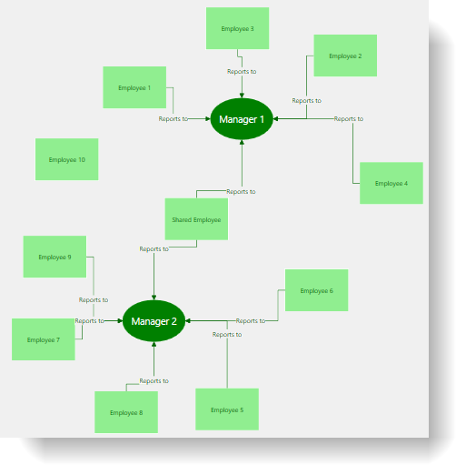

////

|metadata|
{
    "name": "xamdiagram-binding-to-hierarchical-node-data-with-references",
    "tags": ["Charting","Data Binding","Data Presentation","How Do I"],
    "controlName": ["xamDiagram"],
    "guid": "1c94a9bb-fbf9-44d6-80a6-1534d7bea3a4",  
    "buildFlags": [],
    "createdOn": "2014-06-23T07:47:16.4236241Z"
}
|metadata|
////

= Binding to Hierarchical Node Data with References (xamDiagram)

== Topic Overview

=== Purpose

This topic provides a step by step guidance on how to bind the  _xamDiagram_™ control to hierarchical node data.

=== Required background

The following topics are prerequisites to understanding this topic:

[options="header", cols="a,a"]
|====
|Topic|Purpose

| link:xamdiagram-binding-to-data.html[Binding _xamDiagram_ to Data]
|This topic provides an overview of the data binding scenarios supported by the _xamDiagram_ control.

|====

=== In this topic

* <<_Ref391055893, Binding  _xamDiagram_  to Hierarchical Node Data with References >>

** <<_Ref391055896,Introduction>>
** <<_Preview,Preview>>
** <<_Prerequisites,Prerequisites>>
** <<_Overview,Overview>>
** <<_Ref391055903,Steps>>
** <<_Ref382317785,Full code>>

* <<_Ref391056408, Related Content >>

** <<_Ref391056410,Topics>>
** <<_Ref391056412,Samples>>

[[_Ref391055893]]
== Binding  _xamDiagram_   to Hierarchical Node Data with References

[[_Ref391055896]]

=== Introduction

The following procedure demonstrates how to bind the  _xamDiagram_   to data where input data objects represent nodes and each of them has a collection of child node objects.

[[_Preview]]

=== Preview

The following screenshot is a preview of the result.

[[_Prerequisites]]

=== Prerequisites

To complete the procedure, you need the following:

* A WPF application with an empty  _xamDiagram_   added to a page
* The link:{ApiPlatform}controls.charts.xamdiagram{ApiVersion}~infragistics.controls.charts.xamdiagram~layout.html[Layout] property of the  _xamDiagram_   set to an instance of the link:{ApiPlatform}controls.charts.xamdiagram{ApiVersion}~infragistics.controls.charts.forcedirectedgraphdiagramlayout_members.html[ForceDirectedGraphDiagramLayout]

[[_Overview]]

=== Overview

Following is a conceptual overview of the process:

*1. Configure the `ItemsSource` property*

*2. Create the node definitions*

*3. Create the connection definitions*

[[_Ref391055903]]

=== Steps

The following steps demonstrate how to bind the  _xamDiagram_   to hierarchical node data with references.

=== 1. Set the ItemsSource

*1. Add the sample data class*

Add the following `Employee` and `Manager` classes to the code behind. The `Manager` class has a list property with `Employee` instances containing the manager’s subordinates. This property is used to create the  _Manager-Employee_   relations in the  _xamDiagram_  . Note that there is no requirement for the parent-child types to have any inheritance relation, and self-referencing types can be used too.

*In C#:*

[source, CS]
----
public class Employee : INotifyPropertyChanged
{
public Employee(string name)
{
Name = name;
}
private string _name;
public string Name
{
get { return _name; }
set
{
_name = value;
OnPropertyChanged();
}
}
public event PropertyChangedEventHandler PropertyChanged;
protected void OnPropertyChanged([CallerMemberName] string propertyName = "")
{
if (PropertyChanged != null)
PropertyChanged(this, new PropertyChangedEventArgs(propertyName));
}
}
public class Manager : Employee
{
public Manager(string name) : base(name) { }
private IList<Employee> _subordinates;
public IList<Employee> Subordinates
{
get { return _subordinates; }
set
{
_subordinates = value;
OnPropertyChanged();
}
}
}
----

*In VB:*

[source, VB]
----
Public Class Employee
Implements INotifyPropertyChanged
Public Sub New(name__1 As String)
Name = name__1
End Sub
Private _name As String
Public Property Name() As String
Get
Return _name
End Get
Set(value As String)
_name = value
OnPropertyChanged()
End Set
End Property
Public Event PropertyChanged As PropertyChangedEventHandler Implements INotifyPropertyChanged.PropertyChanged
Protected Sub OnPropertyChanged(Optional propertyName As String = "")
RaiseEvent PropertyChanged(Me, New PropertyChangedEventArgs(propertyName))
End Sub
End Class
Public Class Manager
Inherits Employee
Public Sub New(name As String)
MyBase.New(name)
End Sub
Private _subordinates As IList(Of Employee)
Public Property Subordinates() As IList(Of Employee)
Get
Return _subordinates
End Get
Set(value As IList(Of Employee))
_subordinates = value
OnPropertyChanged()
End Set
End Property
End Class
----

*2. Add the view model class.* 

Add the following view model class that the  _xamDiagram_   will be bound to:

*In C#:*

[source, CS]
---- 
public class EmployeeViewModel : INotifyPropertyChanged
{
public EmployeeViewModel()
{
var employees = new ObservableCollection<Employee>();
var sharedEmployee = new Employee("Shared Employee");
employees.Add(new Manager("Manager 1")
{
Subordinates = new List<Employee>()
{
new Employee("Employee 1"),
new Employee("Employee 2"),
new Employee("Employee 3"),
new Employee("Employee 4"),
sharedEmployee
}
});
employees.Add(new Manager("Manager 2")
{
Subordinates = new List<Employee>()
{
sharedEmployee,
new Employee("Employee 5"),
new Employee("Employee 6"),
new Employee("Employee 7"),
new Employee("Employee 8"),
new Employee("Employee 9")
}
});
employees.Add(new Employee("Employee 10"));
Employees = employees;
}
private IList<Employee> _employees;
public IList<Employee> Employees
{
get { return _employees; }
set
{
_employees = value;
OnPropertyChanged();
}
}
public event PropertyChangedEventHandler PropertyChanged;
protected void OnPropertyChanged([CallerMemberName] string propertyName = "")
{
if (PropertyChanged != null)
PropertyChanged(this, new PropertyChangedEventArgs(propertyName));
}
}
----

*In VB:*

[source, VB]
---- 
Public Class EmployeeViewModel
Implements INotifyPropertyChanged
Public Sub New()
Dim employees__1 = New ObservableCollection(Of Employee)()
Dim sharedEmployee = New Employee("Shared Employee")
employees__1.Add(New Manager("Manager 1") With { _
.Subordinates = New List(Of Employee)() From { _
New Employee("Employee 1"), _
New Employee("Employee 2"), _
New Employee("Employee 3"), _
New Employee("Employee 4"), _
sharedEmployee _
} _
})
employees__1.Add(New Manager("Manager 2") With { _
.Subordinates = New List(Of Employee)() From { _
sharedEmployee, _
New Employee("Employee 5"), _
New Employee("Employee 6"), _
New Employee("Employee 7"), _
New Employee("Employee 8"), _
New Employee("Employee 9") _
} _
})
employees__1.Add(New Employee("Employee 10"))
Employees = employees__1
End Sub
Private _employees As IList(Of Employee)
Public Property Employees() As IList(Of Employee)
Get
Return _employees
End Get
Set(value As IList(Of Employee))
_employees = value
OnPropertyChanged()
End Set
End Property
Public Event PropertyChanged As PropertyChangedEventHandler Implements INotifyPropertyChanged.PropertyChanged
Protected Sub OnPropertyChanged(Optional propertyName As String = "")
RaiseEvent PropertyChanged(Me, New PropertyChangedEventArgs(propertyName))
End Sub
End Class
----

*3. Set the `ItemsSource` property*

Set DataContext to a new instance of the view model class and bind the link:{ApiPlatform}controls.charts.xamdiagram{ApiVersion}~infragistics.controls.charts.xamdiagram~itemssource.html[ItemsSource] to the `Employees` property of the `EmployeeViewModel` class.

*In XAML:*

[source,XAML]
---- 
<ig:XamDiagram x:Name="HierarchicalDiagram"
ItemsSource="{Binding Employees}">
<ig:XamDiagram.DataContext>
<local:EmployeeViewModel/>
</ig:XamDiagram.DataContext>
</ig:XamDiagram>
----

=== 2. Create the node definitions

Usually for each of the data types in the link:{ApiPlatform}controls.charts.xamdiagram{ApiVersion}~infragistics.controls.charts.xamdiagram~itemssource.html[ItemsSource] a link:{ApiPlatform}controls.charts.xamdiagram{ApiVersion}~infragistics.controls.charts.nodedefinition_members.html[NodeDefinition] is added to the  _xamDiagram_  . If one or more types are in an inheritance relationship the most concrete types have to be specified first. The  _xamDiagram_   tries to match the type of each of the data items the link:{ApiPlatform}controls.charts.xamdiagram{ApiVersion}~infragistics.controls.charts.nodedefinition~targettype.html[TargetType] of a node definition. The first node definition whose link:{ApiPlatform}controls.charts.xamdiagram{ApiVersion}~infragistics.controls.charts.nodedefinition~targettype.html[TargetType] returns true to a call to `IsAssignableFrom` is selected. That is if the link:{ApiPlatform}controls.charts.xamdiagram{ApiVersion}~infragistics.controls.charts.nodedefinition~targettype.html[TargetType] of a node definition matches exactly or is a parent type of the data item’s type, the node definition will be selected.

*1. Add a `NodeDefinition` for the Manager class*

A. Set the link:{ApiPlatform}controls.charts.xamdiagram{ApiVersion}~infragistics.controls.charts.nodedefinition~targettype.html[TargetType] of the link:{ApiPlatform}controls.charts.xamdiagram{ApiVersion}~infragistics.controls.charts.nodedefinition_members.html[NodeDefinition] to the `Manager` type.

B. Set the link:{ApiPlatform}controls.charts.xamdiagram{ApiVersion}~infragistics.controls.charts.nodedefinition~childrenmemberpath.html[ChildrenMemberPath] to the name of the property holding the collection of child objects.

In this case that is “Subordinates” property.

[start=3]
C. Set the link:{ApiPlatform}controls.charts.xamdiagram{ApiVersion}~infragistics.controls.charts.nodedefinition~displaymemberpath.html[DisplayMemberPath]

If a link:{ApiPlatform}controls.charts.xamdiagram{ApiVersion}~infragistics.controls.charts.nodedefinition~displaymemberpath.html[DisplayMemberPath] is not specified, and if no custom link:{ApiPlatform}controls.charts.xamdiagram{ApiVersion}~infragistics.controls.charts.diagramitem~displaytemplate.html[DisplayTemplate] is set via the link:{ApiPlatform}controls.charts.xamdiagram{ApiVersion}~infragistics.controls.charts.nodedefinition~nodestyle.html[NodeStyle], the result of the `ToString` method will be displayed as the nodes’ content.

[start=4]
D. Set the link:{ApiPlatform}controls.charts.xamdiagram{ApiVersion}~infragistics.controls.charts.nodedefinition~nodestyle.html[NodeStyle] (optional)

Using the link:{ApiPlatform}controls.charts.xamdiagram{ApiVersion}~infragistics.controls.charts.nodedefinition~nodestyle.html[NodeStyle] property allows you to set a style to be applied to all link:{ApiPlatform}controls.charts.xamdiagram{ApiVersion}~infragistics.controls.charts.diagramnode_members.html[DiagramNode] objects matched by the node definition. This gives you the opportunity to easily customize the nodes created for a certain data type.

*In XAML:*

[source,XAML]
---- 
<ig:NodeDefinition
TargetType="{x:Type local:Manager}"
ChildrenMemberPath="Subordinates"
DisplayMemberPath="Name">
<ig:NodeDefinition.NodeStyle>

</ig:NodeDefinition.NodeStyle>
</ig:NodeDefinition>
----

*2. Add a node definition for the Employee class*

Add an additional node definition setting the link:{ApiPlatform}controls.charts.xamdiagram{ApiVersion}~infragistics.controls.charts.nodedefinition~targettype.html[TargetType] and link:{ApiPlatform}controls.charts.xamdiagram{ApiVersion}~infragistics.controls.charts.nodedefinition~displaymemberpath.html[DisplayMemberPath] accordingly. Set the link:{ApiPlatform}controls.charts.xamdiagram{ApiVersion}~infragistics.controls.charts.nodedefinition~nodestyle.html[NodeStyle] to with a setter for the link:{ApiPlatform}controls.charts.xamdiagram{ApiVersion}~infragistics.controls.charts.diagramitem~displaytemplate.html[DisplayTemplate] property as follows.

*In XAML:*

[source,XAML]
---- 
<ig:NodeDefinition
TargetType="{x:Type local:Employee}">
<ig:NodeDefinition.NodeStyle>

</ig:NodeDefinition.NodeStyle>
</ig:NodeDefinition>
----

=== 3. Create a hierarchical connection definition.

Create a link:{ApiPlatform}controls.charts.xamdiagram{ApiVersion}~infragistics.controls.charts.connectiondefinition_members.html[ConnectionDefinition] and add it to the link:{ApiPlatform}controls.charts.xamdiagram{ApiVersion}~infragistics.controls.charts.xamdiagram~connectiondefinitions.html[ConnectionDefinitions] collection. The connection definitions provide a way to set a custom style for the connection generated by the  _xamDiagram_   for parent-child data item relations. Connection definitions are matched by the link:{ApiPlatform}controls.charts.xamdiagram{ApiVersion}~infragistics.controls.charts.connectiondefinition~starttargettype.html[StartTargetType] and link:{ApiPlatform}controls.charts.xamdiagram{ApiVersion}~infragistics.controls.charts.connectiondefinition~endtargettype.html[EndTargetType] properties. For this example set these to the `Manager` and `Employee` types respectively.

Set the link:{ApiPlatform}controls.charts.xamdiagram{ApiVersion}~infragistics.controls.charts.connectiondefinitionbase~connectionstyle.html[ConnectionStyle] property to a style targeting link:{ApiPlatform}controls.charts.xamdiagram{ApiVersion}~infragistics.controls.charts.diagramconnection_members.html[DiagramConnection].

*In XAML:*

[source,XAML]
---- 
<ig:ConnectionDefinition
StartTargetType="{x:Type local:Manager}"
EndTargetType="{x:Type local:Employee}">
<ig:ConnectionDefinition.ConnectionStyle>

</ig:ConnectionDefinition.ConnectionStyle>
</ig:ConnectionDefinition>
----

[[_Ref382317785]]

=== Full code

Following is the full code for this procedure.

*In XAML:*

[source,XAML]
---- 
<UserControl x:Class="DiagramDocumentationSamples.HierararchicalReferencesData"
xmlns="http://schemas.microsoft.com/winfx/2006/xaml/presentation"
xmlns:x="http://schemas.microsoft.com/winfx/2006/xaml"
xmlns:mc="http://schemas.openxmlformats.org/markup-compatibility/2006"
xmlns:d="http://schemas.microsoft.com/expression/blend/2008"
xmlns:ig="http://schemas.infragistics.com/xaml"
xmlns:local="clr-namespace:DiagramDocumentationSamples"
mc:Ignorable="d"
d:DesignHeight="300" d:DesignWidth="300">
<ig:XamDiagram x:Name="HierarchicalDiagram" ItemsSource="{Binding Employees}">
<ig:XamDiagram.DataContext>
<local:EmployeeViewModel/>
</ig:XamDiagram.DataContext>
<ig:XamDiagram.NodeDefinitions>
<ig:NodeDefinition
TargetType="{x:Type local:Manager}"
ChildrenMemberPath="Subordinates"
DisplayMemberPath="Name">
<ig:NodeDefinition.NodeStyle>

</ig:NodeDefinition.NodeStyle>
</ig:NodeDefinition>
<ig:NodeDefinition
TargetType="{x:Type local:Employee}">
<ig:NodeDefinition.NodeStyle>

</ig:NodeDefinition.NodeStyle>
</ig:NodeDefinition>
</ig:XamDiagram.NodeDefinitions>
<ig:XamDiagram.ConnectionDefinitions>
<ig:ConnectionDefinition
StartTargetType="{x:Type local:Manager}"
EndTargetType="{x:Type local:Employee}">
<ig:ConnectionDefinition.ConnectionStyle>

</ig:ConnectionDefinition.ConnectionStyle>
</ig:ConnectionDefinition>
</ig:XamDiagram.ConnectionDefinitions>
<ig:XamDiagram.Layout>
<ig:ForceDirectedGraphDiagramLayout/>
</ig:XamDiagram.Layout>
</ig:XamDiagram>
</UserControl>
----

*In C#:* 

[source, CS]
---- 
using System.Collections.Generic;
using System.Collections.ObjectModel;
using System.ComponentModel;
using System.Runtime.CompilerServices;
using System.Windows.Controls;
namespace DiagramDocumentationSamples
{
public partial class HierararchicalReferencesData : UserControl
{
public HierararchicalReferencesData()
{
InitializeComponent();
}
}
public class Employee : INotifyPropertyChanged
{
public Employee(string name)
{
Name = name;
}
private string _name;
public string Name
{
get { return _name; }
set
{
_name = value;
OnPropertyChanged();
}
}
public event PropertyChangedEventHandler PropertyChanged;
protected void OnPropertyChanged([CallerMemberName] string propertyName = "")
{
if (PropertyChanged != null)
PropertyChanged(this, new PropertyChangedEventArgs(propertyName));
}
}
public class Manager : Employee
{
public Manager(string name) : base(name) { }
private IList<Employee> _subordinates;
public IList<Employee> Subordinates
{
get { return _subordinates; }
set
{
_subordinates = value;
OnPropertyChanged();
}
}
}
public class EmployeeViewModel : INotifyPropertyChanged
{
public EmployeeViewModel()
{
var employees = new ObservableCollection<Employee>();
var sharedEmployee = new Employee("Shared Employee");
employees.Add(new Manager("Manager 1")
{
Subordinates = new List<Employee>()
{
new Employee("Employee 1"),
new Employee("Employee 2"),
new Employee("Employee 3"),
new Employee("Employee 4"),
sharedEmployee
}
});
employees.Add(new Manager("Manager 2")
{
Subordinates = new List<Employee>()
{
sharedEmployee,
new Employee("Employee 5"),
new Employee("Employee 6"),
new Employee("Employee 7"),
new Employee("Employee 8"),
new Employee("Employee 9")
}
});
employees.Add(new Employee("Employee 10"));
Employees = employees;
}
private IList<Employee> _employees;
public IList<Employee> Employees
{
get { return _employees; }
set
{
_employees = value;
OnPropertyChanged();
}
}
public event PropertyChangedEventHandler PropertyChanged;
protected void OnPropertyChanged([CallerMemberName] string propertyName = "")
{
if (PropertyChanged != null)
PropertyChanged(this, new PropertyChangedEventArgs(propertyName));
}
}
}
----

*In VB:*

[source, VB]
----
Imports System.Collections.Generic
Imports System.Collections.ObjectModel
Imports System.ComponentModel
Imports System.Runtime.CompilerServices
Imports System.Windows.Controls
Namespace DiagramDocumentationSamples
Public Partial Class HierararchicalReferencesData
Inherits UserControl
Public Sub New()
InitializeComponent()
End Sub
End Class
Public Class Employee
Implements INotifyPropertyChanged
Public Sub New(name__1 As String)
Name = name__1
End Sub
Private _name As String
Public Property Name() As String
Get
Return _name
End Get
Set(value As String)
_name = value
OnPropertyChanged()
End Set
End Property
Public Event PropertyChanged As PropertyChangedEventHandler Implements INotifyPropertyChanged.PropertyChanged
Protected Sub OnPropertyChanged(Optional propertyName As String = "")
RaiseEvent PropertyChanged(Me, New PropertyChangedEventArgs(propertyName))
End Sub
End Class
Public Class Manager
Inherits Employee
Public Sub New(name As String)
MyBase.New(name)
End Sub
Private _subordinates As IList(Of Employee)
Public Property Subordinates() As IList(Of Employee)
Get
Return _subordinates
End Get
Set(value As IList(Of Employee))
_subordinates = value
OnPropertyChanged()
End Set
End Property
End Class
Public Class EmployeeViewModel
Implements INotifyPropertyChanged
Public Sub New()
Dim employees__1 = New ObservableCollection(Of Employee)()
Dim sharedEmployee = New Employee("Shared Employee")
employees__1.Add(New Manager("Manager 1") With { _
.Subordinates = New List(Of Employee)() From { _
New Employee("Employee 1"), _
New Employee("Employee 2"), _
New Employee("Employee 3"), _
New Employee("Employee 4"), _
sharedEmployee _
} _
})
employees__1.Add(New Manager("Manager 2") With { _
.Subordinates = New List(Of Employee)() From { _
sharedEmployee, _
New Employee("Employee 5"), _
New Employee("Employee 6"), _
New Employee("Employee 7"), _
New Employee("Employee 8"), _
New Employee("Employee 9") _
} _
})
employees__1.Add(New Employee("Employee 10"))
Employees = employees__1
End Sub
Private _employees As IList(Of Employee)
Public Property Employees() As IList(Of Employee)
Get
Return _employees
End Get
Set(value As IList(Of Employee))
_employees = value
OnPropertyChanged()
End Set
End Property
Public Event PropertyChanged As PropertyChangedEventHandler Implements INotifyPropertyChanged.PropertyChanged
Protected Sub OnPropertyChanged(Optional propertyName As String = "")
RaiseEvent PropertyChanged(Me, New PropertyChangedEventArgs(propertyName))
End Sub
End Class
End Namespace
----

[[_Ref391056408]]
== Related Content

[[_Ref391056410]]

=== Topics

The following topics provide additional information related to this topic.

[options="header", cols="a,a"]
|====
|Topic|Purpose

| link:xamdiagram-binding-to-nodes-and-connections-data-with-references.html[Binding to Nodes and Connections Data with References ( _xamDiagram_ )]
|This topic provides a step by step guidance on how to bind the _xamDiagram_ control to data where input data objects represent nodes and connection and each of the connection objects has a reference to two node objects representing its start and end nodes.

| link:xamdiagram-binding-to-nodes-and-connections-data-with-keys.html[Binding to Nodes and Connections Data with Keys ( _xamDiagram_ )]
|This topic provides a step by step guidance on how to bind the _xamDiagram_ control to data where input data objects represent nodes and connections. Each of the node objects has a unique string identifier and each of the connection objects has two properties holding the identifiers of the two node objects representing its start and end nodes.

| link:xamdiagram-binding-to-hierarchical-node-data-with-keys.html[Binding to Hierarchical Node Data with Keys ( _xamDiagram_ )]
|This topic provides a step by step guidance on how to bind the _xamDiagram_ control to hierarchical node data with keys.

|====

[[_Ref391056412]]

=== Samples

The following samples provide additional information related to this topic.

[options="header", cols="a,a"]
|====
|Sample|Purpose

| link:{SamplesURL}/diagram/binding-nodes-with-objects[Binding Nodes with Objects]
|The following sample demonstrates how to bind the _xamDiagram_ to data where input data objects represent nodes and each of them has a collection of child node objects.

|====