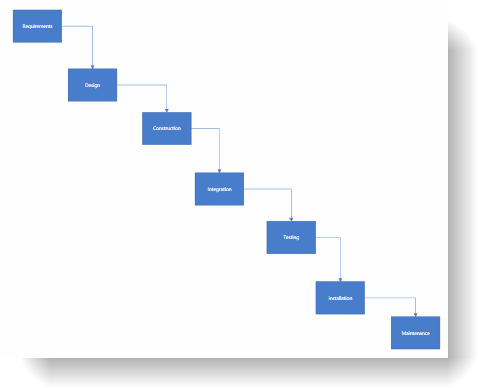

////

|metadata|
{
    "name": "xamdiagram-binding-to-nodes-and-connections-data-with-keys",
    "tags": ["Charting","Data Binding","Data Presentation","How Do I"],
    "controlName": ["xamDiagram"],
    "guid": "f1529b42-ecc7-4733-aa5c-7a3bfd98586a",  
    "buildFlags": [],
    "createdOn": "2014-06-25T10:58:22.6686021Z"
}
|metadata|
////

= Binding to Nodes and Connections Data with Keys (xamDiagram)

== Topic Overview

=== Purpose

This topic provides a step by step guidance on how to bind the  _xamDiagram_™ control to data where input data objects represent nodes and connections. Each of the node objects has a property of type `object` that represents a unique identifier and each of the connection objects has two properties holding the identifiers of the two node objects representing its start and end nodes.

=== Required background

The following topics are prerequisites to understanding this topic:

[options="header", cols="a,a"]
|====
|Topic|Purpose

| link:xamdiagram-adding-to-a-page.html[Binding _xamDiagram_ to Data]
|This topic provides an overview of the data binding scenarios supported by the _xamDiagram_™ control.

|====

=== In this topic

* <<_Ref391057685, Binding to Nodes and Connections Data with Keys >>

** <<_Ref391057687,Introduction>>
** <<_Preview,Preview>>
** <<_Prerequisites,Prerequisites>>
** <<_Overview,Overview>>
** <<_Ref391057695,Steps>>
** <<_Ref382317785,Full code>>

* <<_Ref391057700, Related Content >>

** <<_Ref391057704,Topics>>
** <<_Ref391057708,Samples>>

[[_Ref391057685]]
== Binding to Nodes and Connections Data with Keys

[[_Ref391057687]]

=== Introduction

The following procedure demonstrates how to bind the  _xamDiagram_   to data where input data objects represent nodes and connections. Each of the node objects has a property of type `object` that represents a unique identifier and each of the connection objects has two properties holding the identifiers of the two node objects representing its start and end nodes.

[[_Preview]]

=== Preview

The following screenshot is a preview of the result.

[[_Prerequisites]]

=== Prerequisites

To complete the procedure, you need the following:

* A WPF application with an empty  _xamDiagram_   added to a page
* The link:{ApiPlatform}controls.charts.xamdiagram.v{ProductVersion}~infragistics.controls.charts.xamdiagram~layout.html[Layout] property of the  _xamDiagram_   set to an instance of the link:{ApiPlatform}controls.charts.xamdiagram.v{ProductVersion}~infragistics.controls.charts.forcedirectedgraphdiagramlayout_members.html[ForceDirectedGraphDiagramLayout]

[[_Overview]]

=== Overview

Following is a conceptual overview of the process:

*1. Setting the ItemsSource and ConnectionSource*

*2. Creating the node definitions*

*3. Creating the connection definitions*

[[_Ref391057695]]

=== Steps

The following steps demonstrate how to bind the  _xamDiagram_   to nodes and connections data with keys, building a diagram of the Waterflow software development process.

=== 1. Set the ItemsSource

*1. Add the sample node data class*

Add the following `Activity` class to the code behind. The `Activity` represents the node object and has a single string property called `Key`.

*In C#:*

[source, CS]
---- 
public class Activity : INotifyPropertyChanged
{
public Activity(string name) { Key = name; }
private string _key;
public string Key {
get { return _key; }
set
{
_key = value;
OnPropertyChanged();
}
}
public event PropertyChangedEventHandler PropertyChanged;
protected void OnPropertyChanged([CallerMemberName] string propertyName = "")
{
if (PropertyChanged != null)
PropertyChanged(this, new PropertyChangedEventArgs(propertyName));
}
}
----

*In VB:*

[source, VB]
---- 
Public Class Activity
Implements INotifyPropertyChanged
Public Sub New(name As String)
Key = name
End Sub
Private _key As String
Public Property Key() As String
Get
Return _key
End Get
Set
_key = value
OnPropertyChanged()
End Set
End Property
Public Event PropertyChanged As PropertyChangedEventHandler
Protected Sub OnPropertyChanged( Optional propertyName As String = "")
RaiseEvent PropertyChanged(Me, New PropertyChangedEventArgs(propertyName))
End Sub
End Class
----

*2. Add the sample connection class*

Add the following `ActivityRelation` class to the code behind. The `ActivityRelation` class represents a directed connection between two `Activity` instances. It has two string properties that are set to the start and end activities’ keys.

*In C#:*

[source, CS]
---- 
public class ActivityRelation : INotifyPropertyChanged
{
public ActivityRelation(string from, string to)
{
StartKey = from;
EndKey = to;
}
private string _startKey;
public string StartKey
{
get { return _startKey; }
set
{
_startKey = value;
OnPropertyChanged();
}
}
private string _endKey;
public string EndKey
{
get { return _endKey; }
set
{
_endKey = value;
OnPropertyChanged();
}
}
public override string ToString()
{
return "";
}
public event PropertyChangedEventHandler PropertyChanged;
protected void OnPropertyChanged([CallerMemberName] string propertyName = "")
{
if (PropertyChanged != null)
PropertyChanged(this, new PropertyChangedEventArgs(propertyName));
}
}
----

*In VB:* 

[source, VB]
---- 
Public Class ActivityRelation
Implements INotifyPropertyChanged
Public Sub New(from As String, [to] As String)
StartKey = from
EndKey = [to]
End Sub
Private _startKey As String
Public Property StartKey() As String
Get
Return _startKey
End Get
Set
_startKey = value
OnPropertyChanged()
End Set
End Property
Private _endKey As String
Public Property EndKey() As String
Get
Return _endKey
End Get
Set
_endKey = value
OnPropertyChanged()
End Set
End Property
Public Overrides Function ToString() As String
Return ""
End Function
Public Event PropertyChanged As PropertyChangedEventHandler
Protected Sub OnPropertyChanged( Optional propertyName As String = "")
RaiseEvent PropertyChanged(Me, New PropertyChangedEventArgs(propertyName))
End Sub
End Class
----

*3. Add the data items*

Add the following `WaterFlowViewModel` class which exposes two list properties – for nodes and for connections and is automatically populated with some sample data.

*In C#:*

[source, CS]
---- 
public class WaterFlowViewModel : INotifyPropertyChanged
{
public WaterFlowViewModel()
{
Activities = new ObservableCollection<Activity>()
{
new Activity("Requirements"),
new Activity("Design"),
new Activity("Construction"),
new Activity("Integration"),
new Activity("Testing"),
new Activity("Installation"),
new Activity("Maintenance")
};
Relations = new ObservableCollection<ActivityRelation>()
{
new ActivityRelation("Requirements", "Design"),
new ActivityRelation("Design", "Construction"),
new ActivityRelation("Construction", "Integration"),
new ActivityRelation("Integration", "Testing"),
new ActivityRelation("Testing", "Installation"),
new ActivityRelation("Installation", "Maintenance"),
};
}
private IList<Activity> _activities;
public IList<Activity> Activities
{
get { return _activities; }
set
{
_activities = value;
OnPropertyChanged();
}
}
private IList<ActivityRelation> _relations;
public IList<ActivityRelation> Relations
{
get { return _relations; }
set
{
_relations = value;
OnPropertyChanged();
}
}
public event PropertyChangedEventHandler PropertyChanged;
protected void OnPropertyChanged([CallerMemberName] string propertyName = "")
{
if (PropertyChanged != null)
PropertyChanged(this, new PropertyChangedEventArgs(propertyName));
}
}
----

*In VB:*

[source, VB]
---- 
Public Class WaterFlowViewModel
Implements INotifyPropertyChanged
Public Sub New()
Activities = New ObservableCollection(Of Activity)() From { _
New Activity("Requirements"), _
New Activity("Design"), _
New Activity("Construction"), _
New Activity("Integration"), _
New Activity("Testing"), _
New Activity("Installation"), _
New Activity("Maintenance") _
}
Relations = New ObservableCollection(Of ActivityRelation)() From { _
New ActivityRelation("Requirements", "Design"), _
New ActivityRelation("Design", "Construction"), _
New ActivityRelation("Construction", "Integration"), _
New ActivityRelation("Integration", "Testing"), _
New ActivityRelation("Testing", "Installation"), _
New ActivityRelation("Installation", "Maintenance") _
}
End Sub
Private _activities As IList(Of Activity)
Public Property Activities() As IList(Of Activity)
Get
Return _activities
End Get
Set(value As IList(Of Activity))
_activities = value
OnPropertyChanged()
End Set
End Property
Private _relations As IList(Of ActivityRelation)
Public Property Relations() As IList(Of ActivityRelation)
Get
Return _relations
End Get
Set(value As IList(Of ActivityRelation))
_relations = value
OnPropertyChanged()
End Set
End Property
Public Event PropertyChanged As PropertyChangedEventHandler Implements INotifyPropertyChanged.PropertyChanged
Protected Sub OnPropertyChanged(Optional propertyName As String = "")
RaiseEvent PropertyChanged(Me, New PropertyChangedEventArgs(propertyName))
End Sub
End Class
----

*4. Set the DataContext*   *of the XamDiagram*

Set the diagram’s `DataContext` property to an instance of the `WaterFlowViewModel` class.

*In XAML:*

[source,XAML]
---- 
<ig:XamDiagram>
<ig:XamDiagram.DataContext>
<local:WaterFlowViewModel/>
</ig:XamDiagram.DataContext>
</ig:XamDiagram>
----

  *5. Set the ItemsSource*   *property* 

Bind the link:{ApiPlatform}controls.charts.xamdiagram.v{ProductVersion}~infragistics.controls.charts.xamdiagram~itemssource.html[ItemsSource] to the `Articles` property of the `WaterFlowViewModel` data context.

*In XAML:*

[source,XAML]
---- 
ItemsSource="{Binding Activities}"
----

  *6. Set the ConnectionsSource*   *property* 

Bind the link:{ApiPlatform}controls.charts.xamdiagram.v{ProductVersion}~infragistics.controls.charts.xamdiagram~connectionssource.html[ConnectionsSource] to the `Relations` property of the `WaterFlowViewModel` data context.

*In XAML:*

[source,XAML]
---- 
ConnectionsSource="{Binding Relations}"
----

=== 2. Create the node definitions

For each of the data types in the link:{ApiPlatform}controls.charts.xamdiagram.v{ProductVersion}~infragistics.controls.charts.xamdiagram~itemssource.html[ItemsSource] a link:{ApiPlatform}controls.charts.xamdiagram.v{ProductVersion}~infragistics.controls.charts.nodedefinition_members.html[NodeDefinition] is usually added to the  _xamDiagram_  . Specify the most concrete types first if one or more types are in an inheritance relationship. The  _xamDiagram_   tries to match the type of each of the data items in the link:{ApiPlatform}controls.charts.xamdiagram.v{ProductVersion}~infragistics.controls.charts.nodedefinition~targettype.html[TargetType] of a node definition. The first node definition whose link:{ApiPlatform}controls.charts.xamdiagram.v{ProductVersion}~infragistics.controls.charts.nodedefinition~targettype.html[TargetType] returns true from a call to `IsAssignableFrom` is selected. That is if the link:{ApiPlatform}controls.charts.xamdiagram.v{ProductVersion}~infragistics.controls.charts.nodedefinition~targettype.html[TargetType] of the node definition matches exactly, or is a parent type of the data item’s type; otherwise, the node definition is selected.

In order to use data binding with keys, the node objects must have a string property with valid value for the link:{ApiPlatform}controls.charts.xamdiagram.v{ProductVersion}~infragistics.controls.charts.diagramnode~key.html[Key] property of the link:{ApiPlatform}controls.charts.xamdiagram.v{ProductVersion}~infragistics.controls.charts.diagramnode_members.html[DiagramNode] class.

*1. Create a NodeDefinition for the `Activity` class*

Create a link:{ApiPlatform}controls.charts.xamdiagram.v{ProductVersion}~infragistics.controls.charts.nodedefinition_members.html[NodeDefinition] and add it to the link:{ApiPlatform}controls.charts.xamdiagram.v{ProductVersion}~infragistics.controls.charts.xamdiagram~nodedefinitions.html[NodeDefinitions] collection.

*2. Set the link:{ApiPlatform}controls.charts.xamdiagram.v{ProductVersion}~infragistics.controls.charts.nodedefinition~targettype.html[TargetType] of the link:{ApiPlatform}controls.charts.xamdiagram.v{ProductVersion}~infragistics.controls.charts.nodedefinition_members.html[NodeDefinition] to the `Activity` type.*

*3. Set the KeyMemberPath*

Set the link:{ApiPlatform}controls.charts.xamdiagram.v{ProductVersion}~infragistics.controls.charts.nodedefinition~keymemberpath.html[KeyMemberPath] to  _Key_  . This will populate the link:{ApiPlatform}controls.charts.xamdiagram.v{ProductVersion}~infragistics.controls.charts.diagramnode~key.html[Name] property of the created link:{ApiPlatform}controls.charts.xamdiagram.v{ProductVersion}~infragistics.controls.charts.diagramnode_members.html[DiagramNode] instances to the value of the Key property.

*4. Set the link:{ApiPlatform}controls.charts.xamdiagram.v{ProductVersion}~infragistics.controls.charts.nodedefinition~displaymemberpath.html[DisplayMemberPath]*

Set the link:{ApiPlatform}controls.charts.xamdiagram.v{ProductVersion}~infragistics.controls.charts.nodedefinition~displaymemberpath.html[DisplayMemberPath] to  _Key_  . Not specifying a link:{ApiPlatform}controls.charts.xamdiagram.v{ProductVersion}~infragistics.controls.charts.nodedefinition~displaymemberpath.html[DisplayMemberPath], and not setting a custom link:{ApiPlatform}controls.charts.xamdiagram.v{ProductVersion}~infragistics.controls.charts.diagramitem~displaytemplate.html[DisplayTemplate] via the link:{ApiPlatform}controls.charts.xamdiagram.v{ProductVersion}~infragistics.controls.charts.nodedefinition~nodestyle.html[NodeStyle], the results in the `ToString` method displayed as the nodes’ content.

*5. Set the link:{ApiPlatform}controls.charts.xamdiagram.v{ProductVersion}~infragistics.controls.charts.nodedefinition~nodestyle.html[NodeStyle] (optional)*

Using the link:{ApiPlatform}controls.charts.xamdiagram.v{ProductVersion}~infragistics.controls.charts.nodedefinition~nodestyle.html[NodeStyle] property you can set the style to be applied to all `DiagramNode` objects matched by the node definition. This gives you the opportunity to easily customize the nodes created for a certain data type.

*In XAML:*

[source,XAML]
---- 
<ig:XamDiagram.NodeDefinitions>
<ig:NodeDefinition
TargetType="local:Activity"
KeyMemberPath="Key"
DisplayMemberPath="Key">
<ig:NodeDefinition.NodeStyle>

</ig:NodeDefinition.NodeStyle>
</ig:NodeDefinition>
</ig:XamDiagram.NodeDefinitions>
----

=== 3. Create the connection definitions.

When supplying separate connection data objects, use an instance of link:{ApiPlatform}controls.charts.xamdiagram.v{ProductVersion}~infragistics.controls.charts.connectionsourcedefinition_members.html[ConnectionSourceDefinition] in the diagram’s link:{ApiPlatform}controls.charts.xamdiagram.v{ProductVersion}~infragistics.controls.charts.xamdiagram~connectiondefinitions.html[ConnectionDefinitions]. This type of connection definition describes what connection to create for each data items matching the definition’s link:{ApiPlatform}controls.charts.xamdiagram.v{ProductVersion}~infragistics.controls.charts.nodedefinition~targettype.html[TargetType]. In order for such a connection to have its link:{ApiPlatform}controls.charts.xamdiagram.v{ProductVersion}~infragistics.controls.charts.diagramconnection~startnodekey.html[StartNodeKey] and link:{ApiPlatform}controls.charts.xamdiagram.v{ProductVersion}~infragistics.controls.charts.diagramconnection~endnodekey.html[EndNodeKey] properties correctly populated, the connection definition’s link:{ApiPlatform}controls.charts.xamdiagram.v{ProductVersion}~infragistics.controls.charts.connectionsourcedefinition~startnodekeymemberpath.html[StartNodeKeyMemberPath] and link:{ApiPlatform}controls.charts.xamdiagram.v{ProductVersion}~infragistics.controls.charts.connectionsourcedefinition~endnodekeymemberpath.html[EndNodeKeyMemberPath] properties must be set to the names of the properties holding the identifiers of the start/end node data objects. 

*1. Create a connection definition* 

Create a link:{ApiPlatform}controls.charts.xamdiagram.v{ProductVersion}~infragistics.controls.charts.connectionsourcedefinition_members.html[ConnectionSourceDefinition] and add it to the link:{ApiPlatform}controls.charts.xamdiagram.v{ProductVersion}~infragistics.controls.charts.xamdiagram~connectiondefinitions.html[ConnectionDefinitions] collection.

*2. Set the link:{ApiPlatform}controls.charts.xamdiagram.v{ProductVersion}~infragistics.controls.charts.nodedefinition~targettype.html[TargetType]*

Set the link:{ApiPlatform}controls.charts.xamdiagram.v{ProductVersion}~infragistics.controls.charts.nodedefinition~targettype.html[TargetType] to the `ActivityRelation` type. 

*3. Set the start/end node name member paths* 

Set the link:{ApiPlatform}controls.charts.xamdiagram.v{ProductVersion}~infragistics.controls.charts.connectionsourcedefinition~startnodekeymemberpath.html[StartNodeKeyMemberPath] to “ _StartKey_   _”_  . Set the link:{ApiPlatform}controls.charts.xamdiagram.v{ProductVersion}~infragistics.controls.charts.connectionsourcedefinition~endnodekeymemberpath.html[EndNodeKeyMemberPath] to  _”_   _EndKey_   _”_  .

*4. Set the link:{ApiPlatform}controls.charts.xamdiagram.v{ProductVersion}~infragistics.controls.charts.connectiondefinitionbase~connectionstyle.html[ConnectionStyle]  _(optional)_*

You can customize the connections created for a particular data type by setting the link:{ApiPlatform}controls.charts.xamdiagram.v{ProductVersion}~infragistics.controls.charts.connectiondefinitionbase~connectionstyle.html[ConnectionStyle] property to a style targeting link:{ApiPlatform}controls.charts.xamdiagram.v{ProductVersion}~infragistics.controls.charts.diagramconnection_members.html[DiagramConnection]. You can specify a setting for the link:{ApiPlatform}controls.charts.xamdiagram.v{ProductVersion}~infragistics.controls.charts.diagramitem~displaytemplate.html[DisplayTemplate] property and apply a template setting the `DataContext` where the data object will be.

*In XAML:*

[source,XAML]
---- 
<ig:XamDiagram.ConnectionDefinitions>
<ig:ConnectionSourceDefinition
TargetType="local:ActivityRelation"
StartNodeKeyMemberPath="StartKey"
EndNodeKeyMemberPath="EndKey"/>
</ig:XamDiagram.ConnectionDefinitions>
----

[[_Ref382317785]]

=== Full code

Following is the full code for this procedure.

*In XAML:*

[source, XAML]
---- 
<UserControl x:Class="DiagramDocumentationSamples.NodesConnectionsKeysData"
xmlns="http://schemas.microsoft.com/winfx/2006/xaml/presentation"
xmlns:x="http://schemas.microsoft.com/winfx/2006/xaml"
xmlns:mc="http://schemas.openxmlformats.org/markup-compatibility/2006"
xmlns:d="http://schemas.microsoft.com/expression/blend/2008"
xmlns:ig="http://schemas.infragistics.com/xaml"
xmlns:local="clr-namespace:DiagramDocumentationSamples"
mc:Ignorable="d"
d:DesignHeight="300" d:DesignWidth="300">
<ig:XamDiagram ConnectionsSource="{Binding Relations}" ItemsSource="{Binding Activities}">
<ig:XamDiagram.DataContext>
<local:WaterFlowViewModel/>
</ig:XamDiagram.DataContext>
<ig:XamDiagram.NodeDefinitions>
<ig:NodeDefinition
TargetType="local:Activity"
KeyMemberPath="Key"
DisplayMemberPath="Key">
<ig:NodeDefinition.NodeStyle>

</ig:NodeDefinition.NodeStyle>
</ig:NodeDefinition>
</ig:XamDiagram.NodeDefinitions>
<ig:XamDiagram.ConnectionDefinitions>
<ig:ConnectionSourceDefinition
TargetType="local:ActivityRelation"
StartNodeKeyMemberPath="StartKey"
EndNodeKeyMemberPath="EndKey"/>
</ig:XamDiagram.ConnectionDefinitions>
<ig:XamDiagram.Layout>
<ig:ForceDirectedGraphDiagramLayout/>
</ig:XamDiagram.Layout>
</ig:XamDiagram>
</UserControl>
----

*In C#:*

[source, CS]
---- 
using System.Collections.Generic;
using System.Collections.ObjectModel;
using System.ComponentModel;
using System.Runtime.CompilerServices;
using System.Windows.Controls;
namespace DiagramDocumentationSamples
{
public partial class NodesConnectionsKeysData : UserControl
{
public NodesConnectionsKeysData()
{
InitializeComponent();
}
}
public class WaterFlowViewModel : INotifyPropertyChanged
{
public WaterFlowViewModel()
{
Activities = new ObservableCollection<Activity>()
{
new Activity("Requirements"),
new Activity("Design"),
new Activity("Construction"),
new Activity("Integration"),
new Activity("Testing"),
new Activity("Installation"),
new Activity("Maintenance")
};
Relations = new ObservableCollection<ActivityRelation>()
{
new ActivityRelation("Requirements", "Design"),
new ActivityRelation("Design", "Construction"),
new ActivityRelation("Construction", "Integration"),
new ActivityRelation("Integration", "Testing"),
new ActivityRelation("Testing", "Installation"),
new ActivityRelation("Installation", "Maintenance"),
};
}
private IList<Activity> _activities;
public IList<Activity> Activities
{
get { return _activities; }
set
{
_activities = value;
OnPropertyChanged();
}
}
private IList<ActivityRelation> _relations;
public IList<ActivityRelation> Relations
{
get { return _relations; }
set
{
_relations = value;
OnPropertyChanged();
}
}
public event PropertyChangedEventHandler PropertyChanged;
protected void OnPropertyChanged([CallerMemberName] string propertyName = "")
{
if (PropertyChanged != null)
PropertyChanged(this, new PropertyChangedEventArgs(propertyName));
}
}
public class Activity : INotifyPropertyChanged
{
public Activity(string name) { Key = name; }
private string _key;
public string Key
{
get { return _key; }
set
{
_key = value;
OnPropertyChanged();
}
}
public event PropertyChangedEventHandler PropertyChanged;
protected void OnPropertyChanged([CallerMemberName] string propertyName = "")
{
if (PropertyChanged != null)
PropertyChanged(this, new PropertyChangedEventArgs(propertyName));
}
}
public class ActivityRelation : INotifyPropertyChanged
{
public ActivityRelation(string from, string to)
{
StartKey = from;
EndKey = to;
}
private string _startKey;
public string StartKey
{
get { return _startKey; }
set
{
_startKey = value;
OnPropertyChanged();
}
}
private string _endKey;
public string EndKey
{
get { return _endKey; }
set
{
_endKey = value;
OnPropertyChanged();
}
}
public override string ToString()
{
return "";
}
public event PropertyChangedEventHandler PropertyChanged;
protected void OnPropertyChanged([CallerMemberName] string propertyName = "")
{
if (PropertyChanged != null)
PropertyChanged(this, new PropertyChangedEventArgs(propertyName));
}
}
}
----

*In VB:*

[source, VB]
---- 
Imports System.Collections.Generic
Imports System.Collections.ObjectModel
Imports System.ComponentModel
Imports System.Runtime.CompilerServices
Imports System.Windows.Controls
Namespace DiagramDocumentationSamples
Public Partial Class NodesConnectionsKeysData
Inherits UserControl
Public Sub New()
InitializeComponent()
End Sub
End Class
Public Class WaterFlowViewModel
Implements INotifyPropertyChanged
Public Sub New()
Activities = New ObservableCollection(Of Activity)() From { _
New Activity("Requirements"), _
New Activity("Design"), _
New Activity("Construction"), _
New Activity("Integration"), _
New Activity("Testing"), _
New Activity("Installation"), _
New Activity("Maintenance") _
}
Relations = New ObservableCollection(Of ActivityRelation)() From { _
New ActivityRelation("Requirements", "Design"), _
New ActivityRelation("Design", "Construction"), _
New ActivityRelation("Construction", "Integration"), _
New ActivityRelation("Integration", "Testing"), _
New ActivityRelation("Testing", "Installation"), _
New ActivityRelation("Installation", "Maintenance") _
}
End Sub
Private _activities As IList(Of Activity)
Public Property Activities() As IList(Of Activity)
Get
Return _activities
End Get
Set(value As IList(Of Activity))
_activities = value
OnPropertyChanged()
End Set
End Property
Private _relations As IList(Of ActivityRelation)
Public Property Relations() As IList(Of ActivityRelation)
Get
Return _relations
End Get
Set(value As IList(Of ActivityRelation))
_relations = value
OnPropertyChanged()
End Set
End Property
Public Event PropertyChanged As PropertyChangedEventHandler Implements INotifyPropertyChanged.PropertyChanged
Protected Sub OnPropertyChanged(Optional propertyName As String = "")
RaiseEvent PropertyChanged(Me, New PropertyChangedEventArgs(propertyName))
End Sub
End Class
Public Class Activity
Implements INotifyPropertyChanged
Public Sub New(name As String)
Key = name
End Sub
Private _key As String
Public Property Key() As String
Get
Return _key
End Get
Set(value As String)
_key = value
OnPropertyChanged()
End Set
End Property
Public Event PropertyChanged As PropertyChangedEventHandler Implements INotifyPropertyChanged.PropertyChanged
Protected Sub OnPropertyChanged(Optional propertyName As String = "")
RaiseEvent PropertyChanged(Me, New PropertyChangedEventArgs(propertyName))
End Sub
End Class
Public Class ActivityRelation
Implements INotifyPropertyChanged
Public Sub New(from As String, [to] As String)
StartKey = from
EndKey = [to]
End Sub
Private _startKey As String
Public Property StartKey() As String
Get
Return _startKey
End Get
Set(value As String)
_startKey = value
OnPropertyChanged()
End Set
End Property
Private _endKey As String
Public Property EndKey() As String
Get
Return _endKey
End Get
Set(value As String)
_endKey = value
OnPropertyChanged()
End Set
End Property
Public Overrides Function ToString() As String
Return ""
End Function
Public Event PropertyChanged As PropertyChangedEventHandler Implements INotifyPropertyChanged.PropertyChanged
Protected Sub OnPropertyChanged(Optional propertyName As String = "")
RaiseEvent PropertyChanged(Me, New PropertyChangedEventArgs(propertyName))
End Sub
End Class
End Namespace
----

[[_Ref391057700]]
== Related Content

[[_Ref391057704]]

=== Topics

The following topics provide additional information related to this topic.

[options="header", cols="a,a"]
|====
|Topic|Purpose

| link:xamdiagram-binding-to-nodes-and-connections-data-with-references.html[Binding to Nodes and Connections Data with References ( _xamDiagram_ )]
|This topic provides a step by step guidance on how to bind the _xamDiagram_ control to data where input data objects represent nodes and connections and each of the connection objects has a reference to two node objects representing its start and end nodes.

| link:xamdiagram-binding-to-hierarchical-node-data-with-references.html[Binding to Hierarchical Node Data with References ( _xamDiagram_ )]
|This topic provides a step by step guidance on how to bind the xamDiagram control to hierarchical node data.

| link:xamdiagram-binding-to-hierarchical-node-data-with-keys.html[Binding to Hierarchical Node Data with Keys ( _xamDiagram_ )]
|This topic provides a step by step guidance on how to bind the _xamDiagram_ control to hierarchical node data with keys.

|====

[[_Ref391057708]]

=== Samples

The following sample provides additional information related to this topic.

[options="header", cols="a,a"]
|====
|Sample|Purpose

| link:{SamplesURL}/diagram/binding-nodes-and-connections-with-keys[Binding Nodes and Connections with Keys]
|The following sample demonstrates how to bind the _xamDiagram_ to data where input data objects represent nodes and connections. Each of the node objects has a property of type object that represents a unique identifier and each of the connection objects has two properties holding the identifiers of the two node objects representing its start and end nodes.

|====