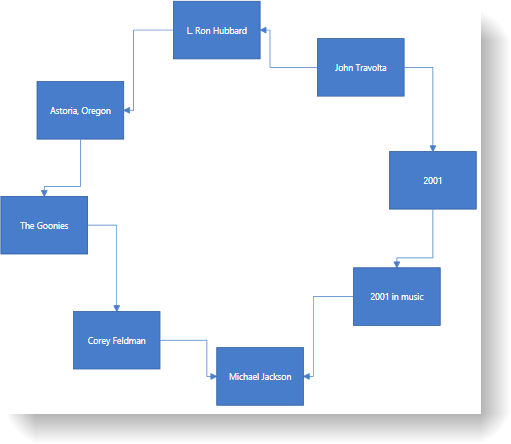

////

|metadata|
{
    "name": "xamdiagram-binding-to-nodes-and-connections-data-with-references",
    "tags": ["Charting","Data Binding","Data Presentation","How Do I"],
    "controlName": ["xamDiagram"],
    "guid": "f312a948-ee67-4468-ae24-1828b7904ecd",  
    "buildFlags": [],
    "createdOn": "2014-06-25T10:57:16.9850344Z"
}
|metadata|
////

= Binding to Nodes and Connections Data with References (xamDiagram)

== Topic Overview

=== Purpose

This topic provides a step by step guidance on how to bind the  _xamDiagram_™ control to data where input data objects represent nodes and connections and each of the connection objects has a reference to two node objects representing its start and end nodes.

=== Required background

The following topics are prerequisites to understanding this topic:

[options="header", cols="a,a"]
|====
|Topic|Purpose

| link:xamdiagram-binding-to-data.html[Binding _xamDiagram_ to Data]
|This topic provides an overview of the data binding scenarios supported by the _xamDiagram_ control.

|====

=== In this topic

* <<_Ref391057685, Binding to Nodes and Connections Data with References >>

** <<_Ref391057687,Introduction>>
** <<_Preview,Preview>>
** <<_Prerequisites,Prerequisites>>
** <<_Overview,Overview>>
** <<_Ref391057695,Steps>>
** <<_Ref382317785,Full code>>

* <<_Ref391057700, Related Content >>

** <<_Ref391057704,Topics>>
** <<_Ref391057708,Samples>>

[[_Ref391057685]]
== Binding to Nodes and Connections Data with References

[[_Ref391057687]]

=== Introduction

The following procedure demonstrates how to bind the  _xamDiagram_   to data objects that represent nodes and connections, and each of the connection objects has a reference to two node objects representing its start and end nodes.

[[_Preview]]

=== Preview

The following screenshot is a preview of the result.

[[_Prerequisites]]

=== Prerequisites

To complete the procedure, you need the following:

* A WPF application with an empty  _xamDiagram_   added to a page
* The link:{ApiPlatform}controls.charts.xamdiagram{ApiVersion}~infragistics.controls.charts.xamdiagram~layout.html[Layout] property of the  _xamDiagram_   set to an instance of the link:{ApiPlatform}controls.charts.xamdiagram{ApiVersion}~infragistics.controls.charts.forcedirectedgraphdiagramlayout_members.html[ForceDirectedGraphDiagramLayout]

[[_Overview]]

=== Overview

Following is a conceptual overview of the process:

*1. Setting the*   *ItemsSource*   * and ConnectionSource*

*2. Creating the node definitions*

*3. Creating the connection definitions*

[[_Ref391057695]]

=== Steps

The following steps demonstrate how to bind the  _xamDiagram_   to hierarchical node data with references.

=== 1. Set the ItemsSource

*1. Add the sample node data class*

Add the following `WikipediaArticle` class to the code behind. The `WikipediaArticle` represents the node object and has a single string property called `Title`.

[source, CS]
---- 
public class WikipediaArticle : INotifyPropertyChanged
{
public WikipediaArticle(string title)
{
Title = title;
}
private string _title;
public string Title
{
get { return _title; }
set
{
_title = value;
OnPropertyChanged();
}
}
public event PropertyChangedEventHandler PropertyChanged;
protected void OnPropertyChanged([CallerMemberName] string propertyName = "")
{
if (PropertyChanged != null)
PropertyChanged(this, new PropertyChangedEventArgs(propertyName));
}
}
----

 

[source, VB]
---- 
Public Class WikipediaArticle Implements INotifyPropertyChanged
Public Sub New(title__1 As String)
Title = title__1
End Sub
Private _title As String
Public Property Title() As String
Get
Return _title
End Get
Set(value As String)
_title = value
OnPropertyChanged()
End Set
End Property
Public Event PropertyChanged As PropertyChangedEventHandler Implements INotifyPropertyChanged.PropertyChanged
Protected Sub OnPropertyChanged(Optional propertyName As String = "")
RaiseEvent PropertyChanged(Me, New PropertyChangedEventArgs(propertyName))
End Sub
End Class
----

*2. Add the sample connection class*

Add the following `WikipediaLink` class to the code behind. The `WikipediaLink` class represents a directed connection between two `WikipediaArticle` instances.

[source, CS]
---- 
public class WikipediaLink : INotifyPropertyChanged
{
public WikipediaLink(WikipediaArticle fromArticle, WikipediaArticle toArticle)
{
FromArticle = fromArticle;
ToArticle = toArticle;
}
private WikipediaArticle _from;
public WikipediaArticle FromArticle
{
get { return _from; }
set
{
_from = value;
OnPropertyChanged();
}
}
private WikipediaArticle _to;
public WikipediaArticle ToArticle
{
get { return _to; }
set
{
_to = value;
OnPropertyChanged();
}
}
public override string ToString()
{
return string.Empty;
}
public event PropertyChangedEventHandler PropertyChanged;
protected void OnPropertyChanged([CallerMemberName] string propertyName = "")
{
if (PropertyChanged != null)
PropertyChanged(this, new PropertyChangedEventArgs(propertyName));
}
}
----

 

[source, VB]
---- 
Public Class WikipediaLink
Implements INotifyPropertyChanged
Public Sub New(fromArticle__1 As WikipediaArticle, toArticle__2 As WikipediaArticle)
FromArticle = fromArticle__1
ToArticle = toArticle__2
End Sub
Private _from As WikipediaArticle
Public Property FromArticle() As WikipediaArticle
Get
Return _from
End Get
Set
_from = value
OnPropertyChanged()
End Set
End Property
Private _to As WikipediaArticle
Public Property ToArticle() As WikipediaArticle
Get
Return _to
End Get
Set
_to = value
OnPropertyChanged()
End Set
End Property
Public Overrides Function ToString() As String
Return String.Empty
End Function
Public Event PropertyChanged As PropertyChangedEventHandler
Protected Sub OnPropertyChanged( Optional propertyName As String = "")
RaiseEvent PropertyChanged(Me, New PropertyChangedEventArgs(propertyName))
End Sub
End Class
----

*3. Add the data items*

Add the following `LinkChainViewModel` class which exposes two list properties – for nodes and for connections and is automatically populated with some sample data.

[source,CS]
---- 
public class LinkChainViewModel : INotifyPropertyChanged
{
public LinkChainViewModel()
{
var travolta = new WikipediaArticle("John Travolta");
var hubbard = new WikipediaArticle("L. Ron Hubbard");
var astoria = new WikipediaArticle("Astoria, Oregon");
var goonies = new WikipediaArticle("The Goonies");
var feldman = new WikipediaArticle("Corey Feldman");
var jackson = new WikipediaArticle("Michael Jackson");
var year2001 = new WikipediaArticle("2001");
var year2001music = new WikipediaArticle("2001 in music");
Articles = new ObservableCollection<WikipediaArticle>()
{
travolta,
hubbard,
astoria,
goonies,
feldman,
jackson,
year2001,
year2001music
};
Links = new ObservableCollection<WikipediaLink>()
{
new WikipediaLink(travolta, hubbard),
new WikipediaLink(hubbard, astoria),
new WikipediaLink(astoria, goonies),
new WikipediaLink(goonies, feldman),
new WikipediaLink(feldman, jackson),
new WikipediaLink(travolta, year2001),
new WikipediaLink(year2001, year2001music),
new WikipediaLink(year2001music, jackson)
};
}
private IList<WikipediaArticle> _articles;
public IList<WikipediaArticle> Articles
{
get { return _articles; }
set
{
_articles = value;
OnPropertyChanged();
}
}
private IList<WikipediaLink> _links;
public IList<WikipediaLink> Links
{
get { return _links; }
set
{
_links = value;
OnPropertyChanged();
}
}
public event PropertyChangedEventHandler PropertyChanged;
protected void OnPropertyChanged([CallerMemberName] string propertyName = "")
{
if (PropertyChanged != null)
PropertyChanged(this, new PropertyChangedEventArgs(propertyName));
}
}
----

  

[source, VB]
---- 
Public Class LinkChainViewModel
Implements INotifyPropertyChanged
Public Sub New()
Dim travolta = New WikipediaArticle("John Travolta")
Dim hubbard = New WikipediaArticle("L. Ron Hubbard")
Dim astoria = New WikipediaArticle("Astoria, Oregon")
Dim goonies = New WikipediaArticle("The Goonies")
Dim feldman = New WikipediaArticle("Corey Feldman")
Dim jackson = New WikipediaArticle("Michael Jackson")
Dim year2001 = New WikipediaArticle("2001")
Dim year2001music = New WikipediaArticle("2001 in music")
Articles = New ObservableCollection(Of WikipediaArticle)() From { _
travolta, _
hubbard, _
astoria, _
goonies, _
feldman, _
jackson, _
year2001, _
year2001music _
}
Links = New ObservableCollection(Of WikipediaLink)() From { _
New WikipediaLink(travolta, hubbard), _
New WikipediaLink(hubbard, astoria), _
New WikipediaLink(astoria, goonies), _
New WikipediaLink(goonies, feldman), _
New WikipediaLink(feldman, jackson), _
New WikipediaLink(travolta, year2001), _
New WikipediaLink(year2001, year2001music), _
New WikipediaLink(year2001music, jackson) _
}
End Sub
Private _articles As IList(Of WikipediaArticle)
Public Property Articles() As IList(Of WikipediaArticle)
Get
Return _articles
End Get
Set(value As IList(Of WikipediaArticle))
_articles = value
OnPropertyChanged()
End Set
End Property
Private _links As IList(Of WikipediaLink)
Public Property Links() As IList(Of WikipediaLink)
Get
Return _links
End Get
Set(value As IList(Of WikipediaLink))
_links = value
OnPropertyChanged()
End Set
End Property
Public Event PropertyChanged As PropertyChangedEventHandler Implements INotifyPropertyChanged.PropertyChanged
Protected Sub OnPropertyChanged(Optional propertyName As String = "")
RaiseEvent PropertyChanged(Me, New PropertyChangedEventArgs(propertyName))
End Sub
End Class
----

*4. Set the DataContext*   *of the XamDiagram*

Set the diagram’s `DataContext` property to an instance of the `LinkChainViewModel` class.

*In XAML:*

[source,XAML]
---- 
<ig:XamDiagram>
<ig:XamDiagram.DataContext>
<local:LinkChainViewModel/>
</ig:XamDiagram.DataContext>
</ig:XamDiagram>
----

  *5. Set the ItemsSource*   *property* 

Bind the link:{ApiPlatform}controls.charts.xamdiagram{ApiVersion}~infragistics.controls.charts.xamdiagram~itemssource.html[ItemsSource] to the `Articles` property of the `LinkChainViewModel` data context.

*In XAML:*

[source,XAML]
---- 
ItemsSource="{Binding Articles}"
----

  *6. Set the ConnectionsSource*   *property* 

Bind the link:{ApiPlatform}controls.charts.xamdiagram{ApiVersion}~infragistics.controls.charts.xamdiagram~connectionssource.html[ConnectionsSource] to the `Links` property of the `LinkChainViewModel` data context.

*In XAML:*

[source,XAML]
---- 
ConnectionsSource="{Binding Links}"
----

=== 2. Create the node definitions

For each of the data types in the link:{ApiPlatform}controls.charts.xamdiagram{ApiVersion}~infragistics.controls.charts.xamdiagram~itemssource.html[ItemsSource] a link:{ApiPlatform}controls.charts.xamdiagram{ApiVersion}~infragistics.controls.charts.nodedefinition_members.html[NodeDefinition] is usually added to the  _xamDiagram_  . Specify the most concrete types first if one or more types are in an inheritance relationship. The  _xamDiagram_   tries to match the type of each of the data items in the link:{ApiPlatform}controls.charts.xamdiagram{ApiVersion}~infragistics.controls.charts.nodedefinition~targettype.html[TargetType] of a node definition. The first node definition whose link:{ApiPlatform}controls.charts.xamdiagram{ApiVersion}~infragistics.controls.charts.nodedefinition~targettype.html[TargetType] returns true from a call to `IsAssignableFrom` is selected. That is if the link:{ApiPlatform}controls.charts.xamdiagram{ApiVersion}~infragistics.controls.charts.nodedefinition~targettype.html[TargetType] of the node definition matches exactly, or is a parent type of the data item’s type; otherwise, the node definition is selected.

*1. Create a NodeDefinition for the Manager class*

*2. Set the link:{ApiPlatform}controls.charts.xamdiagram{ApiVersion}~infragistics.controls.charts.nodedefinition~targettype.html[TargetType] of the link:{ApiPlatform}controls.charts.xamdiagram{ApiVersion}~infragistics.controls.charts.nodedefinition_members.html[NodeDefinition] to the `WikipediaArticle` type.*

*3. Set the link:{ApiPlatform}controls.charts.xamdiagram{ApiVersion}~infragistics.controls.charts.nodedefinition~displaymemberpath.html[DisplayMemberPath]*

Set the link:{ApiPlatform}controls.charts.xamdiagram{ApiVersion}~infragistics.controls.charts.nodedefinition~displaymemberpath.html[DisplayMemberPath] to  _Title_  . Not specifying a link:{ApiPlatform}controls.charts.xamdiagram{ApiVersion}~infragistics.controls.charts.nodedefinition~displaymemberpath.html[DisplayMemberPath], and not setting a custom link:{ApiPlatform}controls.charts.xamdiagram{ApiVersion}~infragistics.controls.charts.diagramitem~displaytemplate.html[DisplayTemplate] via the link:{ApiPlatform}controls.charts.xamdiagram{ApiVersion}~infragistics.controls.charts.nodedefinition~nodestyle.html[NodeStyle], results in the `ToString` method displayed as the nodes’ content.

*4. Set the link:{ApiPlatform}controls.charts.xamdiagram{ApiVersion}~infragistics.controls.charts.nodedefinition~nodestyle.html[NodeStyle] (optional)*

Using the link:{ApiPlatform}controls.charts.xamdiagram{ApiVersion}~infragistics.controls.charts.nodedefinition~nodestyle.html[NodeStyle] property you can set the style to be applied to all `DiagramNode` objects matched by the node definition. This gives you the opportunity to easily customize the nodes created for a certain data type.

*In XAML:*

[source,XAML]
---- 
<ig:XamDiagram.NodeDefinitions>
<ig:NodeDefinition
TargetType="local:WikipediaArticle"
DisplayMemberPath="Title"/>
</ig:XamDiagram.NodeDefinitions>
----

=== 3. Create the connection definitions.

When supplying separate connection data objects, use an instance of link:{ApiPlatform}controls.charts.xamdiagram{ApiVersion}~infragistics.controls.charts.connectionsourcedefinition_members.html[ConnectionSourceDefinition] in the diagram’s link:{ApiPlatform}controls.charts.xamdiagram{ApiVersion}~infragistics.controls.charts.xamdiagram~connectiondefinitions.html[ConnectionDefinitions]. This type of connection definition describes what connection to create for each data items matching the definition’s link:{ApiPlatform}controls.charts.xamdiagram{ApiVersion}~infragistics.controls.charts.nodedefinition~targettype.html[TargetType]. In order for such a connection to have its link:{ApiPlatform}controls.charts.xamdiagram{ApiVersion}~infragistics.controls.charts.diagramconnection~startnode.html[StartNode] and link:{ApiPlatform}controls.charts.xamdiagram{ApiVersion}~infragistics.controls.charts.diagramconnection~endnode.html[EndNode] properties correctly populated, the connection definition’s link:{ApiPlatform}controls.charts.xamdiagram{ApiVersion}~infragistics.controls.charts.connectionsourcedefinition~startnodememberpath.html[StartNodeMemberPath] and link:{ApiPlatform}controls.charts.xamdiagram{ApiVersion}~infragistics.controls.charts.connectionsourcedefinition~endnodememberpath.html[EndNodeMemberPath] properties must be set to the names of the properties holding the start/end node data object references. 

*1. Create a connection definition* 

Create a link:{ApiPlatform}controls.charts.xamdiagram{ApiVersion}~infragistics.controls.charts.connectionsourcedefinition_members.html[ConnectionSourceDefinition] and add it to the link:{ApiPlatform}controls.charts.xamdiagram{ApiVersion}~infragistics.controls.charts.xamdiagram~connectiondefinitions.html[ConnectionDefinitions] collection.

[start=2]
*2. Set the link:{ApiPlatform}controls.charts.xamdiagram{ApiVersion}~infragistics.controls.charts.nodedefinition~targettype.html[TargetType]*

Set the link:{ApiPlatform}controls.charts.xamdiagram{ApiVersion}~infragistics.controls.charts.nodedefinition~targettype.html[TargetType] to the `WikipediaLink` type. 

[start=3]
*3. Set the start/end node member paths*

Set the link:{ApiPlatform}controls.charts.xamdiagram{ApiVersion}~infragistics.controls.charts.connectionsourcedefinition~startnodememberpath.html[StartNodeMemberPath] to “ _FromArticle_   _”_  . Set the link:{ApiPlatform}controls.charts.xamdiagram{ApiVersion}~infragistics.controls.charts.connectionsourcedefinition~endnodememberpath.html[EndNodeMemberPath] to  _”_   _ToArticle_   _”_  .

[start=4]
*4. Set the link:{ApiPlatform}controls.charts.xamdiagram{ApiVersion}~infragistics.controls.charts.connectiondefinitionbase~connectionstyle.html[ConnectionStyle]  _(optional)_*

You can customize the connections created for a particular data type by setting the link:{ApiPlatform}controls.charts.xamdiagram{ApiVersion}~infragistics.controls.charts.connectiondefinitionbase~connectionstyle.html[ConnectionStyle] property to a style targeting link:{ApiPlatform}controls.charts.xamdiagram{ApiVersion}~infragistics.controls.charts.diagramconnection_members.html[DiagramConnection]. You can specify a setting for the link:{ApiPlatform}controls.charts.xamdiagram{ApiVersion}~infragistics.controls.charts.diagramitem~displaytemplate.html[DisplayTemplate] property and apply a template where the data object will be set as the `DataContext`.

*In XAML:*

[source,XAML]
---- 
<ig:XamDiagram.ConnectionDefinitions>
<ig:ConnectionSourceDefinition
TargetType="local:WikipediaLink"
StartNodeMemberPath="FromArticle"
EndNodeMemberPath="ToArticle"/>
</ig:XamDiagram.ConnectionDefinitions>
----

[[_Ref382317785]]

=== Full code

Following is the full code for this procedure.

*In XAML:*

[source, XAML]
---- 
<UserControl x:Class="DiagramDocumentationSamples.NodesConnectionsReferencesData"
xmlns="http://schemas.microsoft.com/winfx/2006/xaml/presentation"
xmlns:x="http://schemas.microsoft.com/winfx/2006/xaml"
xmlns:mc="http://schemas.openxmlformats.org/markup-compatibility/2006"
xmlns:d="http://schemas.microsoft.com/expression/blend/2008"
xmlns:ig="http://schemas.infragistics.com/xaml"
xmlns:local="clr-namespace:DiagramDocumentationSamples"
mc:Ignorable="d"
d:DesignHeight="300" d:DesignWidth="300">
<ig:XamDiagram
x:Name="FlatDataDiagram"
ItemsSource="{Binding Articles}"
ConnectionsSource="{Binding Links}">
<ig:XamDiagram.DataContext>
<local:LinkChainViewModel/>
</ig:XamDiagram.DataContext>
<ig:XamDiagram.NodeDefinitions>
<ig:NodeDefinition
TargetType="local:WikipediaArticle"
DisplayMemberPath="Title"/>
</ig:XamDiagram.NodeDefinitions>
<ig:XamDiagram.ConnectionDefinitions>
<ig:ConnectionSourceDefinition
TargetType="local:WikipediaLink"
StartNodeMemberPath="FromArticle"
EndNodeMemberPath="ToArticle"/>
</ig:XamDiagram.ConnectionDefinitions>
<ig:XamDiagram.Layout>
<ig:ForceDirectedGraphDiagramLayout/>
</ig:XamDiagram.Layout>
</ig:XamDiagram>
</UserControl>
----

*In C#:*

[source, CS]
---- 
using System.Collections.Generic;
using System.Collections.ObjectModel;
using System.ComponentModel;
using System.Runtime.CompilerServices;
using System.Windows.Controls;
namespace DiagramDocumentationSamples
{
public partial class NodesConnectionsReferencesData : UserControl
{
public NodesConnectionsReferencesData()
{
InitializeComponent();
}
}
public class WikipediaArticle : INotifyPropertyChanged
{
public WikipediaArticle(string title)
{
Title = title;
}
private string _title;
public string Title
{
get { return _title; }
set
{
_title = value;
OnPropertyChanged();
}
}
public event PropertyChangedEventHandler PropertyChanged;
protected void OnPropertyChanged([CallerMemberName] string propertyName = "")
{
if (PropertyChanged != null)
PropertyChanged(this, new PropertyChangedEventArgs(propertyName));
}
}
public class WikipediaLink : INotifyPropertyChanged
{
public WikipediaLink(WikipediaArticle fromArticle, WikipediaArticle toArticle)
{
FromArticle = fromArticle;
ToArticle = toArticle;
}
private WikipediaArticle _from;
public WikipediaArticle FromArticle
{
get { return _from; }
set
{
_from = value;
OnPropertyChanged();
}
}
private WikipediaArticle _to;
public WikipediaArticle ToArticle
{
get { return _to; }
set
{
_to = value;
OnPropertyChanged();
}
}
public override string ToString()
{
return string.Empty;
}
public event PropertyChangedEventHandler PropertyChanged;
protected void OnPropertyChanged([CallerMemberName] string propertyName = "")
{
if (PropertyChanged != null)
PropertyChanged(this, new PropertyChangedEventArgs(propertyName));
}
}
public class LinkChainViewModel : INotifyPropertyChanged
{
public LinkChainViewModel()
{
var travolta = new WikipediaArticle("John Travolta");
var hubbard = new WikipediaArticle("L. Ron Hubbard");
var astoria = new WikipediaArticle("Astoria, Oregon");
var goonies = new WikipediaArticle("The Goonies");
var feldman = new WikipediaArticle("Corey Feldman");
var jackson = new WikipediaArticle("Michael Jackson");
var year2001 = new WikipediaArticle("2001");
var year2001music = new WikipediaArticle("2001 in music");
Articles = new ObservableCollection<WikipediaArticle>()
{
travolta,
hubbard,
astoria,
goonies,
feldman,
jackson,
year2001,
year2001music
};
Links = new ObservableCollection<WikipediaLink>()
{
new WikipediaLink(travolta, hubbard),
new WikipediaLink(hubbard, astoria),
new WikipediaLink(astoria, goonies),
new WikipediaLink(goonies, feldman),
new WikipediaLink(feldman, jackson),
new WikipediaLink(travolta, year2001),
new WikipediaLink(year2001, year2001music),
new WikipediaLink(year2001music, jackson)
};
}
private IList<WikipediaArticle> _articles;
public IList<WikipediaArticle> Articles
{
get { return _articles; }
set
{
_articles = value;
OnPropertyChanged();
}
}
private IList<WikipediaLink> _links;
public IList<WikipediaLink> Links
{
get { return _links; }
set
{
_links = value;
OnPropertyChanged();
}
}
public event PropertyChangedEventHandler PropertyChanged;
protected void OnPropertyChanged([CallerMemberName] string propertyName = "")
{
if (PropertyChanged != null)
PropertyChanged(this, new PropertyChangedEventArgs(propertyName));
}
}
}
----

*In VB:* 

[source, VB]
---- 
Imports System.Collections.Generic
Imports System.Collections.ObjectModel
Imports System.ComponentModel
Imports System.Runtime.CompilerServices
Imports System.Windows.Controls
Namespace DiagramDocumentationSamples
Public Partial Class NodesConnectionsReferencesData
Inherits UserControl
Public Sub New()
InitializeComponent()
End Sub
End Class
Public Class WikipediaArticle
Implements INotifyPropertyChanged
Public Sub New(title__1 As String)
Title = title__1
End Sub
Private _title As String
Public Property Title() As String
Get
Return _title
End Get
Set(value As String)
_title = value
OnPropertyChanged()
End Set
End Property
Public Event PropertyChanged As PropertyChangedEventHandler Implements INotifyPropertyChanged.PropertyChanged
Protected Sub OnPropertyChanged(Optional propertyName As String = "")
RaiseEvent PropertyChanged(Me, New PropertyChangedEventArgs(propertyName))
End Sub
End Class
Public Class WikipediaLink
Implements INotifyPropertyChanged
Public Sub New(fromArticle__1 As WikipediaArticle, toArticle__2 As WikipediaArticle)
FromArticle = fromArticle__1
ToArticle = toArticle__2
End Sub
Private _from As WikipediaArticle
Public Property FromArticle() As WikipediaArticle
Get
Return _from
End Get
Set(value As WikipediaArticle)
_from = value
OnPropertyChanged()
End Set
End Property
Private _to As WikipediaArticle
Public Property ToArticle() As WikipediaArticle
Get
Return _to
End Get
Set(value As WikipediaArticle)
_to = value
OnPropertyChanged()
End Set
End Property
Public Overrides Function ToString() As String
Return String.Empty
End Function
Public Event PropertyChanged As PropertyChangedEventHandler Implements INotifyPropertyChanged.PropertyChanged
Protected Sub OnPropertyChanged(Optional propertyName As String = "")
RaiseEvent PropertyChanged(Me, New PropertyChangedEventArgs(propertyName))
End Sub
End Class
Public Class LinkChainViewModel
Implements INotifyPropertyChanged
Public Sub New()
Dim travolta = New WikipediaArticle("John Travolta")
Dim hubbard = New WikipediaArticle("L. Ron Hubbard")
Dim astoria = New WikipediaArticle("Astoria, Oregon")
Dim goonies = New WikipediaArticle("The Goonies")
Dim feldman = New WikipediaArticle("Corey Feldman")
Dim jackson = New WikipediaArticle("Michael Jackson")
Dim year2001 = New WikipediaArticle("2001")
Dim year2001music = New WikipediaArticle("2001 in music")
Articles = New ObservableCollection(Of WikipediaArticle)() From { _
travolta, _
hubbard, _
astoria, _
goonies, _
feldman, _
jackson, _
year2001, _
year2001music _
}
Links = New ObservableCollection(Of WikipediaLink)() From { _
New WikipediaLink(travolta, hubbard), _
New WikipediaLink(hubbard, astoria), _
New WikipediaLink(astoria, goonies), _
New WikipediaLink(goonies, feldman), _
New WikipediaLink(feldman, jackson), _
New WikipediaLink(travolta, year2001), _
New WikipediaLink(year2001, year2001music), _
New WikipediaLink(year2001music, jackson) _
}
End Sub
Private _articles As IList(Of WikipediaArticle)
Public Property Articles() As IList(Of WikipediaArticle)
Get
Return _articles
End Get
Set(value As IList(Of WikipediaArticle))
_articles = value
OnPropertyChanged()
End Set
End Property
Private _links As IList(Of WikipediaLink)
Public Property Links() As IList(Of WikipediaLink)
Get
Return _links
End Get
Set(value As IList(Of WikipediaLink))
_links = value
OnPropertyChanged()
End Set
End Property
Public Event PropertyChanged As PropertyChangedEventHandler Implements INotifyPropertyChanged.PropertyChanged
Protected Sub OnPropertyChanged(Optional propertyName As String = "")
RaiseEvent PropertyChanged(Me, New PropertyChangedEventArgs(propertyName))
End Sub
End Class
End Namespace
----

[[_Ref391057700]]
== Related Content

[[_Ref391057704]]

=== Topics

The following topics provide additional information related to this topic.

[options="header", cols="a,a"]
|====
|Topic|Purpose

| link:xamdiagram-binding-to-nodes-and-connections-data-with-keys.html[Binding to Nodes and Connections Data with Keys ( _xamDiagram_ )]
|This topic provides a step by step guidance on how to bind the _xamDiagram_ control to data where input data objects represent nodes and connections. Each of the node objects has a unique string identifier and each of the connection objects has two properties holding the identifiers of the two node objects representing its start and end nodes.

| link:xamdiagram-binding-to-hierarchical-node-data-with-references.html[Binding to Hierarchical Node Data with References ( _xamDiagram_ )]
|This topic provides a step by step guidance on how to bind the xamDiagram control to hierarchical node data.

| link:xamdiagram-binding-to-hierarchical-node-data-with-keys.html[Binding to Hierarchical Node Data with Keys ( _xamDiagram_ )]
|This topic provides a step by step guidance on how to bind the _xamDiagram_ control to hierarchical node data with keys.

|====

[[_Ref391057708]]

=== Samples

The following sample provides additional information related to this topic.

[options="header", cols="a,a"]
|====
|Sample|Purpose

| link:{SamplesURL}/diagram/binding-nodes-and-connections-with-objects[Binding Nodes and Connections with Objects]
|The following sample demonstrates how to bind the _xamDiagram_ to data objects that represent nodes and connections, and each of the connection objects has a reference to two node objects representing its start and end nodes.

|====