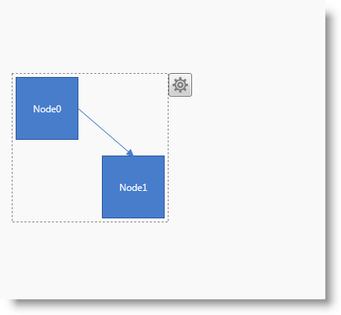
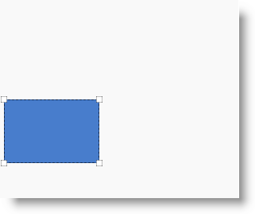

////

|metadata|
{
    "name": "xamdiagram-configuring-selection",
    "tags": ["Charting","How Do I","Selection"],
    "controlName": ["xamDiagram"],
    "guid": "546f8907-dd3c-49b9-b203-a1b85f08c276",  
    "buildFlags": [],
    "createdOn": "2014-06-16T09:40:45.6562673Z"
}
|metadata|
////

= Configuring Selection (xamDiagram)

== Topic Overview

=== Purpose

This topic explains how to enable/disable the selection of multiple diagram items in the  _xamDiagram_™ control and how to perform selection programmatically.

=== Required background

The following topics are prerequisites to understanding this topic:

[options="header", cols="a,a"]
|====
|Topic|Purpose

| link:xamdiagram-general-overview.html[General Overview ( _xamDiagram_ )]
|This topic provides a conceptual overview of the _xamDiagram_ control and its main features and capabilities.

| link:xamdiagram-adding-to-a-page.html[Adding _xamDiagram_ to a Page]
|This topic explains how to add the _xamDiagram_ control to a {PlatformName} application.

|====

=== In this topic

This topic contains the following sections:

*  *<<_Ref389311954,Introduction>>*

** <<_Ref386534590,Diagram items selection configuration summary>>
** <<_DiagramItemsSelectionConfigurationSummaryChart,Diagram items selection configuration summary chart>>

*  *<<_Ref388956251,Configuring the Selection Mode>>*

** <<_Ref385408401,Overview>>
** <<_DiagramItemsSelectionInteractionsRefChart,Diagram items selection interactions reference chart>>
** <<_PropertySettings,Property settings>>

*  *<<_Ref389311986,Selecting/De-Selecting Items Programmatically>>*

** <<_Ref389311991,Overview>>
** <<_Ref389311996,Property settings>>
** <<_Ref389312001,Example>>

*  *<<_Ref385408430,Related Content>>*

** <<_Ref385408435,Topics>>
** <<_Ref385408439,Samples>>

[[_Ref389311954]]
== Introduction

[[_Ref386534590]]

=== Diagram items selection configuration summary

The  _xamDiagram_   control provides functionality enabling the programmatic select of diagram items located on its space. There are several types of selection functionality available - single, multiple, and none, which all can be configured through a property setting. By default, multiple diagram items selection is enabled.

It is possible to select a diagram item either by clicking the left mouse button or drawing a selection rectangle holding the left mouse button down while moving the mouse across the diagram space until all desired diagram items fall within the boundaries of the dash-bordered selection rectangle and then releasing the mouse left button. (For more details see link:xamdiagram-user-interactions-configuration-overview.html#_Ref391566819[Diagram Items Interactions and Usability].)

Selecting diagram items in the context of the diagram control is useful in visually highlighting an item or a group of items (enclosing the item(s) within a dash-bordered rectangle) when rendering and/or configuring it. This could be achieved using either the options pane or via code. Configure the diagram items selection behavior by setting the  _xamDiagram_   control’s link:{ApiPlatform}controls.charts.xamdiagram{ApiVersion}~infragistics.controls.charts.xamdiagram~selectionmode.html[SelectionMode] property to the specific type of selection desired. By default, multiple elements selection is the property default setting (`SelectionMode="Multiple"`).

It is possible to programmatically change the selection state of a diagram item using the property setting ( link:{ApiPlatform}controls.charts.xamdiagram{ApiVersion}~infragistics.controls.charts.diagramitem~isselected.html[DiagramItem.IsSelected]), implemented separately from the user interaction selection functionality.

The selection of the diagram items populates the link:{ApiPlatform}controls.charts.xamdiagram{ApiVersion}~infragistics.controls.charts.xamdiagram~selecteditems.html[SelectedItems] collection and fires the link:{ApiPlatform}controls.charts.xamdiagram{ApiVersion}~infragistics.controls.charts.xamdiagram~selectionchanged_ev.html[SelectionChanged] event each time this collection changes, allowing for the application of custom logic to its members such as programmatically adding/removing diagram items, etc. When data binding is used, the link:{ApiPlatform}controls.charts.xamdiagram{ApiVersion}~infragistics.controls.charts.xamdiagram~selecteddataitems.html[SelectedDataItems] collection is kept in sync with the link:{ApiPlatform}controls.charts.xamdiagram{ApiVersion}~infragistics.controls.charts.xamdiagram~selecteditems.html[SelectedItems] and contains the data items corresponding to the selected diagram items.

[[_DiagramItemsSelectionConfigurationSummaryChart]]

=== Diagram items selection configuration summary chart

The following table briefly explains the configurable aspects of diagram items selection and maps them to the properties that configure them.

[options="header", cols="a,a,a"]
|====
|Configurable aspect|Details|Properties

|[[_Hlk356484826]] 

Selection mode
|The method by which diagram items are selected at a time
| link:{ApiPlatform}controls.charts.xamdiagram{ApiVersion}~infragistics.controls.charts.xamdiagram~selectionmode.html[SelectionMode]

|====

[[_Ref388552386]]
[[_Ref388956251]]
== Configuring the Selection Mode

[[_Ref385408401]]

=== Overview

To specify how many diagram items can be included in a selection on the diagram space, configure the control’s selection mode. The default setting enables multiple diagram items selection on the diagram, so to limit the number of items to one, set the value of the `SelectionMode` property to  _“Single”_  ; alternately set it to  _“None”_   to disable selection.

[[_DiagramItemsSelectionInteractionsRefChart]]

=== Diagram items selection interactions reference chart

The following table summarizes the user interaction capabilities of the  _xamDiagram_   control with respect to the link:{ApiPlatform}controls.charts.xamdiagram{ApiVersion}~infragistics.controls.charts.xamdiagram~selectionmode.html[SelectionMode] property setting.

[options="header", cols="a,a,a"]
|====
|For the user to…|Using…|The `SelectionMode` property must be set to:

|Select a single item on the diagram space
|
* Mouse click 

* Selection rectangle 

|“Single”

|Select multiple diagram items
|
* Pressing and holding Shift/Ctrl + clicking on the element to be included in the selection 

* Selection rectangle 

|_“Multiple”_

|Clear the entire current selection
|Mouse click on the diagram surface outside the selection rectangle
|
* _“Single”_ 

* _“Multiple”_ 

|Include/Exclude specific diagram items to/from multiple selection
|Pressing and holding Shift/Ctrl + clicking on the element to be included/excluded
|_“Multiple”_

|====

[[_PropertySettings]]

=== Property settings

The following table maps the desired configuration to the property settings that manage it.

[options="header", cols="a,a,a"]
|====
|In order to:|Use this property:|And set it to:

|Configure single item containing selection capability on the diagram space
| link:{ApiPlatform}controls.charts.xamdiagram{ApiVersion}~infragistics.controls.charts.xamdiagram~selectionmode.html[SelectionMode]
|_“Single”_

|Configure multiple items containing capability on the diagram space
| link:{ApiPlatform}controls.charts.xamdiagram{ApiVersion}~infragistics.controls.charts.xamdiagram~selectionmode.html[SelectionMode]
| _“Multiple”_ 

|Disable the selection of items on the diagram space
| link:{ApiPlatform}controls.charts.xamdiagram{ApiVersion}~infragistics.controls.charts.xamdiagram~selectionmode.html[SelectionMode]
| _“None”_ 

|====

[[_Ref389311986]]
== Selecting/De-Selecting Items Programmatically

[[_Ref389311991]]

=== Overview

The  _xamDiagram_   control allows you to select and de-select items programmatically. You select or de-select an item by configuring its selection state as determined by the value of the link:{ApiPlatform}controls.charts.xamdiagram{ApiVersion}~infragistics.controls.charts.diagramitem~isselected.html[IsSelected] property.

[[_Ref389311996]]

=== Property settings

The following table maps the desired configuration to the property settings that manage it.

[options="header", cols="a,a,a"]
|====
|In order to:|Use this property:|And set it to:

|Enable the item selection capability of the diagram
| link:{ApiPlatform}controls.charts.xamdiagram{ApiVersion}~infragistics.controls.charts.diagramitem~isselected.html[IsSelected]
| _“True”_ 

|Disable the item selection capability of the diagram
| link:{ApiPlatform}controls.charts.xamdiagram{ApiVersion}~infragistics.controls.charts.diagramitem~isselected.html[IsSelected]
| _“False”_ 

|====

[[_Ref389312001]]

=== Example

The screenshot below demonstrates node selection state configuration as a result of the following settings:

[options="header", cols="a,a"]
|====
|Property|Value

| link:{ApiPlatform}controls.charts.xamdiagram{ApiVersion}~infragistics.controls.charts.diagramitem~isselected.html[IsSelected]
| _“True”_ 

|====

Following is the code that implements this example.

*In XAML:*

[source,xaml]
----
<ig:XamDiagram x:Name="diagram"
               Width="300"
               Height="250"
               Background="#F9F9F9">
    <ig:DiagramNode x:Name="node0"
                    Position="5,125"
                    IsSelected=”True”/>
</ig:XamDiagram>
----

[[_Ref385408430]]
== Related Content

[[_Ref385408435]]

=== Topics

The following topics provide additional information related to this topic.

[options="header", cols="a,a"]
|====
|Topic|Purpose

| link:xamdiagram-user-interactions-configuration-overview.html[User Interactions Configuration Overview ( _xamDiagram_ )]
|This topic provides a summary of all user interaction tasks in the _xamDiagram_ control.

| link:xamdiagram-configuring-keyboard-shortcuts.html[Configuring Keyboard Shortcuts ( _xamDiagram_ )]
|This topic explains how to use the commands provided by the _xamDiagram_ control and how to change the keyboard shortcuts associated with the commands.

|====

[[_Ref385408439]]

=== Samples

The following samples provide additional information related to this topic.

[options="header", cols="a,a"]
|====
|Sample|Purpose

| link:{SamplesURL}/diagram/basic-configuration[Basic Configuration]
|This sample demonstrates creating a simple flowchart diagram using the _xamDiagram_ control.

|====