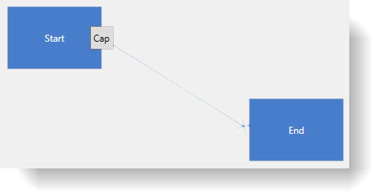

////

|metadata|
{
    "name": "xamdiagram-configuring-the-caps-of-diagram-connections",
    "tags": ["Charting","How Do I","Styling","Templating"],
    "controlName": ["xamDiagram"],
    "guid": "2ad692f0-7a68-4087-a81a-3bb43c5754f3",  
    "buildFlags": [],
    "createdOn": "2014-06-16T09:35:33.587159Z"
}
|metadata|
////

= Configuring the Caps of Diagram Connections (xamDiagram)

== Topic Overview

=== Purpose

This topic explains how to configure the caps of the diagram connections of the  _xamDiagram_™ control by either selecting a pre-defined cap or applying a custom cap.

=== Required background

The following topics are prerequisites to understanding this topic:

[options="header", cols="a,a"]
|====
|Topic|Purpose

| link:xamdiagram-general-overview.html[General Overview ( _xamDiagram_ )]
|This topic provides a conceptual overview of the _xamDiagram_ control and its main features and capabilities.

| link:xamdiagram-adding-to-a-page.html[Adding _xamDiagram_ to a Page]
|This topic explains how to add the _xamDiagram_ control to a WPF application.

| link:xamdiagram-configuring-the-start-and-end-of-diagram-connections.html[Configuring the Start and End of Diagram Connections ( _xamDiagram_ )]
|This topic covers the two possible approaches to configuring the start and end points of diagram connections in _xamDiagram_ : by specifying the nodes to connect to or by specifying the coordinates of the connection’s start and end points on the diagram space.

| link:xamdiagram-configuring-the-connection-points-of-diagram-nodes.html[Configuring the Connection Points of Diagram Nodes ( _xamDiagram_ )]
|This topic explains how to configure the connection points of diagram nodes in the _xamDiagram_ control. This would be necessary if you use custom nodes or need to customize the pre-set connection points of the standard nodes.

|====

=== In this topic

This topic contains the following sections:

* <<_Ref386477912, Introduction >>

** <<_Ref386477960,Diagram connections caps configuration summary>>
** <<_Ref387492519,Pre-defined connections caps configuration summary chart>>
** <<_CustomConnectionsCapsConfigSummaryChart,Custom connections caps configuration summary chart>>

* <<_Ref386478000, Configuring a Pre-Defined Connection Cap >>

** <<_Ref386478019,Overview>>
** <<_PropertySettings,Property settings>>
** <<_Ref386478040,Example>>

* <<_Ref386478056, Configuring a Custom Connection Cap >>

** <<_Ref386478065,Overview>>
** <<_Ref386478080,Property settings>>
** <<_Ref386478085,Example>>

* <<_Ref386478097, Related Content >>

** <<_Ref386478106,Topics>>
** <<_Ref386478113,Samples>>

[[_Ref386477912]]
== Introduction

[[_Ref386477960]]

=== Diagram connections caps configuration summary

The caps of a diagram connection are the shapes that indicate its start and end. By default the start of a connection has no cap and its end is a filled arrow cap.

The  _xamDiagram_   provides a number of pre-defined shapes for the caps. (See the link:xamdiagram-visual-elements-overview.html[Visual Elements Overview ( _xamDiagram)_ ] topic for details.) A pre-defined cap is selected through the link:{ApiPlatform}controls.charts.xamdiagram.v{ProductVersion}~infragistics.controls.charts.diagramconnection~startcaptype.html[StartCapType]/ link:{ApiPlatform}controls.charts.xamdiagram.v{ProductVersion}~infragistics.controls.charts.diagramconnection~endcaptype.html[EndCapType] properties. These properties accept as a value the respective cap shapes available as a link:{ApiPlatform}controls.charts.xamdiagram.v{ProductVersion}~infragistics.controls.charts.diagramconnectioncaptype.html[DiagramConnectionCapType] enumeration. When using one of the pre-defined cap types, you can additionally specify the cap size through the link:{ApiPlatform}controls.charts.xamdiagram.v{ProductVersion}~infragistics.controls.charts.diagramconnection~startcapsize.html[StartCapSize]/ link:{ApiPlatform}controls.charts.xamdiagram.v{ProductVersion}~infragistics.controls.charts.diagramconnection~endcapsize.html[EndCapSize] properties.

If you need entirely custom caps, a custom `Style` with target type of link:{ApiPlatform}controls.charts.xamdiagram.v{ProductVersion}~infragistics.controls.charts.diagramconnectioncappresenter_members.html[DiagramConnectionCapPresenter] can be set to the link:{ApiPlatform}controls.charts.xamdiagram.v{ProductVersion}~infragistics.controls.charts.diagramconnection~startcapstyle.html[StartCapStyle]/ link:{ApiPlatform}controls.charts.xamdiagram.v{ProductVersion}~infragistics.controls.charts.diagramconnection~endcapstyle.html[EndCapStyle] properties. In this, style any custom `ControlTemplate` can be specified for achieving the desired look.

[[_Ref387492519]]

=== Pre-defined connections caps configuration summary chart

The following table maps the desired node shape to the property settings that manage it.

[options="header", cols="a,a,a"]
|====
|Configurable aspect|Details|Properties

|Cap type
|Specifies the shape of the cap.
|
* link:{ApiPlatform}controls.charts.xamdiagram.v{ProductVersion}~infragistics.controls.charts.diagramconnection~startcaptype.html[StartCapType] 

* link:{ApiPlatform}controls.charts.xamdiagram.v{ProductVersion}~infragistics.controls.charts.diagramconnection~endcaptype.html[EndCapType] 

|Cap size
|Specifies the size of the cap shape.
|
* link:{ApiPlatform}controls.charts.xamdiagram.v{ProductVersion}~infragistics.controls.charts.diagramconnection~startcapsize.html[StartCapSize] 

* link:{ApiPlatform}controls.charts.xamdiagram.v{ProductVersion}~infragistics.controls.charts.diagramconnection~endcapsize.html[EndCapSize] 

|Cap fill color (filled cap types only)
|Specifies the fill color of the cap shape
|
* link:{ApiPlatform}controls.charts.xamdiagram.v{ProductVersion}~infragistics.controls.charts.diagramitem~fill.html[Fill] 

|====

[[_CustomConnectionsCapsConfigSummaryChart]]

=== Custom connections caps configuration summary chart

The following table maps the desired connection cap configuration to the property settings that manage it. The aspects highlighted in green are available in detail in this help content.

[options="header", cols="a,a,a"]
|====
|Configurable aspect|Details|Properties

|Type and size
|Custom caps can be configured using a style a style.
|
* link:{ApiPlatform}controls.charts.xamdiagram.v{ProductVersion}~infragistics.controls.charts.diagramconnection~startcapstyle.html[StartCapStyle] 

* link:{ApiPlatform}controls.charts.xamdiagram.v{ProductVersion}~infragistics.controls.charts.diagramconnection~endcapstyle.html[EndCapStyle] 

|====

[[_Ref386478000]]
== Configuring a Pre-Defined Connection Cap

[[_Ref386478019]]

=== Overview

To set the desired cap shape for the diagram connection, specify the corresponding enum value as the value of the link:{ApiPlatform}controls.charts.xamdiagram.v{ProductVersion}~infragistics.controls.charts.diagramconnection~startcaptype.html[StartCapType]/ link:{ApiPlatform}controls.charts.xamdiagram.v{ProductVersion}~infragistics.controls.charts.diagramconnection~endcaptype.html[EndCapType] property. To change the size of the cap, set the link:{ApiPlatform}controls.charts.xamdiagram.v{ProductVersion}~infragistics.controls.charts.diagramconnection~startcapsize.html[StartCapSize]/ link:{ApiPlatform}controls.charts.xamdiagram.v{ProductVersion}~infragistics.controls.charts.diagramconnection~endcapsize.html[EndCapSize] property accordingly.

[[_PropertySettings]]

=== Property settings

The following table maps the desired configuration to the property settings that manage it.

[options="header", cols="a,a,a"]
|====
|In order to set the:|Use this property:|And set it to:

|Start cap shape
| link:{ApiPlatform}controls.charts.xamdiagram.v{ProductVersion}~infragistics.controls.charts.diagramconnection~startcaptype.html[StartCapType]
|The desired cap type from the ones available in the link:{ApiPlatform}controls.charts.xamdiagram.v{ProductVersion}~infragistics.controls.charts.diagramconnectioncaptype.html[DiagramConnectionCapType] enumeration

|End cap shape
| link:{ApiPlatform}controls.charts.xamdiagram.v{ProductVersion}~infragistics.controls.charts.diagramconnection~endcaptype.html[EndCapType]
|The desired cap type from the ones available in the `DiagramConnectionCapType` enumeration

|Size of the start cap
| link:{ApiPlatform}controls.charts.xamdiagram.v{ProductVersion}~infragistics.controls.charts.diagramconnection~startcapsize.html[StartCapSize]
|The desired size in pixels.

|Size of the end cap
| link:{ApiPlatform}controls.charts.xamdiagram.v{ProductVersion}~infragistics.controls.charts.diagramconnection~endcapsize.html[EndCapSize]
|The desired size in pixels.

|Fill color of the caps (filled caps only)
| link:{ApiPlatform}controls.charts.xamdiagram.v{ProductVersion}~infragistics.controls.charts.diagramitem~fill.html[Fill]
|The desired brush.

|====

[[_Ref386478040]]

=== Example

The screenshot below demonstrates how a  _xamDiagram_   with several connections with various link:{ApiPlatform}controls.charts.xamdiagram.v{ProductVersion}~infragistics.controls.charts.diagramconnection~endcaptype.html[EndCapType] and link:{ApiPlatform}controls.charts.xamdiagram.v{ProductVersion}~infragistics.controls.charts.diagramconnection~endcapsize.html[EndCapSize] settings would look as a result of the code listed after it (The link:{ApiPlatform}controls.charts.xamdiagram.v{ProductVersion}~infragistics.controls.charts.diagramconnection~startcaptype.html[StartCapType] and link:{ApiPlatform}controls.charts.xamdiagram.v{ProductVersion}~infragistics.controls.charts.diagramconnection~startcapsize.html[StartCapSize] properties are not set in the example for simplicity as they work in the same way):

Following is the code that implements this example.

*In XAML:*

[source,xaml]
----
<ig:XamDiagram >
      <ig:DiagramConnection StartPosition="20,0"   EndPosition="300,0"   EndCapSize="10,10" EndCapType="None" Content="None" />
      <ig:DiagramConnection StartPosition="20,20"  EndPosition="300,20"  EndCapSize="10,10" EndCapType="OpenArrow" Content="OpenArrow" />
      <ig:DiagramConnection StartPosition="20,40"  EndPosition="300,40"  EndCapSize="10,10" EndCapType="ClosedArrow" Content="ClosedArrow"  />
      <ig:DiagramConnection StartPosition="20,60"  EndPosition="300,60"  EndCapSize="10,10" EndCapType="FilledArrow" Content="FilledArrow" />
      <ig:DiagramConnection StartPosition="20,80"  EndPosition="300,80"  EndCapSize="10,10" EndCapType="IndentedClosedArrow" Content="IndentedClosedArrow"  />
      <ig:DiagramConnection StartPosition="20,100" EndPosition="300,100" EndCapSize="10,10" EndCapType="IndentedFilledArrow" Content="IndentedFilledArrow" />
      <ig:DiagramConnection StartPosition="20,120" EndPosition="300,120" EndCapSize="20,10" EndCapType="OpenDoubleArrow" Content="OpenDoubleArrow"  />
      <ig:DiagramConnection StartPosition="20,140" EndPosition="300,140" EndCapSize="20,10" EndCapType="ClosedDoubleArrow" Content="ClosedDoubleArrow" />
      <ig:DiagramConnection StartPosition="20,160" EndPosition="300,160" EndCapSize="20,10" EndCapType="FilledDoubleArrow" Content="FilledDoubleArrow"  />
      <ig:DiagramConnection StartPosition="20,180" EndPosition="300,180" EndCapSize="10,10" EndCapType="DimensionLine" Content="DimensionLine" />
      <ig:DiagramConnection StartPosition="20,200" EndPosition="300,200" EndCapSize="10,10" EndCapType="Dot" Content="Dot"  />
      <ig:DiagramConnection StartPosition="20,220" EndPosition="300,220" EndCapSize="10,10" EndCapType="FilledDot" Content="FilledDot" />
      <ig:DiagramConnection StartPosition="20,240" EndPosition="300,240" EndCapSize="10,10" EndCapType="Diamond" Content="Diamond"  />
      <ig:DiagramConnection StartPosition="20,260" EndPosition="300,260" EndCapSize="10,10" EndCapType="FilledDiamond" Content="FilledDiamond" />
      <ig:DiagramConnection StartPosition="20,280" EndPosition="300,280" EndCapSize="10,10" EndCapType="Square" Content="Square"  />
      <ig:DiagramConnection StartPosition="20,300" EndPosition="300,300" EndCapSize="10,10" EndCapType="FilledSquare" Content="FilledSquare" />
      <ig:DiagramConnection StartPosition="20,320" EndPosition="300,320" EndCapSize="10,10" EndCapType="ClosedNoDash" Content="ClosedNoDash"  />
      <ig:DiagramConnection StartPosition="20,340" EndPosition="300,340" EndCapSize="10,10" EndCapType="FilledNoDash" Content="FilledNoDash" />
      <ig:DiagramConnection StartPosition="20,360" EndPosition="300,360" EndCapSize="10,10" EndCapType="OpenOneDash" Content="OpenOneDash"  />
      <ig:DiagramConnection StartPosition="20,380" EndPosition="300,380" EndCapSize="20,10" EndCapType="OpenTwoDash" Content="OpenTwoDash" />
      <ig:DiagramConnection StartPosition="20,400" EndPosition="300,400" EndCapSize="20,10" EndCapType="OpenThreeDash" Content="OpenThreeDash"  />
      <ig:DiagramConnection StartPosition="20,420" EndPosition="300,420" EndCapSize="20,10" EndCapType="ClosedOneDash" Content="ClosedOneDash" />
      <ig:DiagramConnection StartPosition="20,440" EndPosition="300,440" EndCapSize="20,10" EndCapType="ClosedTwoDash" Content="ClosedTwoDash"  />
      <ig:DiagramConnection StartPosition="20,460" EndPosition="300,460" EndCapSize="20,10" EndCapType="ClosedThreeDash" Content="ClosedThreeDash" />
      <ig:DiagramConnection StartPosition="20,480" EndPosition="300,480" EndCapSize="20,10" EndCapType="FilledOneDash" Content="FilledOneDash"  />
      <ig:DiagramConnection StartPosition="20,500" EndPosition="300,500" EndCapSize="20,10" EndCapType="FilledTwoDash" Content="FilledTwoDash" />
      <ig:DiagramConnection StartPosition="20,520" EndPosition="300,520" EndCapSize="20,10" EndCapType="FilledThreeDash" Content="FilledThreeDash"  />
      <ig:DiagramConnection StartPosition="20,540" EndPosition="300,540" EndCapSize="10,10" EndCapType="Fork" Content="Fork" />
</ig:XamDiagram>
----

[[_Configuring_a_Custom]]
[[_Ref386478056]]
== Configuring a Custom Connection Cap

[[_Ref386478065]]

=== Overview

By setting the link:{ApiPlatform}controls.charts.xamdiagram.v{ProductVersion}~infragistics.controls.charts.diagramconnection~startcapstyle.html[StartCapStyle] and link:{ApiPlatform}controls.charts.xamdiagram.v{ProductVersion}~infragistics.controls.charts.diagramconnection~endcapstyle.html[EndCapStyle] properties to a custom style for link:{ApiPlatform}controls.charts.xamdiagram.v{ProductVersion}~infragistics.controls.charts.diagramconnectioncappresenter_members.html[DiagramConnectionCapPresenter] with custom `ControlTemplate`, almost any cap can be specified. In addition to this, the link:{ApiPlatform}controls.charts.xamdiagram.v{ProductVersion}~infragistics.controls.charts.diagramconnectioncappresenter_members.html[DiagramConnectionCapPresenter] exposes a set of additional properties for controlling the cap’s display. The following screenshot illustrates these properties relative to a node (1), connection point (2), and a custom cap (3):

[[_Ref386478080]]

=== Property settings

The following table maps the desired configuration to the property settings that manage it.

[options="header", cols="a,a,a"]
|====
|In order to:|Use this property:|And set it to:

|Apply a custom cap
|
* link:{ApiPlatform}controls.charts.xamdiagram.v{ProductVersion}~infragistics.controls.charts.diagramconnection~startcapstyle.html[DiagramConnection.StartCapStyle] 

* link:{ApiPlatform}controls.charts.xamdiagram.v{ProductVersion}~infragistics.controls.charts.diagramconnection~endcapstyle.html[DiagramConnection.EndCapStyle] 

|The desired style

|Set the offset of the custom cap from the point where the connection line ends. (The cap is placed along the connection line.)
|
* link:{ApiPlatform}controls.charts.xamdiagram.v{ProductVersion}~infragistics.controls.charts.diagramconnectioncappresenter~placementoffset.html[DiagramConnectionCapPresenter.PlacementOffset] 

|The desired offset in pixels

|Offset the point where the connection line ends from the expected end point (The new end point is located along the connection line.)
|
* link:{ApiPlatform}controls.charts.xamdiagram.v{ProductVersion}~infragistics.controls.charts.diagramconnectioncappresenter~lineoffset.html[DiagramConnectionCapPresenter.LineOffset] 

|The desired offset in pixels

|Allow rotating of the cap at the angle of the connection
|
* link:{ApiPlatform}controls.charts.xamdiagram.v{ProductVersion}~infragistics.controls.charts.diagramconnectioncappresenter~userotation.html[DiagramConnectionCapPresenter.UseRotation] 

| _“True”_ 

|Prevent (disallow) rotating of the cap at the angle of the connection
|
* link:{ApiPlatform}controls.charts.xamdiagram.v{ProductVersion}~infragistics.controls.charts.diagramconnectioncappresenter~userotation.html[DiagramConnectionCapPresenter.UseRotation] 

| _“False”_ 

|====

[[_Ref386478085]]

=== Example

The screenshot below demonstrates how a diagram connections looks as a result of the code below:

Following is the code that implements this example.

*In XAML:*

[source,xaml]
----
<ig:XamDiagram x:Name="Diagram">
    <ig:DiagramNode Key="Node1"
                    Content="Start"
                    Position="100,20" />
    <ig:DiagramNode Key="Node2"
                    Content="End"
                    Position="320,150" />
    <ig:DiagramConnection x:Name="Connection1"
                          StartNodeKey="Node1"
                          EndNodeKey="Node2" 
                          ConnectionType="Straight">
        <ig:DiagramConnection.StartCapStyle>
            
        </ig:DiagramConnection.StartCapStyle>
        <ig:DiagramConnection.EndCapStyle>
            
        </ig:DiagramConnection.EndCapStyle>
    </ig:DiagramConnection>
</ig:XamDiagram>
----

[[_Ref386478097]]
== Related Content

[[_Ref386478106]]

=== Topics

The following topic provides additional information related to this topic.

[options="header", cols="a,a"]
|====
|Topic|Purpose

| link:xamdiagram-configuring-the-look-and-feel-of-diagram-items.html[Configuring the Look-and-Feel of Diagram Items ( _xamDiagram_ )]
|This topic explains how to configure the basic properties of diagram items in the _xamDiagram_ control related to their look-and-feel.

|====