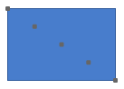

////

|metadata|
{
    "name": "xamdiagram-configuring-the-connection-points-of-diagram-nodes",
    "tags": ["Charting","How Do I"],
    "controlName": ["xamDiagram"],
    "guid": "f4c3a068-325e-4ac3-be3d-db65d19ac5ce",  
    "buildFlags": [],
    "createdOn": "2014-06-16T09:31:14.4994978Z"
}
|metadata|
////

= Configuring the Connection Points of Diagram Nodes (xamDiagram)

== Topic Overview

=== Purpose

This topic explains how to configure the connection points of diagram nodes in the  _xamDiagram_™ control. This would be necessary if you use custom nodes or need to customize the pre-set connection points of the standard nodes.

=== Required background

The following topics are prerequisites to understanding this topic:

[options="header", cols="a,a"]
|====
|Topic|Purpose

| link:xamdiagram-configuring-node-configuration-overview.html[Node Configuration Overview ( _xamDiagram_ )]
|This topic provides an overview of what can be configured about diagram nodes.

| link:xamdiagram-adding-to-a-page.html[Adding _xamDiagram_ to a Page]
|This topic explains how to add the _xamDiagram_ control to a WPF application.

|====

=== In this topic

This topic contains the following sections:

* <<_Ref388886756, Introduction >>

** <<_Ref388886771,Connection points configuration summary>>
** <<_Ref388886777,Connection points configuration summary chart>>

* <<_Ref388886813, Configuring Custom Connection Points for a Node >>

** <<_Ref388886819,Overview>>
** <<_PropertySettings,Property settings>>
** <<_Ref388886826,Example>>

* <<_Ref388886833, Related Content >>

** <<_Ref388886839,Topics>>
** <<_Ref388886845,Samples>>

[[_Ref388886756]]
== Introduction

[[_Ref388886771]]

=== Connection points configuration summary

Connection points are the points on a node where diagram connections can start/end. A connection point for a node is specified by a name and coordinates.

*  *Name*  – used for explicitly specifying a connection point for a connection through the connection’s link:{ApiPlatform}controls.charts.xamdiagram.v{ProductVersion}~infragistics.controls.charts.diagramconnection~startnodeconnectionpointname.html[StartNodeConnectionPointName]/ link:{ApiPlatform}controls.charts.xamdiagram.v{ProductVersion}~infragistics.controls.charts.diagramconnection~endnodeconnectionpointname.html[EndNodeConnectionPointName] properties; therefore, all names of connection points for a node should be unique.
*  *Coordinates*  – relative to the node’s rectangle. The coordinates are in the range 0,0 (top-left) to 1,1 (bottom-right).

Each connection point is represented by a link:{ApiPlatform}controls.charts.xamdiagram.v{ProductVersion}~infragistics.controls.charts.diagramconnectionpoint_members.html[DiagramConnectionPoint] object exposing link:{ApiPlatform}controls.charts.xamdiagram.v{ProductVersion}~infragistics.controls.charts.diagramconnectionpoint~name.html[Name] and link:{ApiPlatform}controls.charts.xamdiagram.v{ProductVersion}~infragistics.controls.charts.diagramconnectionpoint~position.html[Position] properties.

When using one of the predefined shape types set through the link:{ApiPlatform}controls.charts.xamdiagram.v{ProductVersion}~infragistics.controls.charts.diagramnode~shapetype.html[DiagramNode.ShapeType] property, the node’s link:{ApiPlatform}controls.charts.xamdiagram.v{ProductVersion}~infragistics.controls.charts.diagramnode~connectionpoints.html[ConnectionPoints] collection is pre-populated with a few points according to the node type. For custom node shapes, no connection points are added by default.

[[_Ref388886777]]

=== Connection points configuration summary chart

The following table explains briefly the configurable aspects of diagram nodes connection points and maps them to the properties that configure them.

[options="header", cols="a,a,a"]
|====
|Configurable aspect|Details|Properties

|Custom connection point
|Add/remove or modify the points where connections connected to this node will start/end.
|
* link:{ApiPlatform}controls.charts.xamdiagram.v{ProductVersion}~infragistics.controls.charts.diagramnode~connectionpoints.html[ConnectionPoints] 

|====

[[_Ref388886813]]
== Configuring Custom Connection Points for a Node

[[_Ref388886819]]

=== Overview

Connection points for a node are specified through the link:{ApiPlatform}controls.charts.xamdiagram.v{ProductVersion}~infragistics.controls.charts.diagramnode~connectionpoints.html[ConnectionPoints] property. You can use the `Add` and `Remove` methods of the link:{ApiPlatform}controls.charts.xamdiagram.v{ProductVersion}~infragistics.controls.charts.diagramconnectionpointcollection_members.html[DiagramConnectionPointCollection].

[[_PropertySettings]]

=== Property settings

The following table maps the desired configuration to the property settings that manage it.

[options="header", cols="a,a,a"]
|====
|In order to:|Use this property:|And set it to:

|Set custom connection points for a node
| link:{ApiPlatform}controls.charts.xamdiagram.v{ProductVersion}~infragistics.controls.charts.diagramnode~connectionpoints.html[ConnectionPoints]
|The desired set of connection points

|====

[[_Ref388886826]]

=== Example

The following screenshot demonstrates how a node in the  _xamDiagram_  would look when its connection point presenters are visible as a result of the code below.

Following is the code that implements this example.

*In XAML:*

[source,xaml]
----
<ig:XamDiagram x:Name="Diagram">
      <ig:DiagramNode>
            <ig:DiagramNode.ConnectionPoints>
                  <ig:DiagramConnectionPoint Name="Position1" Position="0,0"/>
                  <ig:DiagramConnectionPoint Name="Position2" Position="0.25,0.25"/>
                  <ig:DiagramConnectionPoint Name="Position3" Position="0.5,0.5"/>
                  <ig:DiagramConnectionPoint Name="Position4" Position="0.75,0.75"/>
                  <ig:DiagramConnectionPoint Name="Position5" Position="1,1"/>
            </ig:DiagramNode.ConnectionPoints>
      </ig:DiagramNode>
</ig:XamDiagram>
----

[[_Ref388886833]]
== Related Content

[[_Ref388886839]]

=== Topics

The following topics provide additional information related to this topic.

[options="header", cols="a,a"]
|====
|Topic|Purpose

| link:xamdiagram-configuring-the-start-and-end-of-diagram-connections.html[Configuring the Start and End of Diagram Connections ( _xamDiagram_ )]
|This topic covers the two possible approaches to configuring the start and end points of diagram connections in _xamDiagram_ : by specifying the nodes to connect to or by specifying the coordinates of the connection’s start and end points on the diagram space.

| link:{ApiPlatform}controls.charts.xamdiagram.v{ProductVersion}~infragistics.controls.charts.xamdiagram~connectionpointsdisplaymode.html[XamDiagram.ConnectionPointsDisplayMode]
|API reference for the XamDiagram.ConnectionPointsDisplayMode property.

|====

[[_Ref388886845]]

=== Samples

The following samples provide additional information related to this topic.

[options="header", cols="a,a"]
|====
|Sample|Purpose

| link:{SamplesURL}/diagram/diagram-commands[Diagram Commands]
|This sample demonstrates the _XamDiagram’s_ available commands and different interactions.

|====