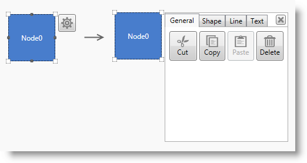
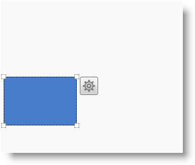
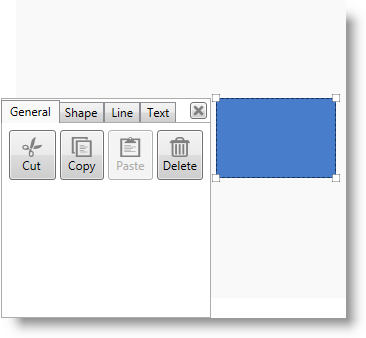
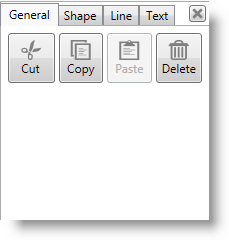
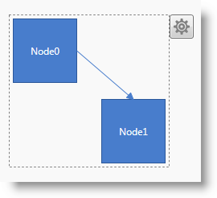

////

|metadata|
{
    "name": "xamdiagram-configuring-the-context-menu",
    "tags": ["Charting","How Do I"],
    "controlName": ["xamDiagram"],
    "guid": "dfd4a592-95cf-4d87-94b3-5d81b5ded547",  
    "buildFlags": [],
    "createdOn": "2014-06-16T09:39:19.1908682Z"
}
|metadata|
////

= Configuring the Context Menu (xamDiagram)

== Topic Overview

=== Purpose

This topic explains how to use the context menu provided by the  _xamDiagram_™ control.

=== Required background

The following topics are prerequisites to understanding this topic:

[options="header", cols="a,a"]
|====
|Topic|Purpose

| link:xamdiagram-general-overview.html[General Overview ( _xamDiagram_ )]
|This topic provides a conceptual overview of the _xamDiagram_ control and its main features and capabilities.

| link:xamdiagram-adding-to-a-page.html[Adding _xamDiagram_ to a Page]
|This topic explains how to add the _xamDiagram_ control to a {PlatformName} application.

|====

=== In this topic

This topic contains the following sections:

*  *<<_Ref389563895,Introduction>>*

** <<_Ref386534590,Context menu configuration summary>>
** <<_Ref385408391,Context menu configuration summary chart>>

*  *<<_ConfiguringOptionsPaneVisibility,Configuring Options Pane Visibility>>*

** <<_Ref385408401,Overview>>
** <<_PropertySettings1,Property settings>>
** <<_Ref389558458,Example>>

*  *<<_Ref389311986,Configuring Options Pane Placement>>*

** <<_Ref389311991,Overview>>
** <<_Ref389311996,Property settings>>
** <<_Ref389312001,Example>>

*  *<<_Ref389058162,Options Pane Configurable Aspects of Diagram Items>>*

** <<_Ref389058167,Options pane copy-pasting operations>>
** <<_Ref389058170,Options pane configurable aspects of the diagram nodes>>
** <<_Ref389058175,Options pane configurable aspects of the diagram connections>>
** <<_Ref389058178,Options pane configurable aspects of the diagram items>>

*  *<<_Ref389058182,Related Content>>*

** <<_Ref385408435,Topics>>
** <<_Ref385408439,Samples>>

[[_Ref389563895]]
== Introduction

[[_Ref386534590]]

=== Context menu configuration summary

The diagram items of the  _xamDiagram_   control can be configured using the context menu functionality of the control. It is represented by an options pane which is opened upon diagram item’s (or items’) selection through a mouse click on the gear-like icon which then appears. By default, the context menu is disabled on the diagram.

It is possible to configure the placement of the options pane relative to the selected item(s). This allows for best user experience for diagram items configuration both by left-handed and right-handed users. The diagram provides a built-in functionality to read the system settings in terms of handedness, so that the menu appears at the most convenient place according to them. The so called “handedness” settings specify where menus would appear depending on the hand you use to write - if left, the menus appear to the right and in the contrary case, the menus appear to the left. They can be accessed via the “Tablet PC Settings” menu. For details, see the MSDN article on handedness. By default the options pane appears opens to the right of the item(s).

Opening and closing the options pane programmatically is also possible through the link:{ApiPlatform}controls.charts.xamdiagram{ApiVersion}~infragistics.controls.charts.diagramcommands~showoptionspane.html[ShowOptionsPane] and link:{ApiPlatform}controls.charts.xamdiagram{ApiVersion}~infragistics.controls.charts.diagramcommands~closeoptionspane.html[CloseOptionsPane] commands. (For more information on commands used in  _xamDiagram_  , see link:xamdiagram-configuring-ui-elements-with-commands.html[Configuring UI Elements with Commands].)

Various properties of the diagram items can be configured using the options pane, such as fill, size, font family etc. They are logically grouped in relevant sections:  _Shape_  ,  _Path_   and  _Line_  , depending on the type of the object they can be applied to. Copy-pasting operations’ (copy, paste, delete etc.) commands can also be invoked by an interaction with its UI. These options are placed in the  _General_   tab. (For details on the configurable aspects and operations see <<_Ref389058162,Options Pane Configurable Aspects of Diagram Items>>.)

It is possible to place the options pane of the diagram somewhere outside its space. In this use case, the link:{ApiPlatform}controls.charts.xamdiagram{ApiVersion}~infragistics.controls.charts.primitives.diagramoptionspane_members.html[DiagramOptionsPane] instance should indicate the diagram it belongs to by providing it as a value to its link:{ApiPlatform}controls.charts.xamdiagram{ApiVersion}~infragistics.controls.charts.primitives.diagramoptionspane~diagram.html[DiagramOptionsPane.Diagram] property.

The look of the options pane can be customized by overriding the template of the control. For the purpose of creating another implementation of a context menu (different from the options pane), the  _xamDiagram_   exposes a link:{ApiPlatform}controls.charts.xamdiagram{ApiVersion}~infragistics.controls.charts.primitives.diagramoptionspanedatacontext_members.html[DiagramOptionsPaneDataContext] class.

[[_Ref385408391]]

=== Context menu configuration summary chart

The following table explains briefly the configurable aspects of the diagram related to its context menu and maps them to the properties that configure them.

[options="header", cols="a,a,a"]
|====
|Configurable aspect|Details|Properties

|[[_Hlk356484826]] 

Visibility
|The ability to show/hide the context menu.
|
* link:{ApiPlatform}controls.charts.xamdiagram{ApiVersion}~infragistics.controls.charts.xamdiagram~optionspanevisibility.html[OptionsPaneVisibility] 

|Placement
|The placement of the options pane relative to the diagram item
|
* link:{ApiPlatform}controls.charts.xamdiagram{ApiVersion}~infragistics.controls.charts.xamdiagram~optionspaneplacement.html[OptionsPanePlacement] 

|====

[[_ConfiguringOptionsPaneVisibility]]
== Configuring Options Pane Visibility

[[_Ref385408401]]

=== Overview

The visibility of the options pane (the ability to display it) is controlled through a property setting. It allows/ prevents the visualization of the gear-like icon () which opens the options pane upon mouse click.

=== Property settings

The following table maps the desired configuration to the property settings that manage it.

[options="header", cols="a,a,a"]
|====
|In order to:|Use this property:|And set it to:

|Configure the visibility of the options pane
| link:{ApiPlatform}controls.charts.xamdiagram{ApiVersion}~infragistics.controls.charts.xamdiagram~optionspanevisibility.html[OptionsPaneVisibility]
|Any of the following properties depending on the desired effect: 

* _Visible_ 

* _Hidden_ 

* _Collapsed_ 

|====

[[_Ref389558458]]

=== Example

The screenshot below demonstrates options pane visibility configuration as a result of the following settings:

[options="header", cols="a,a"]
|====
|Property|Value

| link:{ApiPlatform}controls.charts.xamdiagram{ApiVersion}~infragistics.controls.charts.xamdiagram~optionspanevisibility.html[OptionsPaneVisibility]
| _“Visible”_ 

|====

Following is the code that implements this example.

*In XAML:*

[source,xaml]
----
<ig:XamDiagram x:Name="diagram"
               Width="300"
               Height="250"
               Background="#F9F9F9"
               OptionsPaneVisibility=”Visible”>
    <ig:DiagramNode Position="5,125"/>
</ig:XamDiagram>
----

[[_Ref389311986]]
[[_Ref389058162]]
[[_Ref385408430]]
== Configuring Options Pane Placement

[[_Ref389311991]]

=== Overview

The  _xamDiagram_   control provides functionality to specify the placement of its options pane relative to the selected item(s).

[[_Ref389311996]]

=== Property settings

The following table maps the desired configuration to the property settings that manage it.

[options="header", cols="a,a,a"]
|====
|In order to:|Use this property:|And set it to:

|Configure the placement of the options pane
| link:{ApiPlatform}controls.charts.xamdiagram{ApiVersion}~infragistics.controls.charts.xamdiagram~optionspaneplacement.html[OptionsPanePlacement]
|
* _“Left”_ – the options pane appears to the left of the selected item(s) 

* _“Right”_ – the options pane appears to the right of the selected item(s) 

* _“Auto”_ – reads the user system settings in terms of handedness and applies the respective value to the property(for ex. if “left” is the returned value, the options pane will be placed to the right side of the selected item(s)) 

* _“ReverseAuto”_ – reads the user system settings in terms of handedness and applies the inverted value(for ex. if “left” is the returned value, then the options pane will be placed to the left side of the selected item(s)) 

|====

[[_Ref389312001]]

=== Example

The screenshot below demonstrates the options pane placement as a result of the following settings:

[options="header", cols="a,a"]
|====
|Property|Value

| link:{ApiPlatform}controls.charts.xamdiagram{ApiVersion}~infragistics.controls.charts.xamdiagram~optionspaneplacement.html[OptionsPanePlacement]
| _“Left”_ 

|====

Following is the code that implements this example.

*In XAML:*

[source,xaml]
----
<ig:XamDiagram x:Name="diagram"
               Width="330"
               Height="300"
               Background="#F9F9F9"
               OptionsPaneVisibility="Visible"
               OptionsPanePlacement="Left">
    <ig:DiagramNode Position="200,100"/>
</ig:XamDiagram>
----

== Options Pane Configurable Aspects of Diagram Items

[[_Ref389058167]]

=== Options pane copy-pasting operations

The copy-pasting operations which can be invoked using the options pane are always displayed in its first tab named “ _General_  ” regardless of whether it is used to configure a node, a connection or a combination of them. The content of the buttons is self-descriptive for the operations which they control.

[[_Ref389058170]]

=== Options pane configurable aspects of the diagram nodes

The following table visually illustrates the configuration options for the diagram nodes available in the options pane.

[cols="a,a"]
|====
|Shape
|image::images/xamDiagram_Configuring_the_Context_Menu_6.png[]

|Line
|image::images/xamDiagram_Configuring_the_Context_Menu_7.png[]

|Text
|image::images/xamDiagram_Configuring_the_Context_Menu_8.png[]

|====

[[_Ref389058175]]

=== Options pane configurable aspects of the diagram connections

The following table visually illustrates the configuration options for the diagram connections available in the options pane.

[cols="a,a"]
|====
|Shape
|image::images/xamDiagram_Configuring_the_Context_Menu_9.png[]

|Line
|image::images/xamDiagram_Configuring_the_Context_Menu_10.png[]

|Text
|image::images/xamDiagram_Configuring_the_Context_Menu_11.png[]

|====

[[_Ref389058178]]

=== Options pane configurable aspects of the diagram items

As the context menu is used to configure both properties of diagram nodes and of diagram connections, if a selection has been done on the diagram space which contains both nodes and connections, the options pane will list only the properties which are common between the diagram items.

The following table visually illustrates the configuration options for a mixed selection of diagram items available in the options pane.

[cols="a,a"]
|====
|Shape
|image::images/xamDiagram_Configuring_the_Context_Menu_13.png[]

|Line
|image::images/xamDiagram_Configuring_the_Context_Menu_14.png[]

|Text
|image::images/xamDiagram_Configuring_the_Context_Menu_15.png[]

|====

[[_Ref389058182]]
== Related Content

[[_Ref385408435]]

=== Topics

The following topics provide additional information related to this topic.

[options="header", cols="a,a"]
|====
|Topic|Purpose

| link:xamdiagram-user-interactions-configuration-overview.html[User Interactions Configuration Overview ( _xamDiagram_ )]
|This topic provides a summary of all user interaction tasks in the _xamDiagram_ control.

| link:xamdiagram-configuring-keyboard-shortcuts.html[Configuring Keyboard Shortcuts ( _xamDiagram_ )]
|This topic explains how to use the commands provided by the _xamDiagram_ control and how to change the keyboard shortcuts associated with the commands.

|====

[[_Ref385408439]]

=== Samples

The following samples provide additional information related to this topic.

[options="header", cols="a,a"]
|====
|Sample|Purpose

| link:{SamplesURL}/diagram/basic-configuration[Basic Configuration]
|This sample demonstrates creating a simple flowchart diagram using the _xamDiagram_ control.

|====

=== Resources

The following material (available outside the Infragistics® family of content) provides additional information related to this topic.

[options="header", cols="a,a"]
|====
|Title|Purpose

| link:http://msdn.microsoft.com/en-us/library/ms819495.aspx[Left-Handedness and Right-Handedness]
|An MSDN article providing more information on the concept of handedness.

|====