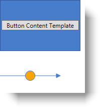
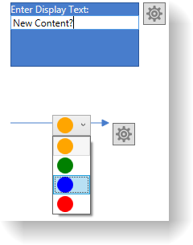

////

|metadata|
{
    "name": "xamdiagram-configuring-the-diagram-items-content-visualization",
    "tags": ["Charting","Styling","Templating"],
    "controlName": ["xamDiagram"],
    "guid": "d26494f7-5324-4b72-a483-3359aa636eae",  
    "buildFlags": [],
    "createdOn": "2014-06-16T09:36:11.547258Z"
}
|metadata|
////

= Configuring the Visualization of the Content of the Diagram Items (xamDiagram)

== Topic Overview

=== Purpose

This topic explains how to set DataTemplates for the content of diagram items and for editing that content.

=== Required background

The following topics are prerequisites to understanding this topic:

[options="header", cols="a,a"]
|====
|Topic|Purpose

| link:xamdiagram-general-overview.html[General Overview ( _xamDiagram_ )]
|This topic provides a conceptual overview of the _xamDiagram_ control and its main features and capabilities.

| link:xamdiagram-adding-to-a-page.html[Adding _xamDiagram_ to a Page]
|This topic explains how to add the _xamDiagram_ control to a WPF application.

|====

=== In this topic

This topic contains the following sections:

* <<_Ref386568673, Introduction >>

** <<_DiagramItemsTemplatesSummary,Diagram items templates summary>>
** <<_Ref386568682,Diagram items’ content visualization configuration summary>>
** <<_Ref386568688,Diagram items’ content visualization configuration summary chart>>

* <<_Ref391037139, Configuring a Custom Display Template >>

** <<_Ref386568700,Overview>>
** <<_PropertySettings,Property settings>>
** <<_Ref386568709,Example>>

* <<_Ref391037158, Configuring a Custom Edit Template >>

** <<_Ref391037160,Overview>>
** <<_Ref391037163,Property settings>>
** <<_Ref391037165,Example>>

* <<_Ref386568715, Related Content >>

** <<_Ref386568722,Topics>>
** <<_Ref386568727,Samples>>

[[_Ref386568673]]
== Introduction

[[_DiagramItemsTemplatesSummary]]

=== Diagram items templates summary

Diagram items have two templates that can be applied to their content – display template and edit template. The display template defines the presentation of the content, and the edit template is the template applied when editing the item’s content.

The following screenshot demonstrates the default content and edit templates applied to a diagram node.

[options="header", cols="a,a"]
|====
|Display Template|Edit Template

|image::images/xamDiagram_Configuring_the_Diagram_Items_Content_Visualization_1.png[]
|image::images/xamDiagram_Configuring_the_Diagram_Items_Content_Visualization_2.png[]

|====

[[_Ref386568682]]

=== Diagram items’ content visualization configuration summary

Manage the visual presentation of the content of the diagram items (nodes and connections) with a display template. Additionally, a set of Node-Level properties provide a convenient way to handle the most trivial aspects of content visualization, such as horizontal alignment and margins, and the element flow relative to the container element (fit in / overlap).

The display template is supplied pre-defined and applied to the diagram items by default. The default data template specifies a template for the content container. That template is the same for both nodes and connections: a `TextBlock` control with its `Text` property bound to the `DiagramItem.Content` value (with the only difference being a 2 px margin around the text block for nodes).

To control the positioning of the nodes’ content within the content container, nodes have a set of explicit properties, enabling you to configure the positioning without having to define it in the template. These properties are:

* link:{ApiPlatform}controls.charts.xamdiagram{ApiVersion}~infragistics.controls.charts.diagramnode~leftcontentoffset.html[LeftContentOffset]
* link:{ApiPlatform}controls.charts.xamdiagram{ApiVersion}~infragistics.controls.charts.diagramnode~rightcontentoffset.html[RightContentOffset]
* `HorizontalContentAlignment`
* `VerticalContentAlignment`
* link:{ApiPlatform}controls.charts.xamdiagram{ApiVersion}~infragistics.controls.charts.diagramnode~contentlayoutbehavior.html[ContentLayoutBehavior]

For diagram connections, the content is always positioned in the middle of the connection line.

.Note
[NOTE]
====
Do not confuse the shape of the diagram node with the content container defined in the data template – these are two separate entities. Unlike the nodes in some popular diagramming software, the node shape itself cannot present content and the content container is not equivalent to the node shape (though in the template it can be configured as a replacement of the node shape in some advanced scenarios).
====

.Note
[NOTE]
====
For diagram nodes, the `DisplayTemplate` is always applied regardless of the settings of the link:{ApiPlatform}controls.charts.xamdiagram{ApiVersion}~infragistics.controls.charts.diagramnode~shapetype.html[ShapeType] and link:{ApiPlatform}controls.charts.xamdiagram{ApiVersion}~infragistics.controls.charts.diagramnode~geometry.html[Geometry] properties. Suggesting that you are expected to set the shape of the node using these properties. Define the presentation of the content in the `DisplayTemplate` and, if necessary, further fine-tune this presentation with the properties listed above. (For details on how to configure the node shape refer to link:xamdiagram-configuring-the-shape-of-diagram-nodes-overview.html[Configuring the Shape of the Diagram Nodes].)
====

[[_Ref386568688]]

=== Diagram items’ content visualization configuration summary chart

The following table briefly explains the configurable aspects of the content of the diagram nodes and connections and maps them to the properties that configure them.

[options="header", cols="a,a,a,a"]
|====
|Mode|Configurable aspect|Details|Properties

|Display
|Horizontal margins of content
|The horizontal margins (the blank space between the left and right edges of the content and the side of the container) are configured individually for the left and the right margin with separate properties.
|
* link:{ApiPlatform}controls.charts.xamdiagram{ApiVersion}~infragistics.controls.charts.diagramnode~leftcontentoffset.html[LeftContentOffset] 

* link:{ApiPlatform}controls.charts.xamdiagram{ApiVersion}~infragistics.controls.charts.diagramnode~rightcontentoffset.html[RightContentOffset] 

|
|Alignment of content
|The horizontal and vertical alignment are configured individually with separate properties.
|
* `HorizontalContentAlignment` 

* `VerticalContentAlignment` 

|
|Content layout behavior
|If the content size is greater than the node size, it can be either cropped to fit the container or displayed as is (based on the link:{ApiPlatform}controls.charts.xamdiagram{ApiVersion}~infragistics.controls.charts.diagramitem~displaytemplate.html[DisplayTemplate]). In the latter case, the content will flow outside of the container overlapping it.
|
* link:{ApiPlatform}controls.charts.xamdiagram{ApiVersion}~infragistics.controls.charts.diagramnode~contentlayoutbehavior.html[ContentLayoutBehavior] 

|
|All aspects (template)
|Configure the manner the content of a diagram node or connection displays with a `DataTemplate`. If the link:{ApiPlatform}controls.charts.xamdiagram{ApiVersion}~infragistics.controls.charts.diagramitem~displaytemplate.html[DisplayTemplate] is not explicitly set, the default template mentioned above will be applied.
|
* link:{ApiPlatform}controls.charts.xamdiagram{ApiVersion}~infragistics.controls.charts.diagramitem~displaytemplate.html[DisplayTemplate] 

* link:{ApiPlatform}controls.charts.xamdiagram{ApiVersion}~infragistics.controls.charts.diagramitem~content.html[Content] 

|Edit
|All aspects (template)
|The way the content of a diagram node or connection is displayed in edit mode can be configured with a `DataTemplate`. If the link:{ApiPlatform}controls.charts.xamdiagram{ApiVersion}~infragistics.controls.charts.diagramitem~edittemplate.html[EditTemplate] is not explicitly set, the default template mentioned above will be applied.
|
* link:{ApiPlatform}controls.charts.xamdiagram{ApiVersion}~infragistics.controls.charts.diagramitem~edittemplate.html[EditTemplate] 

* link:{ApiPlatform}controls.charts.xamdiagram{ApiVersion}~infragistics.controls.charts.diagramitem~content.html[Content] 

|====

[[_Ref391037139]]
== Configuring a Custom Display Template

[[_Ref386568700]]

=== Overview

Applying a custom template for a diagram node or a diagram connection is done by setting the link:{ApiPlatform}controls.charts.xamdiagram{ApiVersion}~infragistics.controls.charts.diagramitem~displaytemplate.html[DisplayTemplate] property to a `DataTemplate` in which the value of the link:{ApiPlatform}controls.charts.xamdiagram{ApiVersion}~infragistics.controls.charts.diagramitem~content.html[Content] property is internally set as the `DataContext` of the data template.

[[_PropertySettings]]

=== Property settings

The following table maps the desired configuration to the property settings that manage it.

[options="header", cols="a,a,a"]
|====
|In order to:|Use this property:|And set it to:

|Set a custom display template
| link:{ApiPlatform}controls.charts.xamdiagram{ApiVersion}~infragistics.controls.charts.diagramitem~displaytemplate.html[DiagramItem.DisplayTemplate]
|The desired `DataTemplate`.

|====

[[_Ref386568709]]

=== Example

The screenshot below demonstrates how a node and a connection in the  _xamDiagram_   would look as a result of the following settings:

[options="header", cols="a,a"]
|====
|Property|Value

| link:{ApiPlatform}controls.charts.xamdiagram{ApiVersion}~infragistics.controls.charts.diagramitem~content.html[DiagramNode.Content]
| _“Button Content Template”_ 

| link:{ApiPlatform}controls.charts.xamdiagram{ApiVersion}~infragistics.controls.charts.diagramitem~displaytemplate.html[DiagramNode.DisplayTemplate]
|*In XAML:* 

[source,XAML]
---- 
<DataTemplate> 
<Button Content="{Binding}" /> 
</DataTemplate>
----

| link:{ApiPlatform}controls.charts.xamdiagram{ApiVersion}~infragistics.controls.charts.diagramitem~content.html[DiagramConnection.Content]
| _Orange_ 

| link:{ApiPlatform}controls.charts.xamdiagram{ApiVersion}~infragistics.controls.charts.diagramitem~displaytemplate.html[DiagramConection.DisplayTemplate]
|*In XAML:* 

[source,XAML]
---- 
<DataTemplate> 
<Ellipse 
Fill="{Binding}" 
Stroke="{Binding Stroke, RelativeSource={RelativeSource AncestorType=ig:DiagramConnection}}" 
Width="20" Height="20"/> 
</DataTemplate>
----

|====

Following is the code that implements this example.

*In XAML:*

[source,XAML]
---- 
<ig:XamDiagram>
<ig:DiagramNode Content="Button Content Template" Width="160">
<ig:DiagramNode.DisplayTemplate>
<DataTemplate>
<Button Content="{Binding}" />
</DataTemplate>
</ig:DiagramNode.DisplayTemplate>
</ig:DiagramNode>
<ig:DiagramConnection Content="Orange" StartPosition="0,150" EndPosition="120,150">
<ig:DiagramConnection.DisplayTemplate>
<DataTemplate>
<!-- Binding the ellipse's fill to the connection's
Content and the Stroke to the connection's Stroke -$$->$$
<Ellipse
Fill="{Binding}"
Stroke="{Binding Stroke, RelativeSource={RelativeSource AncestorType=ig:DiagramConnection}}"
Width="20" Height="20"/>
</DataTemplate>
</ig:DiagramConnection.DisplayTemplate>
</ig:DiagramConnection>
</ig:XamDiagram>
----

[[_Ref391037158]]
[[_Ref386568694]]
== Configuring a Custom Edit Template

[[_Ref391037160]]

=== Overview

Applying a custom edit template for a diagram node or a diagram connection is done by setting the link:{ApiPlatform}controls.charts.xamdiagram{ApiVersion}~infragistics.controls.charts.diagramitem~edittemplate.html[EditTemplate] property to a `DataTemplate`. The value of the link:{ApiPlatform}controls.charts.xamdiagram{ApiVersion}~infragistics.controls.charts.diagramitem~content.html[Content] property is internally as the `DataContext` of the data template.

[[_Ref391037163]]

=== Property settings

The following table maps the desired configuration to the property settings that manage it.

[options="header", cols="a,a,a"]
|====
|In order to:|Use this property:|And set it to:

|Set a custom content edit template
| link:{ApiPlatform}controls.charts.xamdiagram{ApiVersion}~infragistics.controls.charts.diagramitem~edittemplate.html[DiagramItem.EditTemplate]
|The desired `DataTemplate`.

|====

[[_Ref391037165]]

=== Example

The screenshot below demonstrates how a node and a connection in the  _xamDiagram_   would look as a result of the following settings and when in edit mode:

[options="header", cols="a,a"]
|====
|Property|Value

| link:{ApiPlatform}controls.charts.xamdiagram{ApiVersion}~infragistics.controls.charts.diagramitem~content.html[DiagramNode.Content]
| _“New Content?”_ 

| link:{ApiPlatform}controls.charts.xamdiagram{ApiVersion}~infragistics.controls.charts.diagramitem~edittemplate.html[DiagramNode.EditTemplate]
|*In XAML:* 

[source,XAML]
---- 
<DataTemplate> 
<StackPanel> 
<TextBlock Text="Enter Display Text:" Foreground="WhiteSmoke" /> 
<TextBox Text="{Binding Content, RelativeSource={RelativeSource AncestorType=ig:DiagramNode}}"/> 
</StackPanel> 
</DataTemplate>
----

| link:{ApiPlatform}controls.charts.xamdiagram{ApiVersion}~infragistics.controls.charts.diagramitem~content.html[DiagramConnection.Content]
| _Orange_ 

| link:{ApiPlatform}controls.charts.xamdiagram{ApiVersion}~infragistics.controls.charts.diagramitem~edittemplate.html[DiagramConection.EditTemplate]
|*In XAML:* 

[source,XAML]
---- 
<DataTemplate> 
<ComboBox SelectedItem="{Binding .}"> 
<sys:String>Orange</sys:String> 
<sys:String>Green</sys:String> 
<sys:String>Blue</sys:String> 
<sys:String>Red</sys:String> 
<ComboBox.ItemTemplate> 
<DataTemplate> 
<Ellipse Fill="{Binding Content, RelativeSource={RelativeSource AncestorType=ig:DiagramConnection}}" Width="20" Height="20"/> 
</DataTemplate> 
</ComboBox.ItemTemplate> 
</ComboBox> 
</DataTemplate>
----

|====

Following is the code that implements this example.

*In XAML:*

[source,XAML]
----
<ig:XamDiagram xmlns:sys="clr-namespace:System;assembly=mscorlib">
<ig:DiagramNode Content="Button Content Template" Width="160">
<ig:DiagramNode.EditTemplate>
<DataTemplate>
<StackPanel>
<TextBlock Text="Enter Display Text:" Foreground="WhiteSmoke" />
<TextBox Text="{Binding Content, RelativeSource={RelativeSource AncestorType=ig:DiagramNode}}"/>
</StackPanel>
</DataTemplate>
</ig:DiagramNode.EditTemplate>
<ig:DiagramNode.DisplayTemplate>
<DataTemplate>
<Button Content="{Binding}" />
</DataTemplate>
</ig:DiagramNode.DisplayTemplate>
</ig:DiagramNode>
<ig:DiagramConnection Content="Orange" StartPosition="0,150" EndPosition="120,150">
<ig:DiagramConnection.EditTemplate>
<DataTemplate>
<!-- Binding the ComboBox's SelectedItem to the connection's Content. If a complex object
is set as the connection's Content, a simple binding with a Path set to the property path
of the property that has to be edited is enough. -$$->$$
<ComboBox SelectedItem="{Binding Content, RelativeSource={RelativeSource AncestorType=ig:DiagramConnection}}">
<sys:String>Orange</sys:String>
<sys:String>Green</sys:String>
<sys:String>Blue</sys:String>
<sys:String>Red</sys:String>
<ComboBox.ItemTemplate>
<DataTemplate>
<Ellipse Fill="{Binding}" Width="20" Height="20"/>
</DataTemplate>
</ComboBox.ItemTemplate>
</ComboBox>
</DataTemplate>
</ig:DiagramConnection.EditTemplate>
<ig:DiagramConnection.DisplayTemplate>
<DataTemplate>
<!-- Binding the ellipse's fill to the connection's
Content and the Stroke to the connection's Stroke -$$->$$
<Ellipse
Fill="{Binding}"
Stroke="{Binding Stroke, RelativeSource={RelativeSource AncestorType=ig:DiagramConnection}}"
Width="20" Height="20"/>
</DataTemplate>
</ig:DiagramConnection.DisplayTemplate>
</ig:DiagramConnection>
</ig:XamDiagram>
----

[[_Ref386568715]]
== Related Content

[[_Ref386568722]]

=== Topics

The following topic provides additional information related to this topic.

[options="header", cols="a,a"]
|====
|Topic|Purpose

| link:xamdiagram-configuring-the-shape-of-diagram-nodes-overview.html[Configuring the Shape of the Diagram Nodes ( _xamDiagram_ )]
|This topic explains how to configure the shape of the diagram nodes of the _xamDiagram_ control by either selecting a pre-defined shape or applying a custom shape.

|====

[[_Ref386568727]]

=== Samples

The following sample provides additional information related to this topic.

[options="header", cols="a,a"]
|====
|Sample|Purpose

| link:{SamplesURL}/diagram/binding-nodes-and-connections-with-keys[Binding Nodes and Connections with Keys]
|The following sample demonstrates how to bind the _xamDiagram_ to data where input data objects represent nodes and connections. Each of the node objects has a property of type object that represents a unique identifier and each of the connection objects has two properties holding the identifiers of the two node objects representing its start and end nodes.

|====