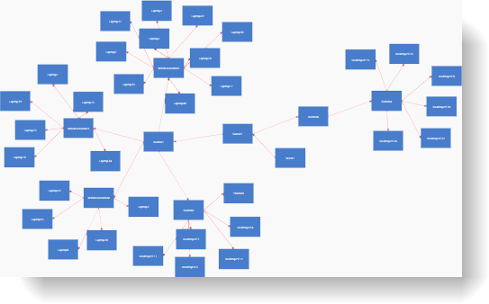
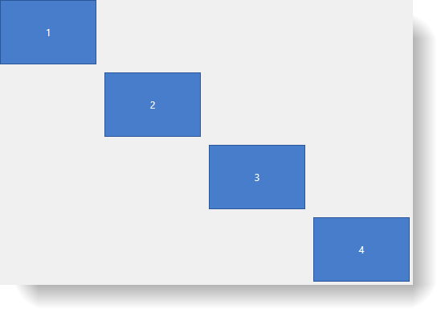

////

|metadata|
{
    "name": "xamdiagram-configuring-the-layout",
    "tags": ["Charting","Data Presentation","How Do I","Layouts"],
    "controlName": ["xamDiagram"],
    "guid": "6e79ab39-d6cf-4b7f-9374-b08513388cf2",  
    "buildFlags": [],
    "createdOn": "2014-06-16T09:41:44.5509903Z"
}
|metadata|
////

= Configuring the Layout (xamDiagram)

== Topic Overview

=== Purpose

This topic explains how to configure the layout of the  _xamDiagram_™ and how to create a custom layout scheme.

=== Required background

The following topics are prerequisites to understanding this topic:

[options="header", cols="a,a"]
|====
|Topic|Purpose

| link:xamdiagram-general-overview.html[General Overview ( _xamDiagram_ )]
|This topic provides a conceptual overview of the _xamDiagram_ control and its main features and capabilities.

| link:xamdiagram-adding-to-a-page.html[Adding _xamDiagram_ to a Page]
|This topic explains how to add the _xamDiagram_ control to a WPF application.

|====

=== In this topic

This topic contains the following sections:

* <<_Ref386477912, Introduction >>

** <<_Ref386477960,Diagram layout configuration summary>>
** <<_Ref387492519,Diagram layout configuration summary chart>>

* <<_Ref386478000, Applying a layout >>

** <<_Ref386478019,Overview>>
** <<_PropertySettings,Property settings>>
** <<_Ref386478040,Example>>

* <<_Ref386478056, Creating a Custom Layout >>

** <<_Ref390709033,Introduction>>
** <<_Ref390709035,Preview>>
** <<_Ref390709040,Prerequisites>>
** <<_Ref390709041,Steps>>
** <<_Ref382317785,Full code>>

* <<_Ref386478097, Related Content >>

** <<_Ref386478106,Topics>>
** <<_Ref386478113,Samples>>

[[_Ref386477912]]
== Introduction

[[_Ref386477960]]

=== Diagram layout configuration summary

There are two ways to position nodes in the  _xamDiagram_   – by setting the link:{ApiPlatform}controls.charts.xamdiagram{ApiVersion}~infragistics.controls.charts.diagramnode~position.html[DiagramNode.Position] property or the link:{ApiPlatform}controls.charts.xamdiagram{ApiVersion}~infragistics.controls.charts.xamdiagram~layout.html[XamDiagram.Layout] property. Currently three predefined layouts are available – link:{ApiPlatform}controls.charts.xamdiagram{ApiVersion}~infragistics.controls.charts.forcedirectedgraphdiagramlayout_members.html[ForceDirectedGraphDiagramLayout], link:{ApiPlatform}controls.charts.xamdiagram{ApiVersion}~infragistics.controls.charts.treediagramlayout_members.html[TreeDiagramLayout] and link:{ApiPlatform}controls.charts.xamdiagram{ApiVersion}~infragistics.controls.charts.griddiagramlayout_members.html[GridDiagramLayout]. Custom layouts are supported through implementations of the link:{ApiPlatform}controls.charts.xamdiagram{ApiVersion}~infragistics.controls.charts.idiagramlayout_members.html[IDiagramLayout] interface. The link:{ApiPlatform}controls.charts.xamdiagram{ApiVersion}~infragistics.controls.charts.idiagramlayout_members.html[IDiagramLayout] interface has a single link:{ApiPlatform}controls.charts.xamdiagram{ApiVersion}~infragistics.controls.charts.idiagramlayout~arrangenodes.html[ArrangeNodes] method that accepts a single `IEnumerable<DiagramNode>` parameter. In this method the Position property of the provided nodes must be set according to the desired layout scheme.

.Note:
[NOTE]
====
The diagram layout is applied only initially to the diagram. If the items are added/removed later, the layout is not automatically applied. In order to rearrange the nodes at a later stage, call the link:{ApiPlatform}controls.charts.xamdiagram{ApiVersion}~infragistics.controls.charts.xamdiagram~refreshlayout.html[RefreshLayout] method.
====

[[_Ref387492519]]

=== Diagram layout configuration summary chart

The following table briefly explains the configurable aspects of the  _xamDiagram_   layout and maps them to the API that configure them.

[options="header", cols="a,a,a"]
|====
|In order to:|Use this API member:|And:

|Apply a layout
| link:{ApiPlatform}controls.charts.xamdiagram{ApiVersion}~infragistics.controls.charts.xamdiagram~layout.html[XamDiagram.Layout]
|Set it to an instance of either the link:{ApiPlatform}controls.charts.xamdiagram{ApiVersion}~infragistics.controls.charts.treediagramlayout_members.html[TreeDiagramLayout] class, the link:{ApiPlatform}controls.charts.xamdiagram{ApiVersion}~infragistics.controls.charts.forcedirectedgraphdiagramlayout_members.html[ForceDirectedGraphDiagramLayout] class or any instance of a class implementing the link:{ApiPlatform}controls.charts.xamdiagram{ApiVersion}~infragistics.controls.charts.idiagramlayout_members.html[IDiagramLayout] interface

|Create a custom layout
| link:{ApiPlatform}controls.charts.xamdiagram{ApiVersion}~infragistics.controls.charts.idiagramlayout_members.html[IDiagramLayout]
|Create a class that implements this interface

|====

[[_Ref386478000]]
== Applying a layout

[[_Ref386478019]]

=== Overview

To set the layout of the  _xamDiagram_  , set its link:{ApiPlatform}controls.charts.xamdiagram{ApiVersion}~infragistics.controls.charts.xamdiagram~layout.html[Layout] property to an instance of the provided link:{ApiPlatform}controls.charts.xamdiagram{ApiVersion}~infragistics.controls.charts.forcedirectedgraphdiagramlayout_members.html[ForceDirectedGraphDiagramLayout], link:{ApiPlatform}controls.charts.xamdiagram{ApiVersion}~infragistics.controls.charts.treediagramlayout_members.html[TreeDiagramLayout] or link:{ApiPlatform}controls.charts.xamdiagram{ApiVersion}~infragistics.controls.charts.griddiagramlayout_members.html[GridDiagramLayout] classes or a custom link:{ApiPlatform}controls.charts.xamdiagram{ApiVersion}~infragistics.controls.charts.idiagramlayout_members.html[IDiagramLayout] implementation.

[[_PropertySettings]]

=== Property settings

The following table maps the desired configuration to the property settings that manage it.

[options="header", cols="a,a,a"]
|====
|In order to set the:|Use this property:|And set it to:

|Diagram nodes layout
| link:{ApiPlatform}controls.charts.xamdiagram{ApiVersion}~infragistics.controls.charts.xamdiagram~layout.html[Layout]
|An instance of class implementing the link:{ApiPlatform}controls.charts.xamdiagram{ApiVersion}~infragistics.controls.charts.idiagramlayout_members.html[IDiagramLayout] interface.

|====

[[_Ref386478040]]

=== Example

The screenshot below demonstrates how a  _xamDiagram_   looks with its link:{ApiPlatform}controls.charts.xamdiagram{ApiVersion}~infragistics.controls.charts.xamdiagram~layout.html[Layout] property set to a link:{ApiPlatform}controls.charts.xamdiagram{ApiVersion}~infragistics.controls.charts.forcedirectedgraphdiagramlayout_members.html[ForceDirectedGraphDiagramLayout] instance:

Following is the code for applying the `ForceDirectedGraphDiagramLayout`.

*In XAML:*

[source,xaml]
----
<ig:XamDiagram>
    <ig:XamDiagram.Layout>
        <ig:ForceDirectedGraphDiagramLayout />
    </ig:XamDiagram.Layout>
    …
</ig:XamDiagram>
----

[[_Configuring_a_Custom]]
[[_Ref386478056]]
== Creating a Custom Layout

[[_Ref390709033]]

=== Introduction

The following procedure explains how to create a custom layout that will position the diagram nodes sequentially in a down-right direction.

[[_Ref390709035]]

=== Preview

The following screenshot is a preview of the result.

[[_Ref390709040]]

=== Prerequisites

To complete the procedure, you need the following:

* A WPF application with the assemblies required by the  _xamDiagram_   as listed in link:xamdiagram-adding-to-a-page.html[Adding  _xamDiagram_  to a Page].

[[_Ref390709041]]

=== Steps

The following steps demonstrate how to create a custom diagonal layout.

=== 1. Implement the IDiagramLayout interface.

Create a class implementing the link:{ApiPlatform}controls.charts.xamdiagram{ApiVersion}~infragistics.controls.charts.idiagramlayout_members.html[IDiagramLayout] interface.

Create a new `DiagonalLayout` class that implements the IDiagramLayout interface. In the link:{ApiPlatform}controls.charts.xamdiagram{ApiVersion}~infragistics.controls.charts.idiagramlayout~arrangenodes.html[ArrangeNodes] method iterate over the nodes and set the link:{ApiPlatform}controls.charts.xamdiagram{ApiVersion}~infragistics.controls.charts.diagramnode~position.html[Position] of each node to the bottom-right corner of the link:{ApiPlatform}controls.charts.xamdiagram{ApiVersion}~infragistics.controls.charts.diagramitem~bounds.html[Bounds] rectangle of the previous node. In this example an additional `Offset` property is added to control the spacing between nodes. Refer to the <<_Ref382317785,Full code>> for the implementation details.

=== 2. Apply the diagonal layout.

In order to apply the diagonal layout set an instance of the `DiagonalLayout` class.

[[_Ref382317785]]

=== Full code

Following is the full code for this procedure.

*In C#:*

[source,csharp]
----
namespace XamDiagramSample
{
    public class DiagonalLayout : IDiagramLayout
    {
        public double Offset { get; set; }
        public void ArrangeNodes(IEnumerable<DiagramNode> nodes)
        {
            Point nextPoint = new Point(0,0);
            foreach (DiagramNode node in nodes)
            {
                node.Position = nextPoint;
                nextPoint = new Point(node.Bounds.Right + Offset, node.Bounds.Bottom + Offset);
            }
        }
    }
}
----

*In Visual Basic:*

[source,vb]
----
Namespace XamDiagramSample
    Public Class DiagonalLayout
        Implements IDiagramLayout
        Public Property Offset As Double
        Public Sub ArrangeNodes(nodes As IEnumerable(Of DiagramNode)) Implements IDiagramLayout.ArrangeNodes
            Dim nextPoint As New Point(0, 0)
            For Each node As DiagramNode In nodes
                node.Position = nextPoint
                nextPoint = New Point(node.Bounds.Right + Offset, node.Bounds.Bottom + Offset)
            Next
        End Sub
    End Class
End Namespace
----

*In XAML:*

[source,xaml]
----
<ig:XamDiagram x:Name="Diagram" 
        xmlns:local="clr-namespace:XamDiagramSample">
    <ig:XamDiagram.Layout>
        <local:DiagonalLayout Offset="10"/>
    </ig:XamDiagram.Layout>
    <ig:DiagramNode Content="1"/>
    <ig:DiagramNode Content="2"/>
    <ig:DiagramNode Content="3"/>
    <ig:DiagramNode Content="4"/>
</ig:XamDiagram>
----

[[_Ref386478097]]
== Related Content

[[_Ref386478106]]

=== Topics

The following topic provides additional information related to this topic.

[options="header", cols="a,a"]
|====
|Topic|Purpose

| link:xamdiagram-configuring-the-position-and-size-of-diagram-nodes.html[Configuring the Position and Size of Diagram Nodes ( _xamDiagram_ )]
|This topic explains how to control the size and position of individual diagram nodes of the _xamDiagram_ control.

|====

[[_Ref386478113]]

=== Samples

The following sample provides additional information related to this topic.

[options="header", cols="a,a"]
|====
|Sample|Purpose

| link:{SamplesURL}/diagram/basic-configuration[Basic Configuration]
|This sample demonstrates a simple flow diagram.

|====