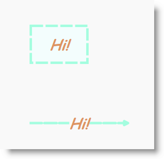

////

|metadata|
{
    "name": "xamdiagram-configuring-the-look-and-feel-of-diagram-items",
    "tags": ["Charting","Styling","Templating"],
    "controlName": ["xamDiagram"],
    "guid": "acd7d0cb-1521-4c01-a112-1f46d67fafd3",  
    "buildFlags": [],
    "createdOn": "2014-06-16T09:35:57.5617593Z"
}
|metadata|
////

= Configuring the Look-and-Feel of Diagram Items (xamDiagram)

== Topic Overview

=== Purpose

This topic explains how to configure the basic Look-and-Feel properties of diagram items in the  _xamDiagram_™ control.

=== Required background

The following topics are prerequisites to understanding this topic:

[options="header", cols="a,a"]
|====
|Topic|Purpose

| link:xamdiagram-general-overview.html[General Overview ( _xamDiagram_ )]
|This topic provides a conceptual overview of the _xamDiagram_ control and its main features and capabilities.

| link:xamdiagram-adding-to-a-page.html[Adding _xamDiagram_ to a Page]
|This topic explains how to add the _xamDiagram_ control to a WPF application.

|====

=== In this topic

This topic contains the following sections:

* <<_Ref387509075, Diagram Items Look-and-Feel Configuration Summary >>

** <<_DiagramItemsLookAndFeelConfigSummaryChart,Diagram items look-and-feel configuration summary chart>>

* <<_Ref386478000, Configuring the Diagram Items Look-and-Feel >>

** <<_Ref386478019,Overview>>
** <<_Ref386478080,Property settings>>
** <<_Ref387509095,Example>>

* <<_Ref386478097, Related Content >>

** <<_Ref386478106,Topics>>
** <<_Ref386478113,Samples>>

[[_Ref387509075]]
== Diagram Items Look-and-Feel Configuration Summary

[[_DiagramItemsLookAndFeelConfigSummaryChart]]

=== Diagram items look-and-feel configuration summary chart

The following table briefly explains the configurable aspects of the diagram items related to their Look-and-Feel and maps them to the properties that configure them.

[options="header", cols="a,a,a"]
|====
|Configurable aspect|Details|Properties

|Fill
|The item’s fill color
|
* link:{ApiPlatform}controls.charts.xamdiagram{ApiVersion}~infragistics.controls.charts.diagramitem~fill.html[Fill] 

|Stroke
|The node shape/connection line, stroke color, thickness, and dash array
|
* link:{ApiPlatform}controls.charts.xamdiagram{ApiVersion}~infragistics.controls.charts.diagramitem~stroke.html[Stroke] 

* link:{ApiPlatform}controls.charts.xamdiagram{ApiVersion}~infragistics.controls.charts.diagramitem~strokedasharray.html[StrokeDashArray] 

* link:{ApiPlatform}controls.charts.xamdiagram{ApiVersion}~infragistics.controls.charts.diagramitem~strokethickness.html[StrokeThickness] 

|Font
|Available Font-Related settings
|
* link:http://msdn.microsoft.com/en-us/library/system.windows.controls.control.foreground(v=vs.110).aspx[Foreground] 

* link:http://msdn.microsoft.com/en-us/library/system.windows.controls.control.fontfamily(v=vs.110).aspx[FontFamily] 

* link:http://msdn.microsoft.com/en-us/library/system.windows.controls.control.fontsize(v=vs.110).aspx[FontSize] 

* link:http://msdn.microsoft.com/en-us/library/system.windows.controls.control.fontstyle(v=vs.110).aspx[FontStyle] 

* link:http://msdn.microsoft.com/en-us/library/system.windows.controls.control.fontweight(v=vs.110).aspx[FontWeight] 

|Opacity
|The item’s opaqueness
|
* link:http://msdn.microsoft.com/en-us/library/system.windows.uielement.opacity.aspx[Opacity] 

|Connection line type (connections only)
|The type of line (Straight or Right-Angle) drawn for a connection
|
* link:{ApiPlatform}controls.charts.xamdiagram{ApiVersion}~infragistics.controls.charts.diagramconnection~connectiontype.html[DiagramConnection.ConnectionType] 

|====

[[_Ref386478000]]
== Configuring the Diagram Items Look-and-Feel

[[_Ref386478019]]

=== Overview

To create the desired diagram item effect, use the Look-and-Feel related properties.

[[_Ref386478080]]

=== Property settings

The following table maps the desired configuration to the property settings that manage it.

[options="header", cols="a,a,a"]
|====
|In order to:|Use this property:|And set it to:

|Set the fill color for the node shape/connection line
| link:{ApiPlatform}controls.charts.xamdiagram{ApiVersion}~infragistics.controls.charts.diagramitem~fill.html[Fill]
|The desired brush

|Set the stroke color for the node shape/connection line
| link:{ApiPlatform}controls.charts.xamdiagram{ApiVersion}~infragistics.controls.charts.diagramitem~stroke.html[Stroke]
|The desired brush

|Set the thickness of the stroke
| link:{ApiPlatform}controls.charts.xamdiagram{ApiVersion}~infragistics.controls.charts.diagramitem~strokethickness.html[StrokeThickness]
|The desired thickness

|Set the font color
| link:http://msdn.microsoft.com/en-us/library/system.windows.controls.control.foreground(v=vs.110).aspx[Foreground]
|The desired brush

|Set the font family
| link:http://msdn.microsoft.com/en-us/library/system.windows.controls.control.fontfamily(v=vs.110).aspx[FontFamily]
|The desired font family

|Set the font size
| link:http://msdn.microsoft.com/en-us/library/system.windows.controls.control.fontsize(v=vs.110).aspx[FontSize]
|The desired size

|Set the font style
| link:http://msdn.microsoft.com/en-us/library/system.windows.controls.control.fontstyle(v=vs.110).aspx[FontStyle]
|The desired style

|Set the font weight
| link:http://msdn.microsoft.com/en-us/library/system.windows.controls.control.fontweight(v=vs.110).aspx[FontWeight]
|The desired font weight

|Set the opacity
| link:http://msdn.microsoft.com/en-us/library/system.windows.uielement.opacity.aspx[Opacity]
|The desired value in the range 0 to 1

|Set the connection type
| link:{ApiPlatform}controls.charts.xamdiagram{ApiVersion}~infragistics.controls.charts.diagramconnection~connectiontype.html[DiagramConnection.ConnectionType]
|_Straight_ or _RightAngle_

|====

[[_Ref387509095]]

=== Example

The screenshot below demonstrates how a diagram node and connection look as a result of the following settings:

[options="header", cols="a,a"]
|====
|Property|Value

| link:{ApiPlatform}controls.charts.xamdiagram{ApiVersion}~infragistics.controls.charts.diagramitem~fill.html[Fill]
| _Azure_ 

| link:{ApiPlatform}controls.charts.xamdiagram{ApiVersion}~infragistics.controls.charts.diagramitem~stroke.html[Stroke]
| _Aquamarine_ 

| link:{ApiPlatform}controls.charts.xamdiagram{ApiVersion}~infragistics.controls.charts.diagramitem~strokethickness.html[StrokeThickness]
| _5_ 

| link:{ApiPlatform}controls.charts.xamdiagram{ApiVersion}~infragistics.controls.charts.diagramitem~strokedasharray.html[StrokeDashArray]
| _5 1_ 

| link:http://msdn.microsoft.com/en-us/library/system.windows.controls.control.foreground(v=vs.110).aspx[Foreground]
| _Chocolate_ 

| link:http://msdn.microsoft.com/en-us/library/system.windows.controls.control.fontfamily(v=vs.110).aspx[FontFamily]
| _Comic Sans MS_ 

| link:http://msdn.microsoft.com/en-us/library/system.windows.controls.control.fontsize(v=vs.110).aspx[FontSize]
| _30_ 

| link:http://msdn.microsoft.com/en-us/library/system.windows.controls.control.fontstyle(v=vs.110).aspx[FontStyle]
| _Italic_ 

| link:http://msdn.microsoft.com/en-us/library/system.windows.controls.control.fontweight(v=vs.110).aspx[FontWeight]
| _Bold_ 

| link:http://msdn.microsoft.com/en-us/library/system.windows.uielement.opacity.aspx[Opacity]
| _0.7_ 

| link:{ApiPlatform}controls.charts.xamdiagram{ApiVersion}~infragistics.controls.charts.diagramconnection~connectiontype.html[ConnectionType]
| _Straight_ 

|====

Following is the code that implements this example.

*In XAML:*

[source,xaml]
----
<ig:XamDiagram>
    <ig:DiagramNode
        Fill="Azure"
        Stroke="Aquamarine"
        StrokeThickness="5"
        StrokeDashArray="5 1"
        Foreground="Chocolate"
        FontFamily="Comic Sans MS"
        FontSize="30"
        FontStyle="Italic"
        FontWeight="Bold"
        Opacity="0.7"
        Content="Hi!"/>
    <ig:DiagramConnection
        Fill="Azure"
        Stroke="Aquamarine"
        StrokeThickness="5"
        StrokeDashArray="5 1"
        Foreground="Chocolate"
        FontFamily="Comic Sans MS"
        FontSize="30"
        FontStyle="Italic"
        FontWeight="Bold"
        Opacity="0.7"
        Content="Hi!"
        ConnectionType="Straight"
        StartPosition="0,200"
        EndPosition="200,200"/>
</ig:XamDiagram>
----

[[_Configuring_a_Custom]]
[[_Ref386478097]]
== Related Content

[[_Ref386478106]]

=== Topics

The following topics provide additional information related to this topic.

[options="header", cols="a,a"]
|====
|Topic|Purpose

| link:xamdiagram-configuring-the-position-and-size-of-diagram-nodes.html[Configuring the Diagram Nodes Position and Size ( _xamDiagram_ )]
|This topic explains how to control the size and position of the diagram nodes of the _xamDiagram_ control.

| link:xamdiagram-configuring-the-shape-of-diagram-nodes-overview.html[Configuring the Shape of the Diagram Nodes ( _xamDiagram_ )]
|This topic explains how to configure the shape of the diagram nodes of the _xamDiagram_ control by either selecting a pre-defined shape or applying a custom shape.

| link:xamdiagram-configuring-the-connection-points-of-diagram-nodes.html[Configuring the Connection Points of Diagram Nodes ( _xamDiagram_ )]
|This topic explains how to configure the connection points of diagram nodes.

| link:xamdiagram-configuring-the-start-and-end-of-diagram-connections.html[Configuring the Start and End of Diagram Connections ( _xamDiagram_ )]
|This topic explains how to configure where the diagram connections start and end.

| link:xamdiagram-configuring-the-caps-of-diagram-connections.html[Configuring the Caps of the Diagram Connections ( _xamDiagram_ )]
|This topic explains how to configure the caps of the diagram connections of the _xamDiagram_ control by either selecting a pre-defined cap or applying a custom cap.

| link:xamdiagram-binding-to-data.html[Binding to Data ( _xamDiagram_ )]
|This topic explains how to bind the _xamDiagram_ control to data.

|====

[[_Ref386478113]]

=== Samples

The following sample provides additional information related to this topic.

[options="header", cols="a,a"]
|====
|Sample|Purpose

| link:{SamplesURL}/diagram/basic-configuration[Basic Configuration]
|This sample demonstrates how to create a simple flow diagram using the _xamDiagram_ .

|====