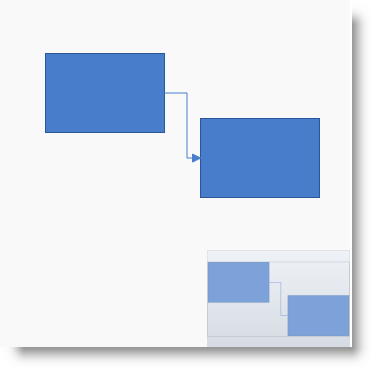
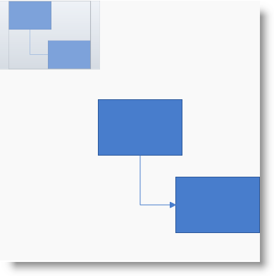

////
|metadata|
{
    "name": "xamdiagram-configuring-the-navigation-pane",
    "tags": ["Charting","How Do I"],
    "controlName": ["xamDiagram"],
    "guid": "c5ab12a7-da35-4bff-b2e5-f7dd150d2a40",
    "buildFlags": [],
    "createdOn": "2014-06-16T09:40:09.8004401Z"
}
|metadata|
////

= Configuring the Navigation Pane (xamDiagram)

== Topic Overview

=== Purpose

This topic explains how to configure the Navigation pane of the  _xamDiagram_™ control.

=== Required background

The following topics are prerequisites to understanding this topic:

[options="header", cols="a,a"]
|====
|Topic|Purpose

| link:xamdiagram-general-overview.html[General Overview ( _xamDiagram_ )]
|This topic provides a conceptual overview of the _xamDiagram_ control and its main features and capabilities.

| link:xamdiagram-visual-elements-overview.html[Visual Elements Overview ( _xamDiagram_ )]
|This topic provides an overview of the visual elements of the _xamDiagram_ control.

| link:xamdiagram-adding-to-a-page.html[Adding _xamDiagram_ to a Page]
|This topic explains how to add the _xamDiagram_ control to a WPF application.

|====

=== In this topic

This topic contains the following sections:

* <<_Ref389722801, Introduction >>

** <<_Ref386630190,Navigation pane configuration summary>>
** <<_Ref385408391,Navigation pane configuration summary chart>>

* <<_Ref386630199, Configuring the Visibility of the Navigation Pane >>

** <<_Ref385408401,Overview>>
** <<_PropertySettings,Property settings>>
** <<_Ref385408408,Example>>

* <<_Configuring_the_Position, Configuring the Position of the Navigation Pane >>

** <<_Ref385408417,Overview>>
** <<_Ref385408421,Property settings>>
** <<_Ref385408425,Example>>

* <<_Ref385408430, Related Content >>

** <<_Ref388453026,Resources>>

[[_Ref385408385]]
[[_Ref389722801]]
== Introduction

[[_Ref386630190]]

=== Navigation pane configuration summary

The  _xamDiagram_   control has the capability to display a reduced-size overview of its full content in a separate pane positioned inside the diagram space, by default at its bottom-right corner.

This feature comes handy when a diagram is displayed only partially in the diagram space due to its current zoom settings or sheer size. In addition to that, the Navigation pane allows users to navigate and change the zoom level of the diagram by an interaction with its UI.

The Navigation pane is implemented as a separate control –  _xamOverviewPlusDetailPane_™ – which is embedded in  _xamDiagram_  .

The visibility (shown/hidden) and the position of the Navigation pane on the diagram space are configurable. They are managed with properties that belong to the  _xamDiagram_   control. By default, the Navigation pane is not displayed but, if visibility is enabled (`NavigationPaneVisibility = “Visible”`), it will be shown at the bottom-right corner of the diagram space (this is the default positioning). The position of the Navigation pane within the diagram space is configurable by specifying the horizontal and vertical alignment of  _xamOverviewPlusDetailPane_   through a couple of alignment properties.

The diagram’s internal instance of the  _xamOverviewPlusDetailPane_   control can be accessed via the link:{ApiPlatform}controls.charts.xamdiagram.v{ProductVersion}~infragistics.controls.charts.xamdiagram~navigationpane.html[XamDiagram.NavigationPane] property and can be further customized through the properties of  _xamOverviewPlusDetailPane_  . For example, the default size of the Navigation pane is 220 px wide and 150 px high, but it can be changed to any desired dimensions with the `Width` and `Height` properties of  _xamOverviewPlusDetailPane_  , (For information on all  _xamOverviewPlusDetailPane_   properties that can be configured, see the link:{ApiPlatform}datavisualization.v{ProductVersion}~infragistics.controls.xamoverviewplusdetailpane_members.html[XamOverviewPlusDetailPane] class members.)

[[_Ref385408391]]

=== Navigation pane configuration summary chart

The following table explains briefly the configurable aspects of the navigation pane of the diagram and maps them to the properties that manage them. The aspects highlighted in green are covered in detail after this summary table.

[options="header", cols="a,a,a,a"]
|====
|Configurable aspect||Details|Properties

|<<_Ref386630199,Visibility>>
|
|The Overview pane can be visible or hidden.
|
* link:{ApiPlatform}controls.charts.xamdiagram.v{ProductVersion}~infragistics.controls.charts.xamdiagram~navigationpanevisibility.html[NavigationPaneVisibility] 

.2|<<_Configuring_the_Position,Position>>
|Horizontal
|The horizontal positioning of the navigation pane is achieved by choosing from 3 alignment positions: left, right, and centered. Alternatively, the pane can also be displayed as stretching horizontally between the left and right edges of the diagram space (“stretch” alignment).
|
* link:{ApiPlatform}controls.charts.xamdiagram.v{ProductVersion}~infragistics.controls.charts.xamdiagram~navigationpanehorizontalalignment.html[NavigationPaneHorizontalAlignment] 
|
|Vertical
|The vertical positioning of the navigation pane is achieved by choosing from 3 alignment positions: top, bottom, and centered. Alternatively, the pane can also be displayed as stretching vertically between the top and bottom edges of the diagram space (“stretch” alignment).
|
* link:{ApiPlatform}controls.charts.xamdiagram.v{ProductVersion}~infragistics.controls.charts.xamdiagram~navigationpaneverticalalignment.html[NavigationPaneVerticalAlignment] 

|====

[[_Configuring_the_Visibility]]
[[_Ref386630199]]
== Configuring the Visibility of the Navigation Pane

[[_Ref385408401]]

=== Overview

The visibility (shown/hidden) of the Navigation pane is managed with link:{ApiPlatform}controls.charts.xamdiagram.v{ProductVersion}~infragistics.controls.charts.xamdiagram~navigationpanevisibility.html[NavigationPaneVisibility] property. The valid settings are:

*  _“Hidden”_  
*  _“Visible”_  
*  _“Collapsed”_  

By default, the Navigation pane is collapsed.

[[_PropertySettings]]

=== Property settings

The following table maps the desired configuration to the property settings that manage it.

[options="header", cols="a,a,a"]
|====
|In order to:|Use this property:|And set it to:

|Hide the Navigation pane
| link:{ApiPlatform}controls.charts.xamdiagram.v{ProductVersion}~infragistics.controls.charts.xamdiagram~navigationpanevisibility.html[NavigationPaneVisibility]
|
* _“Hidden”_ or _“Collapsed”_ 

|Show the Navigation pane
| link:{ApiPlatform}controls.charts.xamdiagram.v{ProductVersion}~infragistics.controls.charts.xamdiagram~navigationpanevisibility.html[NavigationPaneVisibility]
|
* _“Visible_ _”_ 

|====

[[_Ref385408408]]

=== Example

The screenshot below demonstrates how the diagram would look as a result of the following settings:

[options="header", cols="a,a"]
|====
|Property|Value

| link:{ApiPlatform}controls.charts.xamdiagram.v{ProductVersion}~infragistics.controls.charts.xamdiagram~navigationpanevisibility.html[NavigationPaneVisibility]
| _“Visible”_ 

|====

Following is the code that implements this example.

*In XAML:*

[source,xaml]
----
<ig:XamDiagram Width="350"
               Height="350"
               Background="#F9F9F9"
               NavigationPaneVisibility="Visible">
<ig:DiagramNode Key="node0" Position="45,55"/>
<ig:DiagramNode Key="node1" Position="200,120"/>
<ig:DiagramConnection StartNodeKey="node0"
                      EndNodeKey="node1"/>
</ig:XamDiagram>
----

[[_Configuring_the_Position]]
[[_Ref385408414]]
== Configuring the Position of the Navigation Pane

[[_Ref385408417]]

=== Overview

The position of the Navigation pane on the diagram space is achieved as combination of its horizontal and vertical alignment, each managed with a separate property ( link:{ApiPlatform}controls.charts.xamdiagram.v{ProductVersion}~infragistics.controls.charts.xamdiagram~navigationpanehorizontalalignment.html[NavigationPaneHorizontalAlignment] and link:{ApiPlatform}controls.charts.xamdiagram.v{ProductVersion}~infragistics.controls.charts.xamdiagram~navigationpaneverticalalignment.html[NavigationPaneVerticalAlignment]).

In addition to using the respective alignment values ( _“Left”_  ,  _“Right”_  ,  _“Top”_  ,  _“Bottom”_  ,  _“Center”_  ), the position can be configured also by setting the respective alignment property to  _“Stretch”_  .

.Note:
[NOTE]
====
If the respective dimensioning property (`Height` / `Width`) of  _xamOverviewPlusDetailPane_   has been explicitly set (the default case with an embedded Navigation pane), the  _“Stretch”_   value of the related alignment property will work as  _“Center”_  .
====

[[_Ref385408421]]

=== Property settings

The following table maps the desired configuration to the property settings that manage it. For a stretched layout, the respective dimensioning property of the  _xamOverviewPlusDetailPane_   control (`Height` or `Width`) must not be set.

[options="header", cols="a,a,a"]
|====
|In order to position the Navigation pane:|Use this property:|And set it to:

|Top-left

| link:{ApiPlatform}controls.charts.xamdiagram.v{ProductVersion}~infragistics.controls.charts.xamdiagram~navigationpanehorizontalalignment.html[NavigationPaneHorizontalAlignment]
|_“Left”_
|
| link:{ApiPlatform}controls.charts.xamdiagram.v{ProductVersion}~infragistics.controls.charts.xamdiagram~navigationpaneverticalalignment.html[NavigationPaneVerticalAlignment]
|_“Top”_

|Top-center

|`NavigationPaneHorizontalAlignment`
|_“Center”_
|
|`NavigationPaneVerticalAlignment`
|_“Top”_

|Top-right
|`NavigationPaneHorizontalAlignment`
|_“Right”_
|
|`NavigationPaneVerticalAlignment`
|_“Top”_

|Center-left
|`NavigationPaneHorizontalAlignment`
|_“Left”_
|
|`NavigationPaneVerticalAlignment`
|_“Center”_

|In the middle
|`NavigationPaneHorizontalAlignment`
|_“Center”_
|
|`NavigationPaneVerticalAlignment`
|_“Center”_

|Center-right
|`NavigationPaneHorizontalAlignment`
|_“Right”_
|
|`NavigationPaneVerticalAlignment`
|_“Center”_

|Bottom-left
|`NavigationPaneHorizontalAlignment`
|_“Left”_
|
|`NavigationPaneVerticalAlignment`
|_“Bottom”_

|Bottom-center
|`HorizontalAlignment`
|_“Center”_
|
|`NavigationPaneVerticalAlignment`
|_“Bottom”_

|[[_Hlk388450019]]Bottom-right
|`NavigationPaneHorizontalAlignment`
|_“Right”_
|
|`NavigationPaneVerticalAlignment`
|_“Bottom”_

|Stretched horizontally at top
|`NavigationPaneHorizontalAlignment`
| _“Stretch”_ 
|
|`NavigationPaneVerticalAlignment`
| _“Top”_ 

|Stretched horizontally at middle
|`NavigationPaneHorizontalAlignment`
| _“Stretch”_ 
|
|`NavigationPaneVerticalAlignment`
| _“Center”_ 

|Stretched horizontally at bottom
|`NavigationPaneHorizontalAlignment`
| _“Stretch”_ 
|
|`NavigationPaneVerticalAlignment`
| _“Bottom”_ 

|Stretched vertically at left
|`NavigationPaneHorizontalAlignment`
| _“Left”_ 
|
|`NavigationPaneVerticalAlignment`
| _“Stretch”_ 

|Stretched vertically at middle
|`NavigationPaneHorizontalAlignment`
| _“Center”_ 
|
|`NavigationPaneVerticalAlignment`
| _“Stretch”_ 

|Stretched vertically at right
|`NavigationPaneHorizontalAlignment`
| _“Right”_ 

|`NavigationPaneVerticalAlignment`
| _“Stretch”_ 

|====

[[_Ref385408425]]

=== Example

The screenshot below demonstrates how the diagram looks as a result of the following settings:

[options="header", cols="a,a"]
|====
|Property|Value

| link:{ApiPlatform}controls.charts.xamdiagram.v{ProductVersion}~infragistics.controls.charts.xamdiagram~navigationpanehorizontalalignment.html[NavigationPaneHorizontalAlignment]
| _“Left”_ 

| link:{ApiPlatform}controls.charts.xamdiagram.v{ProductVersion}~infragistics.controls.charts.xamdiagram~navigationpaneverticalalignment.html[NavigationPaneVerticalAlignment]
| _“Top”_ 

|====

Following is the code that implements this example.

*In XAML:*

[source,xaml]
----
<ig:XamDiagram x:Name="diagram"
               Width="370"
               Height="370"
               Background="#F9F9F9"
               NavigationPaneVisibility="Visible"
               NavigationPaneHorizontalAlignment="Left"
               NavigationPaneVerticalAlignment="Top">
<ig:DiagramNode Key="node0" Position="140,140"/>
<ig:DiagramNode Key="node1" Position="250,250"/>
<ig:DiagramConnection StartNodeKey="node0"
                      EndNodeKey="node1"/>
</ig:XamDiagram>
----

[[_Ref385408430]]
== Related Content

[[_Ref388453026]]

=== Resources

The following material (available outside the Infragistics family of content) provides additional information related to this topic.

[options="header", cols="a,a"]
|====
|Topic|Purpose

| link:http://msdn.microsoft.com/en-us/library/system.windows.horizontalalignment.aspx[HorizontalAlignment Enumeration]
|An MSDN article Indicating where an element should be displayed on the horizontal axis relative to the allocated layout slot of the parent element. (Relevant for the behavior of the _“Stretch”_ setting of the alignment properties.)

|====